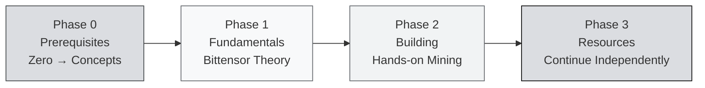

import useBaseUrl from '@docusaurus/useBaseUrl';

# Bittensor Co-Learning Camp: Overview

> **Co-Learning Camp India · HackQuest × Bittensor**
> **Offline · India · 100% FREE**

Welcome to the **Bittensor Co-Learning Camp**! This curriculum is designed to take you from **absolute zero**: no prior experience with blockchain or AI: all the way to **running your own miner** on two production Bittensor subnets: **Sportstensor (SN41)** and **Data Universe (SN13)**.

---

## 🎯 Who Is This Curriculum For?

:::info Target Audience
This curriculum is beginner-friendly and well-suited for:
- 🧑‍🎓 **CS / Data Science students** who want to explore decentralized AI
- 👨‍💻 **Software engineers** curious about AI × Crypto
- 🌐 **Web3 builders** looking to expand into AI infrastructure
- 🤔 **Total beginners** who don't yet know what Web3 or AI is, but are ready to learn
:::

You don't need prior blockchain experience. You don't need to be an AI researcher. What you do need: **the willingness to learn and to execute.**

---

## 🗺️ Learning Path: 4 Phases

### 🟡 Phase 0: Prerequisites (Start From Zero)

The most basic foundation. If you've never heard of "Web3" or "decentralized AI", start here.

- **Unit 1:** What is Web3?
- **Unit 2:** What is AI?
- **Unit 3:** Centralized AI vs Decentralized AI
- **Unit 4:** Why does Bittensor matter?

### 🔵 Phase 1: Bittensor Fundamentals

We get into Bittensor theory: architecture, incentive mechanism, and core subnets.

**Concept I: Introduction to Bittensor**
- Unit 1: The Rise of AI and the Emergence of Bittensor
- Unit 2: Core Concepts & Mechanisms
- Unit 3: Tooling & Tokenomics

**Concept II: Core Bittensor Subnets**
- Unit 1: **Chutes**: Decentralized Inference Infrastructure
- Unit 2: **Data Universe** (SN13): Decentralized Data Provision
- Unit 3: **Sportstensor** (SN41): Sports Event Prediction
- Unit 4: **Ridges**: Engineering & Code Intelligence

### 🟢 Phase 2: Building on a Bittensor Subnet

Hands-on practice. This is where you **actually become a miner.**

**Guided Project 0: Local Mining Intro** (7 units)
1. Intro & Hardware Check
2. Installing btcli
3. Wallet Setup
4. Registering on a Testnet Subnet
5. Running a Local Miner
6. Connections & Ports
7. Local Debugging

**Guided Project I: Sportstensor (SN41) Mining Guide** (7 units)
1. Introduction to SN41
2. Bittensor Wallet Setup & TAO Funding
3. Registering a Miner on Sportstensor
4. Almanac Registration & Miner Identity Binding
5. Miner Initialization & Metadata Registration
6. Programmatic Trade Execution
7. Trading Strategies

**Guided Project II: Data Universe (SN13) Mining** (6 units)
1. Introduction to SN13
2. Environment Setup & Deployment
3. Miner Configuration & Data Scraping Strategy
4. Understanding the Scoring System & Optimizing Rewards
5. S3 Storage Configuration & Data Upload
6. Interaction Layer

### 🟣 Phase 3: More Bittensor Resources

Links to the whitepaper, Taostats, official repos, YouTube, faucets: everything you need to keep exploring on your own after the camp ends.

---

## 📅 Townhall Schedule (Live, Offline)

| TH | Date | Topic |
|----|------|-------|
| **TH1** | Day 1 · 19:00 IST | Intro: Architecture, Subnets, Miners & Validators |
| **TH2** | Day 4 · 19:00 IST | Tooling, Tokenomics & Core Subnets |
| **TH3** | Day 8 · 19:00 IST | Hands-on Mining: SN41 & SN13 |
| **TH4** | Day 11 · 19:00 IST | 🎉 Graduation Day |

:::tip Pro Tip
Read Phase 0 and Phase 1 material **before TH1** so you can join the discussion confidently. The written material here goes deeper than what we can cover in a 2-hour live session.
:::

---

## 🎓 How to Graduate

To earn the **NFT Certificate + Quack Believers invitation**, you must complete **ALL** of the following:

### ✅ Requirements

1. **Attend at least 3 of 4 Townhalls** (live, not recordings)
2. **Stay in the Telegram group** until Graduation Day
3. **Submit miner proof (5 items)** before TH4:
   - Hotkey address (`btcli wallet overview`)
   - Subnet ID / NetUID
   - Miner UID (`btcli neuron list --netuid <netuid>`)
   - Screenshot of the miner running in your terminal
   - Link to an X (Twitter) reflection post (tag `@HackQuest_` & `@bittensor`)
4. **Complete the HackQuest Learning Track** on the platform

### 🏆 Reward Tiers

| Tier | Criteria | Reward |
|------|----------|--------|
| 🥇 **Top 5** | Valid submission + highest engagement & progress | HackQuest hoodie |
| 🥈 **Top 6–20** | Valid submission + next-highest engagement | Stickers + HackQuest t-shirt |
| 🎓 **Graduate** | All requirements met | NFT Certificate + Quack Believers invite |
| 📋 **Participant** | Attended but submission incomplete | Certificate of Participation |

---

## 💬 Support & Community

- **Bittensor Co-Learning Camp India Telegram group**: link shared after registration
- **HackQuest Discord / channel**: general discussion
- **Quack Believers**: alumni network (invite-only for graduates)

---

## 🚀 How to Start

:::tip Recommended order
1. **Read Phase 0 first** if you're a complete beginner: don't jump straight to Phase 1.
2. **Finish Phase 1 before TH2**: the tokenomics and subnet discussion will land much better.
3. **Finish Phase 2 around TH3**: the hands-on workshop will reference the steps documented here.
4. **Phase 3** is meant for self-directed exploration after the camp ends.
:::

**Ready?** Continue to [Phase 0: Unit 1: What is Web3?](./Phase-0-Prerequisites/what-is-web3) 👉

---

### 📚 Quick References

- 🌐 [Bittensor Official](https://bittensor.com)
- 📄 [Whitepaper](https://bittensor.com/whitepaper)
- 📊 [Taostats Explorer](https://taostats.io)
- 🛠️ [Official Documentation](https://docs.bittensor.com)
- 💧 [Testnet Faucet](https://faucet.bittensor.com)

---

:::note Brand & Attribution
The Bittensor, TAO, Subtensor, and Opentensor Foundation marks shown in this curriculum are property of the **Opentensor Foundation (OTF)**. Usage here follows the **Opentensor Graphic Standards**: logos are used only in their black or white versions, on grayscale backgrounds, without modification, without effects, and never combined with other marks.

Educational material is authored by **HackQuest** as community education. Not officially affiliated with OTF unless stated otherwise.

Official brand assets: [bittensor.com/about](https://bittensor.com/about) · [Opentensor on GitHub](https://github.com/opentensor)
:::

*In Builders We Trust.*
