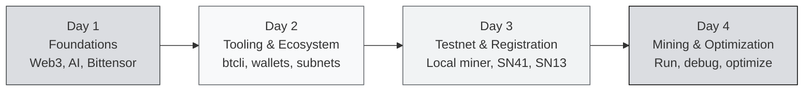

import useBaseUrl from '@docusaurus/useBaseUrl';

# Bittensor Co-Learning Camp: Overview

> **Co-Learning Camp India · HackQuest × Bittensor**

Welcome to the **Bittensor Co-Learning Camp**! This curriculum takes you from **absolute zero** — no prior experience with blockchain or AI — all the way to **running your own miner** on two production Bittensor subnets: **Sportstensor (SN41)** and **Data Universe (SN13)**.

---

## Who Is This Curriculum For?

:::info Target Audience
This curriculum is beginner-friendly and well-suited for:
- **CS / Data Science students** who want to explore decentralized AI
- **Software engineers** curious about AI × Crypto
- **Web3 builders** looking to expand into AI infrastructure
- **Total beginners** who don't yet know what Web3 or AI is, but are ready to learn
:::

You don't need prior blockchain experience. You don't need to be an AI researcher. What you do need: **the willingness to learn and to execute.**

---

## Learning Path: 4 Days

### Day 1 — Foundations

The conceptual base. If you've never heard of "Web3" or "decentralized AI", start here.

- What is Web3?
- What is AI?
- Centralized AI vs Decentralized AI
- Why does Bittensor matter?
- The Rise of AI and the Emergence of Bittensor
- Core Concepts & Mechanisms (subnets, miners, validators, Yuma Consensus)
- Tooling & Tokenomics (btcli, TAO, dTAO, alpha tokens)

### Day 2 — Tooling & Ecosystem

Get your environment ready and tour the subnets you'll mine on.

- Intro & Hardware Check
- Installing Python, venv & btcli
- Wallet Setup (coldkey & hotkey)
- **Chutes**: Decentralized Inference Infrastructure
- **Data Universe (SN13)**: Decentralized Data Provision
- **Sportstensor (SN41)**: Sports Event Prediction
- **Ridges**: Engineering & Code Intelligence

### Day 3 — Testnet & Registration

Spin up a miner on testnet, then register on the two production subnets.

- Register on a Testnet Subnet
- Run a Local Miner
- Connection, Ports & Ngrok for CGNAT
- Intro to SN41 Sportstensor
- Bittensor Wallet & TAO Funding (mainnet)
- Register the Miner on SN41
- Almanac Registration & Identity Binding
- Intro to SN13 Data Universe
- Environment Setup & Deployment (VPS)

### Day 4 — Mining & Optimization

Run miners 24/7 and improve their score.

- Local Debugging & Troubleshooting
- SN41 Miner Init & Metadata Registration
- SN41 Programmatic Trade Execution
- SN41 Trading Strategies (CLV, Elo/ML, arbitrage)
- SN13 Miner Configuration & Scraping Strategy
- SN13 Scoring System & Reward Optimization
- SN13 S3 Storage Configuration & Upload
- SN13 Interaction Layer (FastAPI, monitoring)

### Resources

Whitepaper, Taostats, official repos, YouTube, faucet, glossary — everything you need to keep exploring on your own after the camp ends.

---

## How to Start

:::tip Recommended order
1. **Read Day 1 first** if you're a complete beginner — don't jump straight to subnet specifics.
2. **Get through Day 2** before touching mainnet — the wallet/btcli flow is required.
3. **Day 3 is hands-on** — have your laptop and a terminal ready.
4. **Day 4 is where most of the work lives** — running a real miner means iterating.
:::

**Ready?** Continue to [Day 1 — What is Web3?](./Day-1-Foundations/what-is-web3)

---

### Quick References

- [Bittensor Official](https://bittensor.com)
- [Whitepaper](https://bittensor.com/whitepaper)
- [Taostats Explorer](https://taostats.io)
- [Official Documentation](https://docs.bittensor.com)
- [Testnet Faucet](https://faucet.bittensor.com)

---

:::note Brand & Attribution
The Bittensor, TAO, Subtensor, and Opentensor Foundation marks shown in this curriculum are property of the **Opentensor Foundation (OTF)**. Usage here follows the **Opentensor Graphic Standards**: logos are used only in their black or white versions, on grayscale backgrounds, without modification, without effects, and never combined with other marks.

Educational material is authored by **HackQuest** as community education. Not officially affiliated with OTF unless stated otherwise.

Official brand assets: [bittensor.com/about](https://bittensor.com/about) · [Opentensor on GitHub](https://github.com/opentensor)
:::

*In Builders We Trust.*
