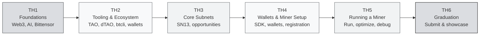

import useBaseUrl from '@docusaurus/useBaseUrl';

# Co-Learning Camp #23 India — Guidebook

> **HackQuest × Bittensor · Co-Learning Camp #23 India**

Welcome! This guidebook takes you from **absolute zero** — no prior experience with blockchain or AI — all the way to **running your own miner** on a production Bittensor subnet: **Data Universe (SN13)**.

The camp runs as **6 Townhalls (TH1 → TH6)**. Each townhall has learning content plus a hands-on quest.

---

## Who Is This For?

:::info Target Audience
Beginner-friendly. Well-suited for:
- **CS / Data Science students** exploring decentralized AI
- **Software engineers** curious about AI × Crypto
- **Web3 builders** expanding into AI infrastructure
- **Total beginners** who don't yet know what Web3 or AI is, but are ready to learn
:::

No prior blockchain experience needed. No AI research background needed. What you do need: **the willingness to learn and to execute.**

---

## Learning Path: 6 Townhalls

### TH1 — Foundations & Introduction

The conceptual base. If you've never heard of "Web3" or "decentralized AI", start here.

- Introduction to Web3
- What is AI?
- AI vs Decentralized AI
- What is Bittensor?
- Ecosystem Overview
- Miners, Validators & Subnets
- Program Structure, Learning Track & Quests

### TH2 — Tooling & Ecosystem

The economics and tooling layer.

- TAO Tokenomics
- Dynamic TAO
- Wallets: Coldkeys & Hotkeys
- Introduction to btcli
- Network Structure
- Understanding Incentives

### TH3 — Core Subnets & Opportunities

What subnets are and the ones you'll work with.

- What Are Subnets?
- **SN13: Data Universe** — decentralized data provision (the camp's hands-on subnet)
- Other Notable Subnets (Chutes, Ridges, and more)
- Use Cases
- Builder & Contributor Opportunities

### TH4 — Wallets & Miner Setup

Hands-on setup before you mine.

- Installing Dependencies
- Setting Up the Bittensor SDK
- Creating Wallets
- Understanding Registration
- Miner Architecture
- Getting Ready for Mining

### TH5 — Running a Miner

Run a real miner and improve its score.

- Registering a Miner
- Run the Local Miner (ports, Ngrok / CGNAT)
- SN13: Running the miner, Scraping Strategy, Scoring & Rewards, S3 Storage
- Logs, Common Errors & Debugging

### TH6 — Graduation & Showcase

Wrap up and graduate.

- Submission Validation
- Participant Showcases
- Lessons Learned
- Top Contributors Recognition
- Ecosystem Opportunities
- Graduation Ceremony

### Resources

Whitepaper, Taostats, official repos, YouTube, faucet, glossary — everything to keep exploring after the camp.

---

## How to Start

:::tip Recommended order
1. **Read TH1 first** if you're a complete beginner — don't jump straight to subnet specifics.
2. **Get through TH2 and TH4** before touching mainnet — the wallet/btcli flow is required.
3. **TH4–TH5 are hands-on** — have your laptop and a terminal ready.
4. **TH5 is where most of the work lives** — running a real miner means iterating.
:::

**Ready?** Continue to [TH1 — Introduction to Web3](./TH1-Foundations-and-Introduction/introduction-to-web3).

:::tip In a hurry? Skip the theory.
The **[One-Shot Guide](./one-shot)** is a copy-paste path: fresh laptop → registered on SN13 testnet, commands only. Use it if you want to ship first and read later.
:::

---

### Quick References

- [Bittensor Official](https://bittensor.com)
- [Whitepaper](https://bittensor.com/whitepaper)
- [Taostats Explorer](https://taostats.io)
- [Official Documentation](https://www.bittensor.com/docs)
- [Testnet TAO — Bittensor Discord](https://discord.gg/qasY3HA9F9) (no public web faucet)

---

:::note Brand & Attribution
The Bittensor, TAO, Subtensor, and Opentensor Foundation marks shown in this guidebook are property of the **Opentensor Foundation (OTF)**. Usage here follows the **Opentensor Graphic Standards**: logos are used only in their black or white versions, on grayscale backgrounds, without modification, without effects, and never combined with other marks.

Educational material is authored by **HackQuest** as community education. Not officially affiliated with OTF unless stated otherwise.

Official brand assets: [bittensor.com/about](https://bittensor.com/about) · [Opentensor on GitHub](https://github.com/opentensor)
:::

*In Builders We Trust.*
