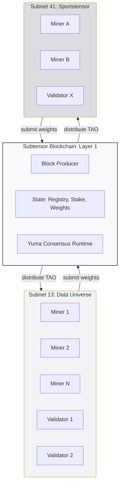
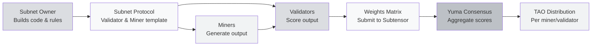
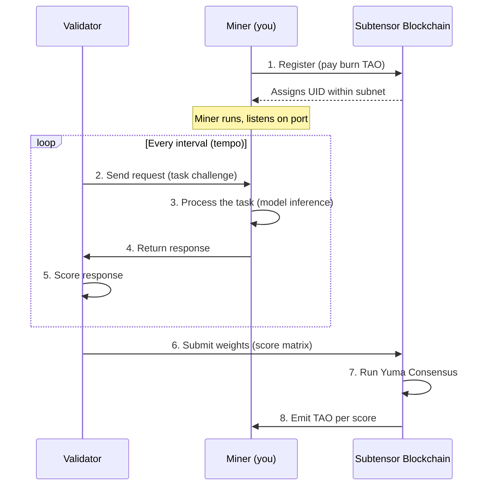
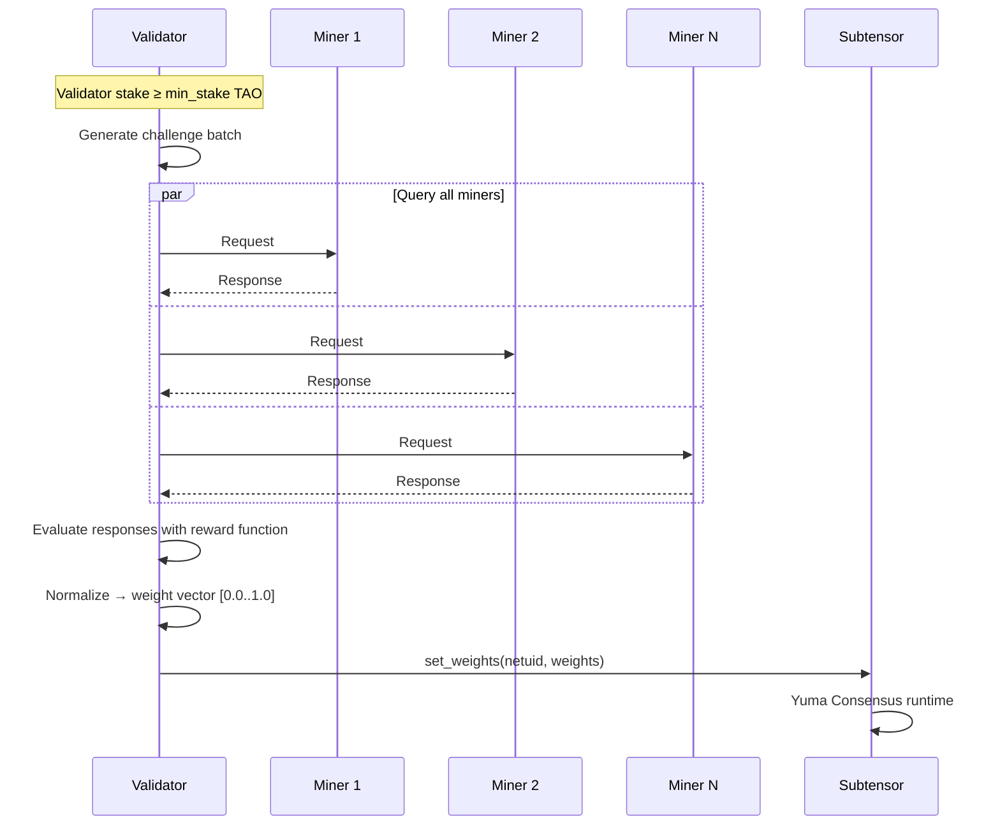
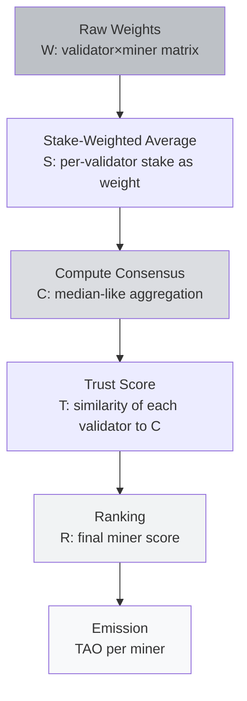
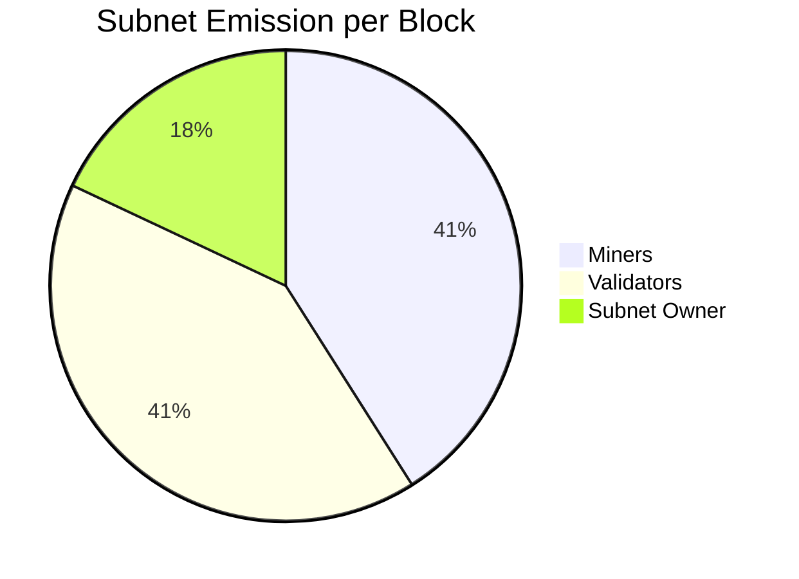
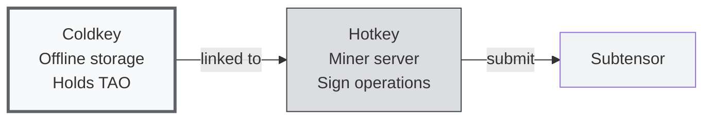
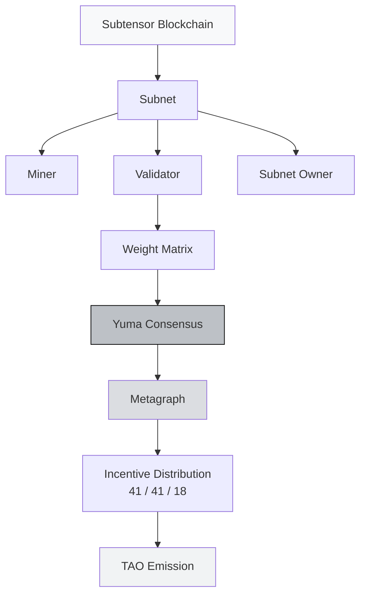

# Unit 2: Core Concepts & Mechanisms of Bittensor

:::info Goal of This Unit
After reading this unit, you will understand:
1. **Subnet architecture**: what's inside, who the actors are, how data flows
2. **Miner vs validator roles**: the request-response and scoring flow
3. **Yuma Consensus**: the validator-score aggregation algorithm (simplified math)
4. **The metagraph**: the network "snapshot" that becomes the ground truth for rewards
5. **The 41/41/18 incentive split**: who gets what, and why this ratio
:::

> The previous unit (Unit 1) explained **why** Bittensor exists. Now we'll dissect **how** it works. This unit is more technical than Unit 1: grab a coffee and let's go.

---

## Big Picture: The Bittensor Components in One Diagram

Before going into details, get the big picture:



**What you should take away from this diagram:**

1. Underneath everything is **Subtensor**: the main blockchain. It's where state is stored, consensus runs, and TAO is emitted.
2. On top of Subtensor are the **subnets**. Each subnet has its own community of miners and validators.
3. Subnets **don't interact directly with each other**: each has a specific task. But they **all share Subtensor** as the source of truth.
4. The TAO flow: Subtensor emits TAO every block → distributes to subnets → distributes again to miners and validators within each subnet according to contribution.

---

## What Is a Subnet?

A **subnet** is a specialization unit in Bittensor. Each subnet is a community of miners + validators working on **one specific task** with a **customized reward mechanism**.

### Subnet Components



Let's break down each role:

### 1. Subnet Owner

The party (a person or team) who **deploys the subnet** to Subtensor and decides:

- **What task** the subnet performs (e.g., "scrape Twitter data", "predict sports outcomes")
- **The reward function**: how validators score miners
- **The protocol**: the request-response format between miners and validators
- **Parameters**: minimum stake, registration burn amount, etc.

The subnet owner gets **18% of the subnet's emission** as compensation for maintenance. Popular subnet → good revenue; quiet subnet → wasted effort.

### 2. Miner

A **worker** that runs the actual AI service. A miner:

- Runs a model/algorithm on their own server/GPU
- Listens for requests from validators
- Generates responses as fast and as high-quality as possible
- Earns **41% of the subnet's emission** if performing well

### 3. Validator

The **auditor** that judges miner quality. A validator:

- Stakes TAO (requires a minimum stake: typically 1,000+ TAO on mainnet)
- Sends challenges/requests to miners
- Scores responses according to the reward function
- Submits a **weight matrix** to Subtensor (numbers 0–1 per miner)
- Earns **41% of the subnet's emission** if their scoring is "consistent" with other validators

### 4. NetUID

Every subnet has a unique numeric ID. Examples:
- **NetUID 1**: Text Prompting (the first subnet)
- **NetUID 13**: Data Universe
- **NetUID 41**: Sportstensor
- **NetUID 64**: Chutes
- **NetUID 62**: Ridges

When you run btcli or write code, you always reference a subnet by its NetUID.

:::tip Simple Analogy: Subnet = Stall in a Marketplace
Imagine Bittensor as a **giant marketplace**. Each subnet is a **stall** with a different product. Stall 13 sells data. Stall 41 sells sports predictions. Stall 64 sells AI inference.

- **Subnet owner** = stall owner, sets the stall's rules (minimum prices, quality, etc.)
- **Miner** = vendor at the stall (brings products)
- **Validator** = market inspector (judges quality)
- **Subtensor** = market authority (issues "stall licenses" and collects "rent")
- **TAO** = the marketplace's common currency
:::

---

## Miner: The Full Flow

A miner has a repetitive but important lifecycle:



### Step-by-Step for a Miner

**1. Register on the subnet**: pay a "registration fee" in TAO that gets burned. The amount is dynamic (rises with competition). Once registered, you receive a **UID** (a unique number within the subnet, typically 0–255).

**2. Run the miner software**: usually a Python script that:
- Loads the model (e.g., LLM, classifier, scraper, etc.)
- Listens on the axon port (a TCP port for communication)
- Registers the axon IP with Subtensor so validators can connect

**3. Serve requests**: validators send requests every **tempo** (a block interval, typically ~72 minutes / 360 blocks). The miner processes and returns the response.

**4. Wait for rewards**: if validators rate you well (high weight), you get a share of the TAO emission each tempo.

### Example Miner Request-Response

For example, in a hypothetical Text Prompting subnet (a simplified example):

```python
# Miner pseudocode
def forward(synapse: TextPromptSynapse) -> TextPromptSynapse:
    prompt = synapse.prompt
    response = my_llm.generate(prompt, max_tokens=200)
    synapse.response = response
    return synapse
```

In Sportstensor (SN41):

```python
# Miner pseudocode
def forward(synapse: MatchPredictionSynapse) -> MatchPredictionSynapse:
    match_id = synapse.match_id
    # Fetch stats, run prediction model
    prediction = my_model.predict(match_id)
    synapse.prediction = prediction  # {home_win: 0.6, draw: 0.2, away_win: 0.2}
    return synapse
```

:::note The Technical Reality of Mining
As a miner, your job is **not just** running the script. What separates top miners from bottom miners is usually:
- **Model quality** (for ML-heavy subnets)
- **Latency** (validators time out fast: 5–10 seconds)
- **Uptime** (offline during a tempo = no reward)
- **Strategy** (knowing the validator challenge patterns and optimizing for the reward function)
:::

---

## Validator: The Full Flow

Validators have a different and heavier responsibility:



### Validator Responsibilities

1. **Stake TAO**: minimum stake varies per subnet but is typically ≥ 1,000 TAO (in the dTAO era, staking uses the alpha token)
2. **Query every miner** each tempo
3. **Score using the subnet's reward function** (defined by the subnet owner)
4. **Submit a weight vector** to Subtensor: an array of 0–1 numbers as long as the miner count
5. **Stay consistent with other validators**: if you score very differently, Yuma Consensus will "punish" you

### Reward Function: A Concrete Example

In Sportstensor (SN41), a simplified reward function looks like (simplified):

```
score_miner_i = accuracy_over_last_N_matches - latency_penalty
weight_miner_i = softmax(score_miner_i across all miners)
```

In other words: a miner whose predictions are **more accurate** over the last N matches and whose **response is faster** gets a higher weight.

In Data Universe (SN13):

```
score_miner_i = volume_data × freshness × uniqueness × validation_pass_rate
```

A miner who contributes **lots of fresh, unique data** (not duplicates) that passes validation gets a high score.

:::tip Why Do Validators Need a High Stake?
Because if a validator misbehaves (random weights, or colludes with miners), they can corrupt the reward distribution. A high stake is **skin in the game**: if their scoring deviates from consensus, their emission drops. An economic disincentive against bad behavior.
:::

---

## Yuma Consensus: The Heart of Bittensor

**Yuma Consensus** is the algorithm that aggregates all the validator weights into a single final reward distribution. This is Bittensor's core innovation.

### The Problem It Solves

Imagine you have 50 validators, each submitting a weight vector for 200 miners. You get a 50×200 matrix of numbers. The questions are:

- **Which validator's weights are more valid?** (The boss validator or a random one?)
- **What if one validator is malicious** and submits weird weights?
- **How do you aggregate fairly** without trusting any single validator?

### The Solution: Weighted Consensus + Trust Score

Yuma Consensus operates in several phases (simplified):



### Simplified Math

Suppose we have 3 validators (A, B, C) with stakes (10, 20, 30) TAO and 2 miners (X, Y). Their weight matrix:

| Validator | Stake | Weight X | Weight Y |
|-----------|-------|----------|----------|
| A         | 10    | 0.8      | 0.2      |
| B         | 20    | 0.7      | 0.3      |
| C         | 30    | 0.2      | 0.8      |

**Step 1: Stake-weighted average per miner:**

```
Miner X: (10×0.8 + 20×0.7 + 30×0.2) / 60 = (8 + 14 + 6) / 60 = 0.467
Miner Y: (10×0.2 + 20×0.3 + 30×0.8) / 60 = (2 + 6 + 24) / 60 = 0.533
```

**Step 2: Consensus C = [0.467, 0.533]**

**Step 3: Trust score per validator** (how close their weights are to consensus):

```
Trust_A = similarity([0.8, 0.2], [0.467, 0.533]) = low (far from consensus)
Trust_B = similarity([0.7, 0.3], [0.467, 0.533]) = medium
Trust_C = similarity([0.2, 0.8], [0.467, 0.533]) = high
```

**Step 4: Validators with high trust → higher validator-side emission.** Validator A, who is "out-of-consensus", gets a smaller emission (a disincentive against opposing the majority).

**Step 5: Miner Y (score 0.533) gets a larger emission share than Miner X (score 0.467).**

:::warning Why Isn't "Majority" a Tyranny of the Majority?
Valid question: what if 51% of validators collude to misscore? In theory, possible. In practice:

- **Minimum stake** means colluding validators need tens of thousands of TAO ($millions of dollars) of stake
- **Long-term reputation**: consistently good validators earn the trust of delegators and accumulate more delegated stake
- **Transparent reward function**: random scoring is easy for the community to detect
- **Fork resistance**: the community can fork if there's a serious attack

The trade-off is similar to Bitcoin: a 51% attack is theoretically possible but very expensive in practice.
:::

---

## Metagraph: The Subnet State Snapshot

The **metagraph** is a complete representation of a subnet's state at a point in time. It is not a "live stream": it's a snapshot updated every tempo.

### What's in a Metagraph

| Field | Meaning | Example |
|-------|---------|---------|
| `uids` | Array of UIDs for miners/validators in the subnet | [0, 1, 2, ..., 255] |
| `stake` | TAO stake per UID | [1000, 500, 20, ...] |
| `weights` | Latest weight matrix (validator → miner) | [[0.1, 0.2, ...], ...] |
| `ranks` | Miner ranking score (output of Yuma Consensus) | [0.8, 0.5, 0.3, ...] |
| `trust` | Trust score per neuron | [0.9, 0.7, ...] |
| `incentive` | Miner incentive share (fraction of miner pool) | [0.4, 0.1, ...] |
| `dividends` | Validator dividend share (fraction of validator pool) | [0.3, 0.2, ...] |
| `emission` | TAO emission per neuron per block | [0.05, 0.02, ...] |
| `hotkeys` | Public key per UID | ["5C4h...", "5F3s...", ...] |
| `axons` | IP:port per miner (so validators can connect) | ["1.2.3.4:8091", ...] |

### How to Access the Metagraph

Using `btcli`:

```bash
btcli subnet metagraph --netuid 13
```

Or in Python:

```python
import bittensor as bt
metagraph = bt.metagraph(netuid=13)
print(metagraph.ranks)       # [0.8, 0.5, 0.3, ...]
print(metagraph.incentive)   # [0.4, 0.1, ...]
```

:::tip Metagraph = Ground Truth
If you're a miner and you're not sure whether your performance is good, **read the metagraph**. Check:
- `incentive[my_uid]`: your current reward share
- `trust[my_uid]`: how much validators trust you
- `emission[my_uid]`: your TAO per block

Most miner optimization decisions are made off metagraph data.
:::

---

## Incentive Distribution: The 41 / 41 / 18 Ratio

Each subnet has an "emission pool" per block. That pool is divided among three parties:



### Why 41 / 41 / 18?

A design choice from Yuma Rao + community iteration:

- **41% miners**: they produce real output (the product)
- **41% validators**: they enforce quality (gatekeepers)
- **18% subnet owner**: they build and maintain the protocol (infrastructure)

If any one side is over-rewarded, the system collapses:
- Miners at 90%, validators quit → quality drops
- Validators at 90%, miners quit → no work gets done
- Owner at 50%, miners and validators protest

41/41/18 is an empirically stable equilibrium.

### Concrete Numbers

Assume:
- Subnet emission per block = **1 TAO** (a realistic number for a medium-sized subnet)
- 1 block = 12 seconds
- 1 tempo = 360 blocks = 72 minutes

**Per tempo, the subnet emits 360 TAO**, divided as:

| Party | Share | Per Tempo | Per Day (20 tempos) |
|-------|-------|-----------|---------------------|
| **Miner pool** | 41% | 147.6 TAO | 2,952 TAO |
| **Validator pool** | 41% | 147.6 TAO | 2,952 TAO |
| **Subnet owner** | 18% | 64.8 TAO | 1,296 TAO |
| **Total** | 100% | 360 TAO | 7,200 TAO |

The 147.6 TAO miner pool is then split among **all active miners** (e.g., 128 miners) **proportional to incentive[uid]**. So if miner UID 5 has `incentive = 0.1`, they receive:

```
emission_miner_5 = 147.6 × 0.1 = 14.76 TAO per tempo
                = 14.76 × 20 = 295.2 TAO per day
```

If TAO is at $300, that's roughly **$88,560/day**. If TAO is at $50, it's $14,760/day. That's why the TAO price matters enormously for miner ROI.

:::warning Economic Reality
The example above is a best case: a top miner on a popular subnet. The reality:
- Most miners get incentive < 0.01 (the bottom 80% collectively)
- Top 3 miners can dominate with incentive > 0.3
- If you're a new miner, **expect losses** for several tempos until your strategy matures

From a subnet owner's perspective: if the subnet is quiet (low total validator stake), the emission to your subnet is also small. There's a dynamic allocation based on demand (via dTAO, covered in Unit 3).
:::

---

## Coldkey vs Hotkey: Key Separation

This is an important concept you'll keep using in btcli:

| Key | Function | Example Use |
|-----|----------|-------------|
| **Coldkey** | Main wallet, holds TAO, signs important transactions | Transfer TAO, stake/unstake, delegate |
| **Hotkey** | Operational key, runs on the miner/validator server | Submit weights, serve axon, lightweight signing |

**Why separate them?**

The hotkey lives on an always-on server → higher risk of compromise. If your hotkey is leaked, an attacker **cannot drain your TAO**: they can only disrupt your miner operation. The TAO stays safe with the offline coldkey.



A single coldkey can have **many hotkeys**: e.g., you run 5 miners across 5 subnets, each miner using a different hotkey but the same coldkey (so rewards collect into one wallet).

---

## An End-to-End Example Calculation

Let's combine all the concepts into one concrete scenario.

**Setup:**
- You're a miner on SN41 (Sportstensor)
- Your UID = 17
- 128 active miners, 24 active validators
- Subnet emission per block = 0.8 TAO

**Tempo #100:**

1. All 24 validators query UID 17. You return match predictions.
2. Your average accuracy over the last 20 matches = 62% (above the 55% average).
3. 20 of 24 validators give UID 17 a high weight (say, 0.05 average).
4. 4 validators give it a low weight (maybe disconnected, maybe a different scoring).
5. Stake-weighted average weight for UID 17 = 0.042.
6. This is fed into Yuma Consensus → rank UID 17 = 0.042.
7. Normalize across all miners → **incentive[17] = 0.08**.

**Your emission this tempo:**

```
miner_pool = 0.8 TAO/block × 360 blocks × 41% = 118.08 TAO
emission_17 = 118.08 × 0.08 = 9.45 TAO per tempo
```

Per day (20 tempos): **189 TAO**. If TAO = $200, that's **$37,800/day**.

(Again: this example is for a top-tier miner. The realistic median miner is far below this.)

---

## The Concept Map So Far



You should know all these terms by heart before moving on to Unit 3.

---

## Summary

:::tip Key Takeaways
1. **Subnet** = specialization unit in Bittensor, owned by a subnet owner, run by miners and validators
2. **Miner** generates AI output; **validator** scores output; **subnet owner** builds the protocol
3. **Yuma Consensus** aggregates validator weights into a final ranking: out-of-consensus validators are punished via the trust score
4. **Metagraph** = subnet state snapshot (stake, weights, incentive, dividends, emission): the ground truth for rewards
5. **Incentive split 41/41/18**: miner, validator, subnet owner: an empirically stable equilibrium
6. **Coldkey vs hotkey**: basic security hygiene; coldkey holds TAO, hotkey operates the miner
7. Real reward depends on: **incentive fraction × pool size × TAO price**: every variable matters and needs to be optimized
:::

### ✅ Quick Check

- Name the 4 main roles inside a subnet (besides the Subtensor blockchain)
- Why does a validator need to stake TAO before submitting weights?
- Briefly describe the Yuma Consensus pipeline: raw weights → emission
- What's the difference between coldkey and hotkey, and why are they separate?

---

## Next Unit

You now understand Bittensor's architecture. Next we move into **practical tooling** for interacting with the network.

**Next:** [Unit 3: Tooling & Tokenomics](./tooling-tokenomics)

*In the next unit: install btcli, create a wallet, get to know TAO tokenomics in full (halving, max supply 21M), dTAO + alpha tokens, and the Chrome Extension wallet.*

---

### Additional References

- [Bittensor Docs: Subnet Architecture](https://docs.bittensor.com/subnets/understanding-subnets)
- [Yuma Consensus Deep Dive (Opentensor Blog)](https://blog.opentensor.ai/)
- [Metagraph Reference](https://docs.bittensor.com/reference/metagraph)
- Phase 0 recap: [Why Does Bittensor Matter?](./why-bittensor)
