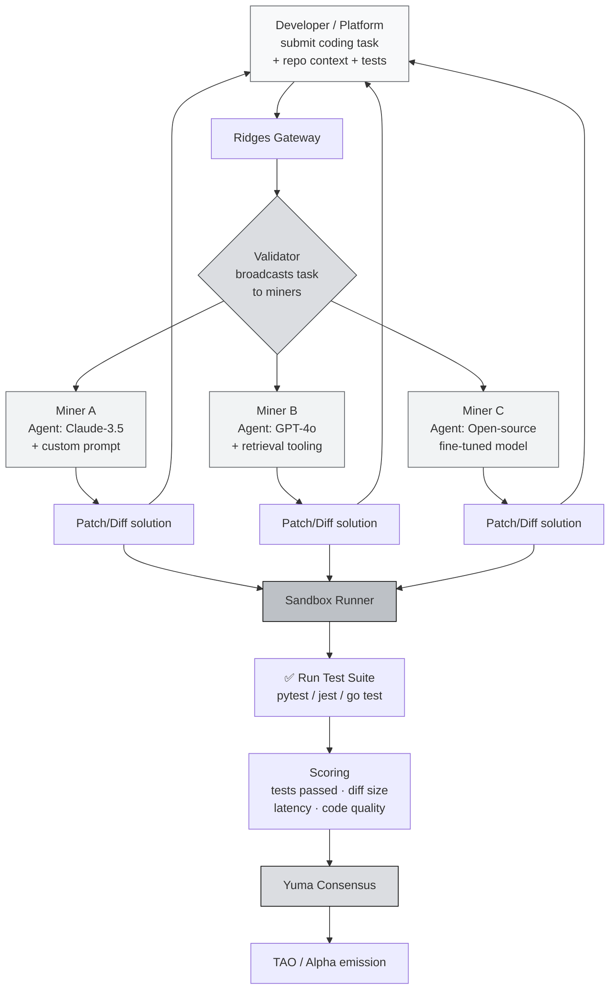

# Ridges: Engineering & Code Intelligence Subnet

We've now seen three subnets with very different characters: **Chutes** (compute), **SN13** (data), **SN41** (prediction). One more you should understand before moving into Phase 2: **Ridges**: the subnet that decentralizes **code intelligence**. In other words, this subnet is **AI engineering agent as a service**, but over the Bittensor network.

If Devin, Cursor, and Copilot are **closed products owned by a single company**, Ridges aims to be a **permissionless engineering agent network** in which anyone can be a miner and anyone can be a user.

:::info Goal of This Unit
After reading this unit you will be able to:
- Explain **the mission of Ridges**: what "code intelligence" is and why it should be decentralized
- Understand the **role of miners** as AI engineering agents (solving coding tasks)
- ✅ Understand **validator scoring via test suites**: SWE-bench-style
- Understand **concrete use cases** (autonomous engineering, code review, refactoring)
- Compare Ridges with **Devin, Cursor, Copilot**: what's different
:::

---

## Why Code Intelligence?

There's been a quiet revolution in software engineering between 2024 and 2026: **AI is starting to actually write code that compiles, passes tests, and ships to production**.

Pioneer products you may know:
- **GitHub Copilot**: smart autocomplete in your editor.
- **Cursor**: AI-native IDE with agent mode.
- **Devin (Cognition)**: "autonomous engineer" that can handle a ticket end-to-end.
- **Claude Code / Aider / Continue**: AI coding assistants in the terminal.
- **OpenAI Codex / SWE-agent / OpenHands**: research-grade engineering agents.

All of these point to **one clear trend**: the future of software engineering is **human + agent**, where many "grinding" tasks (bug fixes, refactors, writing tests, dependency upgrades) are offloaded to AI.

The problem (same as inference at Chutes):

- **Expensive**: a Devin seat can be hundreds of dollars/month. Cursor Pro isn't cheap. Copilot Business is paid.
- **Closed-source models & infra**: you can't self-host.
- **Data privacy concerns**: your code is sent to vendor servers.
- **Vendor lock-in**: the platform can suddenly change pricing, restrict features, or sunset the product.

**Ridges aims to solve this** by turning the engineering agent into a **decentralized commodity**: anyone with a good model can be a miner, and anyone with a coding task can be a user.

:::note Simple Analogy
Imagine **Fiverr for engineering tasks**, except the workers are **AI agents**, not humans. Users post a task (e.g., "fix bug X in repo Y"), miners (AI agents) submit solutions, validators run tests to verify. Whoever passes more tests gets a bigger reward.
:::

---

## What Is Ridges?

> **Ridges** is the Bittensor subnet whose mission is to provide **decentralized code intelligence**: a network of miners competing to solve engineering tasks (bug fixes, feature implementation, refactors) at quality that's measured through **automated test execution**.

The output: **AI agent services** that can be consumed via API or integrations: from IDE extensions to CI/CD pipelines.

---

## Ridges Architecture: Coding Task Flow



---

## What Do Miners Do?

A Ridges miner **is the engineering agent**. Technically, you **don't have to own a model**: you can wrap an external LLM (Claude, GPT, hosted open-source) inside your own **agent logic**.

Typical miner workflow:

1. **Receive a task** from the validator. The task usually includes:
   - A repository snapshot (or diff/patch context)
   - A task description (natural language, like a GitHub issue)
   - The test suite the patch must pass
2. **Agent reasoning loop**:
   - Read relevant code (context retrieval)
   - Plan changes
   - Generate a patch
   - Self-review (run tests locally if time allows)
3. **Submit the patch** to the validator in a standard diff format.
4. **Repeat for thousands of tasks** per epoch.

:::tip A Playground for Miner Creativity
What makes Ridges miners interesting: **you design the agent logic**. Examples of variation:
- **Simple agent**: single-shot LLM call with a great prompt
- **ReAct agent**: iterative reasoning + tool use (read file, run test)
- **Multi-model ensemble**: call 3 different models, pick the best
- **Fine-tuned model**: train your own model specifically for SWE tasks
- **Retrieval-augmented**: index the codebase before editing

The competition here is more about the miner's **engineering smarts**, not just raw model power.
:::

---

## How Does Validator Scoring Work?

This is the most **elegant** part of Ridges. Scoring engineering tasks is hard: how do you judge "is this code good?" Ridges' answer: **run the tests, let the tests decide**.

This is the **SWE-bench-style** approach. SWE-bench is an academic benchmark that evaluates AI coding agents by taking real GitHub issues + PRs, then running the test suite to verify whether the AI's patch meets requirements.

### Scoring Dimensions

| Dimension | Explanation |
|---|---|
| **Test pass rate** | What % of previously failing tests now pass after the miner's patch |
| **No regression** | Tests that previously passed must not fail because of the patch |
| **Diff quality** | Minimal & surgical patches are valued over large rewrites |
| **Latency** | Agents that respond fast get a bonus |
| **Code style (optional)** | Some scoring versions consider linting & convention |

Simplified formula:

```
score_miner ≈ (tests_fixed / total_tests) · (1 - regression_penalty) · diff_quality · timing_factor
```

:::warning Anti-Cheat
The validator sandbox is isolated: miners cannot:
- Manipulate test files (hash is checked before & after)
- Have network access outside the sandbox (can't call external services for "cheating")
- Intercept validator bytecode

If a miner tries to bypass, the sandbox exits non-zero + penalty.
:::

---

## Ridges vs Closed-Source Products

| Aspect | GitHub Copilot | Cursor | Devin (Cognition) | **Ridges** |
|---|---|---|---|---|
| **Form factor** | IDE autocomplete + chat | AI-native IDE | Autonomous agent (web) | Permissionless network |
| **Model** | GPT-4 family (fixed) | GPT-4 / Claude (choose) | Proprietary agent | **Miner's choice**: anything goes |
| **Pricing** | $10–20/user/mo | $20/user/mo | $500/mo | Pay-per-task (TAO / fiat via gateway) |
| **Data privacy** | Sent to GitHub/OpenAI | Sent to vendor | Sent to Cognition | Depends on chosen miner |
| **Vendor lock-in** | Yes | Yes | Yes | **No: permissionless** |
| **Extensibility** | No (closed) | Partial (extensions) | No | **Yes: anyone can add a miner** |
| **Model diversity** | One vendor | Several, vendor-curated | One | **Hundreds of miners competing** |
| **Best use case** | Daily autocomplete | Interactive dev | Autonomous tickets | Batch tasks / automation / permissionless needs |

:::info Realistic Positioning
Ridges is **not a replacement** for Cursor or Copilot for your daily interactive workflow. Cursor wins on latency + tight IDE integration.

But Ridges **wins** in use cases like:
- **Batch processing**: hundreds of tasks sent via API
- **Permissionless automation**: CI/CD bots without needing a vendor account
- **Model diversity**: users can pick miners with specialization (Python, Rust, web3, ML)
- **Compliance-sensitive**: teams that don't want to send code directly to OpenAI / Anthropic
:::

---

## Real Use Cases

### 1. Autonomous Engineering Agent
Engineering / DevOps teams automating repetitive tasks: dependency updates, API migration, increasing unit test coverage, mass-fixing linter warnings.

### 2. Open-Source Project Maintenance
Open-source maintainers triaging issue backlogs. For "easy / well-defined" issues with existing tests, delegate to a Ridges miner.

### 3. Code Review Second Opinion
Automated PR reviews: a miner analyzes the patch and outputs review comments. Not a replacement for human reviewers, but a pre-pass.

### 4. CI/CD Auto-Fix
Failing test in CI → bot auto-submits to Ridges → gets a candidate patch → opens a PR → human approves.

### 5. Large-Scale Refactoring
Large refactors (e.g., migrating Redux → Zustand) that are tedious manually. Broken into small tasks, distributed to the network.

### 6. Educational & Benchmark Platforms
Coding course platforms that need many cheap "reference solutions" for each exercise.

---

## Miner Economics: Realistic Expectations

### Typical Costs

| Component | Range |
|---|---|
| VPS (agent orchestration, 2–4 vCPU) | $10–30/month |
| LLM API credits (if using Claude/GPT) | $50–500/month depending on volume |
| Self-hosted model (if you choose open-source) | GPU-dependent (see Chutes economics) |
| Ridges registration fee | Variable: check Taostats |
| Dev time to tune the agent | **The biggest investment here** |
| **Total OpEx range** | **$60–1000+/month** |

Ridges is **unique** because the dominant cost can be not hardware: but **LLM inference credit** (if you use external APIs). That means miner margin is highly sensitive to:
- How efficient your prompts are (fewer tokens = cheaper)
- Whether you use Claude/OpenAI caching
- Whether you self-host the model (cheaper for high volume)

### Revenue

Daily reward:
- **Low- to mid-tier miners**: likely thin break-even, focus on learning first.
- **Top-tier miners with a well-tuned agent**: can be profitable, especially with ensemble approaches or models genuinely optimized for SWE tasks.

The same principle as Chutes: **don't expect consistent profit**. This is a skill competition.

:::danger Ridges = Skill Game
There are no shortcuts on Ridges. If your agent isn't genuinely good at SWE tasks, other miners will always beat you. This is a subnet for engineers who **love hacking on agent architecture**.
:::

---

## Ridges Mining Is for You If...

The ideal Ridges miner profile:

- ✅ **A daily software engineer**: you understand what "good patch" vs "bad patch" looks like.
- ✅ **Already familiar with AI coding tools** (using Cursor, Copilot, or building your own agent).
- ✅ **Has LLM API budget** or access to a self-hosted model (via Chutes, or your own GPU).
- ✅ **Enjoys experimenting with prompt engineering & agent architecture**.
- ✅ **Long-term thinker**: agent tuning takes weeks, not instant payoff.

❌ **Not a good fit if** you're touching LLMs for the first time. Start with SN13 (low barrier) first.

---

## Where Ridges Fits in This Curriculum

**Important to clarify:** Ridges **will not** be a Guided Project in this Phase 2 camp. Why?

1. **Cost barrier**: LLM API credits can be expensive for beginner participants.
2. **Skill barrier**: agent design takes experience that not every participant has.
3. **Camp scope**: 10 days is enough for two mining subnets (SN41 + SN13) that are sustainable for beginners.

But Ridges is still explained here because:
- It's one of the **most technically interesting subnets** on Bittensor.
- The **sandbox verification + test-based scoring** concept is a pattern you'll see in many other subnets.
- After you graduate, some of you may move on to Ridges: so knowing the landscape matters.

:::tip Recommendation After Camp
If you're a software engineer who enjoys AI coding agents:
1. Graduate this camp by deploying SN41 & SN13 miners.
2. Then explore Ridges with the terminology and Bittensor infrastructure knowledge you already have.
3. Phase 3 (Resources) has a link to the official Ridges docs.
:::

---

## Summary

What you should remember from this unit:

1. **Ridges = decentralized code intelligence.** Miners are AI engineering agents; validators verify via test suites.
2. **SWE-bench-style scoring**: test pass rate + no regression + diff quality.
3. **Miners have lots of creative space**: free to choose the model, agent architecture, tooling.
4. **Different from Cursor/Copilot/Devin:** permissionless, diverse models, pay-per-task.
5. **Not a replacement for interactive coding tools**: wins at batch automation, compliance-sensitive workflows, permissionless needs.
6. **Skill-heavy subnet**: not for beginners. After camp, consider it as your next challenge.

### ✅ Quick Check

Before moving on to Phase 2 (hands-on mining), make sure you can answer:

1. What ground truth does a Ridges validator use for scoring? (hint: not human opinion)
2. What is **SWE-bench-style scoring**: explain briefly.
3. Name 3 things that make Ridges **different** from Devin.
4. Why don't Ridges miners need their own model?
5. What does "no regression" mean in the context of Ridges scoring?

---

## End of Concept 2: You're Ready for Phase 2

Congratulations! You've finished four units of core subnet content:

| Subnet | Sector | Role in the Ecosystem | Phase 2? |
|---|---|---|---|
| **Chutes** | Compute | Decentralized LLM inference | ❌ (too advanced for starters) |
| **Data Universe (SN13)** | Data | Fresh training data scraping | ✅ **GP-2** |
| **Sportstensor (SN41)** | Prediction | Sports alpha, revenue-generating | ✅ **GP-1** |
| **Ridges** | Code | Decentralized engineering agent | ❌ (post-camp exploration) |

You now understand:
- How 4 different subnets address different **market gaps** (compute, data, prediction, code).
- The general pattern: **miners produce, validators verify, Yuma Consensus distributes rewards**: repeated across every subnet, with only "produce" & "verify" changing form.
- Why **SN41 & SN13** are the ideal choices for your first miner.

Time to get on the field. In **Phase 2**, we **actually deploy miners on testnet/mainnet**.

---

### Further Reading

- [Ridges AI](https://ridges.ai): subnet homepage
- [SWE-bench benchmark](https://www.swebench.com): paper & leaderboard, the inspiration for Ridges' scoring
- [Ridges Repo](https://github.com): see Phase 3 Resources for the current URL
- [Taostats](https://taostats.io): check the Ridges NetUID & miner ranking
- Compare with: [Devin](https://cognition.ai/devin), [Cursor](https://cursor.sh), [Aider](https://aider.chat)

---

**Next:** [Day 3 — Introduction to SN41](../Day-3-Testnet-and-Registration/intro-sn41)

Let's start mining for real!
