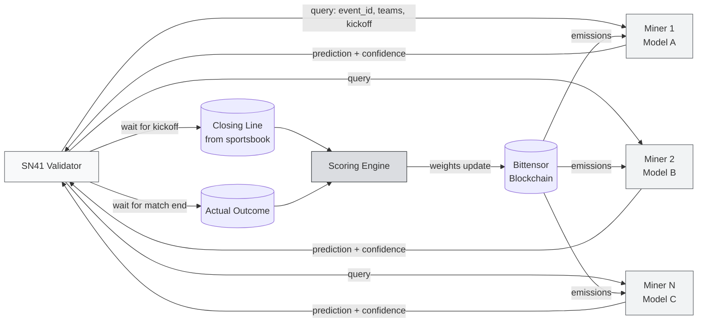

# Introduction to the SN41 Subnet

:::info Goal of This Unit
After completing this unit you will:
- Understand **what Sportstensor (SN41) does** and why this subnet is unique among Bittensor subnets
- Understand the **miner ↔ validator architecture** for sports predictions
- Know the minimum **hardware requirements** and starting budget (TAO + infra)
- Have a **7-unit roadmap** to your active mainnet miner
- Be ready to decide: continue setting up the wallet in Unit 2, or evaluate first
:::

:::note Prerequisites
- ✅ Completed **Phase 0** (Web3, AI, Decentralized AI)
- ✅ Completed **Phase 1**: especially Concept II Unit 3 (Sportstensor overview)
- ✅ Have a laptop/VPS with Linux or WSL2 (Ubuntu 22.04+ recommended)
- ✅ Python 3.10+ installed (`python3 --version`)
- ✅ Starting funds of **~0.5–2 TAO** for registration + buffer (price fluctuates, check the latest)
:::

---

## What Is Sportstensor?

**Sportstensor** (netuid **41** on Bittensor mainnet) is the subnet that runs a **decentralized sports prediction market**. Miners on this subnet compete to give the most accurate predictions for sports outcomes: soccer, NBA, NFL, MLB, tennis, and more: and validators measure prediction accuracy against the **closing line** (the official odds at kickoff) or the **actual outcome**.

What makes SN41 distinctive:

1. **Real revenue model (USD → TAO buyback)**
   Sportstensor has a B2B product that sells prediction access to clients in the sports/betting industry. The incoming USD revenue is used to **buy back TAO** periodically and redistribute it to high-performing miners. This is one of the few subnets with *real-world cashflow*.

2. **Objective ground truth**
   Unlike LLM subnets where scoring is subjective, sports outcomes are facts. Validators don't have to debate "which answer is better": Team A wins, loses, or draws. End of story.

3. **Low hardware barrier to entry**
   You don't need 8× H100s like an LLM training subnet. A modern CPU + stable internet is enough to start. A GPU is only useful if you're training your own predictive ML model.

---

## High-Level Architecture



### Single Prediction Lifecycle

1. The **validator** gets the match schedule from a data source (its internal scheduler).
2. Before kickoff, the validator sends a **query** containing `event_id`, sport, teams, and kickoff time to all active miners.
3. **Miners** run their prediction models (statistical / ML / hybrid) and reply with `{prediction, confidence, stake_suggestion}`.
4. The validator **records** miner answers and timestamps.
5. At kickoff, the validator locks the **closing line** from a sportsbook (e.g., Pinnacle): this is the "smart money consensus".
6. After the match ends, the validator has the **actual outcome**.
7. The **scoring engine** computes how close the miner's prediction was to the closing line (CLV: *Closing Line Value*) and to the actual outcome.
8. The validator submits **weights** to the chain; the blockchain distributes **emissions** (TAO) proportionally to top-performing miners.

:::tip Why the Closing Line, Not Just Win/Lose?
The closing line is an **efficiency benchmark**. If your prediction consistently "beats the closing line", that's evidence of skill, not just luck. A single match can be wrong; 1000 matches with positive CLV = real alpha.
:::

---

## Hardware Requirements

:::info Specs That Have Proven Sufficient
Most SN41 miners run on these specs without issue. Start small, scale if your strategy needs it.
:::

| Component | Minimum | Recommended | Notes |
|---|---|---|---|
| **CPU** | 2 vCPU | 4–8 vCPU | To handle inference + data scraping |
| **RAM** | 4 GB | 8–16 GB | Small ML models need 4 GB; heavy feature stores → 16 GB |
| **Disk** | 40 GB SSD | 100 GB SSD | Logs + historical data + model artifacts |
| **GPU** |: (optional) | RTX 3060 / cloud T4 | Only if you train ML yourself. Light inference = CPU only |
| **Internet** | 50 Mbps stable | 100+ Mbps, low jitter | **CRITICAL**: a miner that times out = 0 reward |
| **OS** | Ubuntu 20.04+ | Ubuntu 22.04 LTS | WSL2 OK for dev; production should use native Linux / VPS |
| **Uptime** | 95%+ | 99%+ | Down during a validator query = miss the reward window |

### Common Hosting Options

- **Cheap VPS**: Contabo VPS-M (~€8/month), Hetzner CX22 (~€4/month)
- **Mid-tier VPS**: DigitalOcean Basic Droplet $12/month
- **Cloud GPU** (if needed): Vast.ai, RunPod on-demand

:::warning Don't Use Home WiFi for Production
Home WiFi can go down, IP changes, latency spikes. For 1–2 days of testing it's fine; for production: **use a VPS**. The cost of a coffee a month is cheaper than missing a day of emission.
:::

---

## Cost & Time Estimates

### One-time Cost (Registration)

The registration cost on Bittensor is **dynamic** (recycle / burn mechanism). Check the actual price:

```bash
btcli subnet burn_cost --netuid 41
```

Historical range (re-check when you register):

| Component | Estimate |
|---|---|
| Registration fee (TAO burn) | 0.1 – 1.5 TAO |
| Transaction buffer | 0.05 TAO |
| **Total minimum to have on the coldkey** | **~1.5 – 2 TAO** |

### Running Cost (Monthly)

| Component | Estimate |
|---|---|
| VPS | $5 – $20 / month |
| Data API (The Odds API free tier or Sportradar trial) | $0 – $50 / month |
| **Total operations** | **$5 – $70 / month** |

### Realistic Timeline

```mermaid
gantt
    title 7-unit roadmap to an active miner
    dateFormat  YYYY-MM-DD
    section Setup
    Unit 1: SN41 Intro              :done, u1, 2026-04-14, 1d
    Unit 2: Wallet & TAO            :u2, after u1, 1d
    Unit 3: Register Miner          :u3, after u2, 1d
    section Miner Code
    Unit 4: Almanac Binding         :u4, after u3, 1d
    Unit 5: Miner Init & Metadata   :u5, after u4, 2d
    section Strategy
    Unit 6: Trade Execution         :u6, after u5, 2d
    Unit 7: Trading Strategies      :u7, after u6, 3d
```

**Total estimate**: 7–14 days at a casual pace, 3–5 days full-time.

---

## 7-Unit Roadmap (What's Next)

| Unit | Topic | Output |
|---|---|---|
| 1 | **SN41 Intro** (you are here) | Understand the why & be ready to continue |
| 2 | Wallet & TAO Funding | Coldkey + hotkey ready, TAO balance present |
| 3 | Register Miner | UID assigned on netuid 41 |
| 4 | Almanac Registration | Hotkey ↔ miner profile bound |
| 5 | Miner Init & Metadata | Miner process running 24/7 |
| 6 | Programmatic Trade Execution | Prediction handler functional |
| 7 | Trading Strategies | Active strategy + CLV monitoring |

:::tip Testnet First Is Fine
All steps in units 2–6 can be tried on **testnet** first using the `--subtensor.network test` flag and a testnet netuid before going to mainnet. We'll cover details in Unit 2.
:::

---

## Mindset Before Starting

:::danger Risk Disclaimer
- **The TAO you burn for registration cannot be returned**. This is not a deposit: it's a fee to enter the subnet.
- Miners that **underperform get pushed out** by new miners (deregistration). You can lose your slot if your score stays low.
- Sports betting / prediction markets are subject to regulation in some jurisdictions. Make sure you understand the local regulations.
- **This is not investment advice.** This curriculum teaches mining technically, not guaranteed profit.
:::

If you're ready to accept the risks above and ready to learn iteratively (not expecting profit on day one), Sportstensor is **one of the most straightforward subnets** to learn end-to-end Bittensor mining.

---

## Summary

In this unit you have:

- ✅ Met Sportstensor (SN41) as a sports prediction subnet with a real revenue model
- ✅ Understood the validator ↔ miner architecture and the scoring cycle (query → closing line → actual outcome)
- ✅ Learned the minimum hardware requirements (2 vCPU / 4 GB RAM / $5/month VPS is enough)
- ✅ Got cost estimates (~1.5–2 TAO + $5–70/month) and timeline (7–14 days)
- ✅ Got the 7-unit roadmap you'll execute

### ✅ Quick Check

Before moving on to Unit 2, answer quickly:

1. What's the difference between Sportstensor and an LLM subnet in terms of ground truth?
2. What is the **closing line** and why does it matter?
3. What's the minimum TAO you need before registering?
4. Why is home WiFi suboptimal for a production miner?

If you can answer all four without scrolling back: you're ready.

### Troubleshooting

| Issue | Fix |
|---|---|
| Confused about testnet vs mainnet netuid | Mainnet SN41 = netuid `41`. Testnet uses a different netuid; we'll confirm in Unit 3 |
| No Linux yet | Install WSL2 on Windows, or rent a VPS from Hetzner/Contabo from the start |
| No Python 3.10+ | `sudo apt install python3.11 python3.11-venv` |
| Unsure about budget | Testnet first (free via faucet). Mainnet later once you're confident your strategy works |

---

**Next:** [Unit 2: Bittensor Wallet Setup & TAO Funding →](./wallet-tao-funding)
