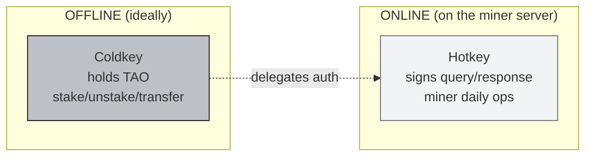

# Bittensor Wallet Setup and TAO Funding

:::info Goal of This Unit
After this unit you will have:
- `btcli` installed and version confirmed
- A new **coldkey** (for holding TAO, offline-first)
- A new **hotkey** (for signing miner operations, online)
- The mnemonic **safely backed up** in an offline location
- TAO ready in the coldkey: testnet (via faucet) or mainnet (via exchange)
- Balance verified via `btcli wallet overview`
:::

:::note Prerequisites
- ✅ Completed [Unit 1: Intro SN41](./intro-sn41)
- ✅ Python 3.10+ (`python3 --version`)
- ✅ `pip` and `venv` ready
- ✅ Stable internet access
- ✅ (For mainnet) Exchange account that supports TAO: **Kraken**, **MEXC**, **Gate.io**, **KuCoin**
:::

---

## Coldkey vs Hotkey Concept

Before executing, you must understand the difference between these two keys: using the wrong one = losing funds.



| Aspect | Coldkey | Hotkey |
|---|---|---|
| **Function** | Holds TAO, high-value ops | Signs miner/validator messages |
| **Exposure** | Ideally offline / cold | Lives on the miner server 24/7 |
| **If compromised** |  TAO can be stolen | Can be replaced, TAO safe |
| **Quantity** | Usually 1 | Can be many (one per role) |

:::danger Important Analogy
**Coldkey = bank vault**. **Hotkey = ATM card**. If you lose the ATM card, you block it; the funds in the vault stay safe. If the vault is breached, everything is lost. Treat the coldkey with the appropriate *paranoia*.
:::

---

## Step 1: Install btcli

There are two packages:

- `bittensor-cli` → CLI only (lightweight, sufficient for wallet operations)
- `bittensor` → full SDK (required later to run a miner)

### Set Up a Virtual Environment First

```bash
# create a project folder
mkdir -p ~/bittensor && cd ~/bittensor

# virtual env to avoid global conflicts
python3 -m venv venv
source venv/bin/activate

# confirm pip
pip install --upgrade pip
```

### Install

```bash
# Install CLI + SDK together (recommended, since you'll need the SDK later)
pip install bittensor bittensor-cli
```

**Verify:**

```bash
btcli --version
```

Output approximately:

```text
btcli, version 8.x.x
```

:::tip If You Get `command not found`
Make sure the venv is active (`source ~/bittensor/venv/bin/activate`). If you want it global, re-install without venv, but the dependency conflict risk is high: **venv is safer**.
:::

### Checkpoint Validation

```bash
btcli --help | head -20
```

If you see the list of subcommands (`wallet`, `subnet`, `stake`, etc.): installation is successful.

---

## Step 2: Create the Coldkey

```bash
btcli wallet new_coldkey --wallet.name sn41_miner
```

The process:

1. btcli asks for a **password** to encrypt the local coldkey file. Pick a strong password, **don't lose it**: there's no recovery.
2. btcli generates a **12-word mnemonic** and shows it in the terminal.
3. Confirm the mnemonic has been recorded.

Output (example: the mnemonic below is ONLY illustrative, never use a leaked one):

```text
IMPORTANT: Store this mnemonic in a secure (preferable offline place), as anyone
who has possession of this mnemonic can use it to regenerate the key and access your tokens.

The mnemonic to the new coldkey is:
word1 word2 word3 word4 word5 word6 word7 word8 word9 word10 word11 word12

You can use the mnemonic to recreate the key in case it gets lost. The command to use to regenerate the key is:
btcli w regen_coldkey --mnemonic "word1 word2 ... word12"
```

:::danger BACK UP THE MNEMONIC NOW
**Before continuing:** write those 12 words on **physical paper** (two copies, in different locations). Do not:
- ❌ Screenshot
- ❌ Save to Google Docs / Notion / cloud notes
- ❌ Send to your own WhatsApp
- ❌ Put it in a `.txt` file on your laptop

**Anyone with the mnemonic = owns your TAO.** After recording, `clear` the terminal.
:::

```bash
clear   # remove the mnemonic from the terminal scrollback
history -c   # clear this shell session's history
```

### Checkpoint

```bash
btcli wallet list
```

Should show `sn41_miner` with an address starting with `5...` (SS58 format).

---

## Step 3: Create the Hotkey

```bash
btcli wallet new_hotkey \
  --wallet.name sn41_miner \
  --wallet.hotkey miner_01
```

Same process: password + new hotkey mnemonic. The hotkey mnemonic **should also be backed up**, but its risk profile is lower than the coldkey.

Output:

```text
The mnemonic to the new hotkey is:
...12 words...

btcli w regen_hotkey --mnemonic "..."
```

### Checkpoint

```bash
btcli wallet list
```

Expected output:

```text
Wallets
└── sn41_miner
    ├── Coldkey  5FHneW46xGXgs5mUiveU4sbTyGBzmstUspZC92UhjJM694ty
    └── Hotkeys
        └── miner_01  5CiPPseXPECbkjWCa6MnjNokrgYjMqmKndv2rSnekmSK2DjL
```

Your **SS58** address will differ, but the structure is the same.

:::tip Screenshot This Output
You'll need a screenshot of `btcli wallet list` for the graduation submission at the end of the Guided Project.
:::

---

## Step 4: Get TAO (Testnet First!)

### Option A: Testnet Faucet (RECOMMENDED for learning)

Testnet TAO is free via faucet. The testnet uses a separate subtensor endpoint.

```bash
btcli wallet faucet \
  --wallet.name sn41_miner \
  --subtensor.network test
```

The process requires **proof-of-work** (runs for a few minutes on CPU). After completion:

```bash
btcli wallet overview \
  --wallet.name sn41_miner \
  --subtensor.network test
```

The testnet TAO (τ) balance will appear on the coldkey.

:::tip Faucet Sometimes Disabled
If the faucet is rate-limited or disabled, ask in the **Bittensor Discord** `#testnet-faucet` channel or try again a few hours later.
:::

### Option B: Mainnet (Buy From an Exchange)

For **real mining on SN41 mainnet**:

1. Buy TAO on a supporting exchange:
   - **Kraken** (pair: TAO/USD, TAO/USDT): most established
   - **MEXC**: decent spreads
   - **Gate.io**: wide listings
   - **KuCoin**: alternative
2. Withdraw TAO to your **coldkey SS58 address**.
   -  Make sure the exchange supports **native Bittensor withdrawal** (not wrapped TAO on another network!)
3. Wait for confirmation (typically 1–3 minutes).

:::warning Double-Check the SS58 Address
Paste the coldkey address from `btcli wallet list`. Don't type it manually. **Transferring to the wrong address = TAO is permanently lost.**

Test with a **small amount** first (0.01 TAO) before withdrawing the full amount. $0.01 today > losing 2 TAO later.
:::

### Check the Mainnet Balance

```bash
btcli wallet overview --wallet.name sn41_miner
```

Expected:

```text
Coldkey: sn41_miner
  Balance: τ 2.000000000
  Hotkeys:
    miner_01 (5Ci...DjL)  Stake: τ 0.0
```

---

## ✅ Step 5: Full Verification

Run the checklist below. **All must pass** before continuing to Unit 3.

```bash
# 1. btcli installed & version OK
btcli --version

# 2. Wallet registered
btcli wallet list

# 3. Coldkey balance is sufficient (min 1.5 TAO on mainnet, or 5+ test-τ on testnet)
btcli wallet overview --wallet.name sn41_miner

# 4. (Optional) check balance by hotkey
btcli wallet balance --wallet.name sn41_miner
```

### Checkpoint Matrix

| Check | Expected | If Failed |
|---|---|---|
| `btcli --version` | `8.x.x` shows | Re-install, make sure venv active |
| `btcli wallet list` | Coldkey + hotkey appear | Re-run steps 2 & 3 |
| Coldkey balance ≥ 1.5 TAO (mainnet) | Balance shows | Add deposit from exchange |
| Balance ≥ 5 test-τ (testnet) | Balance shows | Re-run the faucet |

---

## Wallet File Structure

btcli stores wallets in `~/.bittensor/wallets/`:

```text
~/.bittensor/wallets/sn41_miner/
├── coldkey             # encrypted, requires password
├── coldkeypub.txt      # public key (safe to share)
└── hotkeys/
    └── miner_01        # encrypted hotkey
```

:::danger DO NOT Commit This Folder to Git
Add to `.gitignore`:
```text
.bittensor/
*.bittensor
wallets/
```
And **don't upload the `coldkey` file anywhere**: even though it's encrypted.
:::

---

## Summary

You have successfully:

- ✅ Installed `btcli` + `bittensor` SDK in a virtualenv
- ✅ Generated **coldkey** `sn41_miner` + offline mnemonic backup
- ✅ Generated **hotkey** `miner_01` + mnemonic backup
- ✅ Got TAO (testnet via faucet or mainnet via exchange)
- ✅ Verified the balance via `btcli wallet overview`

### ✅ Quick Check

1. What's the difference between coldkey and hotkey roles in miner operations?
2. Where are local wallet files stored by default?
3. Why must the mnemonic **not** be saved in Google Docs?
4. What flag is used for testnet operations?

### Troubleshooting

| Error | Likely Cause | Fix |
|---|---|---|
| `command not found: btcli` | venv not active | `source ~/bittensor/venv/bin/activate` |
| `ModuleNotFoundError: bittensor` | Install half-failed | `pip install --force-reinstall bittensor` |
| Faucet output `rate limited` | Too many requests | Wait 1–4 hours, or ask Discord |
| Balance shows but `0.0` | Transaction not confirmed | Wait 1–3 blocks (12–36 seconds) |
| SS58 address looks different | Different network | Make sure endpoints match (`--subtensor.network test` for testnet) |
| `Invalid password` on unlock | Typo | No reset: must use mnemonic via `btcli w regen_coldkey` |
| Mnemonic lost |  Cannot recover | Create a new wallet, treat the old one as lost |

:::tip Bookmark the Output
Save screenshots of `btcli wallet list` and `btcli wallet overview`: needed for the **graduation submission**.
:::

---

**Next:** [Unit 3: Registering a Miner on Sportstensor →](./register-miner)
