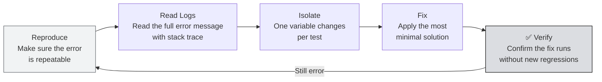

import Tabs from '@theme/Tabs';
import TabItem from '@theme/TabItem';

# Unit 7: Local Debugging & Troubleshooting

:::info Goal of This Unit
By the end of this unit you will:
- Have a **systematic debug framework**: reproduce → read logs → isolate → fix → verify
- Understand the **top 10 most common issues** with a local Bittensor miner and how to fix them
- Be able to **read logs** from btcli and the miner to identify problems
- Know **per-OS diagnostic commands** for network, port, and process inspection
:::

:::note Prerequisites
- ✅ Units 1–6 complete: the miner has run before (with errors or not)
- ✅ Familiar with the basic terminal
:::

---

## Debug Framework: 4 Steps

Don't immediately Google or ask in Discord whenever an error appears. **Reproduce first, then isolate:**



---

## How to Read Miner Logs

Miner logs use the format: `TIMESTAMP | LEVEL | MESSAGE`

```text
2026-04-21 10:30:12 | INFO     | Loading wallet mywallet/miner1       ← OK
2026-04-21 10:30:13 | WARNING  | No validators found in metagraph     ← Normal on testnet
2026-04-21 10:30:14 | ERROR    | Connection refused to subtensor      ← PROBLEM
2026-04-21 10:30:14 | CRITICAL | Failed to initialize axon            ← FATAL
```

### Reading Logs Based on Run Method

<Tabs>
<TabItem value="foreground" label="Plain Terminal" default>

Logs appear directly in the terminal. Scroll up to see the original error.

Run with the debug flag for more detailed logs:

```bash
python neurons/miner.py \
  --netuid 1 \
  --wallet.name mywallet \
  --wallet.hotkey miner1 \
  --subtensor.network test \
  --logging.debug 2>&1 | tee ~/miner.log
```

The `2>&1 | tee ~/miner.log` flag = display in the terminal AND save to a file.

</TabItem>
<TabItem value="screen" label="screen">

```bash
# Re-attach to the session
screen -r bittensor-miner

# Scroll up with: Ctrl+A, [   (opens scroll mode)
# Scroll: PgUp / PgDn
# Exit scroll mode: q or Enter
```

Or read the log file:

```bash
tail -f ~/miner.log
```

</TabItem>
<TabItem value="tmux" label="tmux">

```bash
# Re-attach
tmux attach -t bittensor-miner

# Scroll mode: Ctrl+B, [
# Scroll: arrow keys / PgUp / PgDn
# Exit: q
```

</TabItem>
</Tabs>

---

## Top 10 Most Common Issues

### Issue 1: `btcli: command not found`

**Symptom:** Type `btcli` → `command not found`

**Cause:** venv not activated.

```bash
# Fix
source ~/bittensor-env/bin/activate
btcli --version  # should now appear
```

**Prevent:** Add the `btenv` alias to `.bashrc` / `.zprofile` (see Unit 2).

---

### Issue 2: `ModuleNotFoundError: No module named 'bittensor'`

**Symptom:** Import error when Python runs.

**Cause:** Wrong venv or bittensor not installed.

```bash
# Verify venv is active
which python
# Should be: /home/user/bittensor-env/bin/python

# Reinstall the SDK
pip install "bittensor<10.0.0"
```

---

### Issue 3: `ImportError` or `AttributeError` related to bittensor

**Symptom:** Errors like `cannot import name 'SubnetInfo' from 'bittensor'` or `AttributeError: 'subtensor' object has no attribute 'X'`

**Cause:** SDK version too new (v10+), incompatible with the subnet template.

```bash
# Check version
python -c "import bittensor; print(bittensor.__version__)"

# If >=10.0.0, downgrade:
pip uninstall bittensor -y
pip install "bittensor<10.0.0"
```

---

### Issue 4: `Connection refused` / Timeout to Subtensor

**Symptom:**
```text
ERROR | SubstrateRequestException: Connection refused
ERROR | Failed to connect to subtensor at test
```

**Cause:** Subtensor testnet endpoint down or network issue.

```bash
# Try the alternative endpoint
python neurons/miner.py \
  --netuid 1 \
  --wallet.name mywallet \
  --wallet.hotkey miner1 \
  --subtensor.chain_endpoint wss://test.finney.opentensor.ai:443 \
  --logging.debug

# Or check basic connectivity
curl -s --max-time 5 https://test.finney.opentensor.ai && echo "OK" || echo "FAIL"
```

---

### Issue 5: Port 8091 Already in Use

**Symptom:**
```text
ERROR | Port 8091 is already in use
OSError: [Errno 98] Address already in use
```

```bash
# Find the process using the port
lsof -i :8091

# Kill the process (replace <PID> with the number from lsof output)
kill -9 <PID>

# Or use a different port
python neurons/miner.py --axon.port 8092 ...
```

---

### Issue 6: `Wallet not found` / `Wallet file corrupted`

**Symptom:**
```text
ERROR | Wallet not found at path: ~/.bittensor/wallets/mywallet
```

```bash
# Check available wallets
btcli wallet list

# Check the file location
ls ~/.bittensor/wallets/

# If files exist but are corrupted, restore from mnemonic
btcli wallet regen_coldkey --wallet-name mywallet
```

---

### Issue 7: `Insufficient balance` During Registration

**Symptom:**
```text
ERROR | Your balance τ 0.0000 is insufficient to pay the registration fee
```

**Solution:**
1. Request testnet TAO from the faucet (Unit 3)
2. Note: POW registration is disabled on NetUID 1, you must use testnet TAO

```bash
btcli subnet register \
  --netuid 1 \
  --wallet-name mywallet \
  --hotkey miner1 \
  --network test
```

---

### Issue 8: `Active: False` in Metagraph

**Symptom:** Miner running but `btcli subnets metagraph` shows `Active: False`.

**Diagnostic steps:**

```bash
# 1. Make sure the miner is running
ps aux | grep miner.py

# 2. Check port 8091 is listening
ss -tlnp | grep 8091       # Linux/WSL2
lsof -i :8091              # macOS/Linux

# 3. Test the port from another terminal
curl -s http://localhost:8091

# 4. Check whether a firewall is blocking
sudo ufw status            # Linux
```

If the port is listening but `Active: False` → likely **CGNAT**. Set up Ngrok (Unit 6).

---

### Issue 9: Miner Exits Without an Error Message

**Symptom:** The process dies right after start, with no error in the terminal.

```bash
# Run with verbose logging, save the output
python neurons/miner.py \
  --netuid 1 \
  --wallet.name mywallet \
  --wallet.hotkey miner1 \
  --subtensor.network test \
  --logging.debug 2>&1 | tee ~/debug-miner.log

# Read the log
cat ~/debug-miner.log | head -50
```

A common cause: the hotkey isn't registered on the subnet → check with `btcli wallet overview --network test`.

---

### Issue 10: Miner Runs But Earns No Reward

**Symptom:** Miner is `Active: True`, has been running for days, but `Trust` and emission stay 0.

**Checklist:**

```bash
# 1. Check whether the immunity period is still active
btcli subnets metagraph --netuid 1 --network test
# Look at the "Immunity" column

# 2. Check whether there are active validators on the testnet subnet
# (Testnet may have no active validators: normal, no reward on testnet)

# 3. Check the subnet template version: must be compatible with btcli
git -C ~/bittensor-subnet-template log --oneline -5

# 4. Make sure the axon endpoint is truly reachable
curl -v http://<public_ip>:8091
```

:::note Zero Reward on Testnet = Normal
On testnet, validators may be inactive or the emission mechanism may differ. GP-0 focuses on **learning the flow**: not actual rewards. Production rewards live on mainnet (GP-1/GP-2).
:::

---

## Advanced Diagnostics

### Check Network Connectivity

```bash
# Ping subtensor
ping -c 4 test.finney.opentensor.ai

# Traceroute to subtensor
traceroute test.finney.opentensor.ai

# Check DNS resolution
nslookup test.finney.opentensor.ai
```

### Check the Python Environment

```bash
# Python version
python --version

# List all packages in the venv
pip list

# Check a specific package
pip show bittensor
pip show bittensor-cli
```

### Check Processes & Resources

```bash
# List Python processes
ps aux | grep python

# Real-time resource monitor
top -p $(pgrep -f miner.py)    # Linux
# htop is nicer: sudo apt install htop, then: htop

# Check disk space
df -h ~
```

---

## Per-OS Troubleshooting

<Tabs>
<TabItem value="wsl2" label=" WSL2" default>

| Error | Cause | Fix |
|-------|-------|-----|
| `network unreachable` when starting WSL2 | WSL2 network adapter issue | In PowerShell: `wsl --shutdown`, open Ubuntu again |
| Port not accessible from Windows | Port proxy not yet set | `netsh interface portproxy add v4tov4 listenaddress=0.0.0.0 listenport=8091 connectaddress=$(wsl hostname -I) connectport=8091` in PowerShell Admin |
| `clock skew` error on chain | WSL2 clock not synced | `sudo hwclock -s` or `sudo ntpdate pool.ntp.org` |
| `Permission denied` on `sudo apt` | Sudo not configured | Open WSL2, run `passwd`, set a password first |
| Windows file path not recognized | Path must be in Linux format | Use `/mnt/c/Users/...` not `C:\Users\...` |

</TabItem>
<TabItem value="macos" label=" macOS">

| Error | Cause | Fix |
|-------|-------|-----|
| `SSL: CERTIFICATE_VERIFY_FAILED` | macOS SSL certs out of date | `python -m bittensor certifi` |
| Miner dies when screen sleeps | Sleep mode active | Use `caffeinate -i python3 ...` |
| `zsh: command not found: btcli` | venv not active or PATH wrong | `source ~/bittensor-env/bin/activate` |
| Homebrew permission error | Multi-user Mac | `sudo chown -R $(whoami) /opt/homebrew` (Apple Silicon) |
| `libomp` or `libssl` error | Missing dylib | `brew install libomp openssl` |
| Python 3.10 not found | PATH not updated | `export PATH="/opt/homebrew/opt/python@3.10/bin:$PATH"` |

</TabItem>
<TabItem value="linux" label=" Linux">

| Error | Cause | Fix |
|-------|-------|-----|
| `failed to build wheel for cryptography` | Missing dev headers | `sudo apt install libssl-dev libffi-dev python3-dev` |
| `PermissionError: /etc/resolv.conf` | DNS unwritable (non-root) | Run as a regular user, not root |
| `No such file or directory: /proc/net/if_inet6` | IPv6 disabled | Add `--no-use-ipv6` to the miner flags (if supported) |
| `systemd` service fails to start | Wrong path or user in unit file | Check `journalctl -u service-name -e` for details |

</TabItem>
</Tabs>

---

## When to Ask for Help

After trying to debug yourself and still being stuck, ask the community. Tips:

1. **Prepare the full info:**
   ```bash
   # Copy this output to Discord/forum
   python --version
   pip show bittensor | grep Version
   pip show bittensor-cli | grep Version
   uname -a  # or: sw_vers (macOS)
   btcli --version
   ```

2. **Share the full error message**: not a screenshot snippet, but the full stack trace

3. **Try suggested solutions** before asking again (read previous threads)

### Where to Ask

| Platform | Channel | Use For |
|----------|---------|---------|
| Bittensor Discord | `#miner-support`, `#developer-discussion` | General technical issues |
| Bittensor Discord | `#subnet-1-dev` | Issues specific to subnet 1 |
| GitHub | Issues at `opentensor/bittensor` | SDK/btcli bugs |
| GitHub | Issues at the subnet template repo | Miner template bugs |

---

## Summary

- **Debug framework**: reproduce → read logs → isolate → fix → verify
- **Top 3 most-frequent issues**: (1) venv not active, (2) wrong SDK version, (3) port/CGNAT
- **Full logs** = the key to debugging: always use `--logging.debug`
- `Active: False` = port not reachable → check firewall or set up Ngrok
- Zero reward on testnet = **normal**: testnet doesn't always have active validators

### ✅ Quick Check

1. Name the 4 steps of the Bittensor debug framework.
2. Why is `--logging.debug` important when debugging?
3. What's the difference between `ERROR` and `WARNING` in the miner logs?
4. How do you check the miner process is still running in the background?

<details>
<summary> Answers</summary>

1. **Reproduce → Read Logs → Isolate → Fix → Verify**
2. Without `--logging.debug`, many diagnostic messages are hidden. `DEBUG` level shows all details: validator connections, incoming queries, metagraph values fetched.
3. **WARNING** = something non-ideal but the program still runs (e.g., no active validators). **ERROR** = a failure that needs handling (connection failed, file not found).
4. `ps aux | grep miner.py`: if there's an output with the `miner.py` path, the process is still running.

</details>

---

## GP-0 Done!

Congratulations! You've finished the entire **GP-0 Local Mining** sequence:

- ✅ Set up WSL2 / macOS terminal / Linux
- ✅ Install Python, venv, btcli, Bittensor SDK
- ✅ Create coldkey + hotkey wallets, back up the mnemonic
- ✅ Register a miner on NetUID 1 testnet (TAO or POW)
- ✅ Clone & run the subnet-template miner
- ✅ Set up screen/tmux for 24/7 background running
- ✅ Configure ports and Ngrok for CGNAT
- ✅ Know how to debug common issues systematically

You now have a **strong technical foundation** to move on to production mining:

- **[GP-1: Sportstensor SN41](../Day-3-Testnet-and-Registration/intro-sn41)** → CPU-friendly, sports prediction, can run from a laptop
- **[GP-2: Data Universe SN13](../Day-3-Testnet-and-Registration/intro-sn13)** → VPS recommended, data scraping, storage-heavy

*Debugging is a skill, not a weakness. The best miner is the one who knows how to fix their own problems. *
