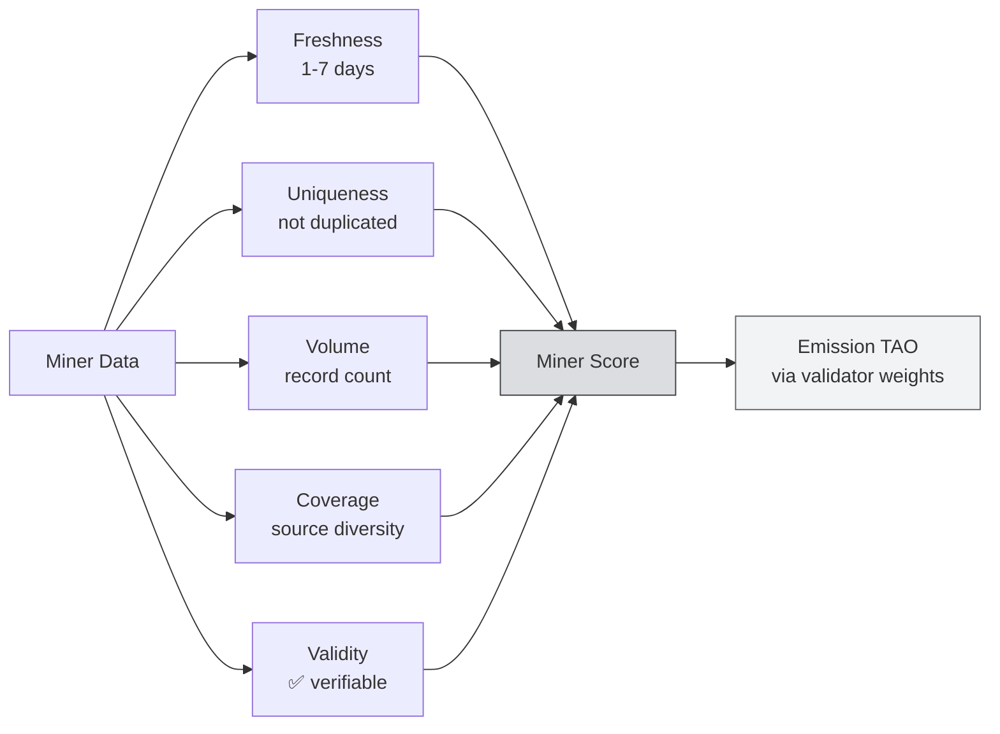
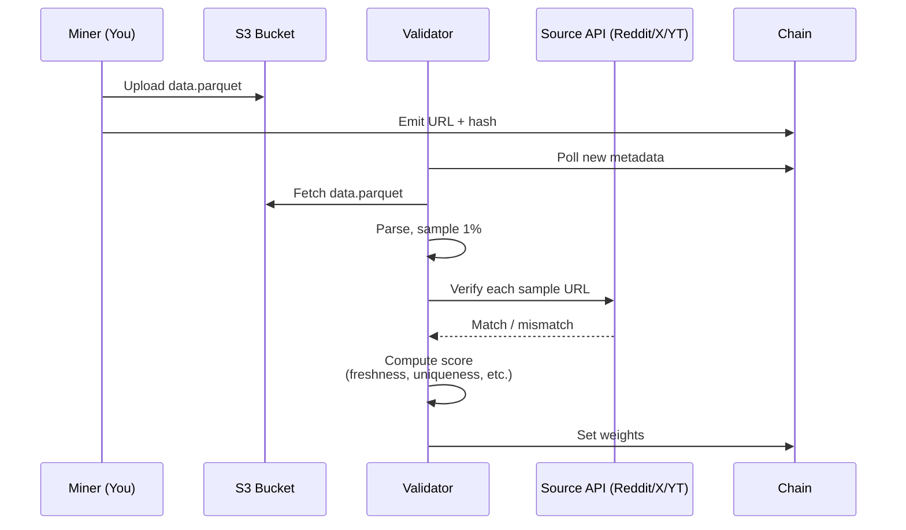

# Unit 4: Understanding the Scoring System & Optimizing Rewards

:::info Goal of This Unit
By the end of this unit you will:
- Understand the **5 SN13 scoring dimensions** in depth
- Understand how **validators audit** miner data samples
- Recognize **common mistakes** that lead to a zero score
- Master the **optimization playbook** to climb the rankings
- Know how to **monitor your miner's leaderboard** position on taostats & community dashboards
:::

:::note Prerequisites
- ✅ Completed [Unit 3: Config & Scraping Strategy](./miner-config-scraping)
- ✅ Your miner can scrape data (Reddit/X/YT) into the local buffer
:::

---

## SN13 Scoring Philosophy

The SN13 Bittensor incentive mechanism is designed to reward **data valuable for AI training**. "Valuable" is quantified through 5 dimensions:



Rough formula (simplified: real implementation in the repo):

```
final_score = validity_gate * (
    w_fresh * freshness_score +
    w_uniq * uniqueness_score +
    w_vol * volume_score +
    w_cov * coverage_score
)
```

`validity_gate` is **0 or 1**: if verification fails, all the other dimensions become moot.

---

## Dimension 1: Freshness

**Newer data is much more valuable.** For training AI relevant to today's reality, the model needs the latest data.

### Freshness Scoring Curve

```
Age of data           Score multiplier
-----------------------------------
≤ 1 hour              1.00 (max)
1 – 24 hours          0.80 – 0.95
1 – 3 days            0.50 – 0.75
3 – 7 days            0.20 – 0.45
> 7 days              ≈ 0 (considered stale)
```

:::tip Optimization
**Prioritize data from the last 24 hours.** Set `max_age_hint_minutes` in the config (Unit 3) so the scraper skips older posts.

For Reddit: sort by `.new()`, not `.top()`. For X: `search_tweet(..., 'Latest')` not `'Top'`.
:::

### Pitfall

- **Scraping archives / old subreddit posts** → 0 score even if volume is high
- **Miner cron dies for 6 hours** → gap window, all data in the gap loses freshness value
- **Timezone confusion**: the data timestamp must be **UTC** when uploaded

---

## Dimension 2: Uniqueness

SN13 validators maintain a **global dedup index**. If 100 miners upload the same tweet, only 1 is counted as unique: the rest are penalized.

### How It Works

1. Each data entity is hashed by `(source, content_id)` or fuzzy content hash
2. Validators cross-reference the global dedup index
3. Score contribution drops **proportional to how many other miners have already claimed the same data**

```
If N miners uploaded the same entity:
  your_uniqueness_contribution = 1 / N
```

### Optimization

1. **Scrape niche labels**: small subreddits & niche hashtags have fewer competitors
2. **Be first**: small `cadence_seconds` (but watch rate limits)
3. **Geographic / language diversity**: scrape regional/language-specific subreddits → fewer international miners scraping these

:::tip Niche = Gold
Pro tip for miners in non-English regions: international miners **rarely scrape non-English content** because they don't understand the language. If you include local language subreddits and hashtags → uniqueness score can soar because you're the unique supplier.
:::

---

## Dimension 3: Volume

More data = more score, **but with a cap and diminishing returns.**

### Curve

```
Entities per epoch    Score (normalized)
-------------------------------------------
0 – 1,000            Linear growth
1,000 – 10,000       Sublinear (sqrt curve)
10,000 – 100,000     Log curve (diminishing)
> 100,000            ≈ Cap (no benefit)
```

The exact cap varies per epoch and depends on validator configuration.

### Strategy

- **Don't spam**: quality > quantity beyond a certain point
- **Focus on stable 24/7 upload** rather than big bursts then idle
- **Monitor the local buffer**: if it fills frequently and data drops, upgrade storage

---

## Dimension 4: Coverage

Validators reward **diversity**. Miners covering Reddit + X + YouTube score higher than single-source miners with large volume.

### Coverage Matrix

| Source | Minimum % for bonus |
|--------|---------------------|
| Reddit | 20% |
| Twitter/X | 20% |
| YouTube | 10% |

### Example

Miner A: 100% Reddit, 100k entries → coverage multiplier 0.8
Miner B: 50% Reddit + 40% X + 10% YT, total 50k entries → coverage multiplier 1.2

Miner B can **win** despite lower volume.

:::note Make Sure `enabled: true`
Make sure all 3 scrapers in `config.json` are `enabled: true` with realistic cadence. YouTube is slow, but it still contributes to coverage.
:::

---

## ✅ Dimension 5: Validity (Gate)

**This is the killer gate.** If your data isn't verifiable, all the other dimensions reset to 0.

### What Gets Validated

The validator randomly samples ~1% of miner data, then checks:

1. **URL check**: does the post/tweet still exist on the source?
2. **Content match**: does the text you uploaded match the source (fuzzy match)?
3. **Timestamp sanity**: is `created_at` in a logical range?
4. **Author match**: is the author field consistent?
5. **Schema compliance**: does the JSON/Parquet match the SN13 schema?

### How to Get High Validity

```python
# Example of a valid Reddit record
record = {
    "source": "reddit",
    "uri": "https://reddit.com/r/cryptocurrency/comments/abc123/",
    "datetime": "2026-04-14T12:34:56Z",  # UTC, ISO 8601
    "label": "r/cryptocurrency",
    "content": "Bitcoin hit $150k today...",  # exact text, unescaped
    "content_size_bytes": 245,
    "obfuscated_content_hash": "sha256:...",
}
```

:::warning Common Validity Failures
- **Truncating content**: don't `[:200]`, upload the full text
- **Unescaped HTML**: `&amp;` should become `&`
- **Relative URL**: must be absolute (`https://...`)
- **Deleted post**: if a post is deleted between scrape & validator check, it's beyond your control. That's why freshness matters (delete rate in the first 24 hours is low).
- **Fake data**: advanced validators can detect LLM-generated text. **Never** synthesize fake data.
:::

---

## Validator Audit Mechanism



### Audit Frequency

- Validator audit cycle: **every tempo ~20 minutes**
- Not every validator audits every cycle: round robin
- Your score = **median** across many validators (robust against 1 outlier)

---

## ❌ Common Mistakes Checklist

From past CLC miner post-mortems:

| Mistake | Impact | Fix |
|---------|--------|-----|
| Upload data > 7 days old from archive scrape | Freshness 0 | Filter in scraper with `max_age_hint_minutes` |
| Twitter scraper cookie expired, no alert | Volume drops 80% | Set up health check + alerting (Unit 6) |
| Truncate content to 200 chars | Validity fails | Upload full content |
| 100% Reddit scraper, skip X + YT | Coverage 0.4× | Enable all three scrapers |
| Axon port 8091 closed in firewall | Validator can't reach → score reset | `ufw allow 8091` |
| Timestamp in local timezone (e.g., UTC+7) | Validity fails (parsing) | Always UTC ISO 8601 |
| Duplicates between runs (miner restart) | Uniqueness drops | Persist dedup SQLite across restarts |
| Disk full, upload fails silently | Undetected for days | Cron `df -h` alert |

---

## Optimization Playbook

### Level 1: Survival (Week 1)

Goal: **don't get deregistered**, hit median score.

- ✅ All three scrapers enabled (Reddit + X + YT)
- ✅ Normal cadence (300s Reddit, 240s X, 3600s YT)
- ✅ Dedup SQLite functional
- ✅ Port 8091 open, validator reachable
- ✅ S3 upload stable (Unit 5)

Expected rank: **top 60–80%**.

### Level 2: Growing (Week 2)

Goal: **top 50%**.

- ✅ More aggressive cadence (180s Reddit, 120s X)
- ✅ Add niche labels (regional subreddits, trending hashtags)
- ✅ Monitor dashboard every 4 hours, adjust label set
- ✅ Upgrade bandwidth/storage if buffer fills often

### Level 3: Elite (Long-Term)

Goal: **top 20%**.

- ✅ Multi-region proxy for scraping IP rotation
- ✅ Custom scraper for trending detection (reactive scrape based on spikes)
- ✅ Fine-tune validity: 100% schema compliance
- ✅ Diversify into new sources as subnet governance updates
- ✅ Hotkey separation for multi-miner strategy (advanced)

:::tip Apply Some Data Science
Export your miner logs daily, plot `score vs label_set`. Sometimes you'll find `r/someRandomSub` contributes unexpectedly highly. Double down there.
:::

---

## Monitoring & Dashboard

### taostats.io

Check subnet performance:

- **URL**: `https://taostats.io/subnets/13/metagraph`
- Look at **Incentive** (= normalized score) and **Emission** (TAO earned per block)
- Sort by UID: find your miner UID, look at the 24h trend

### Subnet-Specific Dashboard

The Macrocosmos team often publishes dashboards:

- `https://data-universe.macrocosmos.ai` (check if active)
- Community Grafana dashboards: link is typically in Discord `#sn13-general`

### CLI Check

```bash
btcli subnet metagraph --netuid 13 | head -50
# Find your UID row, look at columns:
# - Stake: total stake (irrelevant for miner)
# - Trust: from validators
# - Incentive: normalized score (0-1, higher is better)
# - Emission: TAO earned per tempo
```

### Alert Setup

```python
# alert.py: basic monitoring
import requests
import subprocess
import time

WEBHOOK = "https://discord.com/api/webhooks/..."  # Discord or Telegram bot

def check_incentive(uid: int):
    result = subprocess.run(
        ["btcli", "subnet", "metagraph", "--netuid", "13"],
        capture_output=True, text=True
    )
    # Parse output, find your UID row, take incentive value
    # ... (parsing code)
    return incentive

while True:
    inc = check_incentive(my_uid=1234)
    if inc < 0.01:
        requests.post(WEBHOOK, json={"content": f" Incentive low: {inc}"})
    time.sleep(600)
```

---

## Summary

- **5 scoring dimensions**: Freshness, Uniqueness, Volume, Coverage, Validity
- **Validity = gate**: failing verification means all other dimensions are 0
- Validators audit 1% sample against the source every ~20 minutes
- **Niche labels + non-English content** = unfair-advantage strategy for regional miners
- Monitor via **taostats.io/subnets/13** + CLI `btcli subnet metagraph`
- Tiered optimization: **Survival → Growing → Elite**

### ✅ Quick Check

1. Name the 5 SN13 scoring dimensions.
2. Why does truncating content cause a zero score?
3. What's the advantage of scraping non-English content?
4. How long does data still count as "fresh"?
5. What does the validator check during a sample audit?

<details>
<summary> Answers</summary>

1. **Freshness, Uniqueness, Volume, Coverage, Validity.**
2. Validators verify the data content against the source (fuzzy match). If truncated, content mismatches → **validity gate fails** → score 0.
3. International miners rarely scrape non-English content → **high uniqueness score** because you're the unique supplier.
4. **≤ 7 days still scored**, but optimum is **≤ 24 hours** (multiplier ~0.8–0.95 vs 0.5–0.75 at 1–3 days).
5. URL still exists, content matches (fuzzy), timestamp is logical, author is consistent, schema is compliant.

</details>

### Troubleshooting

| Symptom | Likely Cause | Fix |
|---------|--------------|-----|
| Incentive stuck at 0 for > 24 hours | Mass validity failure | Audit miner logs, manually check sample data vs source |
| Score swings drastically each tempo | Scraper intermittent (connection issue) | Set up retry + backoff, health-check cron |
| Your UID missing from metagraph | Deregistered (immunity period ended) | Re-register + fix config |
| Validator weight to your UID is 0 | Validator hasn't audited yet, or your IP geoblock | Check `ufw`, check the VPS provider isn't blocking outbound to validators |
| Your miner crushes testnet but zero on mainnet | Mainnet subnet is stricter | Sync config & retune |

---

**Next:** [Unit 5: S3 Storage Configuration & Data Upload →](./s3-storage-upload)

*In the attention economy, fresh data is currency. *
