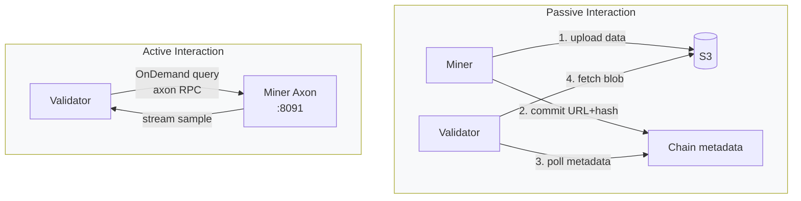

# Unit 6: Interaction Layer

:::info Goal of This Unit
By the end of this unit you can:
- Understand **how validators query miners** (on-chain metadata + HTTP endpoint)
- Implement **axon serving** with the FastAPI pattern to respond to data requests
- Set up **timeout handling** and **graceful degradation** when the scraper is slow
- Deploy a **monitoring stack** (Prometheus + Grafana or simpler alternative)
- Configure **PM2 auto-restart + log rotation**
- Be ready to submit **SN13 graduation evidence** to the HackQuest Learning Track
:::

:::note Prerequisites
- ✅ Completed [Unit 5: S3 Storage Upload](./s3-storage-upload)
- ✅ Miner is uploading data to R2 and committing metadata on-chain
- ✅ Has been running stable for 12+ hours
:::

---

## How Do Validators Interact With Miners?

There are **two interaction paths** between miners ↔ validators on SN13:



### Passive Path (Primary)

Already covered in Unit 5. Miner push → chain → validator pull. **Dominant flow.**

### Active Path (OnDemand)

Validators sometimes ask the miner for a **live sample**: "give me 100 tweets with label `#bitcoin` from the last 1 hour." This is for real-time freshness spot-checking. The miner must expose an HTTP endpoint (axon) always ready to respond.

---

## Axon: The Miner Endpoint

The Bittensor framework already bundles `bt.axon`: a FastAPI wrapper to handle gRPC-like RPC over HTTP.

### Synapse Definition

A synapse = the request/response schema. Data Universe has synapses like `GetDataEntities`, `OnDemandRequest`.

```python
# protocol.py (definition example: see repo for exact schema)
import bittensor as bt
from typing import List, Optional
from pydantic import BaseModel

class DataEntity(BaseModel):
    uri: str
    datetime: str
    source: str
    label: str
    content: str

class OnDemandRequest(bt.Synapse):
    """Validator asks the miner to return data per filter."""
    source: str  # "reddit", "x", "youtube"
    label: str   # e.g., "r/cryptocurrency"
    keywords: Optional[List[str]] = None
    start_time: str  # ISO 8601
    end_time: str
    limit: int = 100

    # Response field
    data_entities: Optional[List[DataEntity]] = None
```

### Handler Function

```python
# neurons/miner.py (skeleton)
import bittensor as bt
from protocol import OnDemandRequest, DataEntity
from storage.query import DataStore

class Miner:
    def __init__(self, config: bt.config):
        self.wallet = bt.wallet(config=config)
        self.subtensor = bt.subtensor(config=config)
        self.axon = bt.axon(wallet=self.wallet, config=config)
        self.datastore = DataStore()  # interface to local buffer / recent S3

        # Attach handler
        self.axon.attach(
            forward_fn=self.handle_on_demand,
            blacklist_fn=self.blacklist_check,
            priority_fn=self.priority_check,
        )

    async def handle_on_demand(self, synapse: OnDemandRequest) -> OnDemandRequest:
        bt.logging.info(f"OnDemand query: {synapse.source}/{synapse.label} limit={synapse.limit}")
        try:
            entities = await self.datastore.query(
                source=synapse.source,
                label=synapse.label,
                keywords=synapse.keywords,
                start=synapse.start_time,
                end=synapse.end_time,
                limit=synapse.limit,
            )
            synapse.data_entities = entities
        except Exception as e:
            bt.logging.exception(f"Query failed: {e}")
            synapse.data_entities = []  # graceful degrade
        return synapse

    def blacklist_check(self, synapse: OnDemandRequest) -> tuple[bool, str]:
        """Reject requests from non-validator hotkeys."""
        hotkey = synapse.dendrite.hotkey
        if not self.is_validator(hotkey):
            return True, "Not a validator"
        return False, ""

    def priority_check(self, synapse: OnDemandRequest) -> float:
        """Validators with larger stake → higher priority."""
        hotkey = synapse.dendrite.hotkey
        return self.get_stake(hotkey)

    def run(self):
        self.axon.serve(netuid=13, subtensor=self.subtensor)
        self.axon.start()
        bt.logging.info(f"Axon listening on :{self.axon.config.axon.port}")
        while True:
            # main loop: heartbeat, refresh metagraph, etc.
            ...
```

---

## ⏱ Timeout & Graceful Degradation

Validators send requests with a timeout (typically **10–30 seconds**). The miner must respond before timeout, **even if data isn't ready.**

### Pattern: Fast Fail Over Slow Success

```python
import asyncio

async def handle_on_demand(self, synapse: OnDemandRequest) -> OnDemandRequest:
    try:
        entities = await asyncio.wait_for(
            self.datastore.query(...),
            timeout=8.0,  # internal budget < external timeout 10s
        )
        synapse.data_entities = entities
    except asyncio.TimeoutError:
        bt.logging.warning("Query timed out, returning partial/empty")
        synapse.data_entities = []  # empty > no response
    except Exception as e:
        bt.logging.exception(f"Query error: {e}")
        synapse.data_entities = []
    return synapse
```

:::warning Don't Be Slow
Miners that frequently timeout (no response) get **validator weight 0**. Better to respond empty than to respond late.
:::

### Cache Layer

The same query can come from multiple validators within 1 minute. Use an LRU cache:

```python
from functools import lru_cache
from cachetools import TTLCache

class DataStore:
    def __init__(self):
        self.cache = TTLCache(maxsize=1000, ttl=60)  # 60-second cache

    async def query(self, source, label, keywords, start, end, limit):
        key = (source, label, tuple(keywords or []), start, end, limit)
        if key in self.cache:
            return self.cache[key]
        result = await self._real_query(source, label, keywords, start, end, limit)
        self.cache[key] = result
        return result
```

---

## Monitoring Stack

### Option 1: Simple: Script + Discord Webhook

For a CLC miner (not enterprise production), a Discord webhook is enough:

```python
# monitoring/health_check.py
import requests
import subprocess
import time
import os

WEBHOOK = os.getenv("DISCORD_WEBHOOK")

def check_miner_pm2():
    result = subprocess.run(["pm2", "jlist"], capture_output=True, text=True)
    return "online" in result.stdout

def check_disk():
    result = subprocess.run(["df", "-h", "/"], capture_output=True, text=True)
    # parse percentage
    usage = int(result.stdout.split("\n")[1].split()[4].rstrip("%"))
    return usage

def notify(msg):
    if WEBHOOK:
        requests.post(WEBHOOK, json={"content": msg})

if __name__ == "__main__":
    if not check_miner_pm2():
        notify(" Miner PM2 process DOWN!")
    if check_disk() > 85:
        notify(f" Disk usage {check_disk()}%: cleanup needed")
```

Schedule via cron:

```bash
crontab -e
# add:
*/10 * * * * /home/miner/data-universe/venv/bin/python /home/miner/data-universe/monitoring/health_check.py
```

### Option 2: Full Stack: Prometheus + Grafana

For serious miners:

```bash
# Install Prometheus (briefly)
wget https://github.com/prometheus/prometheus/releases/download/v2.51.0/prometheus-2.51.0.linux-amd64.tar.gz
tar xvf prometheus-*.tar.gz && cd prometheus-*

# Expose metrics from the miner (using prometheus_client library)
pip install prometheus_client
```

In the miner:

```python
from prometheus_client import start_http_server, Counter, Gauge

scraped_total = Counter('sn13_scraped_total', 'Total entities scraped', ['source'])
uploaded_bytes = Counter('sn13_uploaded_bytes', 'Bytes uploaded to S3')
validator_queries = Counter('sn13_validator_queries', 'OnDemand queries received')
current_incentive = Gauge('sn13_incentive', 'Current incentive score from metagraph')

start_http_server(9100)  # metrics endpoint at :9100
```

Grafana dashboard: monitor scraped rate, upload rate, incentive trend.

:::tip Shortcut
For CLC9 graduation, **Option 1 (Discord webhook)** is enough. A Grafana setup takes 2–3 extra hours.
:::

---

## PM2 Configuration

### Ecosystem File

```javascript
// ecosystem.config.js
module.exports = {
  apps: [
    {
      name: "sn13-miner",
      script: "venv/bin/python",
      args: "neurons/miner.py --netuid 13 --subtensor.network finney --wallet.name my_cold --wallet.hotkey sn13_miner --axon.port 8091 --logging.info",
      cwd: "/home/miner/data-universe",
      autorestart: true,
      watch: false,
      max_memory_restart: "4G",
      restart_delay: 10000,
      env: {
        PYTHONUNBUFFERED: "1"
      },
      error_file: "/home/miner/logs/miner-err.log",
      out_file: "/home/miner/logs/miner-out.log",
      log_date_format: "YYYY-MM-DD HH:mm:ss"
    }
  ]
};
```

### Start & Persist

```bash
cd ~/data-universe
pm2 start ecosystem.config.js
pm2 save
pm2 startup    # follow the instructions to auto-start on VPS reboot
```

### Commands Cheatsheet

```bash
pm2 list               # see status
pm2 logs sn13-miner    # tail log in real time
pm2 restart sn13-miner # restart
pm2 stop sn13-miner    # stop
pm2 delete sn13-miner  # remove from PM2
pm2 monit              # live dashboard
```

### Log Rotation

```bash
pm2 install pm2-logrotate
pm2 set pm2-logrotate:max_size 100M
pm2 set pm2-logrotate:retain 7
pm2 set pm2-logrotate:compress true
```

Without this, logs can fill the disk in 2 weeks.

---

## End-to-End Smoke Test

Final test before claiming graduation:

```bash
# 1. Miner running
pm2 list
# Status: online, uptime > 1 hour

# 2. Chain registration OK
btcli wallet overview --wallet.name my_cold --netuid 13
# UID registered, stake > 0

# 3. Incentive rising
btcli subnet metagraph --netuid 13 | grep <your_uid>
# Incentive > 0 (even if small)

# 4. S3 bucket filled
rclone size r2:sn13-miner-<uid>
# Total > 0 bytes, Count > 0 files

# 5. Axon reachable from outside
curl -v http://<VPS_IP>:8091/
# Should return something (not timeout)

# 6. Logs clean (no recurring ERROR)
pm2 logs sn13-miner --lines 100 --nostream | grep -i error | wc -l
# < 5 errors per 100 lines = acceptable
```

---

## Graduation Submission Checklist

To graduate CLC9 SN13 (and earn the NFT + Quack Believers invite):

### Required Evidence to Submit on the HackQuest Learning Track

1. ✅ **Hotkey SS58 Address**
   ```bash
   btcli wallet overview --wallet.name my_cold
   # Copy SS58 from the sn13_miner hotkey row
   ```

2. ✅ **NetUID**: `13`

3. ✅ **Miner UID**
   ```bash
   btcli wallet overview --wallet.name my_cold --netuid 13
   # The number in the UID column
   ```

4. ✅ **Screenshot of miner running**
   - Open 2 terminals:
     - Terminal 1: `pm2 list` (showing `sn13-miner` online)
     - Terminal 2: `pm2 logs sn13-miner --lines 20` (showing live logs)
   - Screenshot both, upload as 1 image

5. ✅ **Screenshot of taostats.io/subnets/13**: browser open to the metagraph page, your UID highlighted

6. ✅ **Screenshot of R2 bucket**: Cloudflare dashboard, bucket showing uploaded files

7. ✅ **X (Twitter) reflection post**: write a learning reflection, tag `@HackQuest_` and `@bittensor`, paste the link

:::tip Screenshot Pro Tips
- Crop & annotate using a tool like **Snipaste** or **Flameshot**
- Add red arrows to your UID/hotkey so reviewers can verify easily
- Minimum resolution 1280×720
:::

---

## Full Production Checklist

Before saying "my miner is production-ready":

- [ ] VPS in Singapore region, 4+ vCPU, 8+ GB RAM, 500+ GB SSD
- [ ] Ubuntu 22.04, `ufw` firewall enabled, port 8091 open
- [ ] Non-root user `miner`, SSH key-based auth only
- [ ] Python venv with all deps installed
- [ ] Hotkey (not coldkey) on the VPS
- [ ] Registered on NetUID 13, incentive > 0
- [ ] Scraper config for 3 sources (Reddit + X + YT) with label diversity
- [ ] Dedup SQLite persists across restart
- [ ] S3 bucket (R2), access keys in `.env` (gitignored!)
- [ ] Upload cadence 15–30 minutes, lifecycle 14 days
- [ ] Axon handler with timeout + graceful degrade
- [ ] PM2 ecosystem config, autorestart, log rotate
- [ ] Monitoring script Discord webhook cron /10 min
- [ ] NTP sync (so S3 signature is correct)
- [ ] End-to-end smoke test passed
- [ ] Graduation evidence collected

---

## Summary

- Validators interact via 2 paths: **passive** (via S3 + chain metadata) and **active** (axon HTTP queries)
- **Axon** = Bittensor's FastAPI wrapper for handling synapse RPCs
- Timeout handling: **fast fail > slow success**: always respond, an empty list is OK
- **PM2 ecosystem** = auto-restart + log rotate + persists across reboots
- Monitoring: **Discord webhook** is enough for CLC; Prometheus for serious miners
- Graduation submission needs **6–7 pieces of evidence**: hotkey, UID, screenshots, X post

### ✅ Quick Check

1. What's the difference between the passive and active validator ↔ miner paths?
2. What should the miner do if a validator query is approaching timeout?
3. Why use PM2 instead of raw systemd?
4. What happens if the miner frequently times out against validators?
5. What files MUST be gitignored in your miner repo?

<details>
<summary> Answers</summary>

1. **Passive**: miner pushes data → S3 + chain commit, validator pulls. **Active**: validator sends a synapse request (OnDemand) → miner must respond via axon. Passive is dominant.
2. **Respond with partial data / an empty list.** Late response is worse than empty: validators set weight 0 on timeout.
3. PM2 is a native Node tool with portable ecosystem config, log-rotate plugin, live monit dashboard, zero-downtime restart. Systemd works too but config is more verbose.
4. **Validator weight to your UID falls to 0** → incentive drops → minimal/zero TAO emission.
5. **`.env`** (S3, Reddit, Twitter credentials) and the **`wallets/`** folder if it ever gets in there. Never commit secret files!

</details>

### Troubleshooting

| Symptom | Cause | Fix |
|---------|-------|-----|
| Axon listening but validators can't reach | IP behind NAT / cloud firewall | Verify `curl http://<public_ip>:8091` from outside the VPS. Check provider security group. |
| `Address already in use` port 8091 | Old miner still running | `pm2 delete sn13-miner` then restart. Or `lsof -i :8091` to find PID. |
| Handler crash, PM2 restart loop | Unhandled exception in query | Wrap everything in try/except, return empty list. Check `pm2 logs` for stack trace. |
| Disk full after 1 week | Logs not rotating | Install `pm2-logrotate`, purge old logs in `/home/miner/logs/` |
| Prometheus metrics 404 | `start_http_server` called but port closed in firewall | `ufw allow 9100` (or don't expose publicly, access via localhost/tunnel) |
| Submission rejected by reviewer | Screenshot blurry / UID not visible | Retake with clear annotation |

---

## Congratulations!

You've reached the end of **Guided Project II: Data Universe (SN13)**. If your miner has been running stable for >24 hours, all submission evidence is collected, and logs are clean: **you're ready to graduate!**

The final step: submit all evidence to the HackQuest Learning Track before **TH4 (Graduation Day)**.

**Next:** [Resources →](/resources)

*In miners we trust. In TAO we thrive. *
