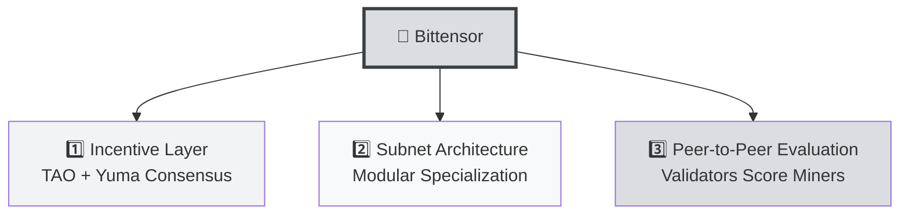
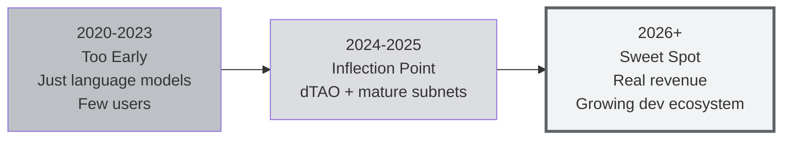

# 🦆 Unit 4: Why Does Bittensor Matter?

:::info Goal of This Unit
After reading this unit, you will understand:
1. **Bittensor's history in brief**: from the 2020 paper to a top-30 cryptocurrency
2. **The three pillars of Bittensor** that set it apart from other DeAI projects
3. **What subnets, miners, and validators are**: a first-pass overview before deep-diving in Phase 1
4. **Why 2026 is the right moment** to enter Bittensor
:::

> This is the last unit of Phase 0. After this, you have all the context you need to start the technical deep dive in Phase 1.

---

## 📜 A Short History of Bittensor

### 2020: Whitepaper & Original Vision

**Yuma Rao** (a pseudonym for the founding team, a reference to Yuma: a city in Arizona) published the first Bittensor whitepaper. The vision:

> *"Build a market for machine intelligence: where contributors are rewarded based on the value they add to the network, validated peer-to-peer without any central authority."*

**Co-founders:** Jacob Steeves (ex-Google researcher) and Ala Shaabana (neuroscience researcher).

### 2021: "Kusanagi" Testnet
The early network ran with small neural language models. Miners competed to produce the best text representations.

### 2023: Dynamic Subnets
A major upgrade: the network was split into **subnets** specializing in different tasks (not only language models). It now spans inference, data, prediction, code: anything.

### 2024: Dynamic TAO (dTAO)
An economic upgrade: each subnet now has its own "alpha token" priced by the market, not set manually. Bittensor's economy became much more organic.

### 2025–2026: Mature Ecosystem
- 100+ active subnets
- TAO entered the **top-30 cryptocurrencies** by market cap
- Real revenue is starting to flow: Sportstensor generates revenue from sports betting, Chutes from AI API sales, etc.
- Global developer adoption is rising sharply

---

## 🏛️ The Three Pillars of Bittensor

What makes Bittensor different from other Decentralized AI projects:

### 1️⃣ Incentive Layer: "Work = Earn TAO"

Bittensor has a built-in economic system. Contributors don't work for free: they earn **TAO tokens** every block (~12 seconds).

- Reward split: **41% miner, 41% validator, 18% subnet owner** (per block, per subnet)
- The size of the reward is determined by **contribution quality**, not just quota

This solves a classic open-source problem: why should anyone contribute if they're not paid?

### 2️⃣ Subnet Architecture: "Specialization"

Instead of one network handling every task, Bittensor **splits into subnets**. Each subnet:
- Has a specific goal (e.g., SN13 = data scraping, SN41 = sports prediction)
- Has its own reward mechanism
- Has its own miners and validators
- Is owned by a "subnet owner" who builds the underlying logic

**The result:** the ecosystem can grow **wide** (many subnets) and **deep** (each subnet can specialize).

### 3️⃣ Peer-to-Peer Evaluation: "Validators Score Miners"

Within each subnet:
- **Miners** produce output (inference, data, predictions)
- **Validators** issue challenges and score quality
- Scores are aggregated via **Yuma Consensus** → distributing rewards

There's no "central judge". The scoring is done by independent validators, and their scores themselves are cross-checked.

:::tip Analogy
Imagine a cooking competition in every district (a subnet), with local judges (validators), and prizes based on rankings (Yuma Consensus). **There's no central head judge** that has to approve: the system self-organizes.
:::

---

## 🧩 Quick Glossary (We'll Go Deeper in Phase 1)

So you're familiar with terms that will keep appearing:

| Term | Short Meaning |
|------|---------------|
| **TAO (τ)** | Bittensor's native token. Max supply 21M (similar to Bitcoin) |
| **Subtensor** | The Bittensor blockchain (Substrate-based, similar to Polkadot) |
| **Subnet** | A specialized sub-network (100+ active) |
| **NetUID** | The numeric subnet ID (e.g., 13 for Data Universe, 41 for Sportstensor) |
| **Miner** | A contributor providing the AI service |
| **Validator** | A contributor evaluating miner quality |
| **Subnet Owner** | The party who deploys and maintains a subnet |
| **Metagraph** | A "snapshot" of subnet state: who's a miner, who's a validator, scores |
| **Coldkey** | The main wallet (holds TAO) |
| **Hotkey** | The operational wallet (runs the miner/validator) |
| **Yuma Consensus** | The algorithm that aggregates validator scores |
| **dTAO (Dynamic TAO)** | The newer economic system (2024+): every subnet has an alpha token |
| **Alpha Token** | A per-subnet token whose price is market-driven |
| **btcli** | The CLI tool for interacting with Bittensor |

**Don't panic** if you don't yet understand all of these. We'll cover each one in Phase 1.

---

## 📈 Why 2026 Is the Right Time to Enter Bittensor

### 🎯 Three Reasons the Timing Is Right

### 1. **The Infrastructure Is Mature** ✅
In 2020–2022, running a Bittensor miner meant dealing with thin docs, buggy tooling, and a tiny community. **Today (2026):** btcli is stable, documentation is comprehensive, YouTube tutorials are plentiful, Discord is active. **The barrier to entry is dramatically lower.**

### 2. **Still Early for the Mass Market** 🌱
Even though it's a top-30 cryptocurrency, Bittensor is still **pre-chasm** compared to Ethereum or Solana, both of which are mainstream. Active developers number in the **thousands, not hundreds of thousands**. **Skill arbitrage:** Bittensor skills today = scarce skills that will be at a premium in 2–3 years.

### 3. **Real Revenue Is Starting to Flow** 💰
Subnets like Sportstensor (SN41) already generate **USD revenue** from sports-betting integrations and use it for TAO buybacks. This is no longer a token with empty tokenomics: there's a **real business model** behind it. The more subnets that produce revenue, the more stable the ecosystem becomes.

---

## 🌏 Why This Matters for Students in Emerging Markets

### Why CLC9 Bittensor is Particularly Relevant

1. **GPU access is still expensive in many parts of the world.** But **cloud GPU rentals are cheap** ($0.20–$2/hour on Vast.ai): you don't need to buy a GPU to start.

2. **TAO rewards = USD-equivalent income.** If you become a top miner on a productive subnet, your TAO can be converted to local currency directly. It's a new income stream with relatively few competitors.

3. **Skill scarcity + a community that's still small.** Within HackQuest, the Bittensor community is still early. **Early contributor = early credibility.** A Co-Learning Camp graduate is in the first tier of local talent.

4. **Stable internet in major cities is enough.** A 24/7 mining operation can run from anywhere with decent connectivity, often through a rented VPS.

### 💡 Specific Opportunities

| Opportunity | Your Goal |
|-------------|-----------|
| **Become a Sportstensor miner** | Passive TAO income from sports prediction |
| **Become a Data Universe miner** | TAO from scraping Twitter/Reddit data |
| **Become a subnet builder** | Build a new subnet (e.g., a region-specific dataset) |
| **Become a validator** | Mid-term goal: once you have skill and TAO stake |
| **Become a community lead** | Lead the local Bittensor community: first-mover advantage |

---

## 🎯 What You'll Learn Next

After this Phase 0, you'll move into the more technical phases:

### 🔵 Phase 1: Fundamentals (Theory)
- **Concept I:** Detailed history, full architecture, tokenomics, dTAO
- **Concept II:** Deep dive on the 4 core subnets: Chutes, Data Universe, Sportstensor, Ridges

### 🟢 Phase 2: Building (Practice)
- **GP-0:** A local mining intro that prepares you for any subnet
- **Guided Project I:** Set up and run a miner on Sportstensor (SN41)
- **Guided Project II:** Set up and run a miner on Data Universe (SN13)

### 🟣 Phase 3: Resources
- Reference links for continued self-study

---

## ⚠️ Realistic Expectations

:::warning Before You Continue
**Bittensor mining is not a "get rich quick" scheme.** It's a **skill + capital investment**, and your outcomes depend on:
- The quality of your strategy (not just "running a node")
- The subnet you choose (some are profitable, others aren't)
- The TAO price when you cash out
- The competition from other miners (network effects)

You **can lose money** if you go in without a strategy: registration fees, GPU costs, time costs. We cover this in Phase 1 → Concept I → Unit 3 (Tokenomics).

**A healthy expectation:**
- ✅ **Learn a scarce skill** in Decentralized AI
- ✅ **Network effect**: join the early-adopter community
- ✅ **Income opportunity** if you commit and iterate seriously
- ❌ Not a cheat code for getting rich overnight
:::

---

## 🎯 Summary

:::tip Key Takeaways
1. **Bittensor** = decentralized AI network with the TAO token (top-30 crypto, whitepaper from 2020)
2. **Three pillars:** Incentive Layer (TAO), Subnet Architecture, Peer-to-Peer Evaluation
3. **Subnet** = a specialized sub-network (100+ active), identified by NetUID
4. **Miner** = AI service contributor, **Validator** = evaluator, **Subnet Owner** = creator of the subnet
5. **2026 is a sweet spot:** mature infra, still early, real revenue starting
6. **Healthy expectation:** not a get-rich-quick scheme, but a scarce skill + income opportunity
:::

### ✅ Quick Check

- ❓ Name the three pillars of Bittensor
- ❓ What's the role of a miner, a validator, and a subnet owner?
- ❓ Why is dTAO (2024+) important for the ecosystem?
- ❓ How does Centralized AI (Unit 3) differ from Bittensor?

---

## 🚀 Ready for Phase 1?

**Phase 0 is complete!** 🎉 You now have a foundation:
- ✅ Web3 (blockchain, wallet, token)
- ✅ AI (training, inference, model, LLM)
- ✅ Why Decentralized AI matters
- ✅ Where Bittensor sits in the DeAI ecosystem

**Next:** [Phase 1 → Concept I → Unit 1: The Rise of AI and Bittensor](../Phase-1-Fundamentals/Concept-1-Introduction/rise-of-ai-bittensor) 👉

*Time for the technical deep dive. Let's go, miner!* 🦆⚡
