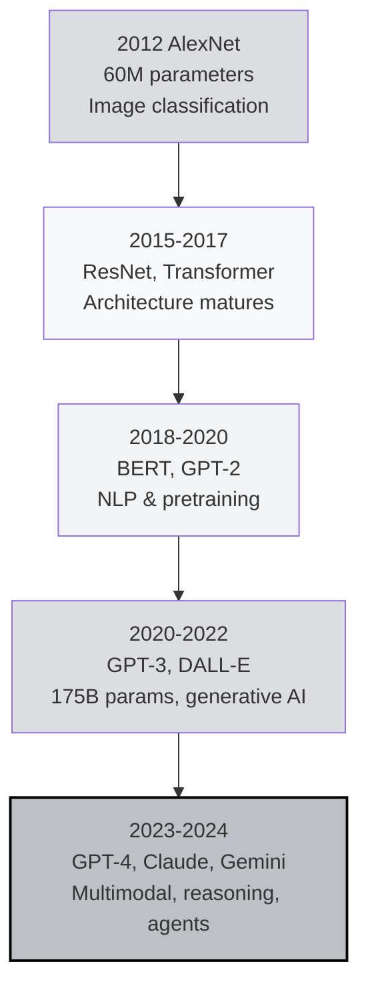
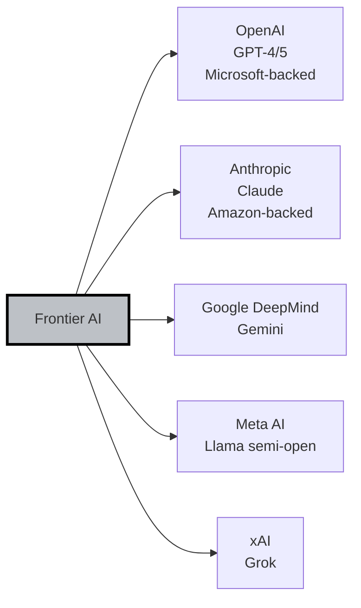
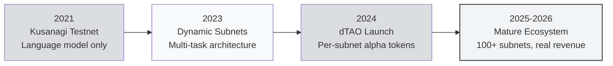

# 🧠 Unit 1: The Rise of AI and the Emergence of Bittensor

:::info Goal of This Unit
After reading this unit, you will understand:
1. **The progression of AI** from 2012 (AlexNet) to the GPT-4 / Claude / Gemini era: what actually changed
2. **The structural problems** that emerge when AI is controlled by a handful of companies (OpenAI, Anthropic, Google, Meta)
3. **The background of the Yuma Rao 2020 whitepaper** and why the timing was right
4. **Why Bittensor specifically** addresses these problems: and why it's not just another "blockchain AI" project
:::

> This unit is intentionally **narrative**. Before we dissect Bittensor's technical architecture in Unit 2, you need to understand **why** Bittensor exists. Without the historical context, the architecture will feel arbitrary. With the context, every design decision starts to make sense.

---

## 📜 2012: The Moment AI "Came Back to Life"

Before 2012, the AI field (then called "machine learning") had been **stagnant for a decade**. Neural networks were known as an elegant idea that *never quite worked*: most researchers were preferring methods like Support Vector Machines or Random Forests.

That all changed at **ImageNet 2012**.

A team of **Alex Krizhevsky, Ilya Sutskever, and Geoffrey Hinton** submitted an architecture called **AlexNet**: a convolutional neural network with 8 layers. The result?

- Error rate of 15.3% vs. the runner-up's 26.2% (a gap of nearly 11 points)
- Run on **2 Nvidia GTX 580 GPUs** (not a CPU farm)
- Proof that: **scale + GPUs + lots of data** = the shortcut everyone had been missing

:::tip Simple Analogy
Imagine the AI field as a chemistry lab stuck for 20 years. Everyone was trying to run reactions in small pans over moderate heat. The AlexNet team showed up with an industrial reactor and rocket fuel. Result: reactions nobody else had ever seen. **This wasn't a new chemistry discovery: it was the discovery that "scale matters more than elegance".**
:::

From 2012 onward, the **Deep Learning era** began. Each year the models got bigger, the data grew, and the compute became more expensive.

---

## 📈 2012 → 2024: An Unexpected Trajectory

### 2015–2017: The Architecture Era

**ResNet** (Microsoft, 2015) solved the vanishing gradient problem with skip connections: opening the door to training networks with hundreds of layers. In 2017, the legendary **"Attention Is All You Need"** paper from Google introduced the **Transformer**: the architecture that would later become the backbone of nearly every modern LLM.

### 2018–2020: The Pretraining Era

**BERT** (Google, 2018) and **GPT-2** (OpenAI, 2019) introduced a new paradigm: instead of training a model from scratch for each task, **pretrain it on a giant corpus** first, then fine-tune for a specific task. The effect: a single model could generalize across many tasks.

### 2020–2022: The Scale Era

**GPT-3** (OpenAI, June 2020) was shockingly large: 175 billion parameters. It wasn't just the size: it was the **emergent behavior**, capabilities that weren't programmed explicitly but appeared because of scale. Few-shot learning became real. Generative AI was no longer an academic toy; it became a commercial API.

### 2023–2024: The General Assistant Era

**GPT-4** (March 2023), **Claude 2** & **Claude 3** (Anthropic), **Gemini** (Google), **Llama 2/3** (Meta). Models became:
- **Multimodal** (text + image + audio + video)
- **Reasoning-capable** (chain-of-thought, tool use)
- **Agent-capable** (can use tools, orchestrate workflows)

By the end of 2024, ChatGPT had **300+ million weekly active users**. AI is no longer a future technology: it's daily infrastructure.

---

## 💰 What Makes Modern AI So Expensive?

To understand why the monopoly problem emerged, you need to understand the **real cost** of building a GPT-4-class LLM.

| Component | Estimated Cost (GPT-4 class) |
|-----------|------------------------------|
| **GPU training cluster** | $50M – $100M (Nvidia H100/A100, 10,000+ units) |
| **Electricity for training run** | $5M – $10M (megawatt-scale power) |
| **Data curation + annotation** | $10M – $20M (human labelers, filtering, RLHF) |
| **Research talent** | $100M+/year (top researcher TC at $1M–$10M) |
| **Inference cost (ongoing)** | $700K/day (peak ChatGPT) |

:::warning Economic Implication
The cost of **training a single SOTA model** (state-of-the-art) is roughly **$80M–$200M**. Add 2–3 years of research and inference costs and the total easily reaches **$1 billion** per model generation.

How many organizations in the world can afford this? **Fewer than 10.** That's the reality of modern AI.
:::

---

## 🏢 The Silent Monopoly: Who Actually Controls AI?

In 2024, the "frontier AI" landscape is dominated by five entities:

**What they all have in common:**
- Data-center-scale GPU clusters (10,000+ H100s)
- Access to web-scale data (scraping + licensing deals)
- Premium-paid talent pool
- Billions of dollars in capital reserves

**What most people don't realize:** even though you're a **user** of their APIs, you are not a **stakeholder**. Decisions like:
- Which model gets deprecated (GPT-3 quietly killed → your app breaks)
- API prices going up 5x (this has already happened)
- Which content filters apply (what is and isn't allowed)
- Whether your data is used for training again

…are all made **unilaterally** by the company, **without any meaningful voting, protest, or exit mechanism**.

### Why Is This a Problem?

:::info Problem Statement
If AI is going to become a **general-purpose technology** on the level of electricity or the internet, then letting **5 companies** control it is a civilizational risk. Imagine if the entire internet were controlled by 5 ISPs that could shut down any website. That's roughly the situation AI is in today.
:::

The concrete problems:

1. **Single point of failure**: if the OpenAI API is down, thousands of AI startups go down with it.
2. **Censorship by default**: models refuse certain legitimate topics (medical research, security research, etc.).
3. **Data extraction without compensation**: their crawlers pull data from your website/blog for training, and you get nothing.
4. **Alignment ambiguity**: who decides "AI safety"? An internal team of ~50 people in San Francisco, for a model used by 300 million people globally.
5. **Zero interoperability**: GPT can't directly "talk" to Claude. Every API is isolated.

---

## 🤔 Solutions That Have Been Tried (and Failed)

Before Bittensor, several approaches tried to solve the AI monopoly problem. Spoiler: most of them failed.

### 1. Open-Source Models (Hugging Face, Llama)

**The idea:** release the model for free, anyone can use and modify.

**The reality:**
- ✅ Democratizes **access** to the model
- ❌ Doesn't democratize **training**: that still requires millions of dollars in GPUs
- ❌ No **ongoing** incentive for contributors
- ❌ Meta still controls Llama's roadmap (could stop at any time)

### 2. Federated Learning

**The idea:** train models on local devices (phones, laptops), aggregate gradients on a central server.

**The reality:**
- ✅ Data privacy is fine
- ❌ Still requires a **central coordinator**
- ❌ Bandwidth and device heterogeneity become the bottleneck
- ❌ Not viable for LLM-scale models

### 3. First-Generation Blockchain AI (SingularityNET, Fetch.ai, Ocean)

**The idea:** AI marketplaces on a blockchain, payment in crypto.

**The reality:**
- ✅ Permissionless access
- ❌ **No quality incentive**: weak reputation systems, easily Sybil-attacked
- ❌ Most became "AI API gateway + crypto payment" rather than a decentralized compute substrate
- ❌ Tokens were purely speculative, not used for coordination

:::note Important Lesson
The above approaches didn't fail because they were **ignoble**: they failed because they didn't solve the **core problem**: how do you incentivize people to contribute high-quality AI in a decentralized, Sybil-resistant, self-sustaining way? That's the gap Bittensor targets.
:::

---

## 📄 2020: The Yuma Rao Whitepaper

In November 2020, an anonymous figure named **Yuma Rao** published a whitepaper titled:

> **"A Peer-to-Peer Intelligence Market"**

The "Yuma Rao" name is a pseudonym. Yuma is a city in Arizona near the Mexican border: and Rao is a reference to **C.R. Rao**, the famous Indian statistician. Behind the pseudonym, two public figures later emerged:

- **Jacob Steeves** (now goes by Const): ex-Google researcher
- **Ala Shaabana**: PhD in neuroscience, ex-researcher at the University of Toronto

### What's Different About This Whitepaper?

Bittensor isn't merely "blockchain + AI". The three key ideas the paper introduced:

#### 1. Peer-to-Peer Evaluation (Not a Central Authority)

In traditional systems, AI quality is verified by an internal team or a public benchmark. In Bittensor: **independent validators** assign scores, and their scores are themselves cross-validated.

Analogy: not "one MasterChef judging all dishes", but "hundreds of independent chefs scoring each other, with the final output being the consensus of their collective scores".

#### 2. Incentives Through Market Dynamics

Rewards (TAO tokens) are split **proportional to contributions deemed high quality**. Not quotas, not fixed salaries: pure market signals.

#### 3. Protocol, Not Product

Bittensor **is not** an AI application. It's the **infrastructure** on which many AI applications (subnets) can be built. This is an important philosophical distinction: Bittensor wants to be the **TCP/IP of AI**, not the Gmail of AI.

### Borrowed Ideas

Yuma Rao explicitly acknowledges that some ideas are taken from:

- **Bitcoin** (Satoshi Nakamoto): the concept of mining with token incentives, max supply cap
- **Ethereum** (Vitalik Buterin): smart-contract-like logic for custom subnets
- **Polkadot** (Gavin Wood): multi-chain / Substrate architecture (Bittensor is actually built on the Substrate framework)

**What's new:** how Proof-of-Work is reframed as **Proof-of-Intelligence**: a contribution is valuable if it produces useful AI output, not a useless hash.

---

## 🌱 2021–2026: The Evolution of Bittensor

### 2021: Kusanagi Testnet

The early launch. Just one "subnet", focused on language modeling. Miners competed to produce the best text representations, validators scored against a shared loss function. Small scale: tens of miners, not thousands.

### 2023: Dynamic Subnets

A major refactor: Bittensor became a **multi-subnet architecture**. Each subnet could have its own task, its own reward mechanism, its own miners and validators. **This is what made Bittensor scalable as an ecosystem.**

The early subnets that emerged: language generation, translation, image generation, code, data scraping, prediction markets, and more.

### 2024: Dynamic TAO (dTAO)

The largest economic upgrade. Before dTAO, TAO emission allocation across subnets was decided by **root validator voting** (complex, political, manipulable). After dTAO:

- Each subnet has its own **alpha token**
- The alpha token's price is set by an **AMM pool** (similar to Uniswap) between TAO and alpha
- Emission to a subnet is **proportional** to the alpha price → the market decides which subnets are valuable

We deep-dive dTAO in Unit 3 (Tokenomics).

### 2025–2026: Maturation

- **100+ active subnets** with real use cases
- **TAO entered the top-30 cryptocurrencies** by market cap
- **Real revenue** is starting to flow: Sportstensor from sports betting, Chutes from AI API sales, other subnets from enterprise contracts
- **Global developer adoption** is accelerating, including in Asia and emerging markets

---

## 🎯 Where Bittensor Sits on the DeAI Map

To make it clear where Bittensor stands relative to other "decentralized AI" projects:

| Category | Example Projects | What They Solve | Difference From Bittensor |
|----------|------------------|------------------|----------------------------|
| **AI API Aggregator** | SingularityNET | On-chain marketplace for AI services | Bittensor has **incentive-based quality control**, not just a payment gateway |
| **Federated Learning** | Flower, FedML | Privacy-preserving collaborative training | Bittensor is **permissionless + token-incentivized**; Flower still needs a coordinator |
| **GPU Compute** | Akash, Render, io.net | GPU rental marketplaces | Bittensor focuses on **AI quality consensus**, not just compute rental |
| **Data / Training Data** | Ocean, Gensyn | Data marketplaces, verified training | Bittensor has **end-to-end** subnets (data + training + inference) |
| **Agent Framework** | Fetch.ai, ChainGPT | On-chain AI agents | Bittensor is the **substrate for many agents**, not a single agent |

:::tip Analogy: Bittensor = Operating System, Not App
If you think of Ethereum as "the operating system for smart contracts", then Bittensor is "the operating system for AI services". Each subnet = an application. Miners = developers. Validators = QA testers. TAO = the electricity that keeps it all running.
:::

---

## 💡 Why Bittensor Specifically Solves the AI Monopoly

Let's match them up directly: the AI monopoly problems from earlier, and how Bittensor addresses each.

| AI Monopoly Problem | How Bittensor Solves It |
|---------------------|--------------------------|
| **Single point of failure** | No central API gateway: each subnet is run by hundreds of independent miners across many countries |
| **Censorship by default** | Miners freely choose their model, filter, and policy. Users can pick miners aligned with their values |
| **Data extraction without compensation** | Data contribution (e.g., via the Data Universe subnet) is rewarded with TAO |
| **Alignment ambiguity** | "Alignment" is defined per-subnet by the subnet owner + the market. Not a unilateral decision by 1 company |
| **Zero interoperability** | All subnets share the same substrate and token (TAO). Composable by design |

:::warning Not Without Trade-offs
Bittensor **is not a perfect solution**. Important trade-offs to be aware of:

- **Quality variance**: amateur miners can produce poor output (validators are the filter, but they're not perfect)
- **Slower innovation**: a single OpenAI team can move fast. The Bittensor network needs to coordinate through governance
- **Complexity**: the user experience is more complex than "click ChatGPT"
- **Scalability limit**: subnets are bounded (initially 256, more now but still finite)

These aren't reasons Bittensor is bad: they're **characteristics of decentralized systems**. The trade-off is worth it for scenarios where monopoly risk > efficiency gains.
:::

---

## 🧭 Conceptual Roadmap From Here

Now you know **why Bittensor exists**. Next, in Concept I, we get into **how Bittensor works**:

- **Unit 2 (next):** Core Concepts & Mechanisms: deep dive on subnets, miners, validators, Yuma Consensus, the metagraph, incentive distribution
- **Unit 3:** Tooling & Tokenomics: `btcli`, Subtensor, TAO, dTAO/alpha, emission schedule, the Chrome Extension wallet

After Concept I, we move to Concept II to dissect the 4 core subnets: Chutes, Data Universe, Sportstensor, Ridges.

---

## 🎯 Summary

:::tip Key Takeaways
1. **2012 AlexNet** triggered the modern Deep Learning era: GPUs + scale + data = the new recipe for AI
2. **2020–2024 progression** brought us to the GPT-4/Claude/Gemini era: AI became general-purpose, but **training costs $100M+**
3. **AI monopoly** isn't a conspiracy theory: the reality is 5 companies controlling frontier AI, with the risk of single point of failure + censorship + zero user stake
4. **Earlier solutions failed** (open-source, federated learning, gen-1 blockchain AI) because they didn't solve incentive and Sybil-resistance
5. **The Yuma Rao 2020 whitepaper** introduced three key ideas: peer-to-peer evaluation, market-driven incentive, protocol-not-product
6. **Bittensor 2021→2026 evolution**: Kusanagi → Dynamic Subnets → dTAO → maturation
7. **Bittensor ≠ AI app**. It's the substrate (OS) for AI services: each subnet is an application
:::

### ✅ Quick Check

- ❓ Why is 2012 AlexNet considered the turning point of modern AI? What were the 2 key factors that made it succeed?
- ❓ Name 3 concrete problems that emerge from AI being controlled by 5 companies
- ❓ How is Bittensor different from SingularityNET or Akash Network?
- ❓ What does it mean that "Bittensor is a protocol, not a product"?

---

## 🚀 Next Unit

Ready for the technical material?

**Next:** [Unit 2: Core Concepts & Mechanisms of Bittensor](./core-concepts) 👉

*In the next unit we'll dissect: what a subnet is (full architecture), how miners work, how validators evaluate, and how Yuma Consensus aggregates all of that into a single reward number.*

---

### 📚 References for This Unit

- [Bittensor Whitepaper: Yuma Rao 2020](https://bittensor.com/whitepaper)
- ["Attention Is All You Need": Vaswani et al. 2017](https://arxiv.org/abs/1706.03762)
- [ImageNet 2012 Paper (AlexNet)](https://papers.nips.cc/paper/2012/hash/c399862d3b9d6b76c8436e924a68c45b)
- [State of AI Report 2024: Nathan Benaich](https://www.stateof.ai/)
- Phase 0 recap: [Centralized vs Decentralized AI](../../Phase-0-Prerequisites/centralized-vs-decentralized-ai)
