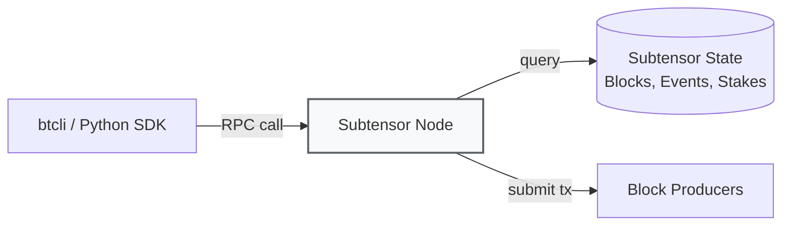
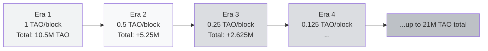
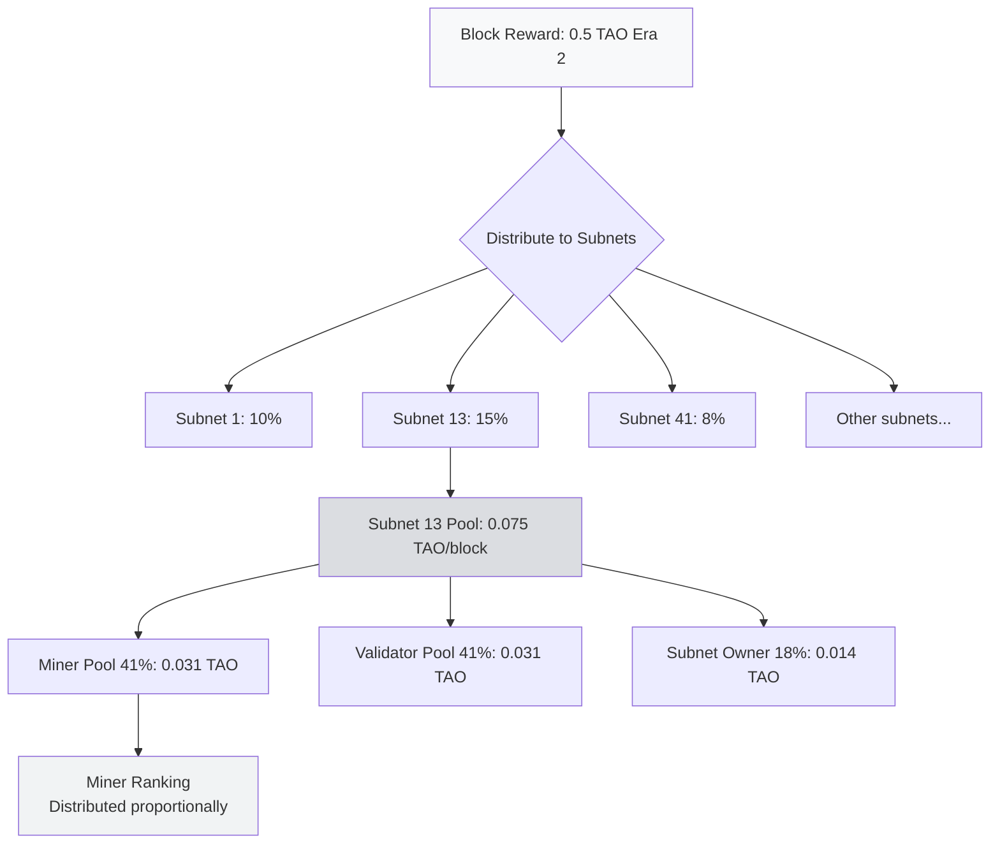
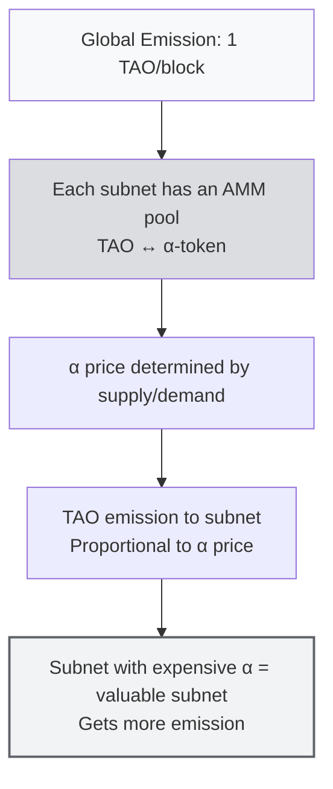

# 💰 Unit 3: Tooling & Tokenomics

:::info Goal of This Unit
After reading this unit, you will understand:
1. **btcli**: install and use Bittensor's main command-line tool (wallet, stake, transfer, overview)
2. **Subtensor**: what role it plays and why you'll typically use a public endpoint
3. **TAO tokenomics**: halving schedule, 21M max supply, the 41/41/18 emission split (subnet level)
4. **dTAO & alpha tokens**: the new 2024+ mechanism in which every subnet has its own market price
5. **Bittensor Chrome Extension wallet**: set up the GUI wallet for users more familiar with Metamask-style flows
:::

> This unit is half theory (tokenomics) + half practice (btcli). You won't run a miner yet: that's Phase 2. But you will **install the tool and create a wallet** so you're ready for Phase 2.

---

## 🛠️ Part 1: Tooling

### What Is btcli?

**btcli** = "Bittensor Command Line Interface". It's the main tool for:

- 🔑 Creating and managing wallets (coldkey + hotkey)
- 💸 Transferring TAO
- 🔒 Staking / unstaking TAO to validators
- 📝 Registering miners/validators on subnets
- 📊 Viewing the metagraph, overview, emission
- 🗳️ Voting / delegating (for governance)

Built on the Python SDK (`bittensor-cli`), so it's compatible with virtually all OSes (Linux, macOS, Windows WSL).

### Subtensor: What It Is and Why You Should Know

**Subtensor** = the main Bittensor blockchain, built on the **Substrate framework** (the same as Polkadot). It's where all state, transactions, and emissions are tracked.



**Three ways to access Subtensor:**

| Option | Pros | Cons | Best For |
|--------|------|------|----------|
| **Public endpoint** (`finney`) | Free, just use it | Rate-limited, shared globally | Beginners, testing |
| **Self-hosted Subtensor node** | Full control, no rate limit | Requires hardware + 500GB+ storage | Serious validators/miners |
| **Lite node (pruned)** | Lighter than a full node | No historical data | Middle ground |

For CLC9 we'll use the **public finney endpoint** throughout Phase 1 and Phase 2.

---

### Install btcli: Step by Step

#### Prerequisites

- **Python 3.9+** (check with `python3 --version`)
- **pip** (usually bundled)
- **Virtual environment** (recommended, not required)

#### Install via pip

```bash
# Create a virtual env (recommended)
python3 -m venv btvenv
source btvenv/bin/activate     # Linux / macOS
# or
btvenv\Scripts\activate        # Windows

# Install bittensor-cli
pip install bittensor-cli

# Verify
btcli --version
```

Expected output:

```
btcli v9.x.x
```

:::warning Windows Users
Native Windows occasionally has issues with crypto dependencies. **Recommendation:** use **WSL2** (Windows Subsystem for Linux) + Ubuntu. WSL setup tutorial is in Phase 2 (Sportstensor setup).
:::

#### Install the Full SDK (Optional but Recommended)

If you also want to use Python scripts:

```bash
pip install bittensor
```

Difference:
- `bittensor-cli` = CLI tool only
- `bittensor` = full Python SDK (CLI + library for building miners/validators)

For CLC9 Phase 2 you need the **full SDK**.

---

### Important btcli Commands: Cheatsheet

These are the commands you'll use most. Memorize them or bookmark this section.

#### 🔑 Wallet Management

```bash
# Create a new coldkey
btcli wallet new_coldkey --wallet.name my_wallet

# Create a hotkey under that coldkey
btcli wallet new_hotkey --wallet.name my_wallet --wallet.hotkey miner1

# List all wallets on the system
btcli wallet list

# View wallet overview (balance, stake, subnet)
btcli wallet overview --wallet.name my_wallet

# Export (back up) the mnemonic
btcli wallet regen_coldkey --wallet.name backup_wallet
```

:::danger BACK UP YOUR MNEMONIC!
When you run `btcli wallet new_coldkey`, you'll be prompted with a **12/24-word mnemonic**. This is the **only way to recover** the wallet if it's lost.

**What you must do:**
- Write it on physical paper (don't put it in a cloud note!)
- Store it in 2 different locations
- **Don't screenshot it**
- **Don't share it with anyone**: not even HackQuest admins

If your mnemonic is leaked, your TAO can be drained in seconds.
:::

#### 💸 Transfer & Stake

```bash
# Transfer TAO to another address
btcli wallet transfer --wallet.name my_wallet --dest 5CAh... --amount 10

# Stake TAO to a validator (delegated staking)
btcli stake add --wallet.name my_wallet --amount 50

# Unstake TAO
btcli stake remove --wallet.name my_wallet --amount 50

# View current stake
btcli stake show --wallet.name my_wallet
```

#### 🌐 Subnet Management

```bash
# List all active subnets
btcli subnet list

# View the metagraph for a specific subnet
btcli subnet metagraph --netuid 41

# Register a miner/validator on a subnet
btcli subnet register --netuid 41 --wallet.name my_wallet --wallet.hotkey miner1

# Check the current registration price
btcli subnet register --netuid 41 --wallet.name my_wallet --wallet.hotkey miner1 --dry-run
```

#### 📊 Info & Monitoring

```bash
# Root overview: TAO total supply, emission rate
btcli root get_weights

# Subnet-specific emission and stake
btcli subnet show --netuid 13

# View delegations to a particular validator
btcli stake show --all
```

:::tip Practical Tip
Use `--help` at the end of any command to see the full options. Examples:

```bash
btcli wallet --help
btcli subnet register --help
```
:::

---

### Example Session: Create Your First Wallet

A realistic flow you'll go through today:

```bash
# 1. Activate the virtual env
source btvenv/bin/activate

# 2. Create your first coldkey
$ btcli wallet new_coldkey --wallet.name clc9 --wallet.hotkey default

# [Prompt] Enter password:
# [Prompt] Confirm password:
#
# Wallet created successfully!
#
# MNEMONIC (SAVE THIS!):
# abandon ability able about above absent absorb abstract absurd abuse access accident
#
# coldkey address: 5CAh5A...

# 3. Create a hotkey for the Sportstensor miner
$ btcli wallet new_hotkey --wallet.name clc9 --wallet.hotkey sn41_miner

# 4. Check overview
$ btcli wallet overview --wallet.name clc9

# Output:
# Coldkey: 5CAh5A...
# Hotkeys:
#   - default (5F3s...)       Stake: 0 TAO
#   - sn41_miner (5GrwF...)   Stake: 0 TAO
# Total Balance: 0 TAO
```

You don't have any TAO yet: that's fine. In Phase 2 we'll cover how to get TAO (testnet faucet, or buying from an exchange).

---

## 💎 Part 2: TAO Tokenomics

Now to the economics. You need to understand **where TAO comes from, how much exists, and what makes its price move**.

### Basic Facts About TAO

| Fact | Value |
|------|-------|
| **Symbol** | TAO (τ) |
| **Max Supply** | **21,000,000** (21 million, similar to Bitcoin) |
| **Block Time** | ~12 seconds |
| **Emission per block (initial)** | 1 TAO (before halving) |
| **Blocks per halving** | 10,500,000 blocks (~4 years) |
| **Genesis** | 2021 (testnet), mainnet 2022 |
| **First Halving** | Expected ~2025–2026 (already occurred) |

:::note Bitcoin-like, But Different
Bittensor intentionally chose tokenomics similar to Bitcoin (21M cap + 4-year halving). The reason: **a proven scarcity model**. The key differences:

- Bitcoin: rewards miners for proof-of-work hashes
- Bittensor: rewards miners for proof-of-intelligence (AI output quality)

Plus there's a **subnet owner share** that Bitcoin doesn't have.
:::

---

### Halving Schedule: Visual



### Emission Schedule Table (Estimated)

| Era | Period | Emission/block | Total TAO Minted in This Era |
|-----|--------|----------------|------------------------------|
| **1** | 2021–2025 | 1.000 TAO | 10,500,000 |
| **2** | 2025–2029 | 0.500 TAO | 5,250,000 |
| **3** | 2029–2033 | 0.250 TAO | 2,625,000 |
| **4** | 2033–2037 | 0.125 TAO | 1,312,500 |
| **5+** | 2037–2140+ | ↓↓↓ | …up to 21M total |

**Implication:** if you're mining in 2026 (early Era 2), you're still in a period of **high emission**. After the next halving (2029), emission drops 50%: if the TAO price doesn't at least 2x, your income halves.

:::warning Practical Implications of Halving
A halving = half as much TAO minted → supply inflation drops. Typical effects:
- **Price pressure** (less new supply → price tends to rise)
- **Miner shakeout** (marginal miners go unprofitable → quit)
- **Tighter competition** (the remaining miners must be more efficient)

If you plan to mine long-term, **model** the halving scenarios.
:::

---

### Emission Flow: From Block to Miner

We covered 41/41/18 in Unit 2, but let's combine it with halving:



**The key:** there are **two distribution levels**:
1. **Level 1 (root → subnet):** TAO per block is split across subnets. Before dTAO this was decided by root validator voting. After dTAO, it's proportional to the **alpha token price** (covered shortly).
2. **Level 2 (subnet → miner/validator/owner):** 41/41/18, then split per neuron based on incentive/dividend.

---

## 🆕 Part 3: Dynamic TAO (dTAO) & Alpha Tokens

This is a revolutionary new mechanism (launched 2024). If you don't understand it, you'll be confused looking at subnet prices on Taostats.

### The Problem Before dTAO

Before 2024, emission allocation across subnets was decided by **root validators**: 64 elite validators with the largest stakes voting on which subnet gets how much.

**The problems:**
- Politics and lobbying of subnet owners to root validators
- Root validators could extract rent (asking for a subnet share in exchange for votes)
- Market inefficiency: genuinely valuable subnets could be underallocated if they lacked connections

### The Solution: dTAO + Alpha Tokens

In dTAO, every subnet has its own **alpha token** (called "alpha" or "α-token"), with the following mechanism:



### dTAO Key Concepts

| Concept | Explanation |
|---------|-------------|
| **α-token (alpha token)** | A per-subnet token. Subnet 13 has α₁₃, subnet 41 has α₄₁, etc. |
| **AMM pool** | Similar to Uniswap v2. Each subnet has a pool TAO ↔ α, with prices set by constant product (x × y = k) |
| **Alpha price** | The price of 1 α in TAO. The higher, the more the market "values" the subnet |
| **Proportional emission** | A subnet with a higher alpha price gets a larger share of emission |
| **Validators stake α, not TAO** | Validators now stake the subnet's alpha token, not TAO directly. Stake in α = "skin in the game" for that subnet |

### A Simple Analogy: dTAO = Subnet Stocks

:::tip Analogy
Imagine TAO as a **fiat currency**. Each subnet's alpha token is a **company share** on a stock exchange.
- Buying SN13 alpha = buying shares in the "company" Data Universe
- Alpha price up = the company is growing, more emission to the subnet
- Alpha price down = the subnet is less valued, emission decreases

And the subnet "pays dividends" (TAO emission) to alpha holders (validators) + workers (miners) + the subnet owner.
:::

### dTAO Pool Example

Suppose subnet SN41 (Sportstensor) has the pool:

```
Pool SN41:
  TAO reserve: 5,000
  α₄₁ reserve: 10,000
  Price α₄₁ = TAO / α = 5000 / 10000 = 0.5 TAO per α
```

Now someone stakes 500 TAO into SN41. The AMM kicks in:

```
New TAO reserve: 5,500
Using constant product (x × y = k):
  k = 5000 × 10000 = 50,000,000
  New α reserve = 50,000,000 / 5,500 = 9,090.9
  α received by user: 10,000 - 9,090.9 = 909.1 α₄₁
  New price: 5,500 / 9,090.9 = 0.605 TAO per α (up from 0.5)
```

In other words: staking 500 TAO drives the SN41 alpha price **from 0.5 to 0.605** (+21%). If many people stake into SN41 → α price rises → the subnet gets more emission in the next block.

:::warning Important Dynamics
This makes Bittensor **market-driven**. A subnet that's genuinely valuable will:
- Attract more stakers → alpha price rises → emission rises → miners and validators earn more → the subnet ecosystem grows
- A non-valuable subnet → alpha gets dumped → emission falls → miners quit → the subnet dies

This is healthy natural selection for the ecosystem.
:::

### dTAO Commands in btcli

```bash
# View alpha price across all subnets
btcli subnet list

# View pool details for a specific subnet
btcli subnet show --netuid 41

# Stake TAO into a subnet (receive alpha)
btcli stake add --netuid 41 --amount 100 --wallet.name clc9

# Unstake (sell alpha, receive TAO)
btcli stake remove --netuid 41 --amount 50 --wallet.name clc9

# Move stake between subnets (swap alpha)
btcli stake move --origin 41 --dest 13 --amount 50 --wallet.name clc9
```

---

## 🖥️ Part 4: Bittensor Chrome Extension Wallet

If you're more comfortable with a GUI wallet (similar to Metamask), Bittensor has an official Chrome Extension.

### Why Use the Extension?

| Scenario | Recommendation |
|----------|----------------|
| Mining/validator operations | **btcli** (scriptable, server-friendly) |
| Light user, staking & transfers | **Extension** (GUI, user-friendly) |
| DApp interaction (future) | **Extension** (web3-compatible) |
| Production security | **Hardware wallet + btcli** (most secure) |

For **CLC9 Phase 2** you'll use btcli. But the **Extension is useful** for monitoring balances day-to-day.

### Install Steps

1. **Open the Chrome Web Store**: search "Bittensor Wallet"
2. Or directly: [chrome.google.com/webstore/bittensor-wallet](https://chrome.google.com/webstore) (verify the official URL via docs.bittensor.com)
3. Click **Add to Chrome**
4. Pin the extension to your toolbar

### Wallet Setup

**Option A: Create a new wallet:**
1. Click the extension → "Create New Wallet"
2. Set a password (minimum 8 characters)
3. **Back up the 12-word mnemonic** (write it on paper!)
4. Confirm the mnemonic
5. Done: your coldkey address appears

**Option B: Import an existing wallet:**
1. Click the extension → "Import Wallet"
2. Paste your mnemonic
3. Set a local password
4. Your coldkey address appears

### Sync With btcli

The Extension and btcli share the **same wallet format**. If you create a wallet in btcli, its mnemonic can be imported into the Extension (and vice versa).

:::tip Best Practice
1. **Create your main wallet (coldkey) in btcli** on a separate laptop/server
2. **Import it into the Extension** in the browser to monitor balances
3. **Don't store your mnemonic in a cloud password manager** (iCloud, Google Pass): keep it on paper + an encrypted offline file
:::

### Extension Features

- View coldkey TAO balance
- Transfer TAO
- Stake/unstake to validators
- Support for dTAO alpha tokens (view holdings per subnet)
- Sign transactions for Bittensor DApps (future)

---

## 🔐 Security Hygiene: What You Should Practice

Because this involves real money, let's revisit security one more time.

### Level 0: Newbie (Day One)

- ✅ Mnemonic on physical paper, stored at home
- ✅ btcli password minimum 12 characters
- ✅ Don't use the same wallet across 5 different devices
- ❌ Don't share your mnemonic on Telegram/Discord (scammers impersonate admins; real admins will never ask)

### Level 1: Serious (Once You Start Mining)

- ✅ Separate the coldkey (offline storage) and hotkey (on the miner server)
- ✅ The hotkey on the server is OK to expose: if it leaks, the TAO in the coldkey stays safe
- ✅ Back up the mnemonic to 2 different physical locations
- ✅ Lock your laptop / enable FDE (full disk encryption)

### Level 2: Pro (Mining With Significant Capital)

- ✅ Hardware wallet (Ledger or Trezor) for the main coldkey
- ✅ Multi-sig via the Subtensor multi-sig pallet (for teams)
- ✅ Dedicated server for the validator/miner (not your personal laptop)
- ✅ Uptime monitoring + alerting

:::danger Common Scams
- 🚫 Telegram DM claiming to be a "HackQuest admin" asking for your mnemonic: SCAM
- 🚫 Fake website "bittensor-claim.com" asking you to paste your mnemonic: SCAM
- 🚫 Fake extensions in the Chrome Store (always verify the official publisher = Opentensor Foundation)
- 🚫 "Airdrop TAO" YouTube videos: SCAM
:::

---

## 📊 Recap: Tokenomics Cheatsheet

| Concept | Summary |
|---------|---------|
| **TAO max supply** | 21,000,000 |
| **Halving** | Every ~4 years (10.5M blocks) |
| **Era 2 emission** | 0.5 TAO/block (at the time of writing) |
| **Per-subnet split** | 41% miner / 41% validator / 18% owner |
| **dTAO** | Each subnet has an alpha token, with a TAO ↔ α AMM |
| **Alpha price drives emission** | A subnet with a higher α price gets more emission |
| **Staking in the dTAO era** | Stake using the subnet's α-token (not TAO directly) |

---

## 🎯 Summary

:::tip Key Takeaways
1. **btcli** = the main Bittensor CLI. Install via `pip install bittensor-cli`
2. **Coldkey vs hotkey**: coldkey holds TAO (offline), hotkey operates the miner/validator
3. **TAO tokenomics** is similar to Bitcoin: max 21M, halving every ~4 years, currently in Era 2 (0.5 TAO/block)
4. **Per-subnet emission split:** 41% miner / 41% validator / 18% subnet owner
5. **dTAO (2024+)**: every subnet has an alpha token + AMM pool. Subnets with higher alpha prices get more emission
6. **Chrome Extension**: GUI wallet for monitoring balances, optional but handy
7. **Security first**: mnemonic on paper, coldkey offline, never share with anyone
:::

### ✅ Quick Check

- ❓ What command creates a new coldkey in btcli? And a hotkey under it?
- ❓ Name 3 differences between TAO before and after dTAO (2024)
- ❓ If subnet X's alpha price = 0.8 TAO/α and subnet Y's = 0.2 TAO/α, which subnet gets more emission? Why?
- ❓ What's the risk if your hotkey is leaked (compared to the coldkey/mnemonic being leaked)?

---

## 🚀 Next Unit: Into Real-World Subnets!

Congratulations: you've finished **Concept I: Introduction to Bittensor**! You now understand:

- ✅ The history of Bittensor and why it exists (Unit 1)
- ✅ Technical architecture: subnet, miner, validator, Yuma Consensus, metagraph (Unit 2)
- ✅ Tooling (btcli) + tokenomics (TAO, halving, dTAO, alpha tokens) (Unit 3)

Next, in **Concept II: Core Bittensor Subnets**, we'll dissect 4 specific subnets you'll interact with directly:

**Next:** [Concept II: Unit 1: Chutes (Decentralized Inference Infrastructure)](../Concept-2-Core-Subnets/chutes) 👉

*Chutes is the subnet that makes Bittensor "the decentralized AWS for AI": an inference API anyone can access using TAO. We'll see how it works and why it's foundational for the ecosystem.*

---

### 📚 References for This Unit

- [btcli Official Docs](https://docs.bittensor.com/btcli)
- [Bittensor Tokenomics Overview](https://docs.bittensor.com/dynamic-tao/dtao-guide)
- [Taostats Explorer](https://taostats.io): real-time metagraph, alpha prices, emission
- [Bittensor Chrome Extension (Opentensor)](https://bittensor.com/wallet)
- Phase 0 recap: [Centralized vs Decentralized AI](../../Phase-0-Prerequisites/centralized-vs-decentralized-ai)

*Ready to explore production subnets? Onward to Chutes!* 🦆⚡
