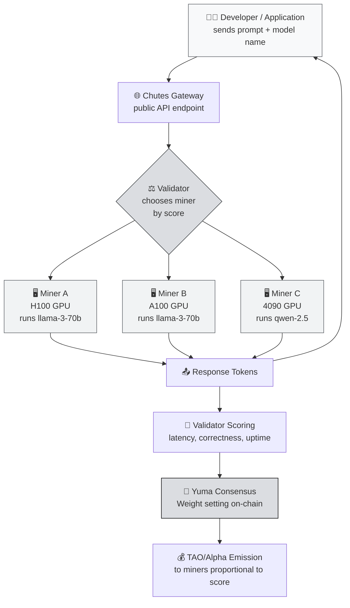

# ⚡ Chutes: Decentralized Inference Infrastructure Subnet

You now understand **Bittensor's general architecture** (subnet, miner, validator, Yuma Consensus) from Concept 1. Time to drop one level: **what does each subnet actually do?** We start with **Chutes**: one of the most "visible" subnets in terms of immediate value, because it directly addresses a developer's daily need: **LLM inference**.

:::info Goal of This Unit
After reading this unit, you will be able to:
- 🎯 Explain **what decentralized inference is** and how it differs from calling the OpenAI API
- ⚙️ Describe **what miners and validators do on Chutes**: who does what
- 💰 Compare **Chutes vs centralized inference** in terms of price, latency, and censorship
- 🧠 Identify **real use cases** where Chutes makes more sense than a commercial API
- 📈 Have a basic picture of **miner economics** (GPU capital, TAO rewards, risks)
:::

---

## 🧠 Quick Recap: Why Is Inference Expensive?

Before we get into Chutes, recall the problem we're trying to solve.

If you've ever used ChatGPT, Claude, or Gemini: those all run on **massive data centers** owned by OpenAI / Anthropic / Google. Every prompt you send:

1. Goes into their servers.
2. Gets processed by a GPU cluster (typically H100 / A100).
3. The model generates response tokens.
4. You pay per-token (or they take a loss and subsidize you).

There are three classic problems:

- 💸 **Expensive.** GPT-4-class models can be $10–30 per million output tokens. For high-volume products, inference cost can exceed revenue.
- 🚫 **Censorable.** They can ban your account, block a country, or refuse certain topics. If you're building a finance / medical / controversial product: high risk.
- 🔐 **Opaque.** You don't know exactly which model is serving you, whether it's logged, or whether it's used for training.

Chutes was created to **decouple** inference from all three.

---

## 🎯 What Is Chutes?

> **Chutes** is the Bittensor subnet that **provides decentralized inference**: meaning anyone with a GPU can become a miner that serves LLM requests (text generation, embeddings, vision models, etc.) from developers and applications around the world.

Think of Chutes as **Uber for GPU inference**:

- **Users (developers / applications)** send a prompt + pick a model (e.g. `llama-3-70b` or `qwen-2.5-coder`).
- **Miners** with idle GPUs pick up the request, run the model, and return the result.
- **Validators** make sure miners are honest: output is valid, latency is reasonable, quality is sufficient.
- **The network** pays miners in TAO/alpha proportional to their contribution.

:::note Simple Analogy
Imagine a **global GPU café**. Internet cafés used to exist because not everyone could afford a gaming PC. Chutes is **a café for inference**: developers without H100 GPUs can "rent" one from miners who have them: but without trusting any single central company, because validators ensure quality.
:::

---

## 📊 Chutes Architecture: End-to-End Flow

This flow happens **every second** in the Chutes subnet. Let's break it down piece by piece.

---

## ⚙️ What Do Miners Do?

A Chutes miner is a **GPU operator** running the model the subnet is asking for. Concretely:

1. **Pick a model to serve.** The subnet typically has an "allowlist" of models (e.g. `llama-3.1-70b-instruct`, `qwen-2.5-coder-32b`, several vision / embedding models).
2. **Set up the inference infrastructure.** Most miners use `vLLM`, `TGI`, or `SGLang` as the inference engine. These are frameworks that optimize GPU throughput (continuous batching, PagedAttention, etc.).
3. **Register on the subnet.** Pay the registration fee (in TAO/alpha) so your hotkey is registered as a neuron under the Chutes NetUID.
4. **Listen for validator requests.** Your miner software opens an endpoint that validators query.
5. **Respond with model output.** Send back the token stream as fast as possible.
6. **Repeat ~24/7.** The more requests you handle with good quality and latency, the higher your score.

:::tip Hardware Requirements (indicative)
To efficiently serve a 70B model (Llama-3-70b), you'll typically need at minimum:
- **2× A100 80GB** or **1× H100 80GB** for fp16
- Or **1× A100 80GB** with quantization (AWQ/GPTQ 4-bit)

For 7B–13B models, an **RTX 4090 24GB** is enough. But rewards are clearly lower because demand for smaller models is also lower and competition is high.
:::

---

## ⚖️ What Do Validators Do?

Validators don't process user prompts directly. Their job: **measure miner performance** so TAO emission flows to the highest contributors.

A Chutes validator typically:

- **Synthetic queries**: sends standard prompts to many miners and compares their outputs.
- **Correctness scoring**: checks whether the output is reasonable, not garbage / cut off mid-sentence / coming from a different model than claimed.
- **Latency scoring**: miners that respond quickly (low p50 and p99) get a higher score.
- **Uptime scoring**: miners that go offline often are penalized.
- **Consistency**: the output for the same prompt shouldn't be too random (unless an explicit random seed is given).

The result is mapped to a **weight vector** that gets submitted on-chain. Yuma Consensus then aggregates the weights from all validators → final TAO distribution.

:::warning Validators Can Cheat Too
Just like miners can spam junk output, validators can try to cheat (favoring specific hotkeys). Yuma Consensus protects the network by punishing validators whose weights deviate strongly from the consensus median. This was covered in Concept 1 Unit 2: section **"Validator incentive & bond"**.
:::

---

## 💰 Chutes vs Centralized API: A Realistic Comparison

| Aspect | OpenAI / Anthropic API | Chutes |
|---|---|---|
| **Input/output price** | Fixed per 1M tokens, set by vendor | Market-driven, typically cheaper for equivalent open-source models |
| **Models available** | Only the vendor's proprietary models | Llama, Qwen, Mistral, DeepSeek: every open model |
| **Censorship** | Vendor can block accounts / topics / countries | Permissionless: anyone can access |
| **Data privacy** | Vendor's logging policy (sometimes used for training) | Varies by miner; you can pick miners who sign privacy commitments |
| **Latency** | Very stable (low p99, strong SLA) | Variable: depends on miner choice and load |
| **Uptime / reliability** | 99.9%+ SLA with credits | Depends on validator fallbacks; no contractual SLA yet |
| **Custom fine-tuned models** | Limited, must go through the vendor | Possible: miners are free to serve their own fine-tuned models |
| **Billing** | Credit card, fiat, post-paid | TAO on-chain (or via gateways that accept fiat) |

:::info Pragmatic Takeaway
**For enterprises that need SLAs and compliance audits**: OpenAI is still ahead.
**For indie developers / startups that need open-source models at the optimal price without KYC drama**: Chutes is much more attractive.
**For applications operating in "grey zone" jurisdictions / topics**: Chutes is practically the only scalable path.
:::

---

## 🎯 Real Use Cases

Chutes is best suited to scenarios like:

### 1. AI Startups With Tight Burn Rates
You're building an agentic product (an AI agent that calls an LLM dozens of times per task). On OpenAI this can run $5–20 per user per month. On Chutes, with an equivalent open-source model (Llama-3.1-70B ≈ GPT-4-mini class), the cost can drop significantly: although you trade off some SLA.

### 2. Applications That Need Custom Models
You've fine-tuned Llama for a specific use case (legal docs, medical, regional language). On Chutes you can become the miner serving your own fine-tuned model, or work with an existing miner.

### 3. Products Active in the "Grey Zone"
Adult content, gambling assistants, legal research in sensitive jurisdictions: all of these would be banned by OpenAI. Chutes is permissionless.

### 4. Research & Benchmarking
Researchers needing high-volume inference on open models for experiments (evals, red-teaming, synthetic data generation).

### 5. Agent Framework Developers
Builders making AutoGPT-like agents: they need access to many cheap models to test orchestration. Chutes provides multi-model access through a single gateway.

---

## 📈 Basic Miner Economics

This is the question beginners ask most: **"If I become a Chutes miner, will I break even?"**

Honest answer: **it depends on many variables**. Let's break it down.

### Main Costs

| Component | Estimated Monthly |
|---|---|
| Cloud GPU rental (1× H100 80GB on-demand) | $1,800 – $3,000/mo |
| Cloud GPU rental (1× A100 80GB spot) | $700 – $1,200/mo |
| Owned GPU (electricity + 4090 depreciation) | $100 – $250/mo |
| Registration fee (one-time, in TAO) | Variable: check Taostats |
| Bandwidth / monitoring / ops | $20 – $100/mo |

### Miner Revenue (Qualitative)

Miner reward is a function of:
1. **Your relative score** vs other miners on the subnet (not absolute).
2. **Total TAO emission** flowing into the Chutes subnet per day (set by dynamic TAO / root subnet weight).
3. **TAO / alpha token price** in the market.

Because TAO price and subnet emission are **volatile**, daily miner revenue can fluctuate 30–50% week-over-week. Some indicative ranges often reported by the community:

- **Top-ranked miners with H100s** on a popular inference subnet: from tens of dollars to several hundred dollars per day (in TAO equivalent). Very rough: check Taostats in real time.
- **Mid-tier miners with A100s**: usually below the H100 top tier; can break even or earn a thin profit.
- **Entry-level miners (4090)**: often struggle to break even on subnets with large models. Better suited to subnets with smaller models or non-Chutes subnets.

:::danger Realistic Warning
Don't enter Bittensor mining with the **expectation of guaranteed profit**. This is global competition: you're up against professional operators with hundreds of GPUs. Beginners are strongly advised to start on **a more beginner-friendly subnet like Data Universe (SN13)** before going serious on Chutes. See Unit 2 in this Concept.
:::

---

## 🧩 Chutes Mining Is for You If...

The ideal Chutes miner profile:

- ✅ **Has access to enterprise-grade GPUs** (H100, A100, or at least an A6000): owned or cloud.
- ✅ **Is familiar with vLLM / TGI / SGLang**: or willing to invest 2–4 weeks learning inference engines seriously.
- ✅ **Comfortable with Linux DevOps**: systemd, Docker, monitoring, log rotation.
- ✅ **Understands basic networking**: opening ports, reverse proxies, TLS.
- ✅ **Tolerant of volatility**: ready for revenue to drop 40% overnight due to TAO price.

❌ **Not a good fit if** you're new to the command line or have never run a Docker container in production. Start with SN13 first.

---

## 🔗 Where Chutes Fits in This Curriculum

Chutes is **not** the subnet we'll build a miner for in Phase 2. Why?

1. **High cost barrier**: not every participant has an H100.
2. **Tech complexity**: tuning vLLM for competitive latency takes experience.
3. **The camp's goal is** to get you a **first miner running**: not the most profitable miner. For that, **SN41 (Sportstensor)** and **SN13 (Data Universe)** are far more suitable as entry points.

But understanding Chutes still matters because:
- Chutes is a **showcase** of what Bittensor can achieve when inference is decentralized.
- Many of the scoring concepts (latency, correctness) will be **similar** in SN41 (prediction correctness + latency).
- If you upgrade to enterprise GPUs after the camp, you can come back to Chutes.

---

## 🎯 Summary

What you should remember from this unit:

1. **Chutes = decentralized LLM inference.** Miners provide GPUs, validators score quality and latency, users gain access to open-source models via the gateway.
2. **The value proposition:** cheaper for open models, censorship-resistant, permissionless: trade off in SLA and consistency.
3. **Miner economics is complex:** expensive GPUs, global competition, volatile rewards. Not an entry-level subnet for beginners.
4. **Validators don't forward user prompts**: they evaluate miners using synthetic queries and scoring heuristics.
5. **Chutes vs OpenAI** isn't apples-to-apples; it's a positioning trade-off: one focuses on enterprise SLA, the other on open access.

### ✅ Quick Check

Before moving on to Unit 2 (Data Universe), make sure you can answer:

1. Name 3 things Chutes validators score miners on.
2. Why would an indie developer benefit more from Chutes than the OpenAI API?
3. What's the minimum hardware for being a competitive Chutes miner on a 70B model?
4. Why are we **not** deploying a Chutes miner in this camp?
5. What's the "Uber for GPU inference" analogy: who is the driver, the passenger, and the dispatcher?

If those five questions are easy → on to Data Universe. If you're still shaky, re-read the **Chutes Architecture** and **Miner Economics** sections.

---

### 📚 Further Reading

- [Bittensor Official Docs](https://docs.bittensor.com): official documentation
- [Taostats: Subnet Explorer](https://taostats.io): check the Chutes NetUID, miner ranking, and emission in real time
- [vLLM](https://github.com/vllm-project/vllm): the most common inference engine miners use
- [SGLang](https://github.com/sgl-project/sglang): a high-performance alternative
- Concept 1 Unit 2: **Core Concepts & Mechanisms** (refresher on subnets, miners, validators)

---

**Next:** [Unit 2: Data Universe (SN13) → Decentralized Data Provision](./data-universe) 👉
