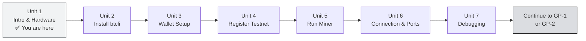

import Tabs from '@theme/Tabs';
import TabItem from '@theme/TabItem';

# 🖥️ Unit 1: Intro & Hardware Check

:::info Goal of This Unit
By the end of this unit you will:
- Understand **the purpose of GP-0** and how it differs from GP-1 (SN41) and GP-2 (SN13)
- Know whether **your computer meets the requirements** to run a local miner
- Have **WSL2 active** (Windows) or your terminal ready (macOS/Linux)
- Be ready to install btcli in Unit 2
:::

:::note Prerequisites
- ✅ Finished **Phase 1**: understand subnets, miners, validators, tokenomics
- ✅ Have a computer (Windows 10/11, macOS, or Linux)
- ✅ Stable internet connection
- ❌ A GPU is **not required**: everything in GP-0 uses testnet on CPU only
:::

---

## 🎯 Why GP-0?

GP-1 (Sportstensor) and GP-2 (Data Universe) are designed for **production miners**: meaning a cloud VPS, a static public IP, and monthly operating costs. That's great for graduation, but **not the ideal starting point** if you've never touched the Bittensor CLI before.

**GP-0 exists to answer the question that comes up often:**

> _"Can I learn Bittensor from my own laptop first, before spending money on a VPS?"_

The answer: **Yes.** Bittensor has a testnet (a practice network) where you can:
- Install and configure btcli
- Create a coldkey + hotkey wallet
- Register a miner on a testnet subnet (free / test TAO)
- Run a miner from your local computer
- See results in the metagraph

All of this **without a GPU, without a VPS, without real TAO.**

---

## 👤 Who Is GP-0 For?

| Profile | Suitable? |
|---------|-----------|
| First time using btcli | ✅ Highly suitable |
| Has a laptop with 8 GB RAM + SSD | ✅ Sufficient |
| Wants to learn the mining flow before investing in a VPS | ✅ Right place |
| Already has a VPS and wants to go straight to production | ⬛ Skip ahead to GP-1/GP-2 |
| Wants serious mainnet mining | ⬛ GP-0 is a stepping stone, then continue with GP-1 or GP-2 |

---

## 💻 Minimum Spec for a Local Computer

| Component | Minimum | Recommended | Notes |
|-----------|---------|-------------|-------|
| **OS** | Windows 10 (64-bit), macOS 12+, Ubuntu 20.04+ | Windows 11, macOS 14+, Ubuntu 22.04 | Windows uses WSL2 |
| **CPU** | 2 cores / 4 threads | 4+ cores | Scraping & CLI = I/O bound, not compute |
| **RAM** | 4 GB | 8 GB+ | btcli + Python + miner ~500 MB–1 GB |
| **Storage** | 10 GB free | 20 GB+ | Repo + venv + logs |
| **Internet** | 5 Mbps | 20 Mbps+ | For chain data sync |
| **GPU** | ❌ Not needed | — | Testnet with subnet-template doesn't need a GPU |

:::tip Older Laptops Work Too
A 2017 Intel MacBook, a Windows laptop with an 8th-gen i5, or a Linux PC with 8 GB of RAM: all are sufficient for GP-0. What matters is that Python 3.10+ runs.
:::

---

## 🪟 Setup WSL2 (Windows Only)

The Bittensor CLI (`btcli`) and its ecosystem are **Unix-based**. On Windows, the best way is to use **WSL2 (Windows Subsystem for Linux)**: a virtual Linux running inside Windows without dual-booting.

<Tabs>
<TabItem value="windows" label="🪟 Windows" default>

### Install WSL2

Open **PowerShell as Administrator** (right-click → Run as Administrator):

```powershell
wsl --install
```

This command automatically:
- Enables the WSL2 feature
- Downloads and installs **Ubuntu 22.04 LTS** (the default distro)
- Restarts the computer if asked

After restart, **Ubuntu** will appear in the Start Menu. Open Ubuntu: the first time it'll set up your Linux username and password.

:::note Verify WSL2
```powershell
wsl --list --verbose
```
Correct output:
```
  NAME      STATE   VERSION
* Ubuntu    Running       2
```
Make sure `VERSION` is **2**, not 1.
:::

### If Ubuntu Is Already Installed but on WSL1

```powershell
wsl --set-version Ubuntu 2
wsl --set-default-version 2
```

### Update Ubuntu After Install

In the Ubuntu terminal:

```bash
sudo apt update && sudo apt upgrade -y
```

</TabItem>
<TabItem value="macos" label="🍎 macOS">

### Check macOS Version

```bash
sw_vers -productVersion
# Must be 12.0 (Monterey) or newer
```

### Install Homebrew (If Not Yet Installed)

```bash
/bin/bash -c "$(curl -fsSL https://raw.githubusercontent.com/Homebrew/install/HEAD/install.sh)"
```

Follow the terminal instructions. After completion, add Homebrew to your PATH:

```bash
# For Apple Silicon (M1/M2/M3)
echo 'eval "$(/opt/homebrew/bin/brew shellenv)"' >> ~/.zprofile
eval "$(/opt/homebrew/bin/brew shellenv)"

# For Intel Mac
echo 'eval "$(/usr/local/bin/brew shellenv)"' >> ~/.zprofile
eval "$(/usr/local/bin/brew shellenv)"
```

Verify:
```bash
brew --version
# Output: Homebrew 4.x.x
```

The default macOS terminal (zsh) is enough: no extra configuration needed.

</TabItem>
<TabItem value="linux" label="🐧 Linux">

### Ubuntu / Debian

No special setup needed: your terminal is ready.

Update the system first:

```bash
sudo apt update && sudo apt upgrade -y
```

### Fedora / RHEL

```bash
sudo dnf update -y
```

### Arch Linux

```bash
sudo pacman -Syu
```

Continue directly to Unit 2.

</TabItem>
</Tabs>

---

## ✅ Checklist Before Continuing

Before Unit 2, make sure:

<Tabs>
<TabItem value="windows-check" label="🪟 Windows" default>

- [ ] WSL2 is active (`wsl --list --verbose` shows VERSION 2)
- [ ] Ubuntu 22.04 can be opened from the Start Menu
- [ ] You can run `sudo apt update` without errors in the Ubuntu terminal
- [ ] You know the Linux password you set during Ubuntu setup

</TabItem>
<TabItem value="macos-check" label="🍎 macOS">

- [ ] Homebrew is installed (`brew --version` doesn't error)
- [ ] Terminal (zsh) is accessible via Spotlight (Cmd+Space → "Terminal")
- [ ] `sw_vers` shows macOS 12+

</TabItem>
<TabItem value="linux-check" label="🐧 Linux">

- [ ] Your terminal opens
- [ ] `sudo apt update` (or your distro's equivalent) runs without errors
- [ ] Python 3.10+ is available: `python3 --version`

</TabItem>
</Tabs>

---

## 🗺️ GP-0 Roadmap (7 Units)



---

## 🎯 Summary

- **GP-0** = hands-on local mining using the testnet: suitable for beginners before going to production
- Minimum spec: **4 GB RAM, 10 GB storage, stable internet**: no GPU required
- **Windows**: must set up WSL2 first (`wsl --install`)
- **macOS**: install Homebrew if you haven't already
- **Linux**: ready to go directly

---

**Next:** [Unit 2: Install Python, venv & btcli →](./installing-btcli)

*A long journey starts with the first step. 🚀*
