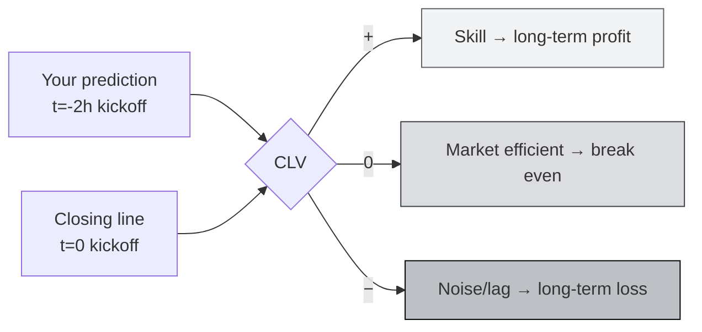
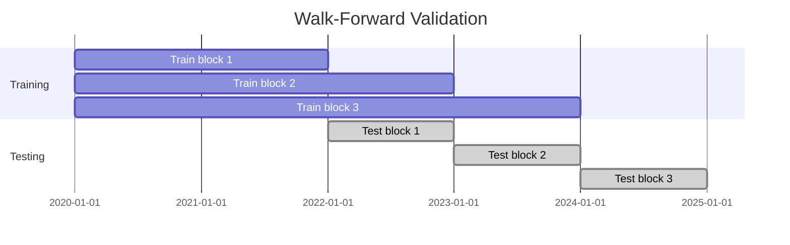
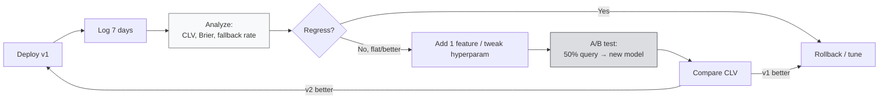

# 📊 Trading Strategies

:::info Goal of This Unit
After this unit you will:
- Understand **Closing Line Value (CLV)** as the north-star metric for Sportstensor miners
- Know 3 **strategy archetypes**: statistical model, arbitrage, sharp book tailing
- Know what **features** are useful (form, injury, weather, line movement)
- Be able to **backtest** strategies using walk-forward methodology
- Understand **risk management** via confidence calibration
- Have a measurable **iteration loop**: analyze → adjust → redeploy
:::

:::note Prerequisites
- ✅ [Unit 6: Programmatic Trade Execution](./06-programmatic-trade-execution) complete: baseline handler running
- ✅ Miner has been running 24/7 + logging active for at least 48 hours (so there's evaluation data)
- ✅ Basic Python data science: `pandas`, `numpy`, ideally `scikit-learn`
- ✅ At least 1 source of **historical odds + outcomes** (kaggle / scraped / API trial)
:::

---

## 🎯 North-Star: Closing Line Value (CLV)

### Definition

**Closing Line Value** = the difference (%) between your prediction's odds and the closing odds (just before kickoff). Positive means your prediction is more accurate than the final market.

```text
CLV = (implied_prob_mu - closing_implied_prob) / closing_implied_prob
```

Example:
- Your prediction (2 hours before kickoff): `home_win = 0.60`
- Closing market line: `home_win = 0.55`
- CLV = `(0.60 - 0.55) / 0.55 = +9.1%`

:::tip Why CLV, Not Win Rate?
**Win rate can lie.** You can be correct 55% of the time just because favorites win often. But if the closing line was already 70% favorite, your `65%` prediction = **negative** CLV (the market "knew more"). Consistently beating the closing line = real skill.
:::



**Realistic initial target:** average CLV **+1–3%** after 100+ predictions. Above +5% consistently = elite miner.

---

## 🧬 Strategy Archetypes

Three main archetypes: pick one, master it, then expand.

### 1. Statistical Model (most common for beginners)

Build your own model using historical data. Favorite architectures:

#### a. Elo-Based Rating

Each team has an Elo rating; updated every game. Prediction = logistic function of the rating difference.

```python
# src/predictors/elo.py
import math

class EloModel:
    def __init__(self, k: float = 20, home_adv: float = 60):
        self.ratings: dict[str, float] = {}
        self.k = k
        self.home_adv = home_adv

    def rating(self, team: str) -> float:
        return self.ratings.get(team, 1500.0)

    def predict(self, home: str, away: str) -> float:
        diff = self.rating(home) + self.home_adv - self.rating(away)
        return 1.0 / (1 + 10 ** (-diff / 400))

    def update(self, home: str, away: str, home_score: int, away_score: int):
        p_home = self.predict(home, away)
        result = 1.0 if home_score > away_score else 0.0 if home_score < away_score else 0.5
        delta = self.k * (result - p_home)
        self.ratings[home] = self.rating(home) + delta
        self.ratings[away] = self.rating(away) - delta
```

Simple, fast, and a **baseline that's hard to beat for sports with clear home-field advantage** (MLB, NBA, NFL).

#### b. ML Regression (Logistic / Gradient Boosting)

Feature-based. Example stack:

```python
# src/predictors/gbm.py
from sklearn.ensemble import GradientBoostingClassifier
import numpy as np

FEATURES = [
    "home_elo", "away_elo",
    "home_form_last10", "away_form_last10",
    "home_rest_days", "away_rest_days",
    "home_injury_index", "away_injury_index",
    "travel_km",
    "market_line_open",   # line when market opens
    "line_move_pct",      # movement since open
]

class GBMPredictor:
    def __init__(self):
        self.model = GradientBoostingClassifier(
            n_estimators=200,
            max_depth=4,
            learning_rate=0.05,
            random_state=42,
        )

    def fit(self, X: np.ndarray, y: np.ndarray):
        self.model.fit(X, y)

    def predict_proba(self, X: np.ndarray) -> np.ndarray:
        return self.model.predict_proba(X)
```

Practice: train on 2–3 historical seasons, validate on the next season (walk-forward: see below).

#### c. Deep Learning (Advanced)

LSTM/Transformer for line-movement time-series. **Only worth it** if you have 5+ seasons of granular per-minute data. For 90% of miners, GBM is enough.

---

### 2. Arbitrage

Find discrepancies between bookmakers: if book A sets `home 2.10` and book B sets `away 2.10`, there's an arbitrage window (rare, but exists).

**For SN41 miners:** arbitrage isn't direct → you infer "true" probability from the **average sharp book** then bet against soft books.

```python
# concept
def sharp_consensus(odds_list: list[dict]) -> float:
    """Weighted average implied prob, higher weight for sharp books (Pinnacle, Circa)."""
    weights = {"Pinnacle": 3.0, "Circa": 2.5, "Betfair_Exchange": 2.0}
    total_w, total_wp = 0.0, 0.0
    for o in odds_list:
        w = weights.get(o["book"], 1.0)
        p = 1.0 / o["decimal_odds"]
        total_w += w
        total_wp += w * p
    return total_wp / total_w if total_w else 0.0
```

**Pro:** high accuracy if data is fresh.
**Con:** depends on data API availability and latency.

---

### 3. Sharp Book Tailing

Pinnacle, Circa, and the Betfair exchange have the **lowest margins** → their prices are closest to true. Strategy: use Pinnacle as the "oracle", and your miner's prediction = Pinnacle's probability ± a small adjustment.

**This is the *simple-but-effective* strategy for beginners.** Almost guaranteed CLV ≈ 0 (you don't beat closing, but you also don't lose). From here add features for an edge.

```python
def pinnacle_tail(pinnacle_odds: float, edge_bps: int = 0) -> float:
    """Return implied prob, optionally adjusted by edge_bps basis points."""
    base = 1.0 / pinnacle_odds
    return base + (edge_bps / 10000)
```

:::warning Pinnacle Scraping
Pinnacle **doesn't have an official public retail API**. Scraping them violates their ToS. Legal alternative: use an aggregator with a partnership (see The Odds API official docs: there's a tier that includes Pinnacle).
:::

---

## 🔬 Feature Engineering

Features that consistently help across sports:

| Feature | Description | Data Source |
|---|---|---|
| **Elo rating** | Rolling team rating | Compute from historical scores |
| **Form last 10** | Win rate over last 10 games | Scoreboards |
| **Rest days** | Days since last game | Schedule |
| **Travel km** | Distance to venue | Airport + venue coords |
| **Injury index** | Weighted sum of key player injuries | ESPN / team reports |
| **Weather** | Outdoor sports: wind, rain, temp | OpenWeatherMap |
| **Referee bias** | Per-ref stats (NBA, soccer) | Historical box scores |
| **Line open → move** | Odds movement since market open | Odds API historical |
| **Steam moves** | Big sudden line shift = sharp money | Monitor odds stream |
| **Public %** | % of bettors taking X | Action Network / public data |

:::tip Minimum Viable Features
For your first ML model, 5 features are enough:
1. `home_elo - away_elo`
2. `home_rest - away_rest`
3. `home_form_10 - away_form_10`
4. `market_line_implied_prob`
5. `line_move_pct_last_24h`

Don't over-feature early. **The curse of dimensionality** more often causes losses than rich features cause gains.
:::

---

## 🧪 Backtesting: Walk-Forward Validation

Never backtest with a random train/test split: that's a **data leak**. Use walk-forward:



### Implementation

```python
# backtest.py
import pandas as pd
from sklearn.metrics import brier_score_loss

def walk_forward_backtest(df: pd.DataFrame, model_cls, feature_cols: list[str], target_col: str):
    df = df.sort_values("game_date").reset_index(drop=True)
    # split per season
    seasons = df["season"].unique()
    results = []
    for i in range(2, len(seasons)):
        train = df[df["season"].isin(seasons[:i])]
        test = df[df["season"] == seasons[i]]
        model = model_cls()
        model.fit(train[feature_cols].values, train[target_col].values)
        p = model.predict_proba(test[feature_cols].values)[:, 1]
        # metrics
        brier = brier_score_loss(test[target_col].values, p)
        clv = compute_clv(p, test["closing_implied_prob"].values)
        results.append({
            "test_season": seasons[i],
            "n": len(test),
            "brier": brier,
            "clv_mean": clv.mean(),
            "clv_median": clv.median() if hasattr(clv, 'median') else float(pd.Series(clv).median()),
        })
    return pd.DataFrame(results)


def compute_clv(pred_prob: pd.Series, closing_prob: pd.Series) -> pd.Series:
    return (pred_prob - closing_prob) / closing_prob
```

### Required Metrics

| Metric | Target | Meaning |
|---|---|---|
| **Brier score** | `< 0.24` | Calibration error; lower = better |
| **CLV mean** | `> 0` | Average edge vs closing line |
| **CLV hit rate** | `> 52%` | % of predictions beating closing |
| **Log loss** | `< 0.66` | Alternative to Brier |

If 3 seasons of backtests consistently show CLV > 0 → only then deploy to mainnet.

---

## 🎚️ Risk Management: Confidence Calibration

Your confidence should **mean what it says.** If you output `confidence=0.8`, it must be correct ~80% of the time on backtest data.

### Check Calibration (Reliability Diagram)

```python
import numpy as np
import matplotlib.pyplot as plt

def reliability_diagram(y_true, y_prob, n_bins=10):
    bins = np.linspace(0, 1, n_bins + 1)
    idx = np.digitize(y_prob, bins) - 1
    accuracies, confidences = [], []
    for b in range(n_bins):
        mask = idx == b
        if mask.sum() > 0:
            accuracies.append(y_true[mask].mean())
            confidences.append(y_prob[mask].mean())
    plt.plot([0,1],[0,1],"k--", label="perfect")
    plt.scatter(confidences, accuracies, label="model")
    plt.xlabel("confidence"); plt.ylabel("actual accuracy")
    plt.legend(); plt.show()
```

### Platt Scaling / Isotonic Regression If Miscalibrated

```python
from sklearn.calibration import CalibratedClassifierCV
cal = CalibratedClassifierCV(base_model, method="isotonic", cv=3)
cal.fit(X_train, y_train)
```

### Don't Over-Bet When Confidence Is Low

In the handler, clamp the output:

```python
def safe_confidence(raw_conf: float, sample_size: int) -> float:
    # shrink to 0.5 if data is insufficient
    if sample_size < 100:
        return 0.5 + (raw_conf - 0.5) * 0.3
    return raw_conf
```

:::danger Overconfidence = Emission Loss
The validator scores misses harder when confidence is high. Wrong with conf 0.9 > wrong with conf 0.55. **Under-promise over-deliver** is more profitable.
:::

---

## 🔁 Iteration Loop

Weekly iteration is a healthy tempo:



### Weekly Review Checklist

1. **Log ingestion**: `grep prediction_complete logs/*.log | jq > week.jsonl`
2. **Metrics**: compute CLV mean/median, Brier, fallback rate
3. **Per-sport breakdown**: you may be strong in MLB but bleeding in NBA: drop the negative sport
4. **Validator feedback**: check rank in the metagraph, emission trend
5. **Decide**: hold / rollback / experiment

### A/B Testing in Production

Run 2 models in parallel with 50/50 query routing via hash(event_id):

```python
import hashlib

def route(event_id: str) -> str:
    h = int(hashlib.md5(event_id.encode()).hexdigest(), 16)
    return "v2" if h % 2 == 0 else "v1"
```

Log the variant, compute CLV per variant after 200+ events.

---

## 🧰 Recommended Full Stack

| Layer | Choice |
|---|---|
| **Data API** | The Odds API (free → paid), Sportradar (trial) |
| **Storage** | PostgreSQL / SQLite for historical, Redis for cache |
| **ML** | scikit-learn, XGBoost, LightGBM |
| **Backtest** | pandas + custom walk-forward |
| **Monitoring** | Grafana + Prometheus (scrape custom `/metrics`) |
| **Alerting** | Simple: cron + script → Telegram bot when CLV drops |

---

## 🧪 Checkpoint Validation

### Week 1 (Baseline Deployed)

- [ ] Handler v1 (baseline implied odds) running for 7 days
- [ ] At least 100 predictions logged
- [ ] CLV mean computable (could be ≈ 0 or slightly negative: that's the baseline)

### Week 2 (Elo / GBM v1)

- [ ] Feature pipeline complete (at least 5 features)
- [ ] 3-season walk-forward backtest succeeded
- [ ] Model v1 deployed, A/B test vs baseline

### Week 3 (Calibration & Expansion)

- [ ] Reliability diagram looks near-diagonal
- [ ] CLV mean consistently > 0 in 1+ sport
- [ ] Drop negative sport or add feature

:::tip Screenshot for Graduation
Collect for the final submission:
1. CSV / table of weekly CLV report
2. Reliability diagram (your model)
3. Walk-forward backtest output (Brier per season)
4. Metagraph screenshot with your UID + trust/emission > 0
:::

---

## 🎯 Summary

- ✅ CLV as the north-star metric (not win rate)
- ✅ Three archetypes: statistical (Elo/GBM), arbitrage, sharp tailing
- ✅ Minimum-viable feature engineering (5 features > 50 random features)
- ✅ Walk-forward backtest (don't random split)
- ✅ Calibration: confidence must match actual accuracy
- ✅ Weekly iteration loop with A/B testing

### ✅ Quick Check

1. Why is CLV better than win rate as a metric?
2. What's the difference between walk-forward and random train/test split?
3. What's the risk of overconfidence in miner output?
4. Why are beginners advised to pick 1 sport first?
5. What's a healthy Brier score target?

### 🐛 Troubleshooting

| Symptom | Fix |
|---|---|
| Backtest looks great, live looks bad | Data leak: check whether future features leak into training |
| CLV consistently negative | Lag in data: your prediction publishes after the line has already moved |
| Model overfit | Reduce `max_depth`, add regularization, larger train size |
| Calibration is off but accuracy is OK | Use isotonic regression post-hoc |
| Miner rank stuck / declining | Validators may have updated scoring: check the subnet changelog |
| Odds API quota blown | Cache aggressively, upgrade tier, or combine with a legal scraper |

:::warning Don't Chase Noise
1 week of bad performance doesn't mean the strategy failed. At least **30 days** before deciding to roll back. Too much iteration = overfitting to new noise.
:::

---

## 🏁 Graduation Submission (End of Guided Project I)

Collect the following evidence into a `submission-gp1/` folder:

1. Screenshot of `btcli wallet list`
2. Screenshot of `btcli subnet register` output (UID assigned)
3. Screenshot of `btcli subnet metagraph --netuid 41` with your UID visible
4. Screenshot of Almanac binding response / verification
5. Screenshot of `pm2 status` (miner online)
6. Log snippet of at least 10 successful validator query → response cycles
7. Weekly CLV report (CSV or table screenshot)
8. Reliability diagram PNG
9. Short write-up (1 page): strategy used + first-week results

Submit to the HackQuest organizer per the submission-channel instructions.

---

**Congratulations!** 🎉 You've finished Guided Project I: Sportstensor SN41. Continue to GP-II to learn mining on the data-provision subnet:

**Next:** [GP-II Unit 1: Intro to the SN13 Data Universe Subnet →](../GP-2-Data-Universe-SN13/01-intro-sn13)
