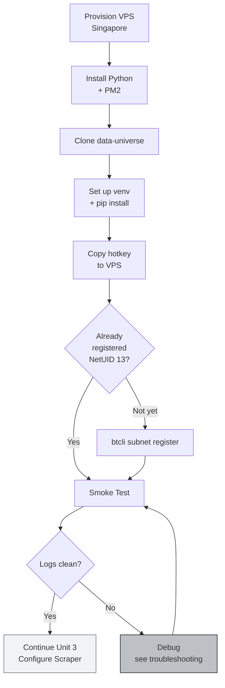

# ⚙️ Unit 2: Environment Setup & Deployment

:::info Goal of This Unit
By the end of this unit you will:
- Have a **VPS Ubuntu 22.04** ready (Vultr/DigitalOcean/Linode, Singapore region)
- **Python 3.10+, git, pm2** installed and verified
- The **`macrocosm-os/data-universe`** repo cloned + dependencies installed
- The **miner hotkey** registered on **NetUID 13** mainnet
- Be able to run a **dry-run / smoke test** of the miner without errors
:::

:::note Prerequisites
- ✅ Completed [Unit 1: Introduction to SN13](./01-intro-sn13)
- ✅ Have a **coldkey + hotkey** (from GP-1)
- ✅ Have at least **0.5 TAO** in the coldkey for registration fee + reserve
- ✅ Credit card / e-wallet to provision a VPS (~$40/month)
:::

---

## 🖥️ Step 1: Provision the VPS

### Provider Options

| Provider | SG Region | Recommended Spec | Price/month |
|----------|-----------|------------------|-------------|
| **Vultr** ⭐ | Singapore | Cloud Compute 4 vCPU / 8 GB / 500 GB NVMe | ~$40 |
| **DigitalOcean** | Singapore SG1 | Basic Droplet Premium AMD, 8 GB | ~$48 |
| **Linode / Akamai** | Singapore | Dedicated 4 GB | ~$36 |
| **Hetzner** | Finland/Germany | CX41 | ~€16 (~$17, but Asia latency higher) |

:::tip Recommendation
For CLC9 graduation: **Vultr High Frequency 4 vCPU / 8 GB / 256 GB NVMe in Singapore (SGP)**: enough storage for the working set + can upgrade storage addon. Price ~$48/month. Hourly billing, so 2 weeks = under $25.
:::

### Post-Provision Checklist

After the VPS is active, SSH in:

```bash
ssh root@<VPS_IP>
```

Then do basic hardening:

```bash
# Update system
apt update && apt upgrade -y

# Create non-root user
adduser miner
usermod -aG sudo miner

# Set up SSH key for miner (from local machine)
# ssh-copy-id miner@<VPS_IP>

# Disable root login (optional but recommended)
sed -i 's/#PermitRootLogin yes/PermitRootLogin no/' /etc/ssh/sshd_config
systemctl restart sshd

# Set up basic firewall
ufw allow OpenSSH
ufw allow 8091/tcp    # default miner port
ufw enable
```

:::warning Miner Port
The default SN13 miner port is **8091**. Can be changed via the `--axon.port` flag, but make sure **the port is open on the VPS firewall**: otherwise validators can't reach your miner and scoring drops.
:::

---

## 🐍 Step 2: Install System Dependencies

Login as user `miner`:

```bash
ssh miner@<VPS_IP>
```

Install toolchain:

```bash
# Core tools
sudo apt install -y build-essential git curl wget \
                    python3.10 python3.10-venv python3-pip \
                    libssl-dev pkg-config

# Verify Python version (must be >= 3.10)
python3 --version
# Output: Python 3.10.12 (or higher)
```

:::tip If Python Isn't 3.10+
Ubuntu 22.04 defaults to Python 3.10. If you're on Ubuntu 20.04, add the PPA:

```bash
sudo add-apt-repository ppa:deadsnakes/ppa
sudo apt update
sudo apt install python3.10 python3.10-venv
```
:::

### Install Node.js + PM2

PM2 is used to run the miner as a service (auto-restart on crash):

```bash
# Install Node.js LTS via NVM
curl -o- https://raw.githubusercontent.com/nvm-sh/nvm/v0.39.7/install.sh | bash
source ~/.bashrc
nvm install --lts
nvm use --lts

# Install PM2 globally
npm install -g pm2

# Verify
pm2 --version
```

---

## 📦 Step 3: Clone the Data Universe Repo

```bash
cd ~
git clone https://github.com/macrocosm-os/data-universe.git
cd data-universe
```

:::note Repo Location
The official SN13 repo = `macrocosm-os/data-universe` (Macrocosmos is the company that maintains SN13). Old versions live at `RusticLuftig/data-universe`: avoid, it's archived.
:::

Inspect the structure:

```bash
ls -la
# You'll see: neurons/, scraping/, storage/, requirements.txt, README.md, etc.
```

---

## 🧪 Step 4: Set Up Python Virtual Environment

Best practice: isolate dependencies in a venv.

```bash
cd ~/data-universe
python3 -m venv venv
source venv/bin/activate

# Your prompt will change to:
# (venv) miner@vps:~/data-universe$
```

Install dependencies:

```bash
pip install --upgrade pip
pip install -r requirements.txt
```

:::warning If Install Fails
Common errors + fixes:

- **`error: Microsoft Visual C++ 14.0 required`**: you're on Windows, not Linux. Switch to a Linux VPS.
- **`failed building wheel for cryptography`**: install dev headers:
  ```bash
  sudo apt install libssl-dev libffi-dev python3.10-dev
  ```
- **`ModuleNotFoundError: No module named 'bittensor'`**: install manually:
  ```bash
  pip install bittensor
  ```
- **`torch` too big / timeout**: if requirements.txt includes torch and you don't need it (SN13 doesn't do ML training), skip first:
  ```bash
  pip install -r requirements.txt --no-deps
  # then install selectively
  ```
:::

Verify installation:

```bash
python -c "import bittensor; print(bittensor.__version__)"
# Output: 7.x.x or higher
```

---

## 🔑 Step 5: Set Up the Wallet on the VPS

Your coldkey & hotkey already exist from GP-1 (on the local machine). Now copy the hotkey to the VPS: **WITHOUT** the coldkey (security best practice).

### Option A: Regenerate Hotkey on the VPS (safest)

On the VPS:

```bash
btcli wallet regen_coldkeypub --wallet.name my_cold
# Paste the coldkey public key (NOT the mnemonic!)

btcli wallet regen_hotkey --wallet.name my_cold --wallet.hotkey sn13_miner
# Paste your hotkey mnemonic
```

:::danger Don't Store the Coldkey on the VPS!
The coldkey = full access to your TAO funds. **Only store coldkeypub (public key)** on the VPS. If the VPS is hacked, the attacker can only reach the hotkey (which can only operate the miner, not transfer TAO).
:::

### Option B: Create a Brand New Hotkey for SN13

Recommended if you want to separate hotkeys per subnet:

```bash
btcli wallet new_hotkey --wallet.name my_cold --wallet.hotkey sn13_miner
```

Save the displayed mnemonic somewhere safe!

Check the hotkey:

```bash
btcli wallet overview --wallet.name my_cold
```

---

## 🎯 Step 6: Register the Miner on NetUID 13

Registration cost varies (dynamic recycled TAO). Check first:

```bash
btcli subnet list
# Look at the "RECYCLE" column for NetUID 13: that's the current fee
```

Register:

```bash
btcli subnet register \
  --netuid 13 \
  --wallet.name my_cold \
  --wallet.hotkey sn13_miner \
  --subtensor.network finney
```

Follow the prompts. After success, you'll get a **UID** (your miner slot number on the subnet). Note this number!

Verify:

```bash
btcli wallet overview --wallet.name my_cold --netuid 13
```

:::tip Registration Fee Too High?
Popular subnet = high recycle TAO (could be 1–5 TAO). Strategy:

1. **Watch `btcli subnet list` for a few hours**, register when the fee drops
2. **Register at off-peak hours** (typically weekend UTC)
3. **Have 2× the estimated fee in reserve** for safety margin
:::

---

## 🚦 Step 7: Smoke Test (Dry Run)

Before going production, test minimally:

```bash
cd ~/data-universe
source venv/bin/activate

# Most SN13 miners have entry point neurons/miner.py
python neurons/miner.py \
  --netuid 13 \
  --subtensor.network finney \
  --wallet.name my_cold \
  --wallet.hotkey sn13_miner \
  --logging.debug \
  --axon.port 8091 \
  --neuron.dry_run 2>&1 | tee smoke-test.log
```

:::note `--neuron.dry_run` Flag
The exact flag may differ across repo versions. Check `python neurons/miner.py --help` for the full flag list. If there's no dry-run, run normally for 30 seconds then `Ctrl+C`: what matters is **no exception during startup.**
:::

Successful logs roughly:

```
2026-04-14 12:34:56 | INFO | Loaded wallet my_cold/sn13_miner
2026-04-14 12:34:57 | INFO | Connected to subtensor finney
2026-04-14 12:34:58 | INFO | Found UID 1234 on netuid 13
2026-04-14 12:34:59 | INFO | Axon serving on 0.0.0.0:8091
2026-04-14 12:35:00 | INFO | Scraper module initialized (default: reddit)
```

If validator connection errors appear, that's normal in a smoke test: we configure the scraper in Unit 3.

---

## 🔄 End-to-End Deployment Flow



---

## 📁 Ideal Directory Structure

After setup, your VPS should have this layout:

```
/home/miner/
├── data-universe/              # Repo
│   ├── neurons/
│   │   └── miner.py           # Entry point
│   ├── scraping/              # Scraper modules
│   ├── storage/               # Local buffer
│   ├── venv/                  # Python venv
│   ├── config.json            # (created in Unit 3)
│   ├── .env                   # (filled in Unit 5: S3 creds)
│   └── requirements.txt
├── .bittensor/
│   └── wallets/
│       └── my_cold/
│           ├── coldkeypub.txt  # ONLY pub, NEVER full coldkey!
│           └── hotkeys/
│               └── sn13_miner
└── logs/                       # for PM2 logs (auto-created)
```

---

## 🎯 Summary

- VPS in Singapore + Ubuntu 22.04 = the most stable setup for an SN13 miner
- Python **3.10+** + PM2 are required
- Official repo: **`macrocosm-os/data-universe`**
- Isolate dependencies in **venv**: don't pollute system Python
- **Hotkey only** on the VPS, coldkey stays on the local machine
- Register on **NetUID 13** via `btcli subnet register`
- Smoke test before continuing to scraping config

### ✅ Quick Check

1. Why do we use venv instead of installing globally?
2. What's the default SN13 miner port? Where does it need to be open in the firewall?
3. What can and CANNOT be stored on the VPS regarding the wallet?
4. Which is the correct SN13 repo?
5. Why does the registration fee fluctuate?

<details>
<summary>💡 Answers</summary>

1. Venv **isolates** dependencies per project → no clashes with system versions; easy rollback (delete the venv folder).
2. Port **8091**, must be open in the **VPS firewall** (`ufw allow 8091`). If there's a cloud firewall (e.g., DigitalOcean Cloud Firewall), open it there too.
3. ✅ Allowed: **hotkey**, **coldkeypub.txt** (public key). ❌ Don't: full coldkey file, coldkey mnemonic.
4. **`macrocosm-os/data-universe`**: `RusticLuftig/data-universe` is archived.
5. Bittensor uses **dynamic recycled TAO**: fee rises when registration demand is high, falls when it's low.

</details>

### 🐛 Troubleshooting

| Error | Cause | Fix |
|-------|-------|-----|
| `bittensor.core.errors.SubstrateRequestException: Connection refused` | Subtensor endpoint down / network issue | Try changing to `--subtensor.network finney` or an alternative chain endpoint |
| `Insufficient balance` on register | Coldkey TAO < recycle fee | Top up the coldkey from an exchange |
| `Permission denied` on `pm2` | Node/NPM perms | Install via NVM (not `sudo apt install nodejs`) |
| Miner doesn't show in `btcli wallet overview` | UID not synced | Wait 1–2 minutes, the chain needs block confirmation |
| SSH drops during a large pip install | VPS timeout | Use `tmux` or `screen`: `tmux new -s install` |

---

**Next:** [Unit 3: Miner Configuration & Data Scraping Strategy →](./03-miner-config-scraping)

*Infrastructure is destiny. 🏗️*
