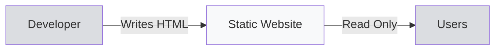
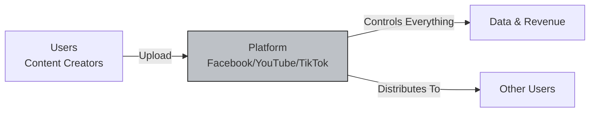
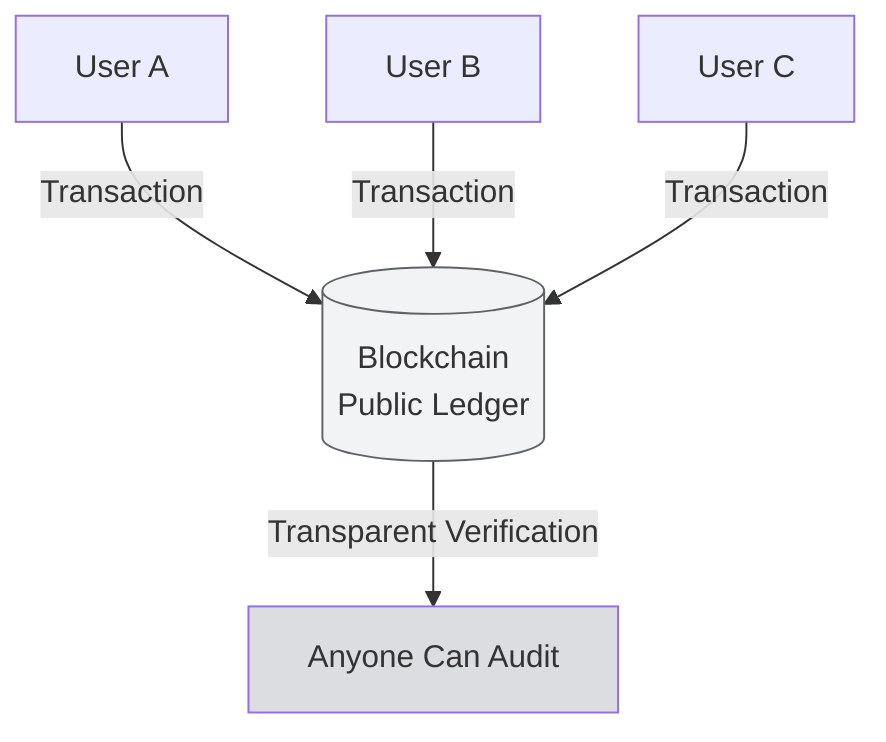

# Introduction to Web3

:::info What You'll Learn
After reading this page, you will understand:
1. The difference between **Web1, Web2, and Web3** through simple analogies
2. What **blockchain** and a **wallet** are (without technical jargon)
3. Why Web3 matters for AI: the foundation that Bittensor builds on
:::

> If you've never touched crypto, blockchain, or a wallet: **read this first.** Everything that follows assumes you understand the basics covered here.

---

## Why Start With Web3?

Bittensor is a **decentralized AI network**. The word "decentralized" is a Web3 concept. If you don't understand Web3, you'll be confused about why Bittensor was built on a blockchain, why there's a "TAO token", why you need a "wallet", and why miners are "rewarded on-chain".

So before we talk about AI, we align on the foundation: **what Web3 is.**

---

## A Simple Analogy: The Evolution of the Internet

Think of the internet like a **village marketplace** evolving over decades:

### Web1 (1990–2005): "The Magazine Stand"

- You could **read** web pages, but you **couldn't comment, like, or upload**.
- One-way only: developers built content, users consumed.
- Examples: early Wikipedia, static news sites.

**Analogy:** Like reading a newspaper. Pure consumption, no interaction.

### Web2 (2005–today): "The Mall Owned by Conglomerates"

- Now you can **upload, comment, like, share**: fully interactive.
- But **all your data is owned by the platform** (Meta, Google, TikTok, etc.).
- They can:
  -  **Ban your account** at any time
  -  **Monetize your data** (targeted ads)
  -  **Control the algorithm**: who sees what
  -  **Lock you in** to their ecosystem

**Analogy:** You open a store inside a mall. You get tons of foot traffic, but **the mall owner can kick you out anytime** and takes a hefty commission.

### Web3 (2015–today): "An Open Marketplace With a Public Ledger"

- There is no "mall owner". Transactions are **recorded on a blockchain**: a public ledger anyone can inspect.
- You **own your data, your assets, your identity** through a **wallet** (a digital wallet).
- No one can ban your account: because your account = your wallet = your private key.

**Analogy:** A traditional open-air marketplace. You sell directly to buyers, every transaction is logged in a community ledger anyone can audit. No mall required.

---

## Core Web3 Concepts (You Must Know These)

### 1. Blockchain: "A Shared Ledger"

:::tip Simple Analogy
Imagine a **WhatsApp group with 10,000 people**. Every time someone sends money, it's not just the sender and receiver who know: **all 10,000 people record that transaction in their own notebooks.**

If someone wants to cheat (e.g., edit history to claim "I have $1 million"), they would need to compromise **more than half** of everyone's notebooks at once. **Practically impossible.**

That is blockchain: **a record book copied across thousands of computers, impossible to fake, and open for anyone to audit.**
:::

Popular blockchains:
- **Bitcoin**: blockchain for digital money
- **Ethereum**: blockchain for smart contracts and applications
- **Bittensor (Subtensor)**: blockchain for decentralized AI

### 2. Wallet: "Your Digital ID + Bank Account"

A wallet is a digital wallet with two components:

| Component | Function | Safe to Share? |
|-----------|----------|----------------|
| **Public key** (address) | Like an account number: used to receive transfers | ✅ Yes (public) |
| **Private key** (seed phrase) | Like a PIN + password: proof of ownership | ❌ **NEVER** |

:::danger WARNING
**Leak your private key and all your assets are gone, with no way to recover them.**
There is no "forgot password → reset" in Web3. This is a 180-degree departure from Web2.
:::

In Bittensor you'll have two kinds of wallets:
- **Coldkey**: your main wallet, holds TAO (money), used rarely
- **Hotkey**: daily wallet for miner operations

We cover this in detail later, in the Wallet Setup material.

### 3. Token: "Currency & Incentive"

A token is a **digital asset that lives on the blockchain**. Examples:
- **BTC**: Bitcoin's token
- **ETH**: Ethereum's token
- **TAO**: Bittensor's token (what you'll earn if you become a productive miner!)

Tokens can play many roles: currency, governance voting, contribution rewards, and more.

### 4. Decentralized: "No Single Boss"

This is the keyword of Web3. It means:

✅ **No single company** can shut down the network
✅ **No single person** can change the rules unilaterally
✅ **No central HQ** that a government can raid

The rules are enforced by **code + consensus across thousands of computers worldwide.**

---

## Quick Comparison: Web2 vs Web3

| Aspect | Web2  | Web3  |
|--------|---------|---------|
| **Data ownership** | The platform (Meta, Google) | You |
| **Identity** | Email + password | Wallet (private key) |
| **Digital assets** | Stored by the platform (game skins, coins) | Stored in your wallet (NFTs, tokens) |
| **Censorship** | The platform can ban | Cannot be banned (permissionless) |
| **Economy** | Platform takes 30–50% commission | Protocol fee 0.1–2% |
| **Recovery** | "Forgot password?" ✅ | If you lose your private key, your assets are gone ❌ |

---

## Connecting to Bittensor & AI

Question: **"OK, Web3 is cool, but why is it relevant to AI?"**

Short answer: AI today is **dominated by a handful of large companies** (OpenAI, Google, Anthropic, Meta). Who trains the models, who uses your data, who controls access: all locked down by them.

Web3 + AI = **AI that is owned collectively**, where:
- Anyone can contribute (become an "AI miner")
- Anyone can access (permissionless)
- Contributions are automatically rewarded (TAO tokens)

That's what Bittensor is building. We go deeper in [AI vs Decentralized AI](/TH1-Foundations-and-Introduction/ai-vs-decentralized-ai).

---

## Summary

:::tip Key Takeaways
1. **Web1 = read** (static), **Web2 = interactive but platform-controlled**, **Web3 = you own**
2. **Blockchain = a shared ledger** that cannot be falsified
3. **Wallet = a digital ID** with a public key (shareable) + private key (SECRET)
4. **Token = a digital asset** on the blockchain (TAO for Bittensor)
5. **Decentralized = no single boss**: rules enforced by code + consensus
:::

### ✅ Quick Check

Try answering these in your head:
- If you lose your private key, what happens?
- What's the difference between a Web2 platform (YouTube) and a Web3 protocol (a "YouTube on blockchain")?
- Why is "permissionless" important?

If you can answer all three, you're ready to move on.

---

**Next:** [What is AI?](/TH1-Foundations-and-Introduction/what-is-ai)

*Got Web3? Now let's tackle AI: the other component Bittensor combines.*
