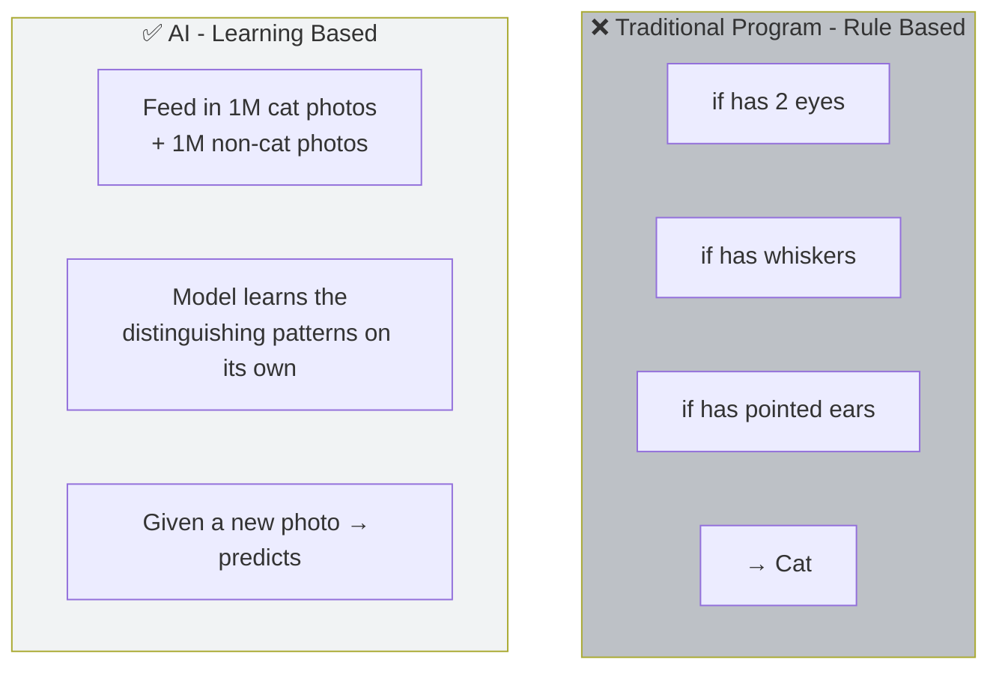
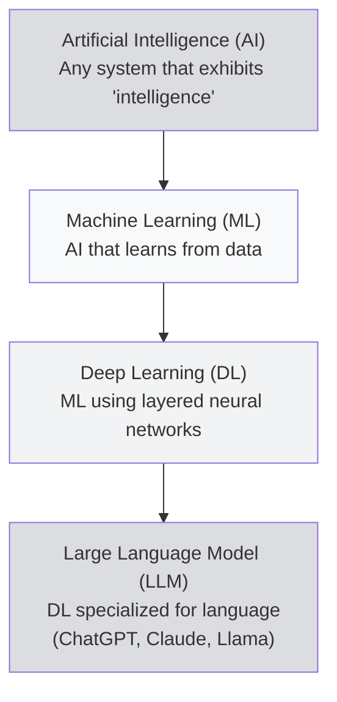
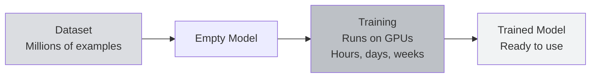

# What is AI?

:::info What You'll Learn
After reading this page, you will understand:
1. What **AI, Machine Learning, and Deep Learning** are (and how they differ)
2. The concept of **training vs inference**: the two main activities in AI
3. What **LLM, model, dataset, GPU** mean: terms that will appear constantly in Bittensor
:::

> If you're already familiar with ChatGPT and you understand the difference between "training" and "inference", you can skim this page. Otherwise, **read it slowly**: these concepts are used throughout the rest of the guidebook.

---

## AI in One Sentence

**AI = a computer program that "learns" from data, instead of just following hard-coded rules.**

### Simple Analogy

Suppose you want to write a program that **recognizes cat photos**:

**Traditional program:** humans write the rules. Rigid, struggles with edge cases (a cat with no whiskers? confused).

**AI:** we feed in many examples and the **model figures out the implicit patterns itself**. More flexible, more powerful.

---

## Term Hierarchy: AI → ML → DL → LLM

People often mix these up. Going from broadest to most specific:

| Term | Simple Definition | Examples |
|------|-------------------|----------|
| **AI** | A system that mimics human intelligence | Chess bots, self-driving, ChatGPT |
| **Machine Learning (ML)** | AI that **learns from data** rather than manual rules | Spam filters, Netflix recommendations |
| **Deep Learning (DL)** | ML using **multi-layer neural networks** | Face recognition, speech-to-text |
| **LLM** | DL for **understanding & generating language** | ChatGPT, Claude, Llama, Gemini |

---

## The Two Main AI Activities: Training & Inference

This is **a critical concept**: it will keep coming up in Bittensor. Memorize it.

### 1.  Training: "The Learning Phase"

**What happens:** the model is fed a large dataset, makes predictions, has them checked against the correct answers, adjusts its internal parameters, and repeats this loop millions of times.

- ⏱ **Slow:** can take hours, days, or weeks
- **Expensive:** requires lots of GPUs ($$$)
- **Done once, used many times**

**Analogy:** like a student learning math for 12 years of school. Slow and expensive, but once they graduate, they can solve any problem.

### 2.  Inference: "The Usage Phase"

**What happens:** the trained model is used to answer new questions or produce new predictions.

- ⏱ **Fast:** milliseconds to seconds
- **Relatively cheap** per request
- **Used millions of times per day**

**Analogy:** the student has graduated. Now you give them a problem → they solve it instantly.

### Comparison

| Aspect | Training  | Inference  |
|--------|-------------|--------------|
| **Goal** | Build the model | Use the model |
| **Duration** | Hours – weeks | Milliseconds – seconds |
| **Cost** | Very expensive | Relatively cheap |
| **Frequency** | Rarely (once per version) | Often (every user request) |
| **In Bittensor** | Some miners do training | **All subnets need inference** |

:::tip In Bittensor
- **Chutes subnet** focuses on **inference**: providing cheap, decentralized AI APIs
- **Data Universe (SN13)** focuses on **data for training**
- **Sportstensor (SN41)** focuses on **prediction** (a specific form of inference)
:::

---

## AI Components You'll Encounter

### 1.  Model

The file containing the AI's "brain" after training. Common formats: `.pth`, `.safetensors`, `.gguf`.

- **Small:** 100 MB – 1 GB (runs on a laptop)
- **Large:** 10 GB – 500 GB+ (requires dedicated GPUs)

Popular examples:
- **Llama 3** (Meta): open-source LLM
- **Mistral**: open-source LLM
- **GPT-4** (OpenAI): closed-source
- **Stable Diffusion**: image generation

### 2.  Dataset

The collection of data used for training. It can be:
- Text (Wikipedia, Reddit, books)
- Images (photos with labels)
- Audio (podcasts with transcripts)
- Structured data (stock prices, weather data)

:::info Why Data Matters
**"Garbage in, garbage out"**: model quality is bounded by data quality. That's why **Data Universe (SN13)** is an important Bittensor subnet: it provides high-quality datasets for training.
:::

### 3.  GPU

A regular computer (CPU) can run small AI models. But for large models you need a **GPU** (Graphics Processing Unit).

Why? AI requires **lots of parallel matrix multiplications**: exactly what GPUs were built for (originally for 3D games).

| GPU | VRAM | Approx. Price | Best For |
|-----|------|---------------|----------|
| RTX 3060 | 12 GB | ~$300 | Learning, small models |
| RTX 4090 | 24 GB | ~$2,000 | Serious mining, 7B LLMs |
| A100 | 40–80 GB | $15k+ | Production, large LLMs |
| H100 | 80 GB | $30k+ | Cutting-edge training |

Alternative: **rent GPUs in the cloud** (Vast.ai, RunPod, Lambda): pay per hour, no need to buy hardware.

### 4.  Hyperparameters & Weights

- **Weights:** the internal numbers in the model (millions to billions). These change during training.
- **Hyperparameters:** training settings (learning rate, batch size, epochs). Set by humans.

You don't need to memorize this. Just remember: **"a model = a warehouse of numbers, learned from training, that can predict things".**

---

## AI in Everyday Life

To make this concrete, examples of AI you already use:

| Product | Type of AI |
|---------|-----------|
| **ChatGPT / Claude** | LLM: generative text |
| **Google Translate** | Neural Machine Translation |
| **Instagram filters** | Computer Vision |
| **Spotify Discover Weekly** | Collaborative Filtering |
| **Gmail spam filter** | Classification ML |
| **Google Maps ETA** | Predictive ML |
| **Siri / Alexa** | Speech Recognition + LLM |
| **iPhone Face ID** | CNN (Convolutional Neural Network) |

AI is everywhere. The real question: **who controls it?** → That's exactly what we discuss in [AI vs Decentralized AI](/TH1-Foundations-and-Introduction/ai-vs-decentralized-ai).

---

## AI Myths to Unlearn

:::danger Don't Believe These
- ❌ "AI is conscious like humans": NO. LLMs are just predicting the next token based on statistical patterns.
- ❌ "AI is always right": NO. AI can **hallucinate** (fabricate facts) and exhibit bias.
- ❌ "AI requires billions of dollars to train": not always. Smaller models can be trained on a home GPU.
- ❌ "AI will replace every job tomorrow": more realistic: AI becomes a **tool**, and the people who use AI (you) win over those who don't.
:::

---

## Summary

:::tip Key Takeaways
1. **AI → ML → DL → LLM**: broad to specific
2. **Training** = building the model (slow, expensive). **Inference** = using the model (fast, cheap)
3. **Model** = the AI's brain; **Dataset** = study material; **GPU** = compute engine
4. **LLMs** (ChatGPT, Claude, Llama) are AI for language: the most popular form right now
5. AI **is not** conscious intelligence: it's a powerful **statistical tool**
:::

### ✅ Quick Check

- What's the difference between training and inference?
- Why are GPUs better suited to AI than regular CPUs?
- If you wanted to run ChatGPT on your own laptop, what would you need?

---

**Next:** [AI vs Decentralized AI](/TH1-Foundations-and-Introduction/ai-vs-decentralized-ai)

*Now you understand Web3 + AI. Time to combine them: and see why "decentralized AI" is a game changer.*
