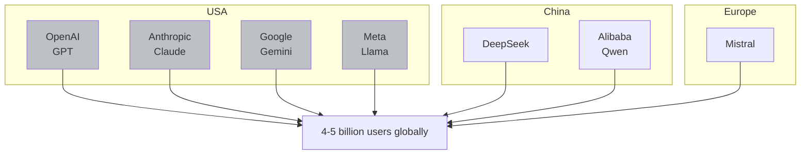
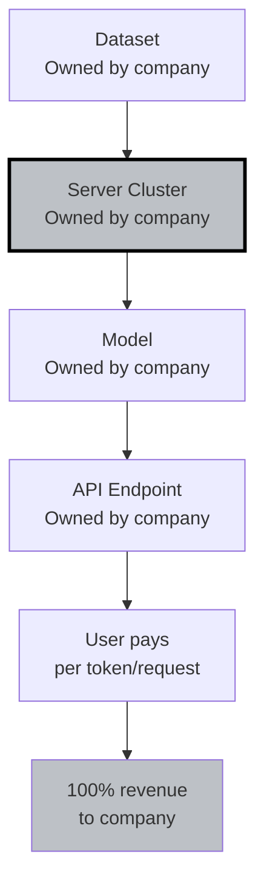
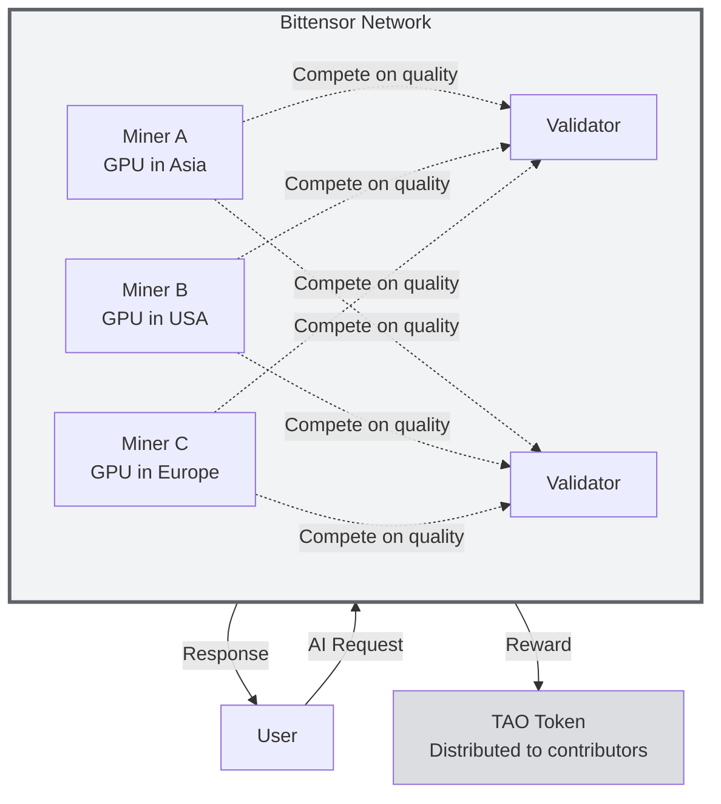

# AI vs Decentralized AI

:::info What You'll Learn
After reading this page, you will understand:
1. How **centralized** AI works today (OpenAI, Google, Anthropic, Meta)
2. The **real problems** that emerge from centralized models
3. What **Decentralized AI** is and how it addresses those problems
4. The **trade-offs**: this is not black and white
:::

> This page is the **bridge** into Bittensor. By the end you'll understand **"why Bittensor exists"** before we dig into **"how Bittensor works"**.

---

## The Big Picture: Who Controls AI Today?

As of 2026, global AI is dominated by a handful of "Big AI" players:



**Notable facts:**
- OpenAI alone is valued at >$150B (2025)
- Microsoft has invested >$13B in OpenAI
- GPT-4 training cost is estimated at >$100M
- One large model requires **thousands of H100 GPUs** at $30k+ per unit

**The result:** only **a handful of giant companies** can afford to train top-tier AI. You and I can only **be users**: pay API fees, use the features they allow.

---

## Centralized AI Architecture (Status Quo)



**What the company controls:**
- ✅ Training data (what the model learns)
- ✅ Model weights (changeable without notice)
- ✅ API access (can block countries, regions, users)
- ✅ Pricing (raised at will)
- ✅ Uptime (downtime = every dependent app goes down)
- ✅ Policy (what can and can't be asked)
- ✅ Your data (every prompt of yours can be reviewed by them)

---

## Real Problems With Centralized AI

### 1.  Single Point of Failure

:::danger Real Case
**November 2023**: OpenAI's board abruptly fired Sam Altman. The company nearly imploded. Thousands of startups built on top of the OpenAI API **panicked** because the future of their products was suddenly uncertain.

If OpenAI collapsed tomorrow, **50% of global GenAI use cases would be affected**. That is the single-point-of-failure problem.
:::

### 2.  Pricing Monopoly

- GPT-4 API: $30 per 1M input tokens
- Claude Sonnet: $3 per 1M input tokens
- You can't easily "switch vendors": every model has its own personality
- They double prices tomorrow? You're stuck

### 3.  Censorship & Geo-blocking

- OpenAI blocks access from China, Iran, Russia, etc.
- Models are trained with company "safety guidelines": certain topics return canned "I can't help with that" responses
- **Who decides what's "safe"?** The company, not the user.

### 4.  Data Privacy: You're Not the Customer, You're the Product

:::info An Uncomfortable Truth
Unless you pay an enterprise tier with a custom data processing agreement:
- Your prompts **may be used to train future versions**
- Company employees **may review prompts** for safety research
- Your data may be stored in servers in countries with different privacy laws
:::

### 5.  Opaque Model Behavior

- An update from one GPT-4 version to another can **drastically change outputs** without notice
- A startup whose prompt engineering was tuned for the old version: **suddenly broken**
- There's no "stable version" you can rely on indefinitely

### 6.  Wealth Concentration

The economic flow of global AI:

```
Users → Pay APIs → AI Companies → Profit for investors & founders
```

You (as a potential contributor: developer, data annotator, researcher) **don't get a share** of the value being created. Only "Big AI" wins.

---

## Decentralized AI: The Web3 Alternative

**Decentralized AI (DeAI)** = building AI infrastructure **without a single company in control**, using blockchains as the coordination layer.

### Decentralized AI Architecture (Bittensor)



**Key components:**
- **Miners**: contributors who provide AI services (run models, scrape data, etc.)
- **Validators**: evaluators who score miner quality
- **Subnets**: specific categories (inference, data, sports prediction, etc.)
- **TAO token**: economic incentive for contributors

---

## Direct Comparison: Centralized vs Decentralized AI

| Aspect | Centralized AI  | Decentralized AI  |
|--------|-------------------|---------------------|
| **Who trains the model?** | One company | Thousands of global miners |
| **Who owns the data?** | The company | Individual contributors |
| **Access** | Permissioned (can be banned) | Permissionless (open to anyone) |
| **Pricing** | Set by the company | Market-driven, competitive |
| **Censorship** | Yes (per company policy) | Minimal (at protocol level) |
| **Uptime** | 99.5% (but if down, everything is down) | 99.9%+ (global redundancy) |
| **Contribution model** | Just be a user | Be a miner and earn TAO |
| **Transparency** | Closed (model weights are secret) | Open (verifiable on-chain) |
| **Contributor rewards** | Salary (limited) | Token-based (global, permissionless) |
| **Innovation pace** | Top-down | Bottom-up, swarm-style |

---

## Trade-offs: Not Black and White

:::warning Be Realistic
Decentralized AI **is not a perfect solution**. There are trade-offs you need to understand:
:::

### ✅ Strengths of Decentralized AI
- Censorship-resistant
- Contributors can earn economic rewards
- Transparent and auditable
- No single point of failure
- Innovation can come from anyone

### ❌ Weaknesses of Decentralized AI (Current State)
- **Quality is not yet uniform**: a low-quality miner can produce a poor response
- **Higher latency**: routing and consensus add overhead
- **More complex UX**: users need to understand wallets, tokens, etc.
- **Frontier models still live in centralized labs**: GPT-5 / Claude still lead at the frontier
- **Regulation is unclear**: governments haven't decided how to regulate this yet

### Insight

**The two models will coexist.** A useful analogy:
- **AWS (centralized cloud)** still dominates enterprise
- **Cloudflare / Akamai (distributed CDNs)** dominate the edge and bandwidth layer

AI is similar: **centralized** will keep winning frontier research. **Decentralized** will win in domain-specific, cost-sensitive, and privacy-sensitive use cases.

**Bittensor's bet:** there's a massive market in the "long tail" of AI: sports prediction, specialized inference, niche datasets: that **will never be a priority for OpenAI**, but that a decentralized network with the right economic incentives can serve.

---

## Why Your Individual Choice Matters

As a developer in 2026, you have **three possible stances** toward AI:

### Stance 1: **Pure Consumer**
Use ChatGPT/Claude for work. Pay your subscription. Done.

- Pro: easy
- Con: 100% of the value stays with US/Chinese companies

### Stance 2: **Builder on Centralized Stack**
Build products on top of the OpenAI/Anthropic API.

- Pro: ship fast, best models available
- Con: thin margins (vendor takes a cut), dependency risk

### Stance 3: **Contributor on Decentralized Stack**
Become a Bittensor miner. Earn TAO. Contribute directly to the network.

- Pro: own a piece of the pie, uncapped upside
- Con: steeper learning curve, more setup effort upfront

**This Co-Learning Camp focuses on Stance 3.** We'll teach you from zero until you're an active miner earning your own TAO rewards.

---

## Summary

:::tip Key Takeaways
1. **Centralized AI** today = 5–7 giant companies control ~95% of global AI capacity
2. **The problems:** single point of failure, pricing monopoly, censorship, privacy, wealth concentration
3. **Decentralized AI** = a network with no boss, contributors get rewards, open and permissionless
4. **Trade-offs exist**: decentralized isn't as polished as centralized yet, but **niche-leading models** can already be decentralized
5. **Bittensor** is a big bet on long-tail AI with economic incentives via the TAO token
:::

### ✅ Quick Check

- Name 3 problems with AI that's fully controlled by a single company
- What's the difference between being a "user" of Centralized AI and being a "miner" on Decentralized AI?
- Why is decentralized AI a good fit for long-tail (niche) use cases?

---

**Next:** [What is Bittensor?](/TH1-Foundations-and-Introduction/what-is-bittensor)

*You understand the context now. Time to zoom in on the main player you'll be learning about: Bittensor.*
