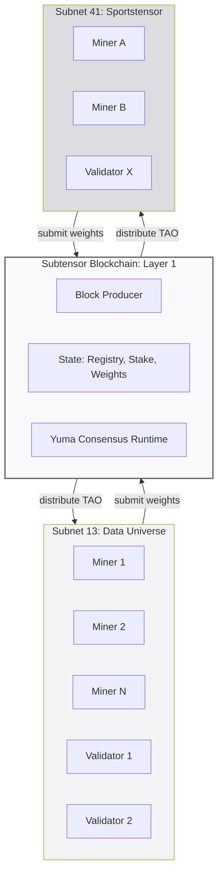
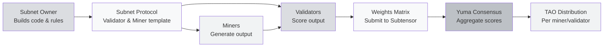
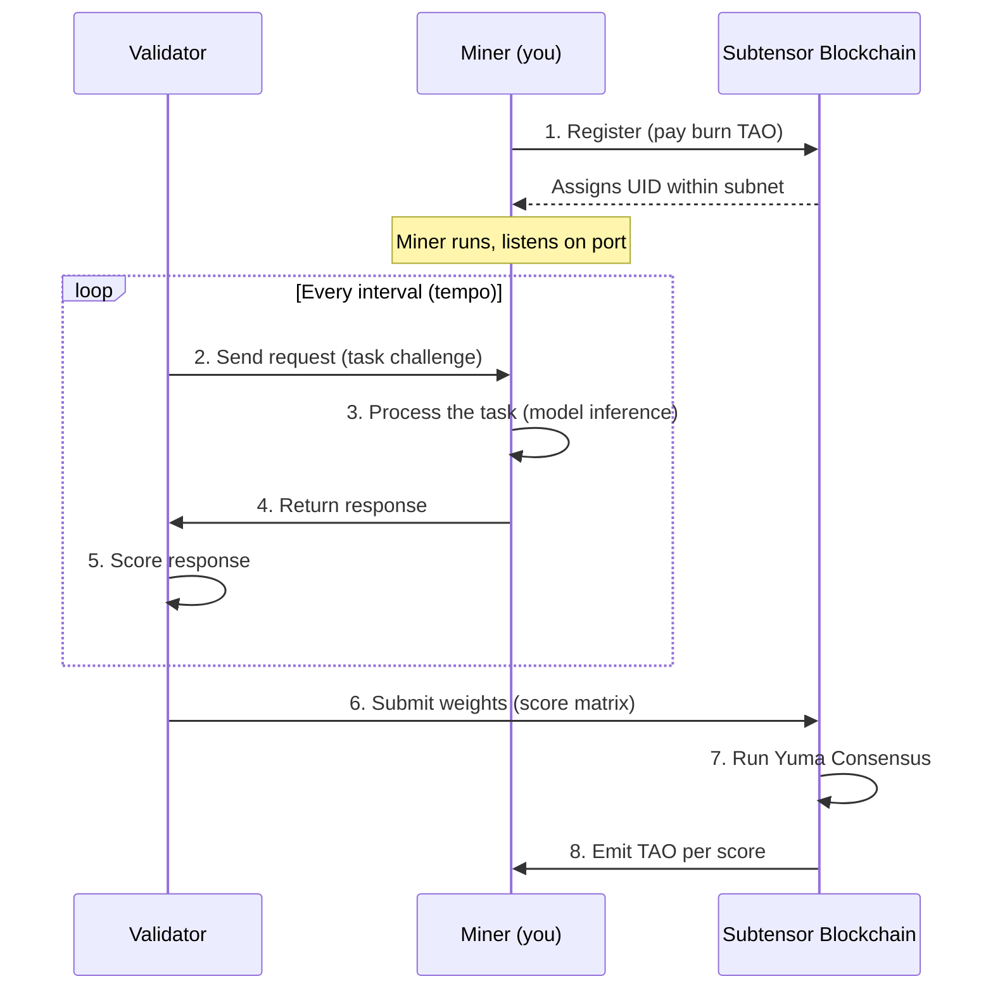
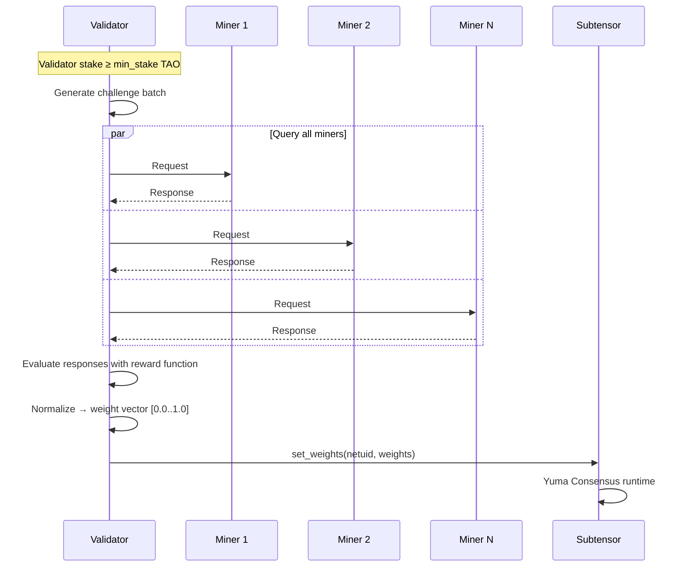
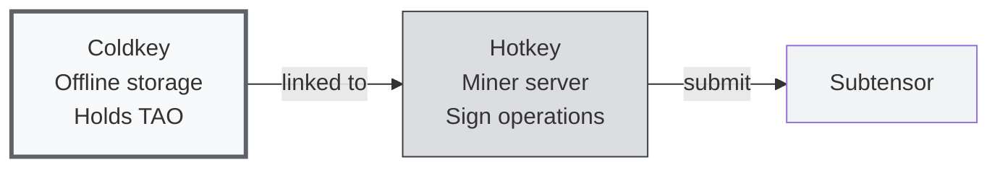

# Miners, Validators & Subnets

:::info What You'll Learn
After reading this page, you will understand:
1. **Subnet architecture**: what's inside, who the actors are, how data flows
2. **Miner vs validator roles**: the request-response and scoring flow
3. **Coldkey vs hotkey**: the key-separation security model you'll use everywhere
:::

> The previous pages explained **why** Bittensor exists. Now we'll dissect **who's who** inside it. This is the "roles & actors" page: grab a coffee and let's go.

---

## Big Picture: The Bittensor Components in One Diagram

Before going into details, get the big picture:



**What you should take away from this diagram:**

1. Underneath everything is **Subtensor**: the main blockchain. It's where state is stored, consensus runs, and TAO is emitted.
2. On top of Subtensor are the **subnets**. Each subnet has its own community of miners and validators.
3. Subnets **don't interact directly with each other**: each has a specific task. But they **all share Subtensor** as the source of truth.
4. The TAO flow: Subtensor emits TAO every block → distributes to subnets → distributes again to miners and validators within each subnet according to contribution.

---

## What Is a Subnet?

A **subnet** is a specialization unit in Bittensor. Each subnet is a community of miners + validators working on **one specific task** with a **customized reward mechanism**.

### Subnet Components



Let's break down each role:

### 1. Subnet Owner

The party (a person or team) who **deploys the subnet** to Subtensor and decides:

- **What task** the subnet performs (e.g., "scrape Twitter data", "predict sports outcomes")
- **The reward function**: how validators score miners
- **The protocol**: the request-response format between miners and validators
- **Parameters**: minimum stake, registration burn amount, etc.

The subnet owner gets **18% of the subnet's emission** as compensation for maintenance. Popular subnet → good revenue; quiet subnet → wasted effort.

### 2. Miner

A **worker** that runs the actual AI service. A miner:

- Runs a model/algorithm on their own server/GPU
- Listens for requests from validators
- Generates responses as fast and as high-quality as possible
- Earns **41% of the subnet's emission** if performing well

### 3. Validator

The **auditor** that judges miner quality. A validator:

- Stakes TAO (requires a minimum stake: typically 1,000+ TAO on mainnet)
- Sends challenges/requests to miners
- Scores responses according to the reward function
- Submits a **weight matrix** to Subtensor (numbers 0–1 per miner)
- Earns **41% of the subnet's emission** if their scoring is "consistent" with other validators

### 4. NetUID

Every subnet has a unique numeric ID. Examples:
- **NetUID 1**: Text Prompting (the first subnet)
- **NetUID 13**: Data Universe
- **NetUID 41**: Sportstensor
- **NetUID 64**: Chutes
- **NetUID 62**: Ridges

When you run btcli or write code, you always reference a subnet by its NetUID.

:::tip Simple Analogy: Subnet = Stall in a Marketplace
Imagine Bittensor as a **giant marketplace**. Each subnet is a **stall** with a different product. Stall 13 sells data. Stall 41 sells sports predictions. Stall 64 sells AI inference.

- **Subnet owner** = stall owner, sets the stall's rules (minimum prices, quality, etc.)
- **Miner** = vendor at the stall (brings products)
- **Validator** = market inspector (judges quality)
- **Subtensor** = market authority (issues "stall licenses" and collects "rent")
- **TAO** = the marketplace's common currency
:::

---

## Miner: The Full Flow

A miner has a repetitive but important lifecycle:



### Step-by-Step for a Miner

**1. Register on the subnet**: pay a "registration fee" in TAO that gets burned. The amount is dynamic (rises with competition). Once registered, you receive a **UID** (a unique number within the subnet, typically 0–255).

**2. Run the miner software**: usually a Python script that:
- Loads the model (e.g., LLM, classifier, scraper, etc.)
- Listens on the axon port (a TCP port for communication)
- Registers the axon IP with Subtensor so validators can connect

**3. Serve requests**: validators send requests every **tempo** (a block interval, typically ~72 minutes / 360 blocks). The miner processes and returns the response.

**4. Wait for rewards**: if validators rate you well (high weight), you get a share of the TAO emission each tempo.

### Example Miner Request-Response

For example, in a hypothetical Text Prompting subnet (a simplified example):

```python
# Miner pseudocode
def forward(synapse: TextPromptSynapse) -> TextPromptSynapse:
    prompt = synapse.prompt
    response = my_llm.generate(prompt, max_tokens=200)
    synapse.response = response
    return synapse
```

In Sportstensor (SN41):

```python
# Miner pseudocode
def forward(synapse: MatchPredictionSynapse) -> MatchPredictionSynapse:
    match_id = synapse.match_id
    # Fetch stats, run prediction model
    prediction = my_model.predict(match_id)
    synapse.prediction = prediction  # {home_win: 0.6, draw: 0.2, away_win: 0.2}
    return synapse
```

:::note The Technical Reality of Mining
As a miner, your job is **not just** running the script. What separates top miners from bottom miners is usually:
- **Model quality** (for ML-heavy subnets)
- **Latency** (validators time out fast: 5–10 seconds)
- **Uptime** (offline during a tempo = no reward)
- **Strategy** (knowing the validator challenge patterns and optimizing for the reward function)
:::

---

## Validator: The Full Flow

Validators have a different and heavier responsibility:



### Validator Responsibilities

1. **Stake TAO**: minimum stake varies per subnet but is typically ≥ 1,000 TAO (in the dTAO era, staking uses the alpha token)
2. **Query every miner** each tempo
3. **Score using the subnet's reward function** (defined by the subnet owner)
4. **Submit a weight vector** to Subtensor: an array of 0–1 numbers as long as the miner count
5. **Stay consistent with other validators**: if you score very differently, Yuma Consensus will "punish" you

### Reward Function: A Concrete Example

In Sportstensor (SN41), a simplified reward function looks like (simplified):

```
score_miner_i = accuracy_over_last_N_matches - latency_penalty
weight_miner_i = softmax(score_miner_i across all miners)
```

In other words: a miner whose predictions are **more accurate** over the last N matches and whose **response is faster** gets a higher weight.

In Data Universe (SN13):

```
score_miner_i = volume_data × freshness × uniqueness × validation_pass_rate
```

A miner who contributes **lots of fresh, unique data** (not duplicates) that passes validation gets a high score.

:::tip Why Do Validators Need a High Stake?
Because if a validator misbehaves (random weights, or colludes with miners), they can corrupt the reward distribution. A high stake is **skin in the game**: if their scoring deviates from consensus, their emission drops. An economic disincentive against bad behavior.
:::

---

## Coldkey vs Hotkey: Key Separation

This is an important concept you'll keep using in btcli:

| Key | Function | Example Use |
|-----|----------|-------------|
| **Coldkey** | Main wallet, holds TAO, signs important transactions | Transfer TAO, stake/unstake, delegate |
| **Hotkey** | Operational key, runs on the miner/validator server | Submit weights, serve axon, lightweight signing |

**Why separate them?**

The hotkey lives on an always-on server → higher risk of compromise. If your hotkey is leaked, an attacker **cannot drain your TAO**: they can only disrupt your miner operation. The TAO stays safe with the offline coldkey.



A single coldkey can have **many hotkeys**: e.g., you run 5 miners across 5 subnets, each miner using a different hotkey but the same coldkey (so rewards collect into one wallet).

---

## Summary

:::tip Key Takeaways
1. **Subnet** = specialization unit in Bittensor, owned by a subnet owner, run by miners and validators
2. **Miner** generates AI output; **validator** scores output; **subnet owner** builds the protocol
3. Every subnet is referenced by its **NetUID**
4. A **miner** registers, runs, serves requests, and earns TAO per tempo based on validator weights
5. A **validator** stakes TAO, queries every miner, scores with the reward function, and submits a weight vector
6. **Coldkey vs hotkey**: basic security hygiene; coldkey holds TAO, hotkey operates the miner
:::

### ✅ Quick Check

- Name the 4 main roles inside a subnet (besides the Subtensor blockchain)
- Why does a validator need to stake TAO before submitting weights?
- What's the difference between coldkey and hotkey, and why are they separate?

---

## Up Next

You now understand **who** does what inside a subnet. Next we look at **what the network itself looks like** — the metagraph, Subtensor, and overall topology.

**Next:** [Network Structure](/TH2-Tooling-and-Ecosystem/network-structure)

---

### Additional References

- [Bittensor Docs: Subnet Architecture](https://www.bittensor.com/docs/concepts/network)
- Foundations recap: [What is Bittensor?](/TH1-Foundations-and-Introduction/what-is-bittensor)
