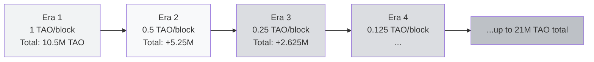
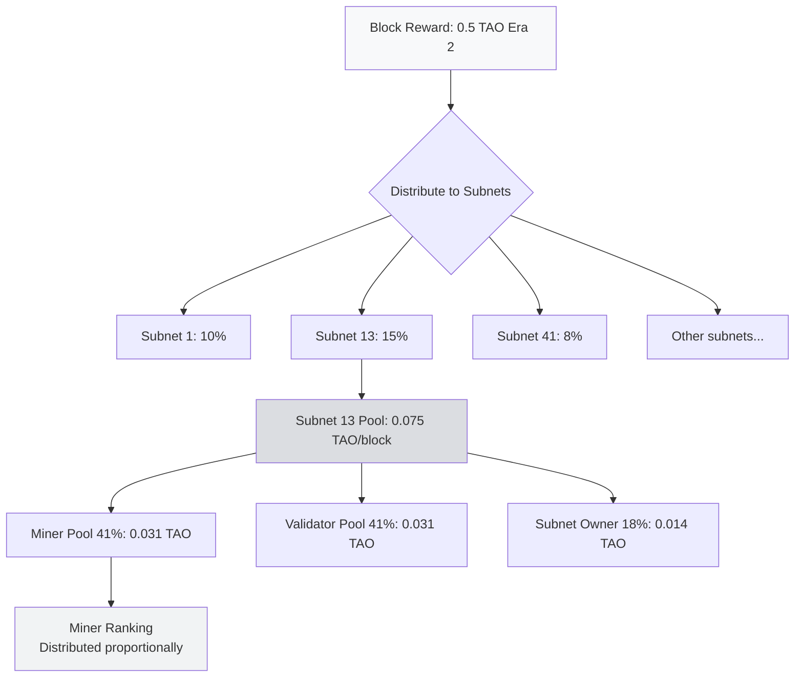

# TAO Tokenomics

:::info Goal
After reading this page, you will understand:
1. **TAO basic facts**: max supply, block time, emission per block
2. **The halving schedule**: how emission drops ~50% every ~4 years
3. **Emission flow**: how a block reward travels from the chain down to an individual miner
4. **The 41/41/18 split**: how each subnet's share is divided between miner, validator, and owner
:::

You need to understand **where TAO comes from, how much exists, and what makes its price move**.

### Basic Facts About TAO

| Fact | Value |
|------|-------|
| **Symbol** | TAO (τ) |
| **Max Supply** | **21,000,000** (21 million, similar to Bitcoin) |
| **Block Time** | ~12 seconds |
| **Emission per block (initial)** | 1 TAO (before halving) |
| **Blocks per halving** | 10,500,000 blocks (~4 years) |
| **Genesis** | 2021 (testnet), mainnet 2022 |
| **First Halving** | Expected ~2025–2026 (already occurred) |

:::note Bitcoin-like, But Different
Bittensor intentionally chose tokenomics similar to Bitcoin (21M cap + 4-year halving). The reason: **a proven scarcity model**. The key differences:

- Bitcoin: rewards miners for proof-of-work hashes
- Bittensor: rewards miners for proof-of-intelligence (AI output quality)

Plus there's a **subnet owner share** that Bitcoin doesn't have.
:::

---

### Halving Schedule: Visual

### Emission Schedule Table (Estimated)

| Era | Period | Emission/block | Total TAO Minted in This Era |
|-----|--------|----------------|------------------------------|
| **1** | 2021–2025 | 1.000 TAO | 10,500,000 |
| **2** | 2025–2029 | 0.500 TAO | 5,250,000 |
| **3** | 2029–2033 | 0.250 TAO | 2,625,000 |
| **4** | 2033–2037 | 0.125 TAO | 1,312,500 |
| **5+** | 2037–2140+ | ↓↓↓ | …up to 21M total |

**Implication:** if you're mining in 2026 (early Era 2), you're still in a period of **high emission**. After the next halving (2029), emission drops 50%: if the TAO price doesn't at least 2x, your income halves.

:::warning Practical Implications of Halving
A halving = half as much TAO minted → supply inflation drops. Typical effects:
- **Price pressure** (less new supply → price tends to rise)
- **Miner shakeout** (marginal miners go unprofitable → quit)
- **Tighter competition** (the remaining miners must be more efficient)

If you plan to mine long-term, **model** the halving scenarios.
:::

---

### Emission Flow: From Block to Miner

We covered 41/41/18 in the Bittensor architecture material, but let's combine it with halving:

**The key:** there are **two distribution levels**:
1. **Level 1 (root → subnet):** TAO per block is split across subnets. Before dTAO this was decided by root validator voting. After dTAO, it's proportional to the **alpha token price** (covered in [Dynamic TAO](./dynamic-tao)).
2. **Level 2 (subnet → miner/validator/owner):** 41/41/18, then split per neuron based on incentive/dividend.

---

## Recap: Tokenomics Cheatsheet

| Concept | Summary |
|---------|---------|
| **TAO max supply** | 21,000,000 |
| **Halving** | Every ~4 years (10.5M blocks) |
| **Era 2 emission** | 0.5 TAO/block (at the time of writing) |
| **Per-subnet split** | 41% miner / 41% validator / 18% owner |

### ✅ Quick Check

- What is the max supply of TAO, and how does it compare to Bitcoin?
- Roughly how often does a halving occur, and what happens to emission per block?
- In the per-subnet split, what fraction goes to the subnet owner?
- If you mine in early Era 2 and the next halving cuts emission in half, what must the TAO price do for your income to stay flat?
