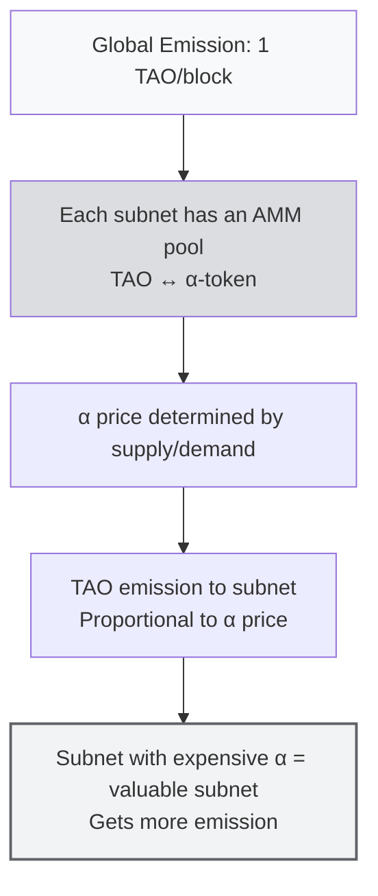

# Dynamic TAO

This is a revolutionary new mechanism (launched 2024). If you don't understand it, you'll be confused looking at subnet prices on Taostats.

### The Problem Before dTAO

Before 2024, emission allocation across subnets was decided by **root validators**: 64 elite validators with the largest stakes voting on which subnet gets how much.

**The problems:**
- Politics and lobbying of subnet owners to root validators
- Root validators could extract rent (asking for a subnet share in exchange for votes)
- Market inefficiency: genuinely valuable subnets could be underallocated if they lacked connections

### The Solution: dTAO + Alpha Tokens

In dTAO, every subnet has its own **alpha token** (called "alpha" or "α-token"), with the following mechanism:



### dTAO Key Concepts

| Concept | Explanation |
|---------|-------------|
| **α-token (alpha token)** | A per-subnet token. Subnet 13 has α₁₃, subnet 41 has α₄₁, etc. |
| **AMM pool** | Similar to Uniswap v2. Each subnet has a pool TAO ↔ α, with prices set by constant product (x × y = k) |
| **Alpha price** | The price of 1 α in TAO. The higher, the more the market "values" the subnet |
| **Proportional emission** | A subnet with a higher alpha price gets a larger share of emission |
| **Validators stake α, not TAO** | Validators now stake the subnet's alpha token, not TAO directly. Stake in α = "skin in the game" for that subnet |

### A Simple Analogy: dTAO = Subnet Stocks

:::tip Analogy
Imagine TAO as a **fiat currency**. Each subnet's alpha token is a **company share** on a stock exchange.
- Buying SN13 alpha = buying shares in the "company" Data Universe
- Alpha price up = the company is growing, more emission to the subnet
- Alpha price down = the subnet is less valued, emission decreases

And the subnet "pays dividends" (TAO emission) to alpha holders (validators) + workers (miners) + the subnet owner.
:::

### dTAO Pool Example

Suppose subnet SN41 (Sportstensor) has the pool:

```
Pool SN41:
  TAO reserve: 5,000
  α₄₁ reserve: 10,000
  Price α₄₁ = TAO / α = 5000 / 10000 = 0.5 TAO per α
```

Now someone stakes 500 TAO into SN41. The AMM kicks in:

```
New TAO reserve: 5,500
Using constant product (x × y = k):
  k = 5000 × 10000 = 50,000,000
  New α reserve = 50,000,000 / 5,500 = 9,090.9
  α received by user: 10,000 - 9,090.9 = 909.1 α₄₁
  New price: 5,500 / 9,090.9 = 0.605 TAO per α (up from 0.5)
```

In other words: staking 500 TAO drives the SN41 alpha price **from 0.5 to 0.605** (+21%). If many people stake into SN41 → α price rises → the subnet gets more emission in the next block.

:::warning Important Dynamics
This makes Bittensor **market-driven**. A subnet that's genuinely valuable will:
- Attract more stakers → alpha price rises → emission rises → miners and validators earn more → the subnet ecosystem grows
- A non-valuable subnet → alpha gets dumped → emission falls → miners quit → the subnet dies

This is healthy natural selection for the ecosystem.
:::

### dTAO Commands in btcli

```bash
# View alpha price across all subnets
btcli subnets list

# View pool details for a specific subnet
btcli subnets show 13

# Stake TAO into a subnet (receive alpha)
btcli stake add --netuid 13 --amount-tao 100 -w clc9

# Unstake (sell alpha, receive TAO)
btcli stake remove --netuid 13 --amount-alpha 50 -w clc9

# Move stake between subnets (swap alpha)
btcli stake move --origin-netuid 13 --dest-netuid 41 --amount-alpha 50 -w clc9
```

---

## Recap

| Concept | Summary |
|---------|---------|
| **dTAO** | Each subnet has an alpha token, with a TAO ↔ α AMM |
| **Alpha price drives emission** | A subnet with a higher α price gets more emission |
| **Staking in the dTAO era** | Stake using the subnet's α-token (not TAO directly) |

### ✅ Quick Check

- Name 3 differences between TAO before and after dTAO (2024).
- If subnet X's alpha price = 0.8 TAO/α and subnet Y's = 0.2 TAO/α, which subnet gets more emission? Why?
- In the dTAO era, what do validators stake — TAO or the subnet's alpha token?
