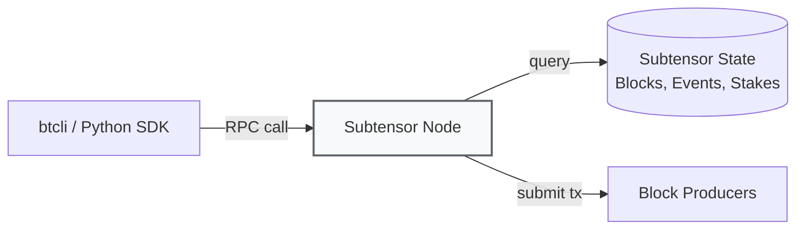

# Introduction to btcli

:::info Goal
After reading this page, you will understand:
1. **btcli**: what Bittensor's main command-line tool does (wallet, stake, transfer, overview)
2. **Subtensor**: what role it plays and why you'll typically use a public endpoint
3. **The essential command cheatsheet**: the btcli commands you'll reach for most
4. **The GUI alternative**: the Bittensor Chrome Extension wallet and the security hygiene around it
:::

:::note Hands-on installation lives in TH4
This page introduces btcli conceptually and serves as a command reference. The actual install-and-run steps (creating a venv, installing the SDK, creating wallets) are covered hands-on in **TH4 Wallets & Miner Setup**.
:::

---

## What Is btcli?

**btcli** = "Bittensor Command Line Interface". It's the main tool for:

- Creating and managing wallets (coldkey + hotkey)
- Transferring TAO
- Staking / unstaking TAO to validators
- Registering miners/validators on subnets
- Viewing the metagraph, overview, emission
- Voting / delegating (for governance)

Built on the Python SDK (`bittensor-cli`), so it's compatible with virtually all OSes (Linux, macOS, Windows WSL).

## Subtensor: What It Is and Why You Should Know

**Subtensor** = the main Bittensor blockchain, built on the **Substrate framework** (the same as Polkadot). It's where all state, transactions, and emissions are tracked.



**Three ways to access Subtensor:**

| Option | Pros | Cons | Best For |
|--------|------|------|----------|
| **Public endpoint** (`finney`) | Free, just use it | Rate-limited, shared globally | Beginners, testing |
| **Self-hosted Subtensor node** | Full control, no rate limit | Requires hardware + 500GB+ storage | Serious validators/miners |
| **Lite node (pruned)** | Lighter than a full node | No historical data | Middle ground |

Throughout this program we'll use the **public finney endpoint**.

---

## Important btcli Commands: Cheatsheet

These are the commands you'll use most. Memorize them or bookmark this section.

### Wallet Management

```bash
# Create a new coldkey
btcli wallet new_coldkey --wallet.name my_wallet

# Create a hotkey under that coldkey
btcli wallet new_hotkey --wallet.name my_wallet --wallet.hotkey miner1

# List all wallets on the system
btcli wallet list

# View wallet overview (balance, stake, subnet)
btcli wallet overview --wallet.name my_wallet

# Export (back up) the mnemonic
btcli wallet regen_coldkey --wallet.name backup_wallet
```

:::danger BACK UP YOUR MNEMONIC!
When you run `btcli wallet new_coldkey`, you'll be prompted with a **12/24-word mnemonic**. This is the **only way to recover** the wallet if it's lost.

**What you must do:**
- Write it on physical paper (don't put it in a cloud note!)
- Store it in 2 different locations
- **Don't screenshot it**
- **Don't share it with anyone**: not even HackQuest admins

If your mnemonic is leaked, your TAO can be drained in seconds.
:::

### Transfer & Stake

```bash
# Transfer TAO to another address
btcli wallet transfer --wallet.name my_wallet --dest 5CAh... --amount 10

# Stake TAO to a validator (delegated staking)
btcli stake add --wallet.name my_wallet --amount 50

# Unstake TAO
btcli stake remove --wallet.name my_wallet --amount 50

# View current stake
btcli stake show --wallet.name my_wallet
```

### Subnet Management

```bash
# List all active subnets
btcli subnet list

# View the metagraph for a specific subnet
btcli subnet metagraph --netuid 41

# Register a miner/validator on a subnet
btcli subnet register --netuid 41 --wallet.name my_wallet --wallet.hotkey miner1

# Check the current registration price
btcli subnet register --netuid 41 --wallet.name my_wallet --wallet.hotkey miner1 --dry-run
```

### Info & Monitoring

```bash
# Root overview: TAO total supply, emission rate
btcli root get_weights

# Subnet-specific emission and stake
btcli subnet show --netuid 13

# View delegations to a particular validator
btcli stake show --all
```

:::tip Practical Tip
Use `--help` at the end of any command to see the full options. Examples:

```bash
btcli wallet --help
btcli subnet register --help
```
:::

---

## GUI Alternative & Security

### Bittensor Chrome Extension Wallet

If you're more comfortable with a GUI wallet (similar to Metamask), Bittensor has an official Chrome Extension.

| Scenario | Recommendation |
|----------|----------------|
| Mining/validator operations | **btcli** (scriptable, server-friendly) |
| Light user, staking & transfers | **Extension** (GUI, user-friendly) |
| DApp interaction (future) | **Extension** (web3-compatible) |
| Production security | **Hardware wallet + btcli** (most secure) |

The Extension and btcli share the **same wallet format**. If you create a wallet in btcli, its mnemonic can be imported into the Extension (and vice versa). A good practice is to create your main coldkey in btcli and import it into the Extension just to **monitor balances** day-to-day.

:::warning Verify the Extension
Search "Bittensor Wallet" on the Chrome Web Store and confirm the official publisher (**Opentensor Foundation**). There are many fake extensions that steal mnemonics: check downloads and reviews before installing.
:::

### Security Hygiene

Because this involves real money, practice good hygiene from day one.

**Newbie level:**
- ✅ Mnemonic on physical paper, stored at home
- ✅ btcli password minimum 12 characters
- ✅ Don't use the same wallet across 5 different devices
- ❌ Don't share your mnemonic on Telegram/Discord (scammers impersonate admins; real admins will never ask)

**Serious level (once you start mining):**
- ✅ Separate the coldkey (offline storage) and hotkey (on the miner server)
- ✅ The hotkey on the server is OK to expose: if it leaks, the TAO in the coldkey stays safe
- ✅ Back up the mnemonic to 2 different physical locations
- ✅ Lock your laptop / enable FDE (full disk encryption)

**Pro level (significant capital):**
- ✅ Hardware wallet (Ledger or Trezor) for the main coldkey
- ✅ Multi-sig via the Subtensor multi-sig pallet (for teams)
- ✅ Dedicated server for the validator/miner (not your personal laptop)
- ✅ Uptime monitoring + alerting

:::danger Common Scams
- Telegram DM claiming to be a "HackQuest admin" asking for your mnemonic: SCAM
- Fake website "bittensor-claim.com" asking you to paste your mnemonic: SCAM
- Fake extensions in the Chrome Store (always verify the official publisher = Opentensor Foundation)
- "Airdrop TAO" YouTube videos: SCAM
:::

---

## Summary

:::tip Key Takeaways
1. **btcli** = the main Bittensor CLI, built on the `bittensor-cli` Python SDK
2. **Subtensor** = the Substrate-based chain; you'll use the public **finney** endpoint
3. **Cheatsheet**: wallet, stake, subnet, and info commands cover almost everything you'll do
4. **Chrome Extension**: GUI wallet for monitoring balances, optional but handy
5. **Security first**: mnemonic on paper, coldkey offline, never share with anyone
:::

### ✅ Quick Check

- What command creates a new coldkey in btcli? And a hotkey under it?
- What is the role of a Subtensor node, and which endpoint will you use throughout the program?
- What's the risk if your hotkey is leaked (compared to the coldkey/mnemonic being leaked)?
- How do you verify a Bittensor browser extension is legitimate before installing it?

---

### References

- [btcli Official Docs](https://docs.bittensor.com/btcli)
- [Taostats Explorer](https://taostats.io): real-time metagraph, alpha prices, emission
- [Bittensor Chrome Extension (Opentensor)](https://bittensor.com/wallet)
