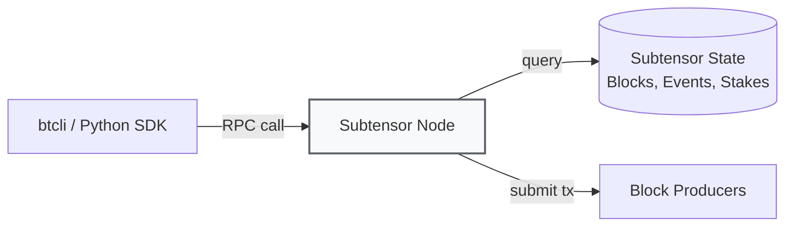

# Introduction to btcli

:::info Goal
After reading this page, you will understand:
1. **btcli**: what Bittensor's main command-line tool does (wallet, stake, transfer, overview)
2. **Subtensor**: what role it plays and why you'll typically use a public endpoint
3. **The essential command cheatsheet**: the btcli commands you'll reach for most
4. **The GUI alternative**: the Bittensor Chrome Extension wallet and the security hygiene around it
:::

:::note Hands-on installation lives in TH4
This page introduces btcli conceptually and serves as a command reference. The actual install-and-run steps (creating a venv, installing the SDK, creating wallets) are covered hands-on in **TH4 Wallets & Miner Setup**.
:::

---

## What Is btcli?

**btcli** = "Bittensor Command Line Interface". It's the main tool for:

- Creating and managing wallets (coldkey + hotkey)
- Transferring TAO
- Staking / unstaking TAO to validators
- Registering miners/validators on subnets
- Viewing the metagraph, overview, emission
- Voting / delegating (for governance)

Ships inside the `bittensor` Python package (v11 bundles SDK + wallet + CLI), so it works on virtually all OSes (Linux, macOS, Windows WSL).

## Subtensor: What It Is and Why You Should Know

**Subtensor** = the main Bittensor blockchain, built on the **Substrate framework** (the same as Polkadot). It's where all state, transactions, and emissions are tracked.



**Three ways to access Subtensor:**

| Option | Pros | Cons | Best For |
|--------|------|------|----------|
| **Public endpoint** (`finney`) | Free, just use it | Rate-limited, shared globally | Beginners, testing |
| **Self-hosted Subtensor node** | Full control, no rate limit | Requires hardware + 500GB+ storage | Serious validators/miners |
| **Lite node (pruned)** | Lighter than a full node | No historical data | Middle ground |

Throughout this program we'll use the **public finney endpoint**.

---

## Important btcli Commands: Cheatsheet

These are the commands you'll use most. Memorize them or bookmark this section.

:::note These are Bittensor 11 commands
btcli was rewritten for **v11** (July 2026). If you find older tutorials using
`-w` / `-n` or `btcli subnet` (singular), those are **v9 syntax and
no longer work**. The mapping:

| v9 | v11 |
|---|---|
| `--wallet.name` | `--wallet` / `-w` |
| `--wallet.hotkey` | `--wallet-hotkey` / `-H` |
| `--subtensor.network` | `--network` / `-n` |
| `--subtensor.chain_endpoint wss://…` | `-n ws://…` |
| `--amount` | `--amount-tao` (stake add) / `--amount-alpha` (unstake) |
| `--json-output` | `--json` |
| `btcli subnets …` | `btcli subnets …` |
| `wallet new_coldkey` | `wallet new-coldkey` (hyphens throughout) |
| `~/.bittensor/config.yml` | `~/.bittensor/btcli.json` |
:::

### Wallet Management

```bash
# Create a coldkey + hotkey in one go
btcli wallet create -w my_wallet -H miner1

# Or individually
btcli wallet new-coldkey -w my_wallet
btcli wallet new-hotkey -w my_wallet -H miner1

# List all wallets on the system
btcli wallet list

# View wallet overview (balance, stake, subnet)
btcli wallet overview -w my_wallet

# Free TAO balance only
btcli wallet balance my_wallet

# Restore a coldkey from its mnemonic
btcli wallet regen-coldkey -w backup_wallet
```

:::danger BACK UP YOUR MNEMONIC!
When you run `btcli wallet create`, you'll be shown a **mnemonic** (12 words by default; 15/18/21/24 also selectable). This is the **only way to recover** the wallet if it's lost — the wallet password only decrypts the local file.

**What you must do:**
- Write it on physical paper (don't put it in a cloud note!)
- Store it in 2 different locations
- **Don't screenshot it**
- **Don't share it with anyone**: not even HackQuest admins

If your mnemonic is leaked, your TAO can be drained in seconds.
:::

### Transfer & Stake

```bash
# Transfer TAO to another address
btcli wallet transfer -w my_wallet --dest 5CAh... --amount-tao 10

# Stake TAO onto a hotkey on a subnet
btcli stake add -w my_wallet --netuid 13 --hotkey 5Fxx... --amount-tao 50

# Unstake (alpha-denominated on dynamic subnets)
btcli stake remove -w my_wallet --netuid 13 --hotkey 5Fxx... --amount-alpha 50

# View current stake
btcli stake list -w my_wallet
```

:::warning Amounts are unit-explicit in v11
`Balance` is strict about units now. You stake **TAO in** (`--amount-tao`) and unstake
**alpha out** (`--amount-alpha`), because staking swaps TAO into the subnet's alpha token at the
pool price. Stake trades are also **slippage-protected by default** (5%) and MEV-shielded —
they'll fail with `SlippageTooHigh` rather than fill at a bad price.
:::

### Subnet Management

```bash
# List all active subnets
btcli subnets list

# View the metagraph for a specific subnet (netuid is positional)
btcli subnets metagraph 13

# Check the current registration burn cost BEFORE registering
btcli subnets burn-cost 13

# Preview a registration without submitting
btcli subnets register --netuid 13 -w my_wallet -H miner1 --dry-run

# Register a miner/validator on a subnet
btcli subnets register --netuid 13 -w my_wallet -H miner1
```

### Info & Monitoring

```bash
# Subnet-specific emission, tempo, burn and stake
btcli subnets show 13

# Every stake position across all your wallets
btcli stake list --all

# Raw chain reads (the generated query catalog)
btcli query subnet --netuid 13
btcli query uid --netuid 13 --hotkey-ss58 5Fxx...
```

### How Address Arguments Resolve

Any address option (`--dest`, `--hotkey`, `--coldkey`, and positional address arguments) accepts
three forms:

| Form | Example | Notes |
|---|---|---|
| Raw **ss58 address** | `5CAh...` | Always works |
| **Local name** | `my_wallet` or `my_wallet/miner1` | Hotkey options take `HOTKEY` or `WALLET/HOTKEY`; coldkey options take a wallet name. Address-book and proxy-book names resolve too |
| **Omitted** | — | `--hotkey` / `--coldkey` fall back to the configured wallet's own keys. **Destination-style options never default** |

```bash
btcli query hotkey-owner --hotkey my_coldkey/my_hotkey
btcli wallet balance my_coldkey
```

That last one is why `btcli wallet balance` takes the wallet name positionally rather than via `-w`.

### Signing & Verifying Messages

```bash
btcli wallet sign --message "hello" -w my_wallet              # coldkey signature (prompts for password)
btcli wallet sign --message "hello" --use-hotkey -w my_wallet # hotkey signature
btcli wallet verify --message "hello" --signature 0x... --ss58 5F...
```

Every transaction declares which key signs it: **staking and transfers are coldkey-signed**,
**weights and axon serving are hotkey-signed**.

:::tip Practical Tip
Use `--help` at the end of any command to see the full options. Examples:

```bash
btcli wallet --help
btcli subnets register --help
```

Two v11 conveniences worth knowing:
- `--dry-run` previews any mutation (fee + effects) without submitting it
- `btcli explain <ERROR_CODE>` gives a long-form explanation of any error you hit
:::

---

## GUI Alternative & Security

### Bittensor Chrome Extension Wallet

If you're more comfortable with a GUI wallet (similar to Metamask), Bittensor has an official Chrome Extension.

| Scenario | Recommendation |
|----------|----------------|
| Mining/validator operations | **btcli** (scriptable, server-friendly) |
| Light user, staking & transfers | **Extension** (GUI, user-friendly) |
| DApp interaction (future) | **Extension** (web3-compatible) |
| Production security | **Hardware wallet + btcli** (most secure) |

The Extension and btcli share the **same wallet format**. If you create a wallet in btcli, its mnemonic can be imported into the Extension (and vice versa). A good practice is to create your main coldkey in btcli and import it into the Extension just to **monitor balances** day-to-day.

:::warning Verify the Extension
Search "Bittensor Wallet" on the Chrome Web Store and confirm the official publisher (**Opentensor Foundation**). There are many fake extensions that steal mnemonics: check downloads and reviews before installing.
:::

### Security Hygiene

Because this involves real money, practice good hygiene from day one.

**Newbie level:**
- ✅ Mnemonic on physical paper, stored at home
- ✅ btcli password minimum 12 characters
- ✅ Don't use the same wallet across 5 different devices
- ❌ Don't share your mnemonic on Telegram/Discord (scammers impersonate admins; real admins will never ask)

**Serious level (once you start mining):**
- ✅ Separate the coldkey (offline storage) and hotkey (on the miner server)
- ✅ The hotkey on the server is OK to expose: if it leaks, the TAO in the coldkey stays safe
- ✅ Back up the mnemonic to 2 different physical locations
- ✅ Lock your laptop / enable FDE (full disk encryption)

**Pro level (significant capital):**
- ✅ Hardware signer for the main coldkey — a **Ledger** (via the Polkadot generic app) or **Polkadot Vault** (QR signing from a permanently offline phone)
- ✅ A **proxy** with narrow permissions (`Staking`, `Registration`, …) for routine work, so the primary coldkey stays cold
- ✅ Multi-sig via the Subtensor multi-sig pallet (for teams)
- ✅ Dedicated server for the validator/miner (not your personal laptop)
- ✅ Uptime monitoring + alerting

:::warning A hardware wallet is not a backup
It's a **signing device**. It will not export your seed phrase, and too many wrong PIN attempts
factory-resets it. Use one *in addition to* your written seed-phrase backups — never instead of them.
:::

:::danger Common Scams
- Telegram DM claiming to be a "HackQuest admin" asking for your mnemonic: SCAM
- Fake website "bittensor-claim.com" asking you to paste your mnemonic: SCAM
- Fake extensions in the Chrome Store (always verify the official publisher = Opentensor Foundation)
- "Airdrop TAO" YouTube videos: SCAM
:::

---

## Summary

:::tip Key Takeaways
1. **btcli** = the main Bittensor CLI, shipped inside the `bittensor` package since v11
2. **Subtensor** = the Substrate-based chain; you'll use the public **finney** endpoint
3. **Cheatsheet**: wallet, stake, subnet, and info commands cover almost everything you'll do
4. **Chrome Extension**: GUI wallet for monitoring balances, optional but handy
5. **Security first**: mnemonic on paper, coldkey offline, never share with anyone
:::

### ✅ Quick Check

- What command creates a new coldkey in btcli? And a hotkey under it?
- What is the role of a Subtensor node, and which endpoint will you use throughout the program?
- What's the risk if your hotkey is leaked (compared to the coldkey/mnemonic being leaked)?
- How do you verify a Bittensor browser extension is legitimate before installing it?

---

### References

- [btcli Official Docs](https://www.bittensor.com/docs/quickstart)
- [Taostats Explorer](https://taostats.io): real-time metagraph, alpha prices, emission
- [Bittensor Chrome Extension (Opentensor)](https://bittensor.com/wallet)
