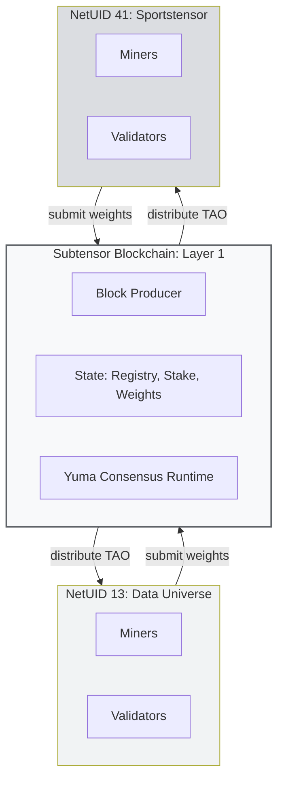
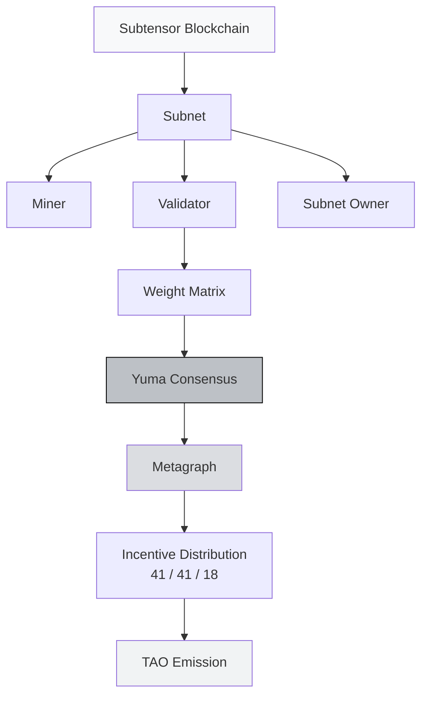

# Network Structure

:::info What You'll Learn
After reading this page, you will understand:
1. **The metagraph**: the network "snapshot" that becomes the ground truth for rewards
2. **Subtensor**: the blockchain that holds all subnet state
3. **NetUID and topology**: how subnets sit on top of one shared chain
:::

> You already know **who** the actors are (miners, validators, subnet owners). This page is about **what the network looks like** — the data structures and the chain that tie everything together.

---

## The Topology: Subnets on Top of Subtensor

Bittensor is one shared blockchain — **Subtensor** — with many **subnets** running on top of it. Each subnet is referenced by a unique **NetUID** (e.g., 13 for Data Universe, 41 for Sportstensor).



**Subtensor** is where state is stored, consensus runs, and TAO is emitted. Subnets don't talk to each other directly — they all share Subtensor as the single source of truth. Each subnet's live state is exposed through a structure called the **metagraph**.

---

## Metagraph: The Subnet State Snapshot

The **metagraph** is a complete representation of a subnet's state at a point in time. It is not a "live stream": it's a snapshot updated every tempo.

### What's in a Metagraph

| Field | Meaning | Example |
|-------|---------|---------|
| `uids` | Array of UIDs for miners/validators in the subnet | [0, 1, 2, ..., 255] |
| `stake` | TAO stake per UID | [1000, 500, 20, ...] |
| `weights` | Latest weight matrix (validator → miner) | [[0.1, 0.2, ...], ...] |
| `ranks` | Miner ranking score (output of Yuma Consensus) | [0.8, 0.5, 0.3, ...] |
| `trust` | Trust score per neuron | [0.9, 0.7, ...] |
| `incentive` | Miner incentive share (fraction of miner pool) | [0.4, 0.1, ...] |
| `dividends` | Validator dividend share (fraction of validator pool) | [0.3, 0.2, ...] |
| `emission` | TAO emission per neuron per block | [0.05, 0.02, ...] |
| `hotkeys` | Public key per UID | ["5C4h...", "5F3s...", ...] |
| `axons` | IP:port per miner (so validators can connect) | ["1.2.3.4:8091", ...] |

### How to Access the Metagraph

Using `btcli`:

```bash
btcli subnet metagraph --netuid 13
```

Or in Python:

```python
import bittensor as bt
metagraph = bt.metagraph(netuid=13)
print(metagraph.ranks)       # [0.8, 0.5, 0.3, ...]
print(metagraph.incentive)   # [0.4, 0.1, ...]
```

:::tip Metagraph = Ground Truth
If you're a miner and you're not sure whether your performance is good, **read the metagraph**. Check:
- `incentive[my_uid]`: your current reward share
- `trust[my_uid]`: how much validators trust you
- `emission[my_uid]`: your TAO per block

Most miner optimization decisions are made off metagraph data.
:::

---

## The Concept Map So Far



The metagraph is the hinge: validators write weights → Yuma Consensus aggregates → results land in the metagraph → emission follows. Next, we look at **how that emission is actually calculated**.

---

## Summary

:::tip Key Takeaways
1. **Subtensor** = the single Layer-1 blockchain that holds all subnet state and emits TAO
2. Subnets sit on top of Subtensor, each identified by a **NetUID**
3. The **metagraph** = a per-tempo subnet state snapshot (stake, weights, incentive, dividends, emission): the ground truth for rewards
4. You read the metagraph (via `btcli` or Python) to know exactly where you stand
:::

### ✅ Quick Check

- What's the difference between Subtensor and a subnet?
- Name three fields in the metagraph and what they tell you
- How would you check your incentive share as a miner?

---

## Up Next

You know what the network looks like. Next: **how the rewards are calculated** — Yuma Consensus and the 41/41/18 split.

**Next:** [Understanding Incentives](/TH2-Tooling-and-Ecosystem/understanding-incentives)

---

### Additional References

- [Metagraph Reference](https://docs.bittensor.com/reference/metagraph)
- [Bittensor Docs: Subnet Architecture](https://docs.bittensor.com/subnets/understanding-subnets)
