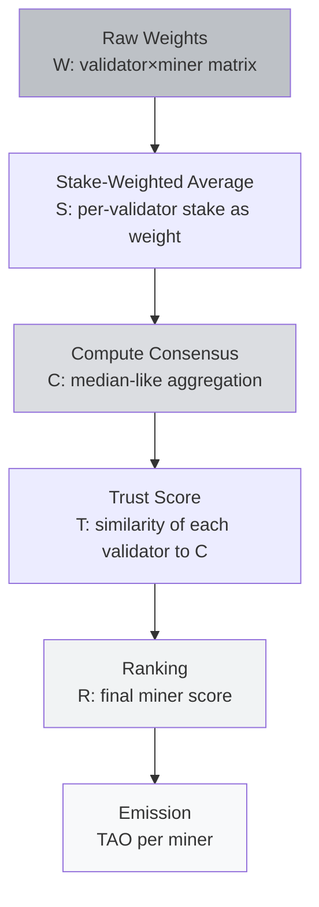
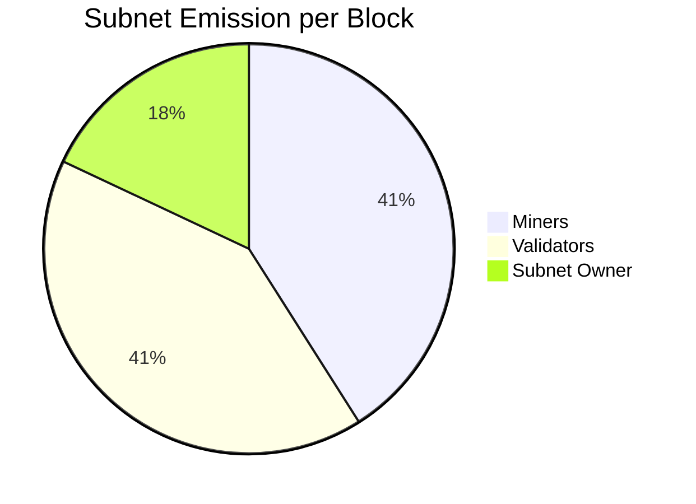

# Understanding Incentives

:::info What You'll Learn
After reading this page, you will understand:
1. **Yuma Consensus**: the validator-score aggregation algorithm (simplified math)
2. **The 41/41/18 incentive split**: who gets what, and why this ratio
3. **End-to-end reward calculation**: how a single miner's TAO is actually computed
:::

> You know what the network looks like (metagraph, Subtensor). This page is about the **economics** — how validator weights become real TAO in a miner's wallet.

---

## Yuma Consensus: The Heart of Bittensor

**Yuma Consensus** is the algorithm that aggregates all the validator weights into a single final reward distribution. This is Bittensor's core innovation.

### The Problem It Solves

Imagine you have 50 validators, each submitting a weight vector for 200 miners. You get a 50×200 matrix of numbers. The questions are:

- **Which validator's weights are more valid?** (The boss validator or a random one?)
- **What if one validator is malicious** and submits weird weights?
- **How do you aggregate fairly** without trusting any single validator?

### The Solution: Weighted Consensus + Trust Score

Yuma Consensus operates in several phases (simplified):



### Simplified Math

Suppose we have 3 validators (A, B, C) with stakes (10, 20, 30) TAO and 2 miners (X, Y). Their weight matrix:

| Validator | Stake | Weight X | Weight Y |
|-----------|-------|----------|----------|
| A         | 10    | 0.8      | 0.2      |
| B         | 20    | 0.7      | 0.3      |
| C         | 30    | 0.2      | 0.8      |

**Step 1: Stake-weighted average per miner:**

```
Miner X: (10×0.8 + 20×0.7 + 30×0.2) / 60 = (8 + 14 + 6) / 60 = 0.467
Miner Y: (10×0.2 + 20×0.3 + 30×0.8) / 60 = (2 + 6 + 24) / 60 = 0.533
```

**Step 2: Consensus C = [0.467, 0.533]**

**Step 3: Trust score per validator** (how close their weights are to consensus):

```
Trust_A = similarity([0.8, 0.2], [0.467, 0.533]) = low (far from consensus)
Trust_B = similarity([0.7, 0.3], [0.467, 0.533]) = medium
Trust_C = similarity([0.2, 0.8], [0.467, 0.533]) = high
```

**Step 4: Validators with high trust → higher validator-side emission.** Validator A, who is "out-of-consensus", gets a smaller emission (a disincentive against opposing the majority).

**Step 5: Miner Y (score 0.533) gets a larger emission share than Miner X (score 0.467).**

:::warning Why Isn't "Majority" a Tyranny of the Majority?
Valid question: what if 51% of validators collude to misscore? In theory, possible. In practice:

- **Minimum stake** means colluding validators need tens of thousands of TAO ($millions of dollars) of stake
- **Long-term reputation**: consistently good validators earn the trust of delegators and accumulate more delegated stake
- **Transparent reward function**: random scoring is easy for the community to detect
- **Fork resistance**: the community can fork if there's a serious attack

The trade-off is similar to Bitcoin: a 51% attack is theoretically possible but very expensive in practice.
:::

---

## Incentive Distribution: The 41 / 41 / 18 Ratio

Each subnet has an "emission pool" per block. That pool is divided among three parties:



### Why 41 / 41 / 18?

A design choice from Yuma Rao + community iteration:

- **41% miners**: they produce real output (the product)
- **41% validators**: they enforce quality (gatekeepers)
- **18% subnet owner**: they build and maintain the protocol (infrastructure)

If any one side is over-rewarded, the system collapses:
- Miners at 90%, validators quit → quality drops
- Validators at 90%, miners quit → no work gets done
- Owner at 50%, miners and validators protest

41/41/18 is an empirically stable equilibrium.

### Concrete Numbers

Assume:
- Subnet emission per block = **1 TAO** (a realistic number for a medium-sized subnet)
- 1 block = 12 seconds
- 1 tempo = 360 blocks = 72 minutes

**Per tempo, the subnet emits 360 TAO**, divided as:

| Party | Share | Per Tempo | Per Day (20 tempos) |
|-------|-------|-----------|---------------------|
| **Miner pool** | 41% | 147.6 TAO | 2,952 TAO |
| **Validator pool** | 41% | 147.6 TAO | 2,952 TAO |
| **Subnet owner** | 18% | 64.8 TAO | 1,296 TAO |
| **Total** | 100% | 360 TAO | 7,200 TAO |

The 147.6 TAO miner pool is then split among **all active miners** (e.g., 128 miners) **proportional to incentive[uid]**. So if miner UID 5 has `incentive = 0.1`, they receive:

```
emission_miner_5 = 147.6 × 0.1 = 14.76 TAO per tempo
                = 14.76 × 20 = 295.2 TAO per day
```

If TAO is at $300, that's roughly **$88,560/day**. If TAO is at $50, it's $14,760/day. That's why the TAO price matters enormously for miner ROI.

:::warning Economic Reality
The example above is a best case: a top miner on a popular subnet. The reality:
- Most miners get incentive < 0.01 (the bottom 80% collectively)
- Top 3 miners can dominate with incentive > 0.3
- If you're a new miner, **expect losses** for several tempos until your strategy matures

From a subnet owner's perspective: if the subnet is quiet (low total validator stake), the emission to your subnet is also small. There's a dynamic allocation based on demand (via dTAO, covered in the Tokenomics material).
:::

---

## An End-to-End Example Calculation

Let's combine all the concepts into one concrete scenario.

**Setup:**
- You're a miner on SN41 (Sportstensor)
- Your UID = 17
- 128 active miners, 24 active validators
- Subnet emission per block = 0.8 TAO

**Tempo #100:**

1. All 24 validators query UID 17. You return match predictions.
2. Your average accuracy over the last 20 matches = 62% (above the 55% average).
3. 20 of 24 validators give UID 17 a high weight (say, 0.05 average).
4. 4 validators give it a low weight (maybe disconnected, maybe a different scoring).
5. Stake-weighted average weight for UID 17 = 0.042.
6. This is fed into Yuma Consensus → rank UID 17 = 0.042.
7. Normalize across all miners → **incentive[17] = 0.08**.

**Your emission this tempo:**

```
miner_pool = 0.8 TAO/block × 360 blocks × 41% = 118.08 TAO
emission_17 = 118.08 × 0.08 = 9.45 TAO per tempo
```

Per day (20 tempos): **189 TAO**. If TAO = $200, that's **$37,800/day**.

(Again: this example is for a top-tier miner. The realistic median miner is far below this.)

---

## Summary

:::tip Key Takeaways
1. **Yuma Consensus** aggregates validator weights into a final ranking: out-of-consensus validators are punished via the trust score
2. **Incentive split 41/41/18**: miner, validator, subnet owner: an empirically stable equilibrium
3. Real reward depends on: **incentive fraction × pool size × TAO price**: every variable matters and needs to be optimized
4. A top-tier miner on a busy subnet can earn well; the **median miner earns far less** — strategy is everything
:::

### ✅ Quick Check

- Briefly describe the Yuma Consensus pipeline: raw weights → emission
- Why is the split 41/41/18 and not, say, 90/5/5?
- Walk through how a miner's per-tempo TAO is computed from `incentive[uid]`

---

## Up Next

You now understand Bittensor's economics end to end. Next we move into **practical tooling and tokenomics** for interacting with the network.

**Next:** [Tooling & Tokenomics](/TH2-Tooling-and-Ecosystem/tao-tokenomics)

*Up next: install btcli, create a wallet, get to know TAO tokenomics in full (halving, max supply 21M), dTAO + alpha tokens, and the Chrome Extension wallet.*

---

### Additional References

- [Yuma Consensus Deep Dive (Opentensor Blog)](https://blog.opentensor.ai/)
- [Bittensor Docs: Subnet Architecture](https://docs.bittensor.com/subnets/understanding-subnets)
