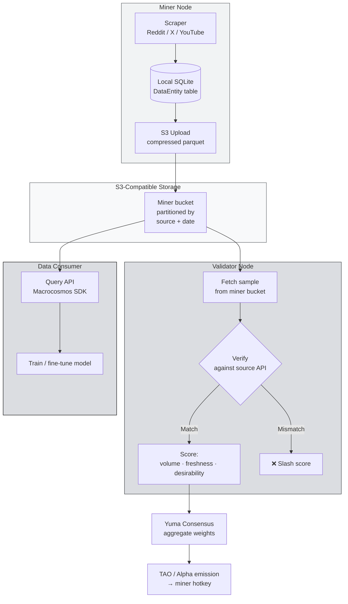

# SN13: Data Universe

Now that you know what a subnet is, let's look at one that provides AI's **fuel**: **data**. Welcome to **Data Universe: NetUID 13**.

If the AI industry has the saying "data is the new oil", then SN13 is **Bittensor's oil refinery**: the subnet that scrapes, cleans, and provides fresh datasets for anyone who needs to train or fine-tune a model.

:::info What You'll Learn
By the end of this page you will be able to:
- Explain the **mission of SN13** and why "data provision" is the most strategic subnet in Bittensor
- Understand the **data sources** miners scrape (Reddit, X/Twitter, YouTube transcripts)
- Understand the **storage architecture**: why S3-compatible and how validators verify
- Understand the principles of **Data Universe scoring**: what factors lead to miner rewards
- See why **SN13 is the best choice for beginner miners**: and the subnet you'll build a miner for in the hands-on Townhall sessions
:::

---

## Why Is "Data" Gold in AI?

Modern AI is built on three pillars: **compute, algorithms, data**. Of those three, **data is the hardest to scale**.

- **Compute** → buy more GPUs, problem solved (if you have the capital).
- **Algorithms** → published on arXiv for free, anyone can use them.
- **High-quality data** → this is what's **scarce**. Internet training data is not infinite, and the good kind (human-written, recent, non-synthetic) is becoming rarer.

When OpenAI / Google / Anthropic need fresh data, they:
1. Pay scraping companies (Common Crawl, or private vendors).
2. Cut deals with platforms directly (Reddit ~$60M deal with Google, an X deal with xAI).
3. Build internal scraper armies.

The problem:
- **Exclusive deals** turn data into a moat for the giants: small AI startups can't access it on equal terms.
- **Static data goes stale fast**: trends change every month; last year's dataset is already out-of-distribution.
- **Labeled / contextualized data** (not raw HTML) requires complex pipelines.

SN13 solves this by **decentralizing the scraping work** to thousands of miners worldwide.

:::note Simple Analogy
Imagine a **paid Wikipedia**. On Wikipedia people contribute voluntarily to fill in articles. On SN13, miners "contribute" data from Reddit / X / YouTube: but they're **paid in TAO** proportional to the **quality and freshness** of their data. More scalable, more economically reliable.
:::

---

## What Is Data Universe / SN13?

> **Data Universe (NetUID 13)**, run by the **Macrocosmos** team, is the Bittensor subnet whose mission is to **collect, validate, and serve high-quality training data**: primarily from social and video platforms whose content is human-generated in real time.

The output: **open datasets** that can be used for:
- **Fine-tuning LLMs** with current conversational data
- **Training sentiment analysis models** for finance / marketing
- **Large-scale social science research**
- **Product intelligence** (what people are saying about product X)

---

## Data Sources Being Scraped

Data Universe focuses on data sources that are **high-signal** and **fresh**. The three main sources today:

### 1. Reddit
Subreddit-based scraping. Reddit is a source of **long, structured discussions** (different from X's short snippets). Miners pull:
- Posts (title + body + subreddit metadata)
- Comments (discussion trees)
- Timestamps (to measure freshness)

### 2. X (Twitter)
Microblogging, the fastest source of real-time signal (news, drama, memes). Miners pull:
- Tweet text + metadata (author, timestamp, engagement)
- Tagged hashtags
- Reply threads

### 3. YouTube Transcripts
Video captions / auto-generated transcripts. These are gold for model training because:
- "Spoken language" is different from "written language"
- Long-form content (podcasts, lectures, tutorials) provides extended context
- Multilingual

:::tip The Subnet Evolves
The data source list can change. The Macrocosmos team adds / retires sources based on downstream buyer priorities. Check the **macrocosm-os/data-universe** repo for the actual list when you join.
:::

---

## SN13 Architecture: From Scrape to Reward



This flow runs **continuously**. Miners scrape 24/7, validators audit samples each epoch, consumers query the data via the Macrocosmos API.

---

## Why S3-Compatible Storage?

This is one of the smartest design decisions in SN13: and it often comes up as a beginner question.

**The problem:** scraped data can be gigabytes per miner per day. If it were stored on-chain (Bittensor Subtensor), the blockchain would explode within a week.

**SN13's solution:** data is stored **off-chain** in an **S3-compatible bucket** owned by each miner. What's on-chain is just:
- A commitment (hash) to the bucket's contents
- Limited metadata (index, source breakdown)
- Validator scoring weights

**Why "S3-compatible" instead of just S3?**

Because the S3 standard is supported by many providers:
- **AWS S3** (the original, most expensive)
- **Cloudflare R2** (no egress fees: popular among miners)
- **Backblaze B2** (cheapest for cold storage)
- **Wasabi, DigitalOcean Spaces**, etc.

Miners are free to choose any provider as long as the **endpoint is S3 API-compatible**. This dramatically lowers the cost barrier to entry.

:::tip Popular Choice for Beginner Miners
The SN13 community often recommends **Cloudflare R2** because:
- Free tier of 10GB storage + 1M Class A operations/month
- **No egress fees**: validators can fetch from your bucket without you incurring bandwidth charges
- Easy setup (similar to AWS S3 API)
:::

---

## What Do SN13 Miners Do?

Concretely, an SN13 miner's job:

1. **Scrape data** from the source the subnet selected (Reddit / X / YouTube).
2. **Save locally** in SQLite using the `DataEntity` schema (content, source, timestamp, label).
3. **Upload batches** to the S3 bucket periodically (typically every 2–4 hours).
4. **Expose an index** at a local HTTP endpoint so validators can query "what do you have?"
5. **Commit the bucket hash** on-chain every epoch.

:::info Beginner-Friendly Advantages
No GPU needed. No model inference. Minimal hardware:
- **Cheap VPS** (Contabo, Hetzner: €5–15/month)
- **Cloud storage** (R2 / B2: $5–20/month depending on volume)
- **Moderate bandwidth** (scraping + upload)
- **Basic Python skills**

Total entry cost can be **under $30/month**, much cheaper than Chutes (covered under Other Notable Subnets).
:::

---

## How Does the Scoring Work?

This is the part that determines **how much TAO you earn**. SN13 scoring is built on three main dimensions:

### 1. Volume (How Much Data)
The more valid data you supply, the higher the base score. But **not linear**: there are diminishing returns.

### 2. Freshness
Recent data (e.g., today's tweets) is worth **much more** than old data (tweets from 3 years ago). Why? Because downstream consumers (AI trainers) need current data more. The subnet actively **decays** the value of older data.

### 3. Desirability
The subnet has **dynamic label preferences**: some topics / subreddits / keywords are more "desirable" than others. Examples: `r/wallstreetbets` during earnings season, or tweets containing AI keywords during a big model release. Miners scraping desirable labels get a multiplier.

The simplified formula:

```
score_miner ≈ Σ ( volume_i × freshness_weight(i) × desirability_weight(label_i) )
```

Validators compute this each epoch, then set weights on-chain.

:::warning Duplicate & Fake Data
Validators actively detect:
- **Duplication**: identical data across miners only counts for one of them.
- **Fake data**: validators randomly sample and **verify against the source's actual API**. If it doesn't match → heavy penalty.

Don't try to generate synthetic data or copy from other miners. Validators will catch it.
:::

---

## Who Buys the Data?

Important question: **the data being scraped: who needs it?**

A few monetization paths in the SN13 ecosystem:

1. **Internal Bittensor subnets**: other subnets (e.g., model training subnets) buy data from SN13 to fine-tune their models.
2. **External AI labs**: researchers / AI startups outside Bittensor need fresh labeled datasets and pay Macrocosmos for API access.
3. **Macrocosmos productization**: the team builds derivative products (analytics dashboards, sentiment feeds for traders) on top of SN13 data.

This revenue indirectly maintains "demand" for SN13's TAO emission: more buyers, more valid subnet economics.

---

## Miner Economics: Realistic Expectations

### Typical Costs (per month)

| Component | Range |
|---|---|
| VPS (2 vCPU, 4GB RAM): Contabo/Hetzner | $5–15 |
| Cloudflare R2 storage (50–200 GB) | $0.75–3 |
| Reddit/X API credentials or proxy | $0–30 (depending on strategy) |
| SN13 registration fee (one-time) | Variable in TAO: check Taostats |
| **Total OpEx** | **~$10–50/month** |

### Revenue Potential (Qualitative)

Daily miner reward on SN13 depends on:
- Your score rank among hundreds of other miners
- TAO emission to subnet 13 (dynamic TAO)
- TAO market price

**Realistic expectation** for a new miner with an OK setup but no tuning yet:
- The first week is often below break-even (still building volume and learning).
- After tuning (picking desirable labels, stabilizing uptime): **realistic for small-to-medium TAO profit**, depending on market price.
- Top-tier miners with sophisticated scraping strategies: can be significant: but they're also the most competitive.

:::note Don't Trust Precise Numbers
You'll see "earning $XXX/day" screenshots on Twitter. Those are usually **cherry-picked** on a TAO pump day. Your budget planning should assume **flat / declining TAO price** so you're not surprised when the market is bad.
:::

---

## SN13 Mining Is for You If...

The ideal SN13 miner profile: and this is **most participants in this camp**:

- ✅ **Limited mining budget** ($10–50/month works): no expensive GPU needed.
- ✅ **Intermediate Python developer**: can read repos, tweak config files, debug exceptions.
- ✅ **Familiar with basic Linux**: ssh, tmux/screen, systemd, `tail -f`.
- ✅ **Patient with tuning**: this subnet is about **optimization**, not brute-force compute.
- ✅ **Wants to start with their first miner**: gentlest learning curve in Bittensor.

❌ **Not a good fit if** you're looking for "passive income with no effort": the scoring is dynamic, you'll need to adjust strategy over time.

---

## Where SN13 Fits in This Curriculum

This is one of the subnets whose miner we'll deploy in the hands-on Townhall sessions.

The **Data Universe (SN13) hands-on track** will walk you step-by-step through:
1. SN13 introduction & environment setup
2. Deploying the miner software
3. Configuring the scraping strategy
4. Tuning to optimize rewards
5. S3 storage configuration & upload flow
6. The interaction layer (testing the query API)

All the concepts here: **freshness, desirability, S3 buckets, commitment hashes**: you'll execute with your own hands during the hands-on setup. Make sure you understand them at the conceptual level now.

:::tip SN13 Is the Camp's Hands-On Subnet
SN13 is the subnet you'll actually build and run a miner on in TH4 and TH5. It's the most
beginner-friendly data subnet, it runs on a modest VPS, and — importantly — its codebase is
actively maintained. The next page surveys other notable subnets for context.
:::

---

## Summary

What you should remember from this page:

1. **SN13 = Data Universe**: provides **fresh training data** from Reddit, X, and YouTube to the AI ecosystem.
2. **Data is stored off-chain in S3-compatible buckets** owned by the miner. Only the hash commitment & scoring is on-chain.
3. **Scoring = volume × freshness × desirability**: not just "more data wins", but **relevance**.
4. **Duplicate & fake data are punished**: validators randomly verify against the source's actual API.
5. **Lowest barrier of entry** in Bittensor: a VPS + cloud storage is enough; no GPU needed.
6. **This is one of the subnets you'll deploy hands-on**: the concepts here translate directly.

### ✅ Quick Check

Before moving on, make sure you can answer:

1. Why is SN13 data stored in the miner's S3 bucket, not on-chain?
2. The three SN13 scoring dimensions are... (name them all).
3. Why is "old data" valued lower than "fresh data": what's the economic reason?
4. Cloudflare R2 is popular among SN13 miners due to one specific feature: what is it?
5. What happens if two miners upload exactly the same data?

All answered → continue. If you're shaky on the scoring formula, re-read the **How Does the Scoring Work** section.

---

### Further Reading

- [Macrocosmos: Data Universe](https://macrocosmos.ai): the team running SN13
- [SN13 Repo (macrocosm-os/data-universe)](https://github.com/macrocosm-os/data-universe): miner/validator source code
- [Taostats: SN13](https://taostats.io/subnets/13): real-time emission & ranking
- [Cloudflare R2](https://www.cloudflare.com/developer-platform/r2/): popular storage choice
- **Introduction to SN13** (the hands-on deep dive)

---

**Next:** [Other Notable Subnets → Chutes & Ridges](/TH3-Core-Subnets-and-Opportunities/other-notable-subnets)
