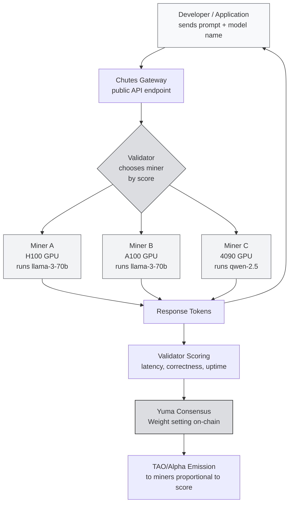
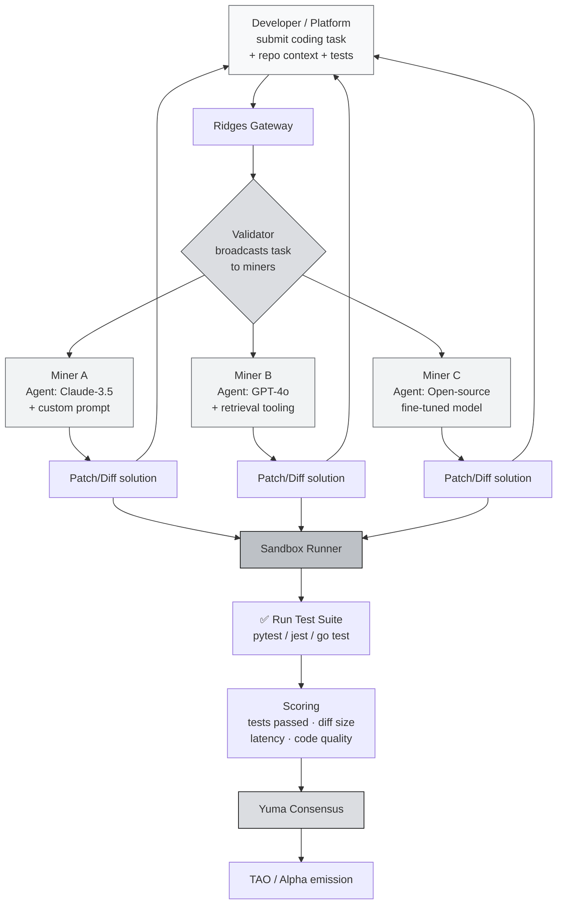

# Other Notable Subnets

You now understand the subnet you'll actually build a miner for: **SN13 (data)**. But Bittensor is far larger than that. This page covers two more high-signal subnets worth knowing: **Chutes** (decentralized inference) and **Ridges** (code intelligence): then points you to the wider landscape of 100+ subnets.

:::info What You'll Learn
By the end of this page you will be able to:
- Explain **decentralized inference** (Chutes) and how it differs from calling the OpenAI API
- Explain **decentralized code intelligence** (Ridges) and how it differs from Devin / Cursor / Copilot
- Describe what **miners and validators** do on each
- Compare both against their centralized counterparts
- Know where to go to explore the rest of the 100+ subnet ecosystem
:::

---

# Chutes: Decentralized Inference Infrastructure

**Chutes** is one of the most "visible" subnets in terms of immediate value, because it directly addresses a developer's daily need: **LLM inference**.

## Quick Recap: Why Is Inference Expensive?

If you've ever used ChatGPT, Claude, or Gemini: those all run on **massive data centers** owned by OpenAI / Anthropic / Google. Every prompt you send:

1. Goes into their servers.
2. Gets processed by a GPU cluster (typically H100 / A100).
3. The model generates response tokens.
4. You pay per-token (or they take a loss and subsidize you).

There are three classic problems:

- **Expensive.** GPT-4-class models can be $10–30 per million output tokens. For high-volume products, inference cost can exceed revenue.
- **Censorable.** They can ban your account, block a country, or refuse certain topics. If you're building a finance / medical / controversial product: high risk.
- **Opaque.** You don't know exactly which model is serving you, whether it's logged, or whether it's used for training.

Chutes was created to **decouple** inference from all three.

---

## What Is Chutes?

> **Chutes** is the Bittensor subnet that **provides decentralized inference**: meaning anyone with a GPU can become a miner that serves LLM requests (text generation, embeddings, vision models, etc.) from developers and applications around the world.

Think of Chutes as **Uber for GPU inference**:

- **Users (developers / applications)** send a prompt + pick a model (e.g. `llama-3-70b` or `qwen-2.5-coder`).
- **Miners** with idle GPUs pick up the request, run the model, and return the result.
- **Validators** make sure miners are honest: output is valid, latency is reasonable, quality is sufficient.
- **The network** pays miners in TAO/alpha proportional to their contribution.

:::note Simple Analogy
Imagine a **global GPU café**. Internet cafés used to exist because not everyone could afford a gaming PC. Chutes is **a café for inference**: developers without H100 GPUs can "rent" one from miners who have them: but without trusting any single central company, because validators ensure quality.
:::

---

## Chutes Architecture: End-to-End Flow



This flow happens **every second** in the Chutes subnet.

---

## What Do Chutes Miners Do?

A Chutes miner is a **GPU operator** running the model the subnet is asking for. Concretely:

1. **Pick a model to serve.** The subnet typically has an "allowlist" of models (e.g. `llama-3.1-70b-instruct`, `qwen-2.5-coder-32b`, several vision / embedding models).
2. **Set up the inference infrastructure.** Most miners use `vLLM`, `TGI`, or `SGLang` as the inference engine. These are frameworks that optimize GPU throughput (continuous batching, PagedAttention, etc.).
3. **Register on the subnet.** Pay the registration fee (in TAO/alpha) so your hotkey is registered as a neuron under the Chutes NetUID.
4. **Listen for validator requests.** Your miner software opens an endpoint that validators query.
5. **Respond with model output.** Send back the token stream as fast as possible.
6. **Repeat ~24/7.** The more requests you handle with good quality and latency, the higher your score.

:::tip Hardware Requirements (indicative)
To efficiently serve a 70B model (Llama-3-70b), you'll typically need at minimum:
- **2× A100 80GB** or **1× H100 80GB** for fp16
- Or **1× A100 80GB** with quantization (AWQ/GPTQ 4-bit)

For 7B–13B models, an **RTX 4090 24GB** is enough. But rewards are clearly lower because demand for smaller models is also lower and competition is high.
:::

---

## What Do Chutes Validators Do?

Validators don't process user prompts directly. Their job: **measure miner performance** so TAO emission flows to the highest contributors.

A Chutes validator typically:

- **Synthetic queries**: sends standard prompts to many miners and compares their outputs.
- **Correctness scoring**: checks whether the output is reasonable, not garbage / cut off mid-sentence / coming from a different model than claimed.
- **Latency scoring**: miners that respond quickly (low p50 and p99) get a higher score.
- **Uptime scoring**: miners that go offline often are penalized.
- **Consistency**: the output for the same prompt shouldn't be too random (unless an explicit random seed is given).

The result is mapped to a **weight vector** that gets submitted on-chain. Yuma Consensus then aggregates the weights from all validators → final TAO distribution.

:::warning Validators Can Cheat Too
Just like miners can spam junk output, validators can try to cheat (favoring specific hotkeys). Yuma Consensus protects the network by punishing validators whose weights deviate strongly from the consensus median. This was covered in the **Miners, Validators & Subnets** session (validator incentive & bond).
:::

---

## Chutes vs Centralized API: A Realistic Comparison

| Aspect | OpenAI / Anthropic API | Chutes |
|---|---|---|
| **Input/output price** | Fixed per 1M tokens, set by vendor | Market-driven, typically cheaper for equivalent open-source models |
| **Models available** | Only the vendor's proprietary models | Llama, Qwen, Mistral, DeepSeek: every open model |
| **Censorship** | Vendor can block accounts / topics / countries | Permissionless: anyone can access |
| **Data privacy** | Vendor's logging policy (sometimes used for training) | Varies by miner; you can pick miners who sign privacy commitments |
| **Latency** | Very stable (low p99, strong SLA) | Variable: depends on miner choice and load |
| **Uptime / reliability** | 99.9%+ SLA with credits | Depends on validator fallbacks; no contractual SLA yet |
| **Custom fine-tuned models** | Limited, must go through the vendor | Possible: miners are free to serve their own fine-tuned models |
| **Billing** | Credit card, fiat, post-paid | TAO on-chain (or via gateways that accept fiat) |

:::info Pragmatic Takeaway
**For enterprises that need SLAs and compliance audits**: OpenAI is still ahead.
**For indie developers / startups that need open-source models at the optimal price without KYC drama**: Chutes is much more attractive.
**For applications operating in "grey zone" jurisdictions / topics**: Chutes is practically the only scalable path.
:::

---

## Where Chutes Fits

Chutes is **not** one of the subnets we'll build a miner for hands-on. Why?

1. **High cost barrier**: not every participant has an H100.
2. **Tech complexity**: tuning vLLM for competitive latency takes experience.
3. **The camp's goal is** to get you a **first miner running**: not the most profitable miner. For that, **SN13 (Data Universe)** is far more suitable as an entry point.

But understanding Chutes still matters because it's a **showcase** of what Bittensor can achieve when inference is decentralized, and its scoring concepts (latency, correctness) reappear across many subnets. If you upgrade to enterprise GPUs after the camp, you can come back to Chutes.

---

# Ridges: Engineering & Code Intelligence

The second subnet to understand here decentralizes **code intelligence**. In other words, this subnet is **AI engineering agent as a service**, but over the Bittensor network.

If Devin, Cursor, and Copilot are **closed products owned by a single company**, Ridges aims to be a **permissionless engineering agent network** in which anyone can be a miner and anyone can be a user.

## Why Code Intelligence?

There's been a quiet revolution in software engineering: **AI is starting to actually write code that compiles, passes tests, and ships to production**.

Pioneer products you may know:
- **GitHub Copilot**: smart autocomplete in your editor.
- **Cursor**: AI-native IDE with agent mode.
- **Devin (Cognition)**: "autonomous engineer" that can handle a ticket end-to-end.
- **Claude Code / Aider / Continue**: AI coding assistants in the terminal.
- **OpenAI Codex / SWE-agent / OpenHands**: research-grade engineering agents.

All of these point to **one clear trend**: the future of software engineering is **human + agent**, where many "grinding" tasks (bug fixes, refactors, writing tests, dependency upgrades) are offloaded to AI.

The problem (same as inference at Chutes):

- **Expensive**: a Devin seat can be hundreds of dollars/month. Cursor Pro isn't cheap. Copilot Business is paid.
- **Closed-source models & infra**: you can't self-host.
- **Data privacy concerns**: your code is sent to vendor servers.
- **Vendor lock-in**: the platform can suddenly change pricing, restrict features, or sunset the product.

**Ridges aims to solve this** by turning the engineering agent into a **decentralized commodity**: anyone with a good model can be a miner, and anyone with a coding task can be a user.

:::note Simple Analogy
Imagine **Fiverr for engineering tasks**, except the workers are **AI agents**, not humans. Users post a task (e.g., "fix bug X in repo Y"), miners (AI agents) submit solutions, validators run tests to verify. Whoever passes more tests gets a bigger reward.
:::

---

## What Is Ridges?

> **Ridges** is the Bittensor subnet whose mission is to provide **decentralized code intelligence**: a network of miners competing to solve engineering tasks (bug fixes, feature implementation, refactors) at quality that's measured through **automated test execution**.

The output: **AI agent services** that can be consumed via API or integrations: from IDE extensions to CI/CD pipelines.

---

## Ridges Architecture: Coding Task Flow



---

## What Do Ridges Miners Do?

A Ridges miner **is the engineering agent**. Technically, you **don't have to own a model**: you can wrap an external LLM (Claude, GPT, hosted open-source) inside your own **agent logic**.

Typical miner workflow:

1. **Receive a task** from the validator. The task usually includes:
   - A repository snapshot (or diff/patch context)
   - A task description (natural language, like a GitHub issue)
   - The test suite the patch must pass
2. **Agent reasoning loop**:
   - Read relevant code (context retrieval)
   - Plan changes
   - Generate a patch
   - Self-review (run tests locally if time allows)
3. **Submit the patch** to the validator in a standard diff format.
4. **Repeat for thousands of tasks** per epoch.

:::tip A Playground for Miner Creativity
What makes Ridges miners interesting: **you design the agent logic**. Examples of variation:
- **Simple agent**: single-shot LLM call with a great prompt
- **ReAct agent**: iterative reasoning + tool use (read file, run test)
- **Multi-model ensemble**: call 3 different models, pick the best
- **Fine-tuned model**: train your own model specifically for SWE tasks
- **Retrieval-augmented**: index the codebase before editing

The competition here is more about the miner's **engineering smarts**, not just raw model power.
:::

---

## How Does Ridges Validator Scoring Work?

This is the most **elegant** part of Ridges. Scoring engineering tasks is hard: how do you judge "is this code good?" Ridges' answer: **run the tests, let the tests decide**.

This is the **SWE-bench-style** approach. SWE-bench is an academic benchmark that evaluates AI coding agents by taking real GitHub issues + PRs, then running the test suite to verify whether the AI's patch meets requirements.

### Scoring Dimensions

| Dimension | Explanation |
|---|---|
| **Test pass rate** | What % of previously failing tests now pass after the miner's patch |
| **No regression** | Tests that previously passed must not fail because of the patch |
| **Diff quality** | Minimal & surgical patches are valued over large rewrites |
| **Latency** | Agents that respond fast get a bonus |
| **Code style (optional)** | Some scoring versions consider linting & convention |

Simplified formula:

```
score_miner ≈ (tests_fixed / total_tests) · (1 - regression_penalty) · diff_quality · timing_factor
```

:::warning Anti-Cheat
The validator sandbox is isolated: miners cannot:
- Manipulate test files (hash is checked before & after)
- Have network access outside the sandbox (can't call external services for "cheating")
- Intercept validator bytecode

If a miner tries to bypass, the sandbox exits non-zero + penalty.
:::

---

## Ridges vs Closed-Source Products

| Aspect | GitHub Copilot | Cursor | Devin (Cognition) | **Ridges** |
|---|---|---|---|---|
| **Form factor** | IDE autocomplete + chat | AI-native IDE | Autonomous agent (web) | Permissionless network |
| **Model** | GPT-4 family (fixed) | GPT-4 / Claude (choose) | Proprietary agent | **Miner's choice**: anything goes |
| **Pricing** | $10–20/user/mo | $20/user/mo | $500/mo | Pay-per-task (TAO / fiat via gateway) |
| **Data privacy** | Sent to GitHub/OpenAI | Sent to vendor | Sent to Cognition | Depends on chosen miner |
| **Vendor lock-in** | Yes | Yes | Yes | **No: permissionless** |
| **Extensibility** | No (closed) | Partial (extensions) | No | **Yes: anyone can add a miner** |
| **Model diversity** | One vendor | Several, vendor-curated | One | **Hundreds of miners competing** |
| **Best use case** | Daily autocomplete | Interactive dev | Autonomous tickets | Batch tasks / automation / permissionless needs |

:::info Realistic Positioning
Ridges is **not a replacement** for Cursor or Copilot for your daily interactive workflow. Cursor wins on latency + tight IDE integration.

But Ridges **wins** in use cases like:
- **Batch processing**: hundreds of tasks sent via API
- **Permissionless automation**: CI/CD bots without needing a vendor account
- **Model diversity**: users can pick miners with specialization (Python, Rust, web3, ML)
- **Compliance-sensitive**: teams that don't want to send code directly to OpenAI / Anthropic
:::

---

## Where Ridges Fits

Ridges is **not** one of the subnets we build a miner for hands-on. Why?

1. **Cost barrier**: LLM API credits can be expensive for beginner participants.
2. **Skill barrier**: agent design takes experience that not every participant has.
3. **Camp scope**: the program focuses on one beginner-sustainable mining subnet (SN13).

But Ridges is still explained here because it's one of the **most technically interesting subnets** on Bittensor, and the **sandbox verification + test-based scoring** pattern reappears across many other subnets. After you graduate, software engineers who enjoy AI coding agents may move on to Ridges next: so knowing the landscape matters.

---

## The Bigger Picture: 100+ Subnets

Chutes and Ridges are just two more examples. As of writing, Bittensor hosts **100+ live subnets** spanning text generation, image generation, financial prediction, protein folding, audio, storage, and more: each a specialized incentivized market with its own miners and validators.

The pattern is always the same: **miners produce, validators verify, Yuma Consensus distributes rewards**. Only "produce" and "verify" change form from subnet to subnet.

To explore the full ecosystem:
- Browse the **Resources** page for curated links to subnet repos and docs.
- Use **[Taostats](https://taostats.io)** to see every live subnet, its NetUID, real-time emission, and miner/validator rankings.

---

## Summary

1. **Chutes = decentralized LLM inference.** Miners provide GPUs, validators score quality and latency, users gain access to open-source models via the gateway. Cheaper for open models, censorship-resistant; trades off SLA and consistency.
2. **Ridges = decentralized code intelligence.** Miners are AI engineering agents, validators verify via SWE-bench-style test execution. Permissionless, diverse models, pay-per-task.
3. **Neither is a hands-on subnet for this camp**: both have higher cost/skill barriers than SN13.
4. **The shared pattern**: miners produce, validators verify, Yuma Consensus distributes: across all 100+ subnets.
5. **Explore more** via the Resources page and Taostats.

---

### Further Reading

- [Bittensor Official Docs](https://www.bittensor.com/docs): official documentation
- [Taostats: Subnet Explorer](https://taostats.io): browse every live subnet, NetUID, ranking, and emission
- [vLLM](https://github.com/vllm-project/vllm) · [SGLang](https://github.com/sgl-project/sglang): common inference engines for Chutes miners
- [Ridges AI](https://ridges.ai): Ridges subnet homepage
- [SWE-bench benchmark](https://www.swebench.com): the inspiration for Ridges' scoring
- Compare Ridges with: [Devin](https://cognition.ai/devin), [Cursor](https://cursor.sh), [Aider](https://aider.chat)
