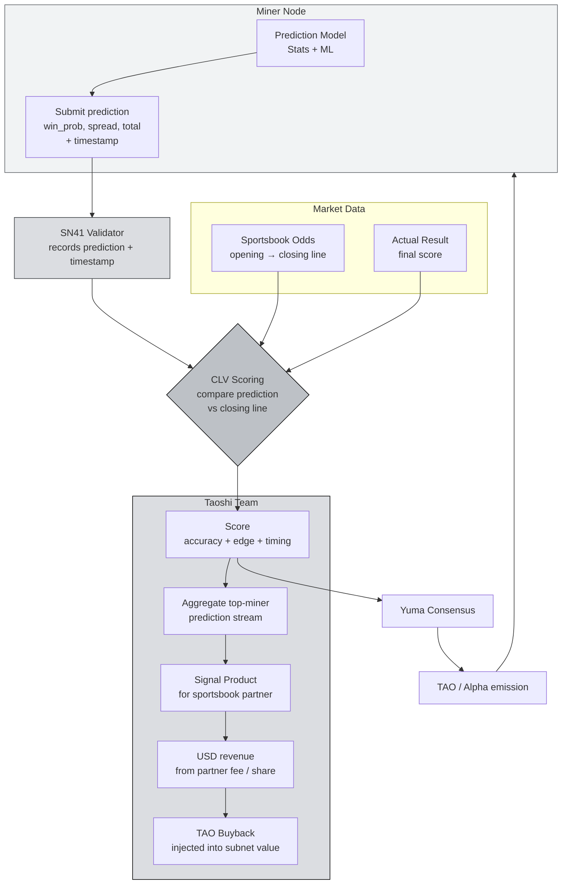

# SN41: Sportstensor

If SN13 sells **data**, **Sportstensor (NetUID 41)** sells something even more directly valuable: **alpha in sports betting markets**. It's one of the most interesting subnets to study because: unlike most Bittensor subnets: SN41 **has real USD revenue** flowing back to the ecosystem as TAO buybacks.

:::info What You'll Learn
By the end of this page you will be able to:
- Explain **the mission of SN41** and how sports prediction can become "alpha" that's monetized
- Understand the **sports being covered** (NBA, NFL, MLB, Soccer) and the prediction mechanism
- Understand **validator scoring**: closing line value (CLV), accuracy, and why it's fair
- Understand the **Taoshi/Sportstensor revenue model**: sportsbook integrations → USD → TAO buyback
- Understand the concepts of **almanac binding** and **programmatic trade execution** (covered in depth in the SN41 deep-dive, TH5)
- See why **SN41 is one of the subnets** whose miner you'll deploy hands-on in TH4
:::

---

## Why Sports Betting?

Before being skeptical: "why should AI predict sports?": understand first that **the sports betting market is one of the most efficient and liquid forecasting markets in the world**.

- **Global volume**: $100B+ annual legal betting volume.
- **Information rich**: player stats, weather, injury reports, line movement, public sentiment.
- **Immediate settlement**: each match completes in 2–3 hours, with clear ground truth (who won).
- **Clear pricing signal**: sportsbooks set odds that move in real time: the "true probability" signal can be extracted.

This makes sports betting a **perfect lab for a decentralized prediction market**. Unlike "stock market predictions" (noisy, slow fundamentals), sports has ground truth that is **clear, fast, and repeated**: ideal for a scoring system.

:::note Simple Analogy
Imagine SN41 as **Bittensor's Renaissance Technologies, focused on sports**. Miners are individual quant traders using their own prediction models. Validators are a risk desk auditing each trader's performance. Those who consistently outperform the market (sportsbook line) get a share of the profit.
:::

---

## What Is Sportstensor / SN41?

> **Sportstensor (NetUID 41)**, run by the **Taoshi** team, is the Bittensor subnet whose mission is to **produce accurate, early sports outcome predictions**: and then monetize them through integrations with sportsbooks and betting exchanges in legal markets.

The output: **a real-time prediction stream** (win probability, spread, total) for thousands of matches per month, then translated into **actionable trading signals**.

### Leagues Covered

- **NBA** (US basketball)
- **NFL** (American football)
- **MLB** (US baseball)
- **Soccer** (Premier League, La Liga, MLS, Champions League, etc.)

This list expands over time: the Taoshi team adds leagues based on market size and data availability.

---

## SN41 Architecture: From Prediction to Revenue



Notice the **two economic loops** in this diagram:
- **Left loop** (miner ↔ validator ↔ TAO emission): standard Bittensor.
- **Right loop** (aggregated predictions → USD revenue → TAO buyback): what makes SN41 **economically sustainable**, not just dependent on TAO inflation.

---

## What Do Miners Do?

An SN41 miner is **essentially a quant trader**. Typical workflow:

1. **Ingest data**: match stats (player box scores, team metrics), injury reports, sportsbook line movement, historical match data.
2. **Build a model**: anything from simple (Elo rating, logistic regression) to complex (gradient boosting, deep learning, ensembles). The subnet doesn't dictate architecture: only the final result is judged.
3. **Submit predictions** to the validator: for each match: home/away win probability, spread prediction, over/under total.
4. **Timestamp matters**: predictions submitted **early** (long before the match and before the line moves) are worth more than last-minute ones.
5. **Repeat for thousands of matches** that week.

:::tip The Edge of Simple but Solid Models
Don't be intimidated into thinking "I have to use deep learning". Miners who sustain long-term often use a **combination of simple models + domain expertise** (understanding league structure, head-to-head, home advantage) over deep nets that overfit.
:::

---

## How Does Validator Scoring Work?

SN41 validators use two ground truth signals:

### 1. Closing Line Value (CLV)

**CLV** is an important concept from professional sports betting. The core idea:

> **The closing line** (the final odds before a match starts) is considered the **best available estimate** for the true probability, because all public information is already priced in.

If your miner predicts `team_A win_prob = 0.62` **a week before the match**, and the closing line moves to an implied probability of 0.60 → you **beat the closing line** by 2%: that's measurable "alpha".

CLV is good because:
- **Not as noisy as actual outcomes**: a single match is high-variance, but CLV is statistically stable.
- **Cannot be gamed**: the closing line is set by the market, not the subnet.
- **Measures prediction skill, not luck**: miners who consistently beat CLV are clearly skilled.

### 2. Actual Outcome (weighted)

Even though CLV is the main signal (because of statistical stability), validators still track **actual results** over the long run. A miner with great CLV but consistently bad actuals will still get penalized (although that rarely happens if CLV truly beats).

### Simplified Formula

```
score_miner ≈ α · CLV_edge_avg + β · accuracy_realized + γ · timing_bonus - δ · penalties
```

`timing_bonus` means: a prediction sent **2 days before the match** is more valuable than 2 hours before.

:::warning Fair Play
Validators counter game-able strategies like:
- **Copying from other miners** (detected via hotkey clustering + timing)
- **Submitting predictions only for "obvious" matches** (clear favorite vs. underdog)
- **Spam submissions**

If you try a clever shortcut, you'll usually get caught and penalized.
:::

---

## The Revenue Model: What Makes SN41 Unique

This is what separates SN41 from most Bittensor subnets.

**Most subnets** live off **inflationary TAO emission**: new TAO is minted and distributed across subnets via root weight. This is sustainable **only as long as** the market believes TAO value will rise.

**SN41 is different**: the Taoshi team sells **aggregated prediction signals** to external integrations:

- **Sportsbook partners**: betting platforms pay fees for early-signal access for their risk management / line setting.
- **Prop betting platforms / exchanges**: integration into user-facing prediction products.
- **B2B analytics**: sports media / professional teams that need model output.

A portion of this USD revenue is used for **TAO buyback**: the team buys TAO on the market and channels it back into the subnet ecosystem. This creates **real demand** for TAO that doesn't depend solely on narrative.

:::info Why This Matters for Miners
If SN41 successfully grows its USD revenue, the SN41 alpha token gains a concrete **buyer of last resort**. Long-term this makes SN41 a candidate for **a more stable emission-to-value ratio** than subnets without external revenue.
:::

---

## Almanac Binding & Programmatic Trade Execution

Two advanced concepts we'll cover **in full in the SN41 deep-dive (TH5) and hands-on setup (TH4)**, but it's important you know the names now:

### Almanac Binding

> **The almanac** is an on-chain registry that binds a **miner's hotkey** to **operational identity** (e.g., endpoint URL, public key for signed predictions, miner metadata).

Binding to the almanac ensures:
- Submitted predictions actually come from the miner that owns the hotkey.
- Validators can verify the signature on every submission.
- Miners can't impersonate other miners.

When you register during the hands-on setup, you'll perform the **hotkey ↔ almanac binding** as one of the required steps.

### Programmatic Trade Execution

> **Programmatic trade execution** is the ability to **auto-execute trades** (on a sportsbook / exchange) based on miner predictions, without human intervention every time.

This is optional: basic miners just send predictions. But advanced miners can hook predictions → an execution layer that performs real trading on whitelisted platforms. This is the **Trading Strategies** topic in the SN41 hands-on track.

:::tip Take It in Stages
You don't need to understand this 100% right now. What matters: **know the terms, know they exist, and understand why the subnet needs these concepts** (identity binding for fairness, programmatic execution to turn miner alpha into real USD).
:::

---

## Miner Economics: Realistic Expectations

### Setup Profile

| Component | Range |
|---|---|
| VPS (2–4 vCPU, 4–8GB RAM) | $5–20/month |
| Data API (sports stats / odds) | $0–50/month (many free sources to start) |
| Compute for model training | Minimal: can be trained offline on a laptop |
| SN41 registration fee (one-time) | Variable in TAO: check Taostats |
| **Initial OpEx** | **~$10–70/month** |

The cost is similar to SN13: low entry barrier from an infrastructure perspective.

### Revenue

Because SN41 has external USD revenue, its alpha token's value can behave differently from pure-inflation subnets. But **day-to-day miner income still depends on**:
- Score rank against other miners
- TAO emission to subnet 41
- TAO and SN41 alpha price

**Key insight:** SN41 is a subnet where **your real prediction skill** determines outcomes. Different from SN13 (volume + strategy) or Chutes (hardware + tuning): SN41 is most like a "quant competition" with long-term gradient bonus as your skill improves.

:::danger Don't Submit Recklessly
If you submit random predictions or stay far from the closing line consistently, not only will you get no reward: you can be slashed. Make sure your model at minimum captures home advantage + basic head-to-head before registering.
:::

---

## SN41 Mining Is for You If...

The ideal SN41 miner profile:

- ✅ **Has interest / background in statistics, ML, or quant finance**: SN41 is the most "quant" subnet on Bittensor.
- ✅ **Familiar with the covered sports**: NBA/NFL/MLB/Soccer. Domain knowledge matters.
- ✅ **Python developer**: all mining tooling is in Python.
- ✅ **Willing to learn betting concepts (CLV, line movement, implied probability)**: these are core to the subnet.
- ✅ **Interested in subnets with external revenue**: if you're a long-term thinker, a subnet with "real buyers" is more attractive.

❌ **Not a good fit if** you have no interest in sports / betting whatsoever and aren't willing to learn the CLV concept. The scoring on this subnet is tightly tied to professional betting terminology.

---

## Where SN41 Fits in This Curriculum

SN41 is one of the subnets whose miner we deploy hands-on.

The **Sportstensor (SN41) hands-on track** (hands-on setup in TH4, deep-dive in TH5) will walk you step-by-step through:

1. SN41 introduction (deeper dive)
2. Bittensor wallet setup & TAO funding
3. Registering a miner on Sportstensor
4. **Almanac registration & miner identity binding**
5. Miner initialization & metadata registration
6. **Programmatic trade execution**
7. Trading strategies

The concepts we cover at a high level here: **CLV, almanac, programmatic execution**: you'll implement yourself in the hands-on sessions.

:::tip Learning Strategy
Recommendation: **read this page first until the concepts are clear**. Later in the SN41 hands-on track, the step-by-step execution will be much easier to digest because the theoretical foundation is in place.
:::

---

## Summary

What you should remember from this page:

1. **SN41 = Sportstensor**: sports prediction subnet (NBA/NFL/MLB/Soccer) with scoring based on **Closing Line Value (CLV)**.
2. **Unique on Bittensor:** has **external USD revenue** through sportsbook integrations → **TAO buybacks** → an economically sustainable subnet.
3. **Scoring = CLV edge + accuracy + timing**: submitting early is worth more.
4. **Almanac binding** = on-chain miner identity that ensures valid signatures.
5. **Programmatic trade execution** = an advanced feature for auto-executing predictions as real trades (optional at the miner level).
6. **The most "quant" subnet** on Bittensor: fits people who like statistics, ML, and sports domain knowledge.
7. **You'll deploy this hands-on**: concepts on this page translate directly.

### ✅ Quick Check

Before moving on, make sure you can answer:

1. What is **Closing Line Value (CLV)** and why is it better for scoring than a single actual outcome?
2. Why are predictions submitted **earlier** (timing bonus) more valuable?
3. What's the source of Taoshi's USD revenue that becomes TAO buyback?
4. What's the function of **almanac binding**: why is it required?
5. Name the 4 main leagues SN41 covers.

If those are easy → on to Ridges. If CLV is still fuzzy, re-read the **Validator Scoring** section.

---

### Further Reading

- [Taoshi: Sportstensor](https://taoshi.io): the team running SN41
- [Sportstensor Repo (taoshidev/sportstensor)](https://github.com/taoshidev/sportstensor): source code
- [Taostats: SN41](https://taostats.io/subnets/41): real-time emission & ranking
- [CLV Primer: What is Closing Line Value?](https://www.pinnacle.com/en/betting-articles/educational/what-is-closing-line-value): explanation of the CLV concept
- **Introduction to SN41** (the hands-on deep dive)

---

**Next:** [Other Notable Subnets → Chutes & Ridges](./other-notable-subnets)
