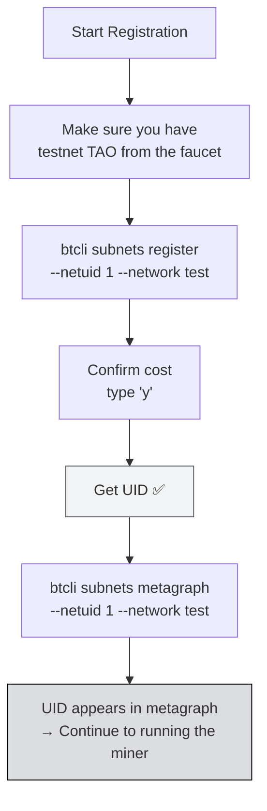

import Tabs from '@theme/Tabs';
import TabItem from '@theme/TabItem';

# Understanding Registration

:::info What You'll Learn
By the end of this page you will:
- Successfully **register your hotkey** on **NetUID 1 testnet** using testnet TAO
- Have a **UID** (the miner's slot number on the subnet)
- Be able to verify status via `btcli subnets metagraph`
:::

:::note Prerequisites
- ✅ [Wallet Setup](/TH4-Wallets-and-Miner-Setup/creating-wallets) complete: wallet & hotkey ready, testnet TAO available
- ✅ venv active: `source ~/.venvs/bt/bin/activate`
- ✅ Stable internet connection
:::

---

## Testnet Configuration

Before registering, set the default network to testnet so all btcli commands automatically use the testnet:

```bash
btcli config set network test
```

Verify the configuration:

```bash
btcli config get
# Output: network: test
```

:::tip Alternative: Per-Command Flag
If you don't want to set a global config, add `--network test` on each btcli command instead.
:::

---

## Step 1: View the Available Testnet Subnets

Check the subnets available on testnet:

```bash
btcli subnets list --network test
```

The output shows a table of all active subnets on testnet. Look for **NetUID 1**: this is the Bittensor development/learning subnet.

:::note Registration Cost
The registration cost on existing subnets (TAO recycle) will be displayed automatically when you run `btcli subnets register` in Step 2: btcli will ask for confirmation showing the cost number before continuing.
:::

---

## Pre-Check: Verify Wallet & Hotkey

Before registering, make sure your wallet and hotkey actually exist:

```bash
btcli wallet list
```

Expected output:

```text
Wallets
└── mywallet
    └── miner1
```

If the hotkey is missing, create it first:

```bash
btcli wallet new-hotkey -w mywallet -H miner1
```

:::warning Match the Hotkey Name
If your hotkey has a **different** name (e.g., `miner_testnet`), replace `miner1` in all subsequent commands with your actual hotkey name.
:::

---

## Register the Miner (TAO Burn)

```bash
btcli subnets register \
  --netuid 1 \
  -w mywallet \
  -H miner1 \
  --network test
```

A confirmation prompt will appear:

```text
Your balance is τ 1.000000
The cost to register by recycle is τ 0.000100
Do you want to continue? [y/n]: y
```

Type `y` and press Enter. Wait a few seconds until the confirmation appears.

**Successful output:**

```text
✅ Registered hotkey miner1 on netuid 1
   UID: 42 (example: your number will differ)
```

Note your **UID**: this number is your miner's slot in the subnet.

:::warning POW Registration Is Not Available on NetUID 1
PoW registration cannot be used on NetUID 1 because **PoW is permanently disabled** by this subnet's operator. The only way to register on NetUID 1 is via TAO burn. (Bittensor 11 dropped the separate `pow_register` command entirely — `btcli subnets register` is burn-based.)

Make sure you have testnet TAO from the faucet before continuing (see the wallet setup page).
:::

---

## ✅ Step 2: Verify the Registration

After registering, verify by viewing the metagraph:

```bash
btcli subnets metagraph 1 --network test
```

The output shows a table of every miner on the subnet. Find your UID:

```text
Metagraph for subnet 1 (test)
┌─────┬─────────────────────────────┬──────────┬──────────┬────────┐
│ UID │ Hotkey                      │ Stake    │ Trust    │ Active │
├─────┼─────────────────────────────┼──────────┼──────────┼────────┤
│ 42  │ 5Gx1...miner1               │ τ 0.00   │ 0.0000   │ True   │
└─────┴─────────────────────────────┴──────────┴──────────┴────────┘
```

Or check via wallet overview:

```bash
btcli wallet overview -w mywallet --network test
```

---

## ⏳ Immunity Period

After registering, your miner enters the **immunity period** (~24 hours on mainnet, shorter on testnet). During this period:

- The miner **cannot be deregistered** even with a score of 0
- It can be used to set up and test the miner without risk of losing your slot
- After immunity ends, miners with very low scores can be pushed out by newly registered miners

:::note Testnet Is More Lenient
On testnet, the immunity period is shorter and the consequences of deregistration aren't as serious as mainnet (no real TAO is at stake).
:::

---

## Registration Flow



---

## Registration Troubleshooting

| Error | Cause | Fix |
|-------|-------|-----|
| `Insufficient balance for registration` | Not enough testnet TAO | Request more from the faucet (wallet setup) |
| `Hotkey already registered` | The hotkey already has a UID on this subnet | Check with `btcli wallet overview --network test` |
| `Subnet does not exist` | Wrong NetUID or subnet not active yet | Check `btcli subnets list --network test` |
| `hotkey 'miner1' does not exist` | Hotkey not created or wrong name | Run `btcli wallet list` to see existing hotkey names, then create: `btcli wallet new-hotkey -w mywallet -H miner1` |
| `No such option: --wallet.name` | Using v9 btcli syntax | btcli v11 uses `-w` / `--wallet` (see the [btcli page](/TH2-Tooling-and-Ecosystem/introduction-to-btcli)) |
| `Connection refused` / `Timeout` | Testnet subtensor is down | Try again in 5–10 minutes |
| UID doesn't appear in metagraph | Chain needs a few blocks | Wait 2–5 minutes, the sync isn't done yet |

---

## Summary

- **NetUID 1 testnet** = Bittensor learning subnet
- Register via **TAO burn**: `btcli subnets register --netuid 1 -w mywallet -H miner1 -n test`
- **POW registration is disabled** on NetUID 1: testnet TAO is required
- After registering → you get a **UID**, visible in the metagraph
- **btcli v11** flags are short and hyphenated: `-w`, `-H`, `-n`. **Miner scripts** still use the
  older dotted argparse style: `--wallet.name`, `--wallet.hotkey`. Different tools, different SDK majors.

### ✅ Quick Check

1. What's the difference between `-w` (btcli) and `--wallet.name` (miner.py)?
2. Why use `--network test` instead of running without the flag?
3. What is the immunity period and why does it matter?
4. How do you verify the registration succeeded?

<details>
<summary> Answers</summary>

1. **`-w` / `--wallet`** is a **btcli v11** flag. **`--wallet.name`** is the flag used when running Python scripts like `neurons/miner.py`, which run on the older pinned SDK (`bittensor==10.3.0`). They're different programs on different SDK majors — the mismatch is expected, not a typo.
2. **`--network test`** = use the Bittensor testnet (sandbox, TAO has no real value). Without the flag, btcli defaults to `finney` (mainnet) using real TAO.
3. **Immunity period** = the grace period after registration (~24 hours on mainnet), during which the miner cannot be deregistered even with a score of 0. Important so you have time to set up.
4. `btcli subnets metagraph 1 --network test`: find your UID in the table. Or `btcli wallet overview -w mywallet --network test`.

</details>

---

**Next:** [Run the Local Miner →](/TH5-Running-a-Miner/run-the-local-miner)

*Your UID is on-chain. Now it's time to bring the miner online! *
