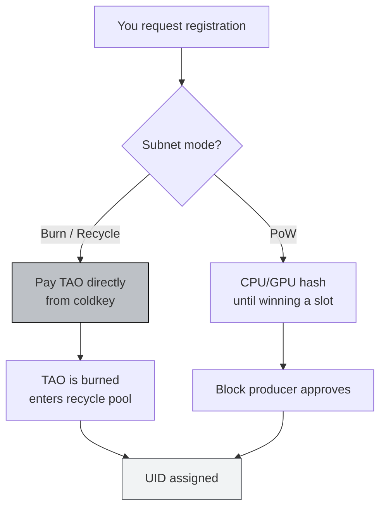
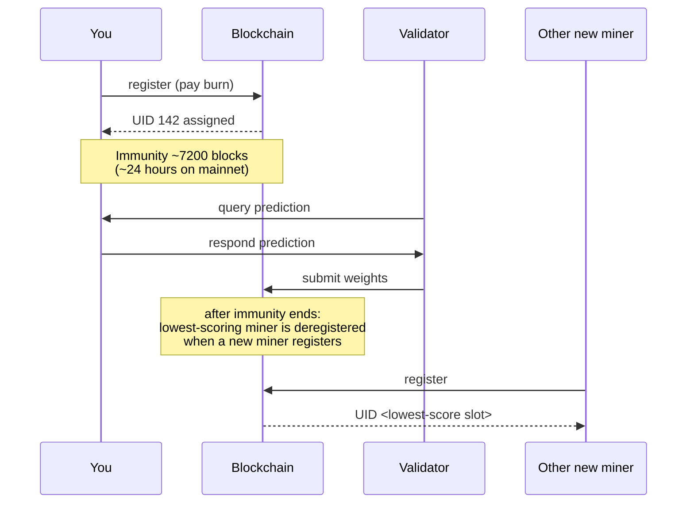

# Registering a Miner

:::info What You'll Do
By the end of this section you will:
- Understand the **TAO recycle / burn** mechanism for subnet registration
- Know how to **check the actual registration cost** via `btcli subnets burn-cost`
- Successfully **register your hotkey** on netuid 13 (or testnet netuid)
- Verify your **UID** appears in the metagraph
- Know how to handle common errors (insufficient balance, registration closed, etc.)
:::

:::note Prerequisites
- ✅ [Wallet & TAO Funding](/TH4-Wallets-and-Miner-Setup/getting-ready-for-mining) complete
- ✅ Coldkey `sn13_miner` has balance ≥ 1.5 TAO (mainnet) or ≥ 5 test-τ (testnet)
- ✅ Hotkey `miner_01` already created
- ✅ Stable internet (registration takes 30–90 seconds)
:::

---

## Registration Concept: Burn vs PoW

Bittensor has two historical registration modes. **SN13 currently uses burn (recycle) mode**: more predictable and friendlier for non-professional miners.



### Why Burn?

- **No heavy hardware needed**: just pay
- **Dynamic price**: many people registering → cost rises; few → falls (supply & demand)
- **Burned TAO** goes into the subnet's recycle pool (not destroyed economically: it preserves scarcity)

:::warning TAO Burned = Gone
Once burned, TAO can't be refunded. If you get deregistered later, you **don't get back** the registration cost. This is not a deposit.
:::

---

## Step 1: Check the Registration Cost

### Mainnet (netuid 13)

```bash
btcli subnets burn-cost 13
```

Output:

```text
Recycle required to register on subnet 13: τ 0.237493921
```

This number is **fluctuating per block** (every ~12 seconds). If it's high right now, wait a few hours.

### Testnet

The Data Universe testnet currently uses **netuid 13** (it previously ran on netuid 172, now full/retired). If registration says the subnet doesn't exist, confirm the current testnet netuid via `btcli subnets list -n test` or the official Data Universe docs.

```bash
btcli subnets burn-cost 13 -n test
```

:::tip View All Subnets + Prices
```bash
btcli subnets list
```
Shows a table of all active subnets along with the current burn cost. Useful for orientation.
:::

### Pre-flight Checkpoint

Make sure your coldkey balance is at least **1.5× burn cost** + buffer:

```bash
btcli wallet overview -w sn13_miner
```

If burn cost is `0.24 τ`, minimum balance `~0.4 τ`. **Have an extra buffer** in case the burn cost rises while you're executing.

:::warning Budget beyond the burn cost — registration is always MEV-shielded
In Bittensor 11 `subnets register` submits through the MEV Shield pallet, and a shielded
submission needs **additional free TAO for the outer carrier fee** on top of the burn. A wallet
holding exactly the burn cost will fail:

```text
error: MEV-shielded submission needs free TAO for the outer carrier fee
  help: burned_register cannot submit unshielded
```

You cannot opt out — burned registration rejects `--no-mev-shield`:

```text
error: burned_register must be submitted MEV-shielded
  help: collateral / burned-registration AMM fills cannot run unshielded; omit --no-mev-shield
```

**Always `--dry-run` first.** It's free and surfaces this before you commit:

```bash
btcli subnets register --netuid 13 -w sn13_miner -H miner_01 --dry-run
```
:::

:::tip `btcli explain` decodes any error
v11 ships a built-in error catalog:

```bash
btcli explain insufficient_balance   # long-form cause + remediation
btcli explain                        # list every semantic code
btcli explain --chain                # the chain-side error catalog
```
:::

---

## Step 2: Execute Registration

### Mainnet

```bash
btcli subnets register \
  --netuid 13 \
  -w sn13_miner \
  -H miner_01
```

### Testnet (recommended for first-timers)

```bash
btcli subnets register \
  --netuid 13 \
  -w sn13_miner \
  -H miner_01 \
  -n test
```

btcli will:

1. Show the **current burn cost**.
2. Ask for **confirmation** ("Do you want to continue? [y/N]").
3. Ask for the **coldkey password**.
4. Submit the extrinsic to the chain.
5. Wait for finality (~12–36 seconds).

### Successful Output (Example)

```text
Balance:
  τ 2.000000000  →  τ 1.762506079
✅ Registered
Registered on netuid 13 with UID 142
```

**Record UID 142** (your number will differ): this is your miner identity in the subnet.

### Checkpoint

```bash
btcli wallet overview -w sn13_miner
```

Expected: balance dropped by the burn cost, and under hotkey `miner_01` the field `uid: <number>` appears.

---

## Step 3: Verify in the Metagraph

The **metagraph** = subnet state snapshot (all miners + validators, UID, stake, weights).

```bash
btcli subnets metagraph 13
```

Output table (excerpt):

```text
Subnet 13: Data Universe
  UID  STAKE    RANK     TRUST    INCENTIVE   EMISSION   HOTKEY
  ...
  142  0.0000   0.0000   0.0000   0.0000      0.0000     5Ci...DjL
  ...
```

Find the row whose **hotkey SS58** matches your `btcli wallet list`.

:::tip Filter Directly to Your UID
Pipe grep to find quickly:
```bash
btcli subnets metagraph 13 | grep "5Ci"
```
(Replace `5Ci` with the first 3–5 characters of your hotkey SS58.)
:::

### What Do the Columns Mean?

| Column | Initial value (just registered) | Will become |
|---|---|---|
| **UID** | Your unique slot number | Stays (until deregistered) |
| **STAKE** | 0 | Rises if you/delegators stake |
| **RANK** | 0 | Rises based on validator scores |
| **TRUST** | 0 | Rises when validators consistently score you positive |
| **INCENTIVE** | 0 | Share of emission based on rank |
| **EMISSION** | 0 | TAO per block you receive |

All columns are zero at the start: **normal**. Takes 1–3 days of active mining to start rising.

---

## Registration & Deregistration Cycle (Immunity Period)



:::warning Immunity Period = Learning Window
After registering, you get an **immunity period** (~24 hours on mainnet). During this window you won't be deregistered even with a score of 0. Use this time to **set up the miner code** in the sections that follow and don't waste it.
:::

---

## Common Errors & Fixes

### 1. `InsufficientBalance`

```text
Error: Not enough balance to pay for registration.
  required: τ 0.51, available: τ 0.42
```

**Fix:**
- Add TAO from an exchange (mainnet) or faucet (testnet)
- Or wait for burn cost to drop (`watch -n 60 btcli subnets burn-cost 13`)

### 2. `RegistrationDisabled` / Registration Closed Window

Some subnets have a **registration interval** (not always open). If you see:

```text
Error: Registration is disabled.
```

**Fix:**
- Wait for the next window: typically the subnet team announces on Discord
- Check `btcli subnets list` status column / next registration

### 3. `PriorityIsTooLow` / `TooManyRegistrationsThisBlock`

Means many people are registering in the same block.

**Fix:**
- Try again 1–2 blocks later. btcli auto-retries a few times.
- If persistent, raise gas priority (advanced: typically not needed in burn mode).

### 4. Timeout `connection refused`

```text
Error: Unable to connect to subtensor endpoint.
```

**Fix:**
- Check internet (`ping entrypoint-finney.opentensor.ai`)
- Use a fallback endpoint: `--subtensor.chain_endpoint wss://entrypoint-finney.opentensor.ai:443`

### 5. Wrong Password

```text
Error: Incorrect password for coldkey.
```

**Fix:**
- No reset. If the password is permanently lost → use the mnemonic regen:
  ```bash
  btcli wallet regen-coldkey --mnemonic "..." -w sn13_miner_v2
  ```
- This is a new wallet from the same mnemonic: address stays the same (SS58 is deterministic from mnemonic).

---

## Documentation for Graduation

Take screenshots of the following output (you need them for the final submission):

1. `btcli subnets burn-cost 13` **before** registering
2. The output of `btcli subnets register ...` showing `Registered on netuid 13 with UID <N>`
3. `btcli subnets metagraph 13 | grep <hotkey_prefix>` showing your UID in the metagraph
4. `btcli wallet overview -w sn13_miner` (balance after burn)

Save in a local folder `~/bittensor/submission-evidence/03-register/`.

---

## Summary

- ✅ Understand the **burn/recycle** mode: pay TAO → get UID
- ✅ Check burn cost via `btcli subnets burn-cost`
- ✅ Successfully `btcli subnets register --netuid 13 ...`
- ✅ UID assigned
- ✅ Verified the UID appears in `btcli subnets metagraph 13`
- ✅ Understand the immunity period concept (~24 hour buffer for miner setup)

### ✅ Quick Check

1. What's the difference between **burn** and **PoW** registration modes?
2. What's the minimum number of flags needed for `btcli subnets register` on mainnet?
3. What happens to TAO after burn: lost, refunded, or recycled?
4. What's the use of the immunity period for new miners?
5. In the metagraph table, which column matters most for your emission?

### Troubleshooting

| Symptom | Quick Fix |
|---|---|
| Burn cost looks unusually high | Wait a few hours: supply & demand |
| UID doesn't appear in metagraph despite success output | Wait 1–2 minutes (sync delay), then re-check |
| `btcli subnets metagraph` is very slow | Normal: metagraph is large. Use `grep` to filter |
| Registered on the wrong netuid | TAO is gone on that netuid: can't be moved. Be careful next time |
| Want to voluntarily deregister | Can't: only auto-deregister when lowest score and a new miner enters |

:::danger DON'T Double-Register on the Same netuid
If you register a second hotkey on netuid 13 with the same coldkey: OK, two slots. But if you re-register the same hotkey without deregistering first → TAO wasted. Check `metagraph` first before re-registering.
:::

---

**Next:** [Run the Local Miner →](/TH5-Running-a-Miner/run-the-local-miner)
