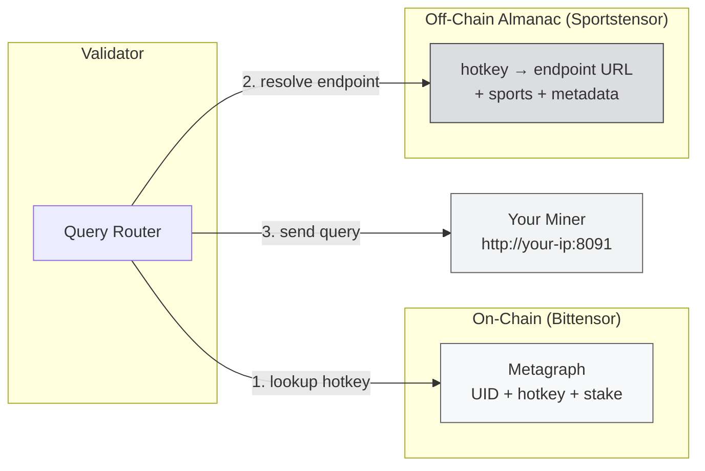
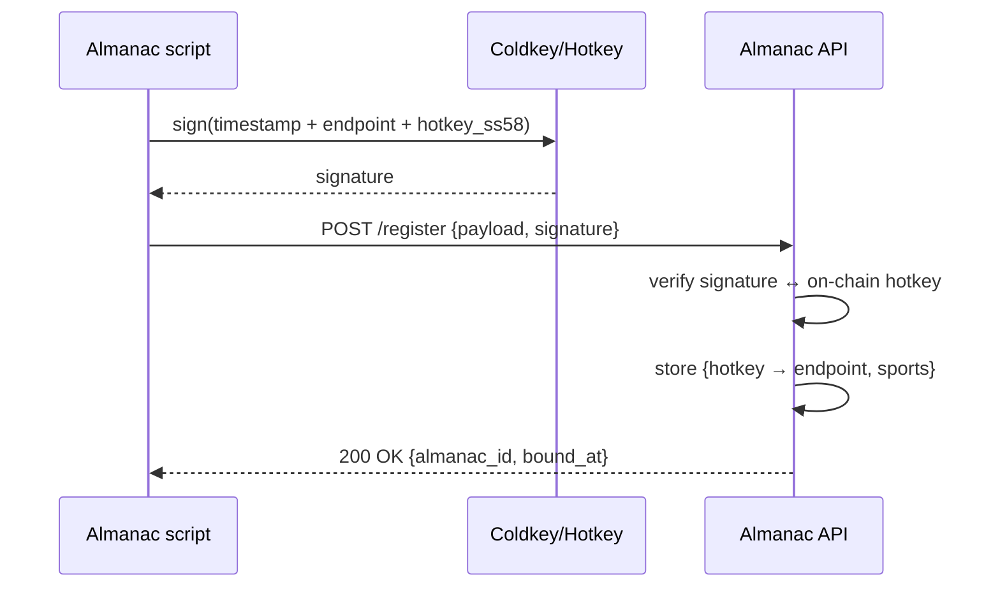

# Obtaining Your UID & Identity Binding

:::info What You'll Do
After this section you will:
- Understand what the **Almanac** is and why it's needed on top of on-chain registration
- Clone the **Sportstensor miner repo** and prepare the environment
- Configure `config.yaml` with your **hotkey SS58** + **endpoint URL**
- Run the **almanac registration** script and verify the binding succeeded
- Understand the re-binding cycle when your IP/endpoint changes
:::

:::note Prerequisites
- ✅ [Registering a Miner](/TH5-Running-a-Miner/registering-a-miner) complete: UID assigned
- ✅ Hotkey `miner_01` registered in the netuid 41 metagraph
- ✅ Git + Python 3.10+ available on the server
- ✅ Public port (default **8091** or per the repo) can be exposed: on a VPS make sure the firewall is OK; at home make sure port forwarding is active
:::

---

## What Is the Almanac?

Bittensor's on-chain registry only stores minimal info (hotkey, stake, weights). But Sportstensor needs additional info:

- **Endpoint URL** of your miner (where should validators send queries?)
- **Sports coverage** (do you cover NBA? NFL? Soccer?)
- **Model metadata** (prediction engine version, etc.)

All of this is stored in the **Almanac**: an off-chain registry managed by the Sportstensor team but verified using **hotkey signatures** (so it can't be forged).



:::tip Simple Analogy
Metagraph = ID card (official identity). Almanac = business card (office address + open hours + services you offer). Validators need both.
:::

---

## Step 1: Clone the Sportstensor Miner Repo

:::warning Official Repo URL
The Sportstensor repo organization can change. **See the official documentation** at [Sportstensor Docs](https://docs.sportstensor.com) or pinned messages in Discord for the latest URL. The example below uses placeholder `sportstensor/sportstensor`: adjust if different.
:::

```bash
cd ~/bittensor
git clone https://github.com/sportstensor/sportstensor.git
cd sportstensor

# Make sure you're on the stable branch
git checkout main   # or 'mainnet' / 'production': check the README

# Install dependencies in the same venv from the wallet setup
source ~/bittensor/venv/bin/activate
pip install -r requirements.txt
pip install -e .    # install this package as editable
```

### Checkpoint

```bash
ls -la
```

There should be at minimum:

```text
config.yaml (or config.example.yaml)
neurons/
  miner.py
  validator.py
scripts/
  register_almanac.py  (name may differ: check README)
requirements.txt
README.md
```

:::tip If the Structure Differs
Read the repo `README.md`. This curriculum assumes a generic SN miner structure. The exact filenames (`register_almanac.py`, `almanac_bind.sh`, etc.): **see the official docs**.
:::

---

## Step 2: Prepare a Public Endpoint

Validators must be able to reach your miner from the internet. Make sure:

### Check the Server's Public IP

```bash
curl -s ifconfig.me
```

Example output:

```text
203.0.113.42
```

### Make Sure the Port Is Open

The default Sportstensor miner port is typically **8091** (or per config).

**On a VPS (ufw):**

```bash
sudo ufw allow 8091/tcp
sudo ufw reload
sudo ufw status
```

**On a home network:**
- Port forward on the router: `Public 8091 → LAN <miner-local-ip>:8091`
- **Dynamic DNS** recommended (NoIP, DuckDNS) so the hostname stays even if the home IP changes

### Test Reachability

From a second laptop / mobile data hotspot:

```bash
curl http://<PUBLIC_IP>:8091/health
```

If the miner isn't running yet, just confirm the port is open via:

```bash
nc -zv <PUBLIC_IP> 8091
```

:::danger Don't Expose 0.0.0.0 Without a Firewall
The miner listens for incoming connections. Without a firewall, your server is exposed to all internet traffic. Always: `ufw allow <port>` + deny default.
:::

---

## Step 3: Configure `config.yaml`

The config template is typically provided as `config.example.yaml`. Copy and edit:

```bash
cp config.example.yaml config.yaml
nano config.yaml
```

General structure (exact fields per official docs):

```yaml
# config.yaml
wallet:
  name: sn41_miner
  hotkey: miner_01
  path: ~/.bittensor/wallets

subtensor:
  network: finney          # 'finney' = mainnet; 'test' = testnet
  netuid: 41

miner:
  endpoint: "http://203.0.113.42:8091"  # <-- REPLACE with your IP + port
  external_ip: "203.0.113.42"
  external_port: 8091
  name: "my-first-miner"

sports:
  - mlb
  - nba
  - nfl
  - soccer

logging:
  level: debug
  file: ./logs/miner.log
```

:::warning Endpoint Must Match Reality
If you're on a VPS with a static IP → use that IP. If at home → use a dynamic DNS hostname (`miner.duckdns.org`). **Wrong endpoint = validator can't query = 0 reward.**
:::

### Checkpoint

```bash
cat config.yaml | grep -E "hotkey|endpoint|netuid"
```

Verify the values are correct.

---

## Step 4: Run the Almanac Registration Script

The script name can vary. Common options:

### Option A: Dedicated Python Script

```bash
python scripts/register_almanac.py \
  --config config.yaml \
  --wallet.name sn41_miner \
  --wallet.hotkey miner_01
```

### Option B: Package CLI Command

```bash
sportstensor-miner almanac-register \
  --wallet.name sn41_miner \
  --wallet.hotkey miner_01
```

### Option C: Directly From the Miner Entrypoint

Some repos auto-register the almanac on first miner run:

```bash
python neurons/miner.py \
  --netuid 41 \
  --wallet.name sn41_miner \
  --wallet.hotkey miner_01 \
  --almanac.register_only
```

**Read the repo README** for the exact command.

### What Happens



### Successful Output (Example)

```text
[almanac] Signing payload with hotkey miner_01 (5Ci...DjL)
[almanac] Submitting to https://almanac.sportstensor.com/api/v1/register
[almanac] ✅ Successfully registered.
  almanac_id: alm_01HXYZ...
  endpoint:   http://203.0.113.42:8091
  sports:     [mlb, nba, nfl, soccer]
  bound_at:   2026-04-14T10:23:45Z
```

---

## Step 5: Verify the Binding

### A. Check via the Official Status Endpoint

Most subnets have a public status page. Example (specific URL per official docs):

```bash
curl https://almanac.sportstensor.com/api/v1/miner/<hotkey_ss58>
```

Response:

```json
{
  "hotkey": "5Ci...DjL",
  "uid": 142,
  "endpoint": "http://203.0.113.42:8091",
  "sports": ["mlb","nba","nfl","soccer"],
  "bound_at": "2026-04-14T10:23:45Z",
  "status": "active"
}
```

### B. Check the Local Cache

If the repo stores local state:

```bash
cat ~/.sportstensor/almanac_binding.json
```

### C. Self-Check via Miner Health Endpoint

If the miner is already running (we'll do that when running the SN41 miner):

```bash
curl http://localhost:8091/almanac/status
```

:::tip Screenshot for Graduation
Save the output of step A or B: needed for the final submission.
:::

---

## When Should You Re-Bind the Almanac?

| Situation | Re-register? |
|---|---|
| VPS IP changes | ✅ Yes |
| Port changes | ✅ Yes |
| Change hotkey | ✅ Yes (new binding) |
| Change domain / DNS | ✅ Yes |
| Just restarting the miner | ❌ No |
| Updating miner code | ❌ No |
| Add sport coverage | ✅ Yes (update metadata) |

Save the registration command in a **Makefile** or shell alias for easy re-running:

```bash
# ~/.bashrc
alias sn41-almanac='cd ~/bittensor/sportstensor && python scripts/register_almanac.py --config config.yaml'
```

---

## Common Errors

### `Signature verification failed`

The Almanac server can't verify your signature.

- **Likely:** the hotkey in `config.yaml` ≠ the hotkey you used in the CLI flag
- **Fix:** match `wallet.hotkey` in the config with the `--wallet.hotkey` flag

### `Hotkey not registered on-chain`

Almanac checks the metagraph first before binding.

- **Fix:** go back to [Registering a Miner](/TH5-Running-a-Miner/registering-a-miner) and confirm the UID is assigned.

### `Endpoint unreachable`

The Almanac server pings your endpoint; it fails.

- **Fix:**
  - `curl http://<IP>:<PORT>/health` from outside: must return 200
  - Check the firewall (`ufw status`) and port forwarding
  - Make sure the miner process is listening (`lsof -i :8091`)

### `Rate limited`

Too many re-registers in a short period.

- **Fix:** wait 5–15 minutes.

### `Unknown sport in config`

The sports list in `config.yaml` must match the enums supported by the Almanac.

- **Fix:** check the valid list in the official docs; typically `mlb`, `nba`, `nfl`, `soccer`, `tennis`.

---

## Summary

- ✅ Understand the Almanac as the off-chain registry complementing the metagraph
- ✅ Cloned the Sportstensor miner repo + installed deps
- ✅ Prepared a public IP/port + firewall
- ✅ Configured `config.yaml` (wallet, endpoint, sports)
- ✅ Ran the almanac registration script → got an `almanac_id`
- ✅ Verified the binding via API or local cache

### ✅ Quick Check

1. Why is the almanac needed when there's already an on-chain metagraph?
2. What gets signed during almanac registration?
3. When are you **required** to re-bind the almanac?
4. What's the consequence of a wrong endpoint in the config?

### Troubleshooting

| Symptom | Fix |
|---|---|
| Script not found | Check the repo README: script name may differ across versions |
| Bind succeeded but validator never queries | Wait 1–2 cycles; verify the endpoint is reachable from outside |
| Home IP changes daily | Use dynamic DNS (DuckDNS/NoIP) + re-bind when the hostname updates |
| `config.yaml` was committed to git | **Move it out of the repo**. Add to `.gitignore`. Don't leak the hotkey path. |

:::danger Do Not Upload config.yaml to GitHub
Even though the hotkey address is public, your local wallet path shouldn't be public. Always `.gitignore` the config file.
:::

---

**Next:** [Running the SN41 Miner →](./running-the-sn41-miner)
