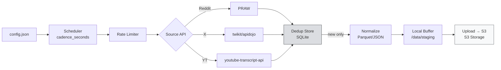

# SN13: Scraping Strategy

:::info What You'll Do
By the end of this section you can:
- Understand the structure of **`config.json` / `miner.yaml`** in Data Universe
- Set up a **Reddit scraper** (PRAW credentials) + **Twitter/X** (twikit/snscrape) + **YouTube** (transcript API)
- Implement **deduplication logic** so you don't double-upload
- Understand **rate limiting** & best practices to avoid IP bans
- Choose a **subreddit + keyword strategy** that scores well on SN13
:::

:::note Prerequisites
- ✅ Completed [Running the SN13 Miner](./running-the-sn13-miner) and environment setup
- ✅ Miner registered on NetUID 13, smoke test clean
- ✅ Access to `~/data-universe` on the VPS
:::

---

## Anatomy of the Config File

Data Universe uses a config file to determine **which scrapers are active, what interval, and which filters.** Depending on the repo version, it can be `config.json`, `miner.yaml`, or `scraper_config.json`. Check:

```bash
cd ~/data-universe
ls scraping/
# Typically: scraper_coordinator.py, reddit/, twitter/, youtube/
```

### Example `config.json` Structure

```json
{
  "scraper_configs": [
    {
      "scraper": "reddit",
      "enabled": true,
      "cadence_seconds": 300,
      "labels_to_scrape": [
        {
          "label_choices": ["r/cryptocurrency", "r/wallstreetbets", "r/technology"],
          "max_data_entities": 100,
          "max_age_hint_minutes": 60
        }
      ]
    },
    {
      "scraper": "X.apidojo",
      "enabled": true,
      "cadence_seconds": 180,
      "labels_to_scrape": [
        {
          "label_choices": ["#bitcoin", "#AI", "#bittensor"],
          "max_data_entities": 150,
          "max_age_hint_minutes": 30
        }
      ]
    },
    {
      "scraper": "youtube.transcripts",
      "enabled": false,
      "cadence_seconds": 3600,
      "labels_to_scrape": []
    }
  ],
  "miner": {
    "upload_cadence_seconds": 1800,
    "local_buffer_max_mb": 2048,
    "compression": "gzip"
  }
}
```

**Key fields:**

| Field | Meaning |
|-------|---------|
| `cadence_seconds` | Interval between scrape cycles |
| `labels_to_scrape` | Target subreddits / hashtags / channels |
| `max_data_entities` | Quota per cycle (avoid API limits) |
| `max_age_hint_minutes` | Age filter: only take posts ≤ N minutes for freshness |
| `upload_cadence_seconds` | Push to S3 interval (covered in S3 Storage) |

:::tip File Location
Typically placed at `~/data-universe/config.json`. If the older repo version uses `miner.yaml`, the YAML format is equivalent. Check the repo `README.md` for confirmation.
:::

---

## Step 1: Reddit Scraper Setup

Reddit needs **OAuth credentials** (official API via PRAW). Free from the Reddit developer portal.

### Create a Reddit App

1. Visit [reddit.com/prefs/apps](https://www.reddit.com/prefs/apps)
2. Click **"Create app"** (or "Create another app")
3. Choose type: **`script`**
4. Name: free, e.g., `sn13-miner-india`
5. Redirect URI: `http://localhost:8080` (not used, but required)
6. Submit: you'll get:
   - **Client ID** (under the app name, short string)
   - **Client Secret** (click "edit", long string)

### Save to `.env`

In `~/data-universe/.env`:

```bash
# Reddit
REDDIT_CLIENT_ID=abc123DEFghi
REDDIT_CLIENT_SECRET=xyz789UVWrst
REDDIT_USERNAME=your_reddit_username
REDDIT_PASSWORD=your_reddit_password
REDDIT_USER_AGENT=sn13-miner/0.1 by u/your_reddit_username
```

:::warning Reddit Password
PRAW needs a password for `script` apps. If your account uses 2FA, **generate an app password** in Reddit settings, or create a dedicated miner Reddit account (no 2FA). **Don't reuse your main account password!**
:::

### Test Credentials

```python
# test_reddit.py
import praw
import os
from dotenv import load_dotenv

load_dotenv()

reddit = praw.Reddit(
    client_id=os.getenv("REDDIT_CLIENT_ID"),
    client_secret=os.getenv("REDDIT_CLIENT_SECRET"),
    username=os.getenv("REDDIT_USERNAME"),
    password=os.getenv("REDDIT_PASSWORD"),
    user_agent=os.getenv("REDDIT_USER_AGENT"),
)

print(f"Authenticated as: {reddit.user.me()}")

# Try fetching 5 latest posts from r/cryptocurrency
for post in reddit.subreddit("cryptocurrency").new(limit=5):
    print(f"[{post.created_utc}] {post.title[:80]}")
```

Run:

```bash
pip install praw python-dotenv
python test_reddit.py
```

Success = output of 5 post titles. If `401 Unauthorized` → re-check credentials.

---

## Step 2: Twitter / X Scraper Setup

The official Twitter API is now paid ($100/month minimum). **Free alternatives:**

### Option A: `twikit` (Login via Browser Cookie)

```bash
pip install twikit
```

```python
# test_twitter.py
from twikit import Client
import asyncio

async def main():
    client = Client('en-US')
    # Login with a Twitter/X account (use a dummy account!)
    await client.login(
        auth_info_1='your_dummy_username',
        auth_info_2='your_email@example.com',
        password='your_password',
    )
    # Save cookies for next time
    client.save_cookies('x_cookies.json')

    tweets = await client.search_tweet('#bittensor', 'Latest', count=10)
    for t in tweets:
        print(f"[{t.created_at}] @{t.user.screen_name}: {t.text[:80]}")

asyncio.run(main())
```

### Option B: `snscrape` (No login, more fragile)

```bash
pip install snscrape
```

```python
import snscrape.modules.twitter as sntwitter

for i, tweet in enumerate(sntwitter.TwitterSearchScraper('#bittensor since:2026-04-01').get_items()):
    if i >= 10:
        break
    print(f"[{tweet.date}] @{tweet.user.username}: {tweet.rawContent[:80]}")
```

:::warning X.com Often Updates Anti-Bot
snscrape and twikit sometimes break after X backend updates. Many SN13 miners migrate to **`X.apidojo`** (paid proxy service) or **Apify scraper API** for reliability. Budget ~$10/month if your volume is large.
:::

:::tip Use a Dummy Account
Don't use your personal Twitter account: high risk of shadowban or suspension if you scrape aggressively. Make a new dedicated miner account.
:::

---

## Step 3: YouTube Transcript Scraper

The simplest of the three: use the `youtube-transcript-api` library:

```bash
pip install youtube-transcript-api pytube
```

```python
# test_youtube.py
from youtube_transcript_api import YouTubeTranscriptApi
from pytube import Channel

# Target channel (e.g., Bittensor Guru)
channel = Channel("https://www.youtube.com/@bittensor")

for i, video in enumerate(channel.videos[:5]):
    try:
        transcript = YouTubeTranscriptApi.get_transcript(video.video_id)
        text = " ".join([chunk['text'] for chunk in transcript])
        print(f"[{video.publish_date}] {video.title}")
        print(f"  Transcript ({len(text)} chars): {text[:100]}...")
    except Exception as e:
        print(f"  No transcript: {e}")
```

:::note Auto-Generated vs Manual Transcript
YouTube auto-generated transcripts have lower quality than manual ones. SN13 validators value **manual/reviewed transcripts** more highly. Choose channels with creators that manually upload captions.
:::

---

## Step 4: Final Multi-Source `config.json`

Combining everything:

```json
{
  "scraper_configs": [
    {
      "scraper": "reddit",
      "enabled": true,
      "cadence_seconds": 300,
      "labels_to_scrape": [
        {
          "label_choices": [
            "r/cryptocurrency",
            "r/bittensor_",
            "r/MachineLearning",
            "r/wallstreetbets",
            "r/technology"
          ],
          "max_data_entities": 100,
          "max_age_hint_minutes": 60
        }
      ]
    },
    {
      "scraper": "X.twikit",
      "enabled": true,
      "cadence_seconds": 240,
      "labels_to_scrape": [
        {
          "label_choices": [
            "#bittensor",
            "#TAO",
            "#AI",
            "#crypto",
            "#LLM"
          ],
          "max_data_entities": 150,
          "max_age_hint_minutes": 30
        }
      ]
    },
    {
      "scraper": "youtube.transcripts",
      "enabled": true,
      "cadence_seconds": 3600,
      "labels_to_scrape": [
        {
          "label_choices": [
            "@bittensor",
            "@OpenTensorFoundation"
          ],
          "max_data_entities": 20,
          "max_age_hint_minutes": 1440
        }
      ]
    }
  ],
  "miner": {
    "upload_cadence_seconds": 1800,
    "local_buffer_max_mb": 2048,
    "compression": "gzip",
    "dedup_window_hours": 24
  }
}
```

---

## Step 5: Deduplication Logic

**Uniqueness** = the most brutal SN13 scoring dimension. If you upload the same tweet twice (or one already uploaded by another miner), the score drops.

### Deduplication Strategy

1. **Per-scraper local cache**: store the hash ID of every scraped entity

```python
# scraping/dedup.py
import hashlib
import sqlite3
from datetime import datetime, timedelta

class DedupStore:
    def __init__(self, db_path="dedup.sqlite"):
        self.conn = sqlite3.connect(db_path)
        self.conn.execute("""
            CREATE TABLE IF NOT EXISTS seen (
                hash TEXT PRIMARY KEY,
                source TEXT,
                seen_at TIMESTAMP
            )
        """)

    def hash_entity(self, source: str, uid: str, content: str) -> str:
        key = f"{source}:{uid}:{content[:200]}"
        return hashlib.sha256(key.encode()).hexdigest()

    def is_seen(self, source: str, uid: str, content: str) -> bool:
        h = self.hash_entity(source, uid, content)
        cur = self.conn.execute("SELECT 1 FROM seen WHERE hash = ?", (h,))
        return cur.fetchone() is not None

    def mark(self, source: str, uid: str, content: str):
        h = self.hash_entity(source, uid, content)
        self.conn.execute(
            "INSERT OR IGNORE INTO seen VALUES (?, ?, ?)",
            (h, source, datetime.utcnow())
        )
        self.conn.commit()

    def purge_old(self, hours=72):
        cutoff = datetime.utcnow() - timedelta(hours=hours)
        self.conn.execute("DELETE FROM seen WHERE seen_at < ?", (cutoff,))
        self.conn.commit()
```

2. **Normalize before hashing**: lowercase, strip whitespace, remove URL tracking params

3. **Periodically purge cache**: don't store forever, a 24–72 hour dedup window is enough

---

## Step 6: Rate Limiting & API Etiquette

```python
# scraping/rate_limiter.py
import asyncio
import time
from collections import deque

class RateLimiter:
    def __init__(self, max_calls: int, window_seconds: int):
        self.max_calls = max_calls
        self.window = window_seconds
        self.calls = deque()

    async def acquire(self):
        now = time.monotonic()
        # purge expired
        while self.calls and self.calls[0] <= now - self.window:
            self.calls.popleft()
        if len(self.calls) >= self.max_calls:
            wait = self.window - (now - self.calls[0])
            await asyncio.sleep(wait)
            return await self.acquire()
        self.calls.append(now)

# Usage
reddit_limiter = RateLimiter(max_calls=60, window_seconds=60)  # 60/min
twitter_limiter = RateLimiter(max_calls=15, window_seconds=900)  # 15 per 15 min
```

:::warning Signs You're Rate-Limited
- Reddit: HTTP 429 or `TooManyRequests`
- Twitter: cookie invalidated / `LoginRequired` during scrape
- YouTube: massive `VideoUnavailable`

Response: **slow down cadence**, rotate user-agent, or rotate IP (proxy).
:::

---

## Step 7: Subreddit & Keyword Strategy

Not every label is equally valuable. SN13 validators weight **coverage + trending relevance.**

### ✅ Tier S (High Value)

Big subreddits/hashtags + consistent traffic + diverse topics:

- `r/cryptocurrency`, `r/bitcoin`, `r/ethereum`
- `r/MachineLearning`, `r/LocalLLaMA`, `r/singularity`
- `r/wallstreetbets`, `r/stocks`
- `r/worldnews`, `r/technology`
- `#AI`, `#Bitcoin`, `#Ethereum`, `#LLM`

### Tier A (Good)

Niche but still active communities:

- `r/bittensor_`, `r/NEAR`, `r/solana`
- `#bittensor`, `#TAO`, `#Web3`

### ❌ Tier Z (Avoid)

- **Default empty subreddits** (r/test, r/subreddits)
- **Generic spam hashtags** (#giveaway, #followme)
- **Private/quarantined subs**: validators can't verify

### Diversify!

Don't be 100% Reddit crypto. Validators reward **coverage diversity.** Mixing 40% crypto + 30% tech/AI + 20% finance + 10% general news is a healthy starting point.

---

## Scraping Pipeline Flow



---

## Data Format: Parquet vs JSON

Data Universe accepts both, but **Parquet** = industry standard (better compression, faster queries):

```python
import pandas as pd

# Collect records
records = [
    {"source": "reddit", "id": "t3_abc", "created_at": 1744632000, "text": "...", "author": "u/bob"},
    # ...
]

df = pd.DataFrame(records)

# Save as Parquet (snappy compression by default)
df.to_parquet("data/reddit_2026-04-14-12.parquet", compression="snappy")

# For JSON gz
df.to_json("data/reddit_2026-04-14-12.json.gz", orient="records", lines=True, compression="gzip")
```

Size: Parquet is typically **3–5× smaller** than JSON after compression.

---

## Summary

- **`config.json`** = the miner's brain: defines active scrapers, cadence, labels, quotas
- Three main scrapers: **Reddit (PRAW)**, **X (twikit/snscrape)**, **YouTube (youtube-transcript-api)**
- **Reddit**: needs OAuth app + username/password
- **Twitter**: use twikit with a dummy account, careful about bans
- **SQLite-based deduplication** using SHA-256 hash: mandatory
- **Rate limiting** = long-term survival; don't be greedy per cycle
- Label strategy: mix crypto + tech + finance + news for the coverage bonus

### ✅ Quick Check

1. Why is deduplication important on SN13?
2. What Reddit app type do you need to create?
3. Why use a dummy Twitter account for scraping?
4. When do we choose Parquet over JSON?
5. What's the risk if `cadence_seconds` is too small?

<details>
<summary> Answers</summary>

1. **Uniqueness** is a major scoring dimension: duplicate data is punished → miner score drops drastically.
2. **`script`** type (not `web app` or `installed app`): because we're automating from a server with no browser login.
3. Aggressive scraping from a personal account can trigger **shadowban or suspend** on Twitter. A dummy account isolates the damage.
4. When volume is large (>100MB per batch): **Parquet** has better compression & faster columnar queries.
5. Hits **API rate limits** → scraper fails → data gaps → freshness & volume score drops.

</details>

### Troubleshooting

| Error | Cause | Fix |
|-------|-------|-----|
| `praw.exceptions.OAuthException: invalid_grant` | Wrong password / 2FA enabled | Disable 2FA on the dummy account or use an app password |
| `twikit.errors.LoginFailed` | Cookie expired / suspicious login | Delete `x_cookies.json`, log in fresh |
| `youtube_transcript_api.NoTranscriptFound` | Video has no caption | Skip, move to another video (don't retry) |
| Miner runs but uploads 0 | Local buffer hasn't hit threshold | Reduce `local_buffer_max_mb` or wait 30 minutes |
| Dedup SQLite keeps growing | Purge not running | Daily cron `dedup.purge_old(hours=72)` |

---

**Next:** [SN13: Scoring & Rewards →](./sn13-scoring-and-rewards)

*Scrape smart, not hard. *
