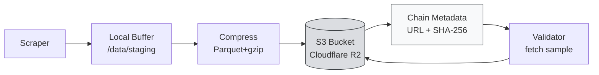

# SN13: S3 Storage

:::info What You'll Do
By the end of this section you will:
- Understand **why SN13 needs S3-compatible storage** (rather than on-chain)
- Be able to compare **AWS S3 vs Cloudflare R2 vs Backblaze B2** for miners
- Set up a bucket, access keys, and configure `.env` correctly
- Implement the **upload flow**: scraper → compress → S3 → emit URL on-chain
- Verify uploads via `s3cmd`, AWS CLI, or rclone
:::

:::note Prerequisites
- ✅ Completed [SN13: Scoring & Rewards](./sn13-scoring-and-rewards)
- ✅ Miner is scraping data into the local buffer (Parquet/JSON.gz)
- ✅ Credit card for cloud storage (estimated $5–15/month)
:::

---

## Why S3?

Bittensor's chain = expensive & slow for storing TB of data. The common solution for data-heavy subnets: **off-chain storage + on-chain pointer.**



The chain only stores **URL and hash**. Real data lives in S3.

---

## Provider Comparison

| Provider | Storage $/GB/month | Egress Fee | Free Tier | SG Region | Recommendation |
|----------|--------------------|------------|-----------|-----------|----------------|
| **Cloudflare R2** ⭐ | $0.015 | **$0** (FREE!) | 10 GB storage + 10M ops/month | via global CDN | **TOP PICK** |
| **Backblaze B2** | $0.006 | $0.01/GB (free via Cloudflare) | 10 GB | via Bandwidth Alliance | Lowest cost |
| **AWS S3** | $0.023 | $0.09/GB | 5 GB (12 months only) | ap-southeast-1 | Expensive, skip |
| **Wasabi** | $6.99/TB flat | $0 | 30-day trial | Singapore | Good for big volume |

:::tip Recommended for the Camp
**Cloudflare R2**. Reasons:
1. **Free egress** = validators can fetch samples without adding costs to you
2. The 10 GB free tier is enough for the first 1–2 weeks of scraping
3. S3-compatible API (works out-of-the-box with `boto3`)
4. Global edge network → low latency for validators wherever they are

Total cost: **$0–5/month** for a CLC-level miner.
:::

---

## Step 1: Set Up Cloudflare R2

### Create Account & Bucket

1. Visit [cloudflare.com](https://www.cloudflare.com/), sign up free
2. Dashboard → **R2** (left sidebar)
3. Activate R2 (requires payment method, but free tier doesn't charge)
4. Click **"Create bucket"**
   - Name: `sn13-miner-<your_uid>` (must be globally unique)
   - Location: **Automatic** (or choose Asia-Pacific if available)
   - **Don't** check "Require admin authentication to access the bucket"
5. Click **"Settings"** for the bucket → note the **S3 API endpoint**:
   ```
   https://<account_id>.r2.cloudflarestorage.com
   ```

### Create API Token

1. Click **"Manage R2 API Tokens"** (top right)
2. **"Create API token"**
   - Permission: **Object Read & Write**
   - Bucket: pick your bucket (not all)
   - TTL: can be infinite or 1 year
3. Save:
   - **Access Key ID**
   - **Secret Access Key**

:::danger Save Securely
The secret key **only shows once**. Copy it immediately to a password manager. If lost, you must regenerate.
:::

---

## Step 2: Configure `.env` on the Miner

In `~/data-universe/.env`:

```bash
# Cloudflare R2
S3_ENDPOINT=https://abcd1234.r2.cloudflarestorage.com
S3_BUCKET=sn13-miner-1234
S3_ACCESS_KEY=your_access_key_id_here
S3_SECRET_KEY=your_secret_access_key_here
S3_REGION=auto

# Public URL prefix (optional: if you set up a custom domain)
S3_PUBLIC_URL=https://pub-abcdef.r2.dev/sn13-miner-1234
```

:::warning Don't Commit `.env` to Git
Add `.env` to `.gitignore`. If your repo is published with credentials, an attacker can nuke your bucket.

```bash
echo ".env" >> .gitignore
```
:::

---

## Step 3: Upload Flow

### Install Library

```bash
source ~/data-universe/venv/bin/activate
pip install boto3 python-dotenv
```

### Upload Script

```python
# storage/s3_uploader.py
import os
import gzip
import hashlib
import logging
from datetime import datetime
from pathlib import Path
import boto3
from botocore.client import Config
from dotenv import load_dotenv

load_dotenv()

log = logging.getLogger(__name__)

class S3Uploader:
    def __init__(self):
        self.endpoint = os.getenv("S3_ENDPOINT")
        self.bucket = os.getenv("S3_BUCKET")
        self.access_key = os.getenv("S3_ACCESS_KEY")
        self.secret_key = os.getenv("S3_SECRET_KEY")
        self.region = os.getenv("S3_REGION", "auto")

        self.client = boto3.client(
            "s3",
            endpoint_url=self.endpoint,
            aws_access_key_id=self.access_key,
            aws_secret_access_key=self.secret_key,
            region_name=self.region,
            config=Config(signature_version="s3v4"),
        )

    def _hash_file(self, path: Path) -> str:
        h = hashlib.sha256()
        with open(path, "rb") as f:
            for chunk in iter(lambda: f.read(1024 * 1024), b""):
                h.update(chunk)
        return h.hexdigest()

    def upload(self, local_path: Path, s3_key: str = None) -> dict:
        s3_key = s3_key or f"data/{datetime.utcnow().strftime('%Y/%m/%d')}/{local_path.name}"
        file_hash = self._hash_file(local_path)
        file_size = local_path.stat().st_size

        log.info(f"Uploading {local_path.name} ({file_size // 1024} KB) → {s3_key}")

        self.client.upload_file(
            str(local_path),
            self.bucket,
            s3_key,
            ExtraArgs={
                "ContentType": "application/gzip" if s3_key.endswith(".gz") else "application/octet-stream",
                "Metadata": {
                    "sha256": file_hash,
                    "size_bytes": str(file_size),
                    "uploaded_at": datetime.utcnow().isoformat(),
                },
            },
        )

        url = f"{self.endpoint}/{self.bucket}/{s3_key}"
        log.info(f"✅ Uploaded: {url}")
        return {"url": url, "sha256": file_hash, "size": file_size, "key": s3_key}


# Usage
if __name__ == "__main__":
    logging.basicConfig(level=logging.INFO)
    uploader = S3Uploader()
    result = uploader.upload(Path("data/reddit_2026-04-14-12.parquet"))
    print(result)
```

### Test Upload

```bash
# Create a test file
echo '{"test": "hello"}' | gzip > /tmp/test.json.gz

# Upload
python -c "
from storage.s3_uploader import S3Uploader
from pathlib import Path
u = S3Uploader()
print(u.upload(Path('/tmp/test.json.gz'), 'test/hello.json.gz'))
"
```

Success if output shows `✅ Uploaded: https://<endpoint>/<bucket>/test/hello.json.gz`

---

## Step 4: Emit URL On-Chain

After upload, the miner must publish the metadata to the chain so validators know where to fetch data.

Depending on the `data-universe` version, the framework typically handles this automatically through a `MinerStorage` abstraction. Internally, however:

:::note This is SDK 10.3.0 API, on purpose
The snippet below uses the **legacy** SDK surface (`bt.wallet`, `bt.subtensor`, `bt.logging`,
`subtensor.commit`) because that's what `data-universe` pins (`bittensor==10.3.0`) and therefore
what runs in your `~/.venvs/sn13` environment. In Bittensor 11 these were replaced —
`bt.Subtensor()`, standard-library `logging`, and commitments submitted as intents via
`client.execute(...)`. Don't "modernize" this code unless the upstream repo has migrated.
:::

```python
# storage/chain_notifier.py (pseudocode: see real implementation in repo)
import bittensor as bt

class ChainNotifier:
    def __init__(self, wallet: bt.wallet, subtensor: bt.subtensor, netuid: int):
        self.wallet = wallet
        self.subtensor = subtensor
        self.netuid = netuid

    def commit_metadata(self, url: str, sha256: str):
        """Emit data location to chain metadata."""
        metadata = f"{url}|{sha256}"
        self.subtensor.commit(
            wallet=self.wallet,
            netuid=self.netuid,
            data=metadata,
        )
        bt.logging.info(f"Committed to chain: {metadata}")
```

Validators will query `subtensor.get_commitment(netuid=13, uid=<miner_uid>)` to fetch the URL.

:::note The Framework Handles This
You **don't need** to manually implement the chain notifier: `neurons/miner.py` in the repo already calls this every upload cycle. Read the code to understand the flow.
:::

---

## Step 5: Integrated Upload Loop

```python
# neurons/miner_upload_loop.py (integration example)
import asyncio
import logging
from pathlib import Path
from storage.s3_uploader import S3Uploader
from storage.chain_notifier import ChainNotifier

log = logging.getLogger(__name__)

class UploadScheduler:
    def __init__(self, buffer_dir: Path, uploader: S3Uploader, notifier: ChainNotifier, cadence_s: int = 1800):
        self.buffer_dir = buffer_dir
        self.uploader = uploader
        self.notifier = notifier
        self.cadence = cadence_s

    async def run(self):
        while True:
            try:
                await self.cycle()
            except Exception as e:
                log.exception(f"Upload cycle failed: {e}")
            await asyncio.sleep(self.cadence)

    async def cycle(self):
        # gather all .parquet / .json.gz files ready in the buffer
        files = list(self.buffer_dir.glob("*.parquet")) + list(self.buffer_dir.glob("*.json.gz"))
        if not files:
            log.info("No files to upload this cycle.")
            return

        for f in files:
            result = self.uploader.upload(f)
            self.notifier.commit_metadata(result["url"], result["sha256"])
            # cleanup local file after successful upload
            f.unlink()
            log.info(f" Deleted local: {f.name}")
```

:::tip Cadence Balance
- **Too frequent** uploads (< 10 minutes) → many small files, high overhead, costs rise
- **Too rare** (> 1 hour) → freshness score drops

**Sweet spot: 15–30 minutes.** Local buffer accumulates ~50–200 MB per cycle, uploaded at once.
:::

---

## Step 6: Verify the Upload

### Via `rclone` (Recommended)

Install & configure:

```bash
curl https://rclone.org/install.sh | sudo bash
rclone config
```

Pick:
- `n` (new remote)
- Name: `r2`
- Type: **`s3`**
- Provider: **`Cloudflare`**
- Access key & secret (paste)
- Region: `auto`
- Endpoint: (paste S3 endpoint)

Then:

```bash
# List bucket
rclone ls r2:sn13-miner-1234

# Look at total size
rclone size r2:sn13-miner-1234

# Download sample to verify
rclone copy r2:sn13-miner-1234/data/2026/04/14/ /tmp/sample --max-depth 1
```

### Via AWS CLI

```bash
pip install awscli
aws configure --profile r2
# enter access key, secret, region=auto

aws s3 ls s3://sn13-miner-1234/ --endpoint-url https://<account_id>.r2.cloudflarestorage.com --profile r2
```

### Via Cloudflare Dashboard

Login Cloudflare → R2 → click your bucket → **Objects** tab. You can see files, manually download, check metadata.

---

## Realistic Monthly Cost Estimate

Assuming an active 24/7 miner with moderate scraping:

| Item | Volume | R2 Pricing | Cost |
|------|--------|------------|------|
| Storage (avg 100 GB) | 100 GB | $0.015/GB/month | $1.50 |
| Class A ops (PUT) ~50k/day | 1.5M/month | $4.50/M | $6.75 (or free in 10M tier) |
| Class B ops (GET) ~10k/day | 300k/month | $0.36/M | $0.11 |
| Egress (validator fetch) | ~500 GB/month | $0 | **$0** |
| **Total** | | | **~$0–8/month** |

R2's free tier of **10 GB storage + 10M Class A + 1M Class B** is enough for ~1 month of CLC mining. After that, paid tier kicks in (~$3–8/month).

---

## Lifecycle & Retention

**Don't store data forever.** Storage cost compounds, and validators only care about freshness. Set up a lifecycle rule:

```python
# Retention policy: delete objects > 14 days
lifecycle_config = {
    "Rules": [
        {
            "ID": "ExpireOldData",
            "Status": "Enabled",
            "Expiration": {"Days": 14},
            "Filter": {"Prefix": "data/"},
        }
    ]
}

uploader.client.put_bucket_lifecycle_configuration(
    Bucket=uploader.bucket,
    LifecycleConfiguration=lifecycle_config,
)
```

Or via Cloudflare dashboard → Bucket → Settings → Object lifecycle rules.

---

## Summary

- **Cloudflare R2** = best choice for SN13 miners (free egress + S3-compatible)
- Set `.env` with `S3_ENDPOINT`, `S3_BUCKET`, access key & secret
- Upload using `boto3` with `s3v4` signature
- Flow: **scraper → buffer → compress → upload → emit URL on-chain → validator fetch**
- Cadence sweet spot: **15–30 minutes** per upload cycle
- Lifecycle rule: **delete data > 14 days** to cap costs
- Realistic total cost: **$0–8/month**

### ✅ Quick Check

1. Why don't validators fetch data directly from the chain?
2. Why is R2 best suited for SN13 miners compared to AWS S3?
3. What does the miner send on-chain after uploading to S3?
4. What's the consequence of an upload cadence that's too frequent?
5. Why is a lifecycle rule needed?

<details>
<summary> Answers</summary>

1. The Bittensor chain is **expensive & slow** for blob data. The chain only stores pointers (URL + hash); real data lives in S3.
2. **Free egress** on R2: validators fetch any amount without adding cost to you. AWS S3 charges $0.09/GB egress → expensive with many validators.
3. **Bucket URL + SHA-256 hash** of the data (metadata commit).
4. **High overhead** (many small files, many PUT ops → ops cost rises). Plus HTTP overhead per request.
5. Storage cost compounds. Data > 7–14 days is already stale (freshness 0) and useless to keep. Auto-delete = predictable cost.

</details>

### Troubleshooting

| Error | Cause | Fix |
|-------|-------|-----|
| `botocore.exceptions.ClientError: Access Denied` | Wrong access key or bucket permission mismatch | Regenerate API token with Object R/W, ensure scoped to the right bucket |
| `SignatureDoesNotMatch` | VPS clock skew > 15 minutes | Install NTP: `sudo apt install ntp && sudo systemctl enable ntp` |
| Upload succeeds but validator doesn't fetch | Wrong URL or private bucket | Make sure bucket is **public read** or URL is signed. Check via `curl <URL>`: must return data. |
| `SSL CERTIFICATE_VERIFY_FAILED` | OS certs outdated | `sudo apt install --reinstall ca-certificates` |
| R2 cost suddenly high | Ops count exploded (cadence too frequent) | Reduce cadence, batch larger files |
| File is in bucket but "URL not commitable" | Chain commitment size limit (typically 256 bytes) | Use shorter URL, hash doesn't need full in metadata |

---

**Next:** [Submission Validation →](../TH6-Graduation-and-Showcase/submission-validation)

*Storage is cheap, lost data is expensive. *
