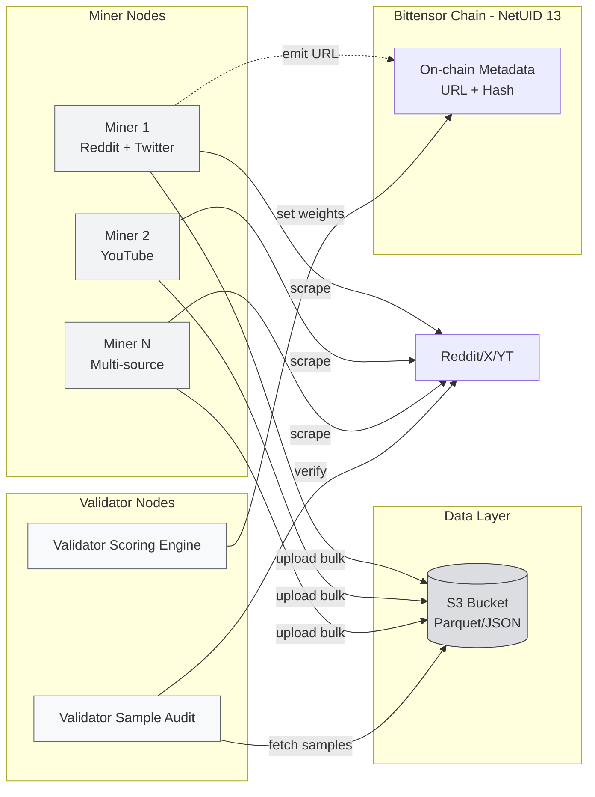
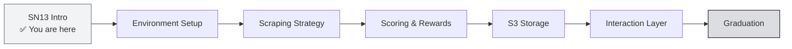

# Running the SN13 Miner

:::info What You'll Do
After completing this section you will:
- Understand Data Universe's (SN13) **mission & raison d'être** in the Bittensor ecosystem
- Know the **miner ↔ validator architecture** and the SN13 data pipeline flow
- Understand why **data is the new oil** for AI training
- Be able to roughly estimate **hardware & bandwidth budget** before deploying
- Know the **fundamental differences** between SN13 and SN41 (storage-heavy vs compute-light)
:::

:::note Prerequisites
Before continuing, make sure you've completed:
- ✅ The foundations Townhalls (Web3, AI, Decentralized AI, Why Bittensor)
- ✅ The core-concepts and core-subnets material (tokenomics, subnet roles)
- ✅ The Sportstensor (SN41) track up to a running miner
- ✅ Have a **coldkey/hotkey wallet**, understand `btcli`, understand the miner lifecycle
:::

---

## Why Does Data Universe Exist?

As covered in the AI foundations, **modern AI (LLMs, vision, reasoning models) needs absurd amounts of data.** GPT-4 was trained on tens of TBs of text. LLaMA 3 used 15T tokens. Gemini needs a multimodal corpus: text + video + audio + code.

But there are classic problems in centralized AI:

| Problem | Impact |
|---------|--------|
| **Data locked behind big platforms** | Reddit, Twitter/X, YouTube charge millions of USD per month for API access |
| **Unilateral scraping risks bans** | Single IP gets caught → rate-limited → data pipeline dies |
| **Fresh data is very expensive** | Training on data 6 months old = a stale model |
| **Centralized vendor lock-in** | Single point of failure for data providers (e.g., Twitter cut off academic API in 2023) |

**Data Universe (SN13)** solves this with the Bittensor principle: **decentralize the data layer.** Hundreds of miners worldwide scrape → upload → validators audit → reward those contributing the freshest, most unique, valid data.

:::tip Simple Framing
SN13 is like **"Uber for data scraping"**: anyone (with storage + bandwidth) can be a supplier, validators are the quality auditors, and buyers (AI developers) get access to a decentralized data pool without paying Reddit/X directly.
:::

---

## SN13 Mission Statement

> **Data Universe provides a continuously updated, decentralized, and auditable data pipeline for training the next generation of AI.**

The three primary data sources miners scrape at the time of writing:

1. **Reddit**: forum text, opinions, niche discussions (subreddits)
2. **Twitter / X**: microblog, trending topics, real-time sentiment
3. **YouTube**: video transcripts, channel metadata

:::note Why These 3 Sources?
These three platforms have a **good signal-to-noise ratio** for LLM training: Reddit has long-form reasoning, Twitter has real-time event coverage, YouTube has multimodal (audio + text). The subnet is **expandable**: new sources can be added in the future via governance.
:::

---

## SN13 Architecture

### Each Node's Role

** Miner: The Data Scrapers**

- Run scrapers automatically 24/7 (Reddit/X/YouTube)
- Save raw data → compress to Parquet/JSON.gz
- Upload to S3-compatible storage (AWS S3 / Cloudflare R2 / Backblaze)
- Emit metadata (bucket URL + hash) on-chain to the subnet
- Respond to validator queries via HTTP endpoint (interaction layer: covered later in this track)

** Validator: The Auditors**

- Random sampling from the miner's bucket (e.g., 1% of data)
- Verify against the original source (is this tweet real? is the timestamp accurate?)
- Score based on **freshness**, **uniqueness**, **volume**, **validity**, **coverage**
- Set weights on-chain → determining TAO emission to miners

** Subnet (NetUID 13)**

- On-chain coordinator: registry of UIDs, weights, emission
- Not where the data is stored (the chain stays lightweight): only pointers

---

## Scoring Glance (Full Detail in Scoring & Rewards)

The five SN13 scoring dimensions:

| Dimension | Rough Weight | Meaning |
|-----------|--------------|---------|
|  **Freshness** | Highest (≤ 24 hours best) | Newly scraped data is much more valuable |
|  **Uniqueness** | High | Duplicates are punished: deduplication is critical |
|  **Volume** | Medium (capped) | More data = points, but there's a diminishing return point |
|  **Coverage** | Medium | Diversify sources (don't only do 1 subreddit) |
| ✅ **Validity** | Gate | If validator can't verify → score zero |

:::warning Don't Spam!
Miners that upload fake / duplicate / stale data get **score ≈ 0** and are deregistered after the immunity period ends. SN13 validators have aggressive cross-check heuristics.
:::

---

## Hardware Requirements

Unlike compute-heavy subnets (Chutes, Targon) that need GPUs, **SN13 is a storage-heavy & network-heavy subnet.** A GPU is **NOT** required.

### Minimum Spec (Just Starting)

| Component | Spec | Note |
|-----------|------|------|
| **OS** | Ubuntu 22.04 LTS | Debian 12 also works |
| **CPU** | 4 vCPU | Scraping is I/O-bound, doesn't need many cores |
| **RAM** | 8 GB | 16 GB safer for parsing large YouTube transcripts |
| **Storage** | 500 GB SSD (NVMe preferred) | Data rotates, but a local buffer matters |
| **Bandwidth** | 50+ Mbps symmetric | Upload to S3 is the main bottleneck |
| **Public IP / Port** | Open on the miner's port (default 8091 or configurable) | Validators must be able to reach the miner |

### Recommended Spec (Serious Miner)

| Component | Spec |
|-----------|------|
| **CPU** | 8 vCPU (parallel Parquet compression) |
| **RAM** | 16–32 GB |
| **Storage** | 1 TB NVMe SSD (working set) + unlimited S3 |
| **Bandwidth** | 100 Mbps+ symmetric |
| **Network** | Data center / VPS (not home ISP with CGNAT) |

:::tip Pro Tip: Region Specific
**Don't run an SN13 miner from home if your ISP uses CGNAT** (most residential ISPs in many countries). Validators won't be able to reach your endpoint → scoring drops.

Practical solutions:
1. **VPS in Singapore / nearby region** (Vultr, DigitalOcean, Linode): low latency, static public IP, $40–60/month
2. **Tunnel via Cloudflare Tunnel / ngrok** if you insist on home: but connection drops are a risk
3. **Upgrade to a business-tier ISP** (static IP available, ~$30/month)

From past CLC alumni experience: **a Singapore VPS is the most stable & cost-effective choice** for SN13.
:::

---

## Rough Miner Economics for SN13

Before you deploy, a rough monthly budget:

| Item | Monthly Cost (USD) |
|------|---------------------|
| VPS Vultr 4 vCPU 8 GB 500 GB | ~$40 |
| S3 Storage (Cloudflare R2, 1 TB) | ~$15 |
| Egress bandwidth (R2 = free) | $0 |
| Reddit API (free tier sufficient at first) | $0 |
| Twitter API (use a free scrape library) | $0 |
| **Total** | **~$55/month** |

**ROI** depends heavily on TAO price and miner ranking position. In a bull range (TAO > $400), top-50 SN13 miners can earn the equivalent of $200–500/month gross. But remember: **this camp is not get-rich-quick**: your goal is to learn & graduate.

:::note Disclaimer
The numbers above are rough estimates for April 2026. Real earnings are volatile: could be higher when subnet emission rises, or very low if you're below the immunity threshold.
:::

---

## SN13 vs SN41: When to Use Which?

You've already run an SN41 miner. What's the difference?

| Aspect | SN41 Sportstensor | SN13 Data Universe |
|--------|-------------------|--------------------|
| **Core work** | Predictive model for match outcomes | Scraping & storing raw web data |
| **Hardware bottleneck** | CPU + model inference | Storage + bandwidth |
| **GPU?** | Optional (for ML model) | Not needed |
| **Scoring signal** | Prediction accuracy vs actual result | Freshness + uniqueness + validity |
| **ML complexity** | High (requires feature engineering) | Low (standard scraper) |
| **Best for** | ML engineer, data scientist | DevOps, backend engineer, hobbyist with storage |

:::tip Dual-Miner Strategy
Many CLC graduates run **miners on SN41 and SN13 simultaneously** on separate VPSes for emission diversification. But for camp graduation, one stable miner (running at submission time) is enough.
:::

---

## SN13 Track Roadmap

Here's the learning flow for the SN13 track:

Each step has practical deliverables: by the end, you'll have a miner running 24/7 with real data uploaded to S3 and audited by validators.

---

## Summary

- **Data Universe (SN13)** = decentralized data-provision subnet for AI training (Reddit + Twitter + YouTube)
- NetUID = **13**, on Bittensor mainnet
- Miner = scraper + uploader; validator = sample auditor + scorer
- Scoring across 5 dimensions: **freshness, uniqueness, volume, coverage, validity**
- Hardware: **storage-heavy + bandwidth-heavy, no GPU needed** (Ubuntu 22.04, 4 vCPU, 8 GB RAM, 500 GB SSD, 50 Mbps+)
- Total operating cost ~**$55/month** (VPS + R2)
- For most regions: **VPS in your region > home ISP** because of CGNAT

### ✅ Quick Check

1. What's the NetUID of Data Universe on Bittensor mainnet?
2. Does SN13 need a GPU? Why?
3. Name the 3 main data sources SN13 miners scrape.
4. What happens if a miner uploads duplicate data to the bucket?
5. Why does a residential home ISP typically have problems running an SN13 miner?

 Answers

1. **13**: NetUID 13.
2. **No.** The miner's job is I/O-bound (scraping + compressing + uploading), not compute-bound. A GPU = wasted money on SN13.
3. **Reddit, Twitter/X, YouTube.**
4. Validators detect duplicates → **uniqueness score drops** → reward falls; if too many duplicates, the total score can be ≈ 0.
5. **CGNAT**: public IP shared across many users, validators can't reach the miner endpoint. Need a static public IP (VPS).

### Troubleshooting

| Symptom | Likely Cause | Fix |
|---------|--------------|-----|
| "I'm confused about which VPS region to pick" | Latency to Bittensor mainnet & source APIs | Singapore for Asia: fast proxy to Reddit/X |
| "Is 500 GB storage enough?" | Depends on retention policy | Enough for working buffer; old data rotates to S3 |
| "TAO earnings unclear" | Subnet emission fluctuates | Use [taostats.io/subnets/13](https://taostats.io) for real-time tracking |

---

**Next:** [SN13: Scraping Strategy →](./sn13-scraping-strategy)

*Data is the new oil. Bittensor is the refinery. *
